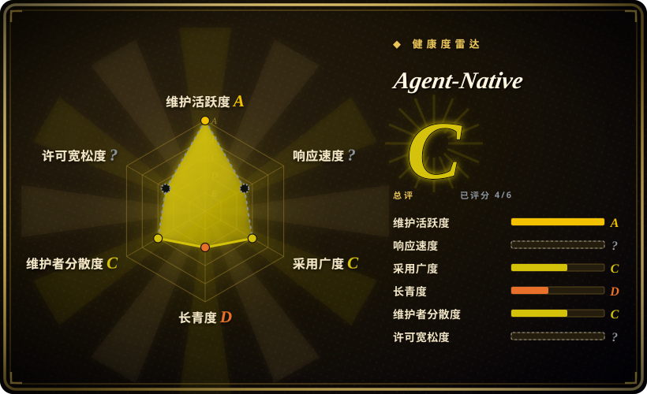
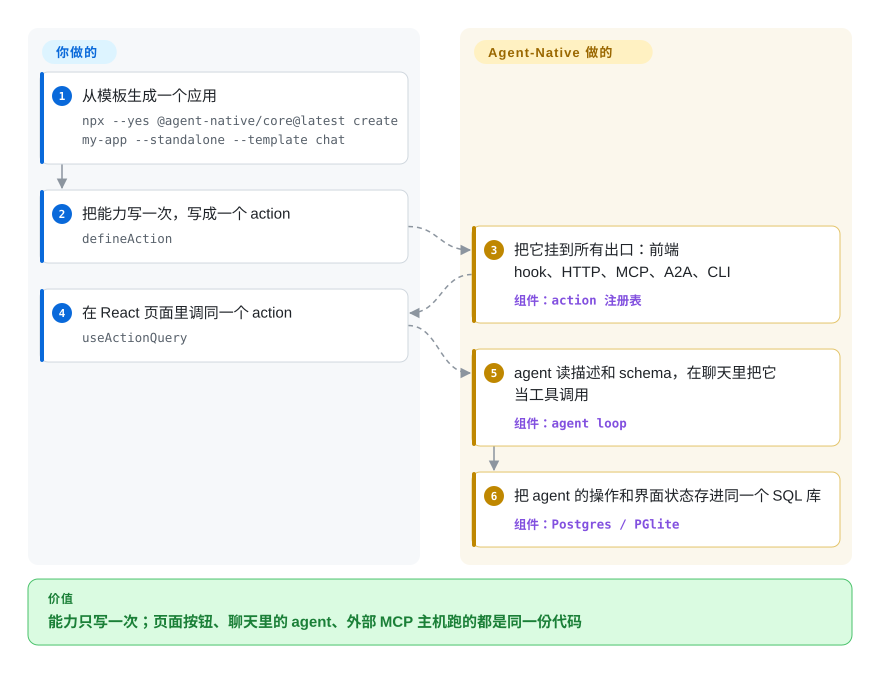

# Agent-Native

你希望产品里的 agent 真的把活干了——回工单、做幻灯片、改记录——可一旦真做，每个能力都得写两遍：一遍给用户点的那个按钮，一遍给模型调的那个工具，然后眼看着两边越走越远。Agent-Native 让你把每个能力只定义一次，写成一个 action，页面和 agent 跑的是同一个函数。

## 何时使用

你在做一个产品，内部工具也好、面向客户的 SaaS 也好，需要 AI 真的完成任务而不只是在旁边聊天：分拣收件箱、生成幻灯片、更新 CRM 记录、跑每晚的报表。这些活在你应用里本来就有归属，缺的是让 agent 能自己去干。放任不管的话，你就得为 agent 单独再写一套后端集成，它随后会和页面调用的那套渐渐对不上，而且每加一个能力都要写两遍。

真正的选择点在这里：愿不愿意让一个 TypeScript 应用接管整条栈——React 前端、它自己的服务端、PostgreSQL——并且让 agent 的能力*就是*应用本身的操作。这也是它和最接近的几类替代品的分界。代码优先的 agent SDK（[LangChain](langchain.zh.md)、[LangGraph](../agent-runtimes/agent-sdks/langgraph.zh.md)）只给你 agent，应用留给你自己，所以界面、鉴权、数据库和那套双写仍然是你的事。可视化平台（[Dify](dify.zh.md)、[Langflow](langflow.zh.md)）把逻辑放进画布，而不是你审查和版本管理的代码里。Agent-Native 把这两样都换掉了：你交出应用的所有权，换回的是界面和 agent 不可能对不上，因为实现只有一份。

## 快问快答

读这一页时冒出来的几个问题，短答：

- **它是从零开始的新框架，还是能嵌进已有系统？** 两种都有，但有前提。它可以从零接管一个完整应用；也可以只把聊天面板（`<AgentSidebar>`、`<AgentPanel>`、`sendToAgentChat()`）塞进你现有的 React 应用；还可以作为「旁挂」挂在已有 SaaS 旁边。但无论哪种，它都自带服务端和自带的 PostgreSQL／PGlite 表，**不会跑进你现有的后端里**。[推断]
- **chat 这侧怎么知道我的能力——靠 MCP、skill 还是别的？** 直接来自 action：内置的 agent loop 把应用注册的 action 当成工具，不需要另外登记。MCP 和 A2A 是在同一张 action 表之上的**额外出口**，给外部 agent 用；skill 是按需拉取的行为说明，不是能力接线。
- **我的 chatbot 用的是别的运行时，怎么接？** 如果那个运行时支持 MCP，就把它指向应用的 `/mcp`，action 会作为工具出现；不支持的话，在那一侧写一个普通工具去调 action 的 HTTP 端点（`POST /_agent-native/actions/<名字>`）。Agent-Native 不会把工具自动注入别人的运行时。具体到 Pi-Mono：它按设计不带 MCP 客户端，所以基于它搭的 chatbot 那一侧，要么加 MCP 扩展，要么写 HTTP 工具。
- **「一个能力一个 action」这个抽象是不是很难做？** 定义本身很小，只有 `description`、`schema`、`run` 三样，难处理的情况也有现成开关（`needsApproval`、`authorize`、`chatUI`、`endsTurn`、`deferLoading`）。真正难的是**粒度**：应该一个用户意图一个 action，而不是一个按钮一个，这样模型既不会淹没在工具里，也不会拿到一块粗到没法组合的操作。

## 怎么用起来

每个能力都是 `actions/` 目录下的一个文件，框架启动时自动发现，你不必手动注册任何东西。一个 action 就是 `defineAction({ description, schema, run })`：`description` 是模型用来判断**什么时候**该调它的说明，`schema` 是带类型的输入契约（默认用 Zod），在每个调用方那里都先校验，同时也被转成工具定义里的 JSON Schema，`run` 才是真正的实现。从这一份定义出发，框架自动挂出前端 hook（`useActionQuery`／`useActionMutation`）、HTTP 路由 `/_agent-native/actions/<名字>`、MCP 工具、A2A 工具和 CLI 命令——所以页面按钮和 agent 工具就是同一个函数。MCP 和 A2A 是让**别的** agent 调用你应用的标准协议，在这里它们是通向同一张注册表的另外几扇门，而不是要单独维护的集成。你拿到的也不只是一个 loop：聊天、鉴权、基于 SQL 的持久会话、skill 与 memory、定时任务都随框架附上，agent 的操作落在界面读的同一批表里，两边始终是同一份状态。

<!-- flow-steps:begin (generated from flows/agent-native.json by tools/flow_card.py — do not edit) -->

流程文字版

1. **你**：从模板生成一个应用 — `npx --yes @agent-native/core@latest create my-app --standalone --template chat`
2. **你**：把能力写一次，写成一个 action — `defineAction`
3. **Agent-Native**：把它挂到所有出口：前端 hook、HTTP、MCP、A2A、CLI — 组件：`action 注册表`
4. **你**：在 React 页面里调同一个 action — `useActionQuery`
5. **Agent-Native**：agent 读描述和 schema，在聊天里把它当工具调用 — 组件：`agent loop`
6. **Agent-Native**：把 agent 的操作和界面状态存进同一个 SQL 库 — 组件：`Postgres / PGlite`

**价值**：能力只写一次；页面按钮、聊天里的 agent、外部 MCP 主机跑的都是同一份代码

<!-- flow-steps:end -->

## 何时不用

- **你已有非 JS 后端、且不打算替换。** Agent-Native 要接管服务端（Nitro）和数据库（PostgreSQL）。Go／Java／Python 服务加 MySQL 或别的关系库，不是它能插进去的地方——采用它意味着并排再跑一套应用栈和第二个数据库，而不是调一个库。如果 agent 必须留在你现有服务里，就用代码优先的 SDK，比如 [LangGraph](../agent-runtimes/agent-sdks/langgraph.zh.md) 或 [LangChain](langchain.zh.md)。
- **你只想在现有 React 应用里加一个聊天面板。** `<AgentSidebar>` 确实能塞进去，但它仍然假定后端在跑它自己的 agent-chat 插件；如果应用、鉴权和 agent loop 本来就是你的，那么只用界面库（Vercel AI SDK 或 assistant-ui，均未收录）更轻。只有当你同时想要它带来的持久 agent 状态时，才考虑旁挂模式。
- **你需要稳定的 API 或语义化版本纪律。** `@agent-native/core` 在大约半年里从 0.1.0 走到 0.186.0，依赖里的 Nitro 是 beta 构建，发布一天好几次（按包做 changeset）。要锁版本、并把升级当作日常维护；如果稳定契约比脚手架更重要，选更沉淀的框架。
- **商用分发前要求许可明确无歧义。** README 和 npm 包写的是 MIT，但仓库里**没有 `LICENSE` 文件**，根 `package.json` 写的是 `ISC`——三个口径、没有权威正文。先过法务，或选一个许可可核查的仓库。这是最硬的一条否决项。[未验证]
- **你想要无代码或可视化编排。** 能力存在于你要审查的 TypeScript 里；如果团队的入口必须是画布，用 [Dify](dify.zh.md)、[Langflow](langflow.zh.md) 或 Flowise。
- **你今天就要把长期平台押在它上面。** 创建于 2026-03，约半年；参照健康度一节看待 Lindy 先验，并留好退路。

## 横向对比

| 替代品 | 是否收录 | 我们的评价 | 取舍 |
|---|---|---|---|
| [LangChain](langchain.zh.md) | 已收录 | 当 agent 应当活在你现有的 Python／TS 服务里、你要最广的集成生态时，选 LangChain，应用本身留给你自己。 | 你完全掌控技术栈、拿到大量集成，但界面、鉴权和数据库要自己搭并自己保持一致——而这正是 Agent-Native 替你吸收掉的那部分工作。 |
| [LangGraph](../agent-runtimes/agent-sdks/langgraph.zh.md) | 已收录 | 当难点是你自己进程里那种可持久、可恢复、图状的 agent 状态时，选 LangGraph，而不是产品外壳。 | 编排控制力一流且不干涉你的应用；Agent-Native 给你一个能直接跑的应用，但形状更规定死（action 加它的服务端加 Postgres）。 |
| [Dify](dify.zh.md) | 已收录 | 当不写代码的团队必须从可视化控制台编排并运维 agentic 工作流、还要内置 RAG 时，选 Dify。 | 门槛低得多、有运维界面；但逻辑活在画布里，比 TypeScript 更难做 diff、审查和版本管理——正好是 Agent-Native 反过来的取舍。 |
| [Langflow](langflow.zh.md) | 已收录 | 当你想要拖拽式搭建、同时又希望画出来的流能对外提供可调 API 和 MCP 服务时，选 Langflow。 | 可视化迭代快，但复杂逻辑在图上会变难维护；Agent-Native 把能力保留为普通的、可审查的代码。 |
| CopilotKit | 未收录 | 当你必须保留现有 React 应用、只想叠加 agent 界面和共享应用状态时，选 CopilotKit。 | 它假定后端是你的，不提供服务端、数据库或 action 注册表——而这是 Agent-Native 补上的部分。它是真实仓库，本批有意未收录，列为待办。 |
| Vercel AI SDK | 未收录 | 当你只是给已有应用加模型调用和流式界面、不想让框架接管整条栈时，选 Vercel AI SDK。 | 它是库不是应用框架：没有开箱即用的 agent 聊天界面、SQL 状态或能力注册表。它是真实仓库，本批有意未收录，列为待办。 |

## 技术栈

- **语言：** TypeScript；pnpm 单体仓库（packages 加模板应用）。
- **前端：** React 19 配 React Router 7。
- **服务端：** Nitro（依赖里是 beta 构建），配 Drizzle ORM。
- **数据库：** 生产用 PostgreSQL；本地在未设 `DATABASE_URL` 时用 PGlite（进程内 Postgres）。
- **鉴权：** better-auth，仓库内还带 SCIM／SSO 相关包。
- **agent 管道：** 框架自带的 agent loop，外加 MCP、A2A、AG-UI 运行时适配；action 契约用 Zod／Standard Schema。
- **仓库内的壳：** 除 Web 模板外还有 Electron 桌面应用和移动应用。

## 依赖

- **Node.js ≥ 22.22 与 pnpm ≥ 10**（`corepack enable`）用于生成和构建。
- **生产需要一个 PostgreSQL 数据库。** 本地不需要任何外部服务，默认用磁盘上的 PGlite。
- **一个 LLM 连接。** 上手流程提供 Builder.io 免费额度、自带的 Anthropic／OpenAI key，或本地 Ollama。
- **外部 agent 接入不需要额外东西**——应用跑起来后 MCP 端点会自动挂上。

## 运维难度

**中到高**，难度主要在体量，而不是什么奇怪的组件。仓库很大（21 个包，光是 `core` 一个包就拉了 85 个依赖，检出体积数百 MB），部署意味着把 Nitro 应用跑在真实 PostgreSQL 上——你运维的是一个完整 Web 应用，不是嵌一个库。项目还在 1.0 之前、每天多次发版，升级和依赖更新需要主动管理，应当锁版本、把升级当成维护任务。本地起步很容易（一条命令、PGlite、无外部数据库），所以上手很舒服，但长期成本比安装体验暗示的要高。

## 健康度与可持续性

- **年龄与 Lindy 先验（2026-09-24）。** 创建于 **2026-03-12**，至今约**半年**。按 Lindy 先验这算年轻：约 6.7k 星是**需要权衡的风险信号**，不是持久性的证据，因为增长很快的年轻仓库还没经过时间检验。[推断]
- **维护状态。** 非常活跃——核验当天仍在推送，`main` 上有数千次提交，最近 30 天各包合计约 100 次发布。这个节奏甚至快过采用者能跟上的速度。[推断]
- **治理与关键人依赖。** 归属 **BuilderIO**（在 Builder.io、Qwik、Mitosis 上有积累的组织），降低了弃坑风险；过去一年约有 69 位贡献者活跃。但贡献高度集中，头部贡献者（`steve8708`）在该窗口内约占三分之二的提交，路线图相当依赖这个人。[推断]
- **采用度。** 约 6.7k 星、约 605 个 fork，`@agent-native/core` 每月约 177,070 次下载（截至 2026-09-15 那一周约 4.7 万）——对一个半年的项目来说是真实使用量，背后还有模板库和 Discord。
- **风险信号。** **许可存疑**（没有 `LICENSE` 文件；README 与 npm 说 MIT，根 `package.json` 说 ISC）——对商用采用者这是最要紧的一条。仍在 1.0 之前，依赖里有 beta 且变动快。官网还宣传了一些应用页面，但哪些是开源模板、哪些只是托管演示，并不清楚。[未验证]

## 存疑（未验证）

- [未验证] **许可：** 仓库根目录没有 `LICENSE` 文件（GitHub 许可 API 返回 404，代码搜索只找到字体／第三方许可），而 `README.md` 写 MIT、`packages/core/package.json` 写 MIT、根 `package.json` 写 `ISC`。缺失是核验过的，维护者意图采用的许可没有确认。
- [未验证] 星数、fork 数、npm 下载量和发布节奏都是 2026-09-24 的时点读数——星数本身不可靠且随时间变化，引用前请复核。
- [推断] 关键人依赖的判断来自贡献者计数，而非治理文档；头部贡献者集中是一个信号，不等于已证实的单点故障。
- [未验证] 「Nitro 是 beta 构建」读自解析出的依赖（`nitro 3.0.260610-beta`）；项目是否打算、何时打算在生产上稳定下来，没有确认。
- [推断] 「各种嵌入方式（面板插件、旁挂）都能干净地接入外部后端」这一说法来自项目文档，未实际运行；而文档写明的服务端前提意味着它自己的服务仍然要在。
- [未验证] 官网应用库（`agent-native.com/apps`）里哪些是开源模板、哪些只是托管演示，未从仓库确认。
- [未验证] 本文没有评估 provider URL 处理的安全姿态；2026 年 9 月有一个相关的 SSRF 报告被提出并关闭，其修复未经验证。
