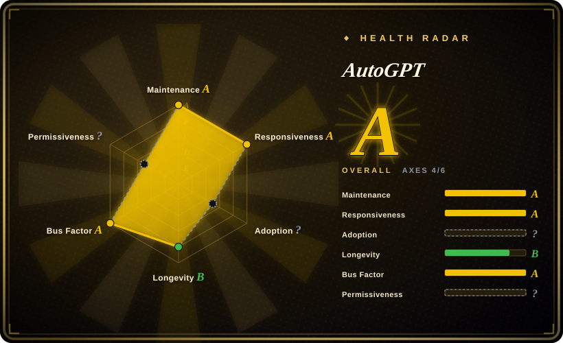
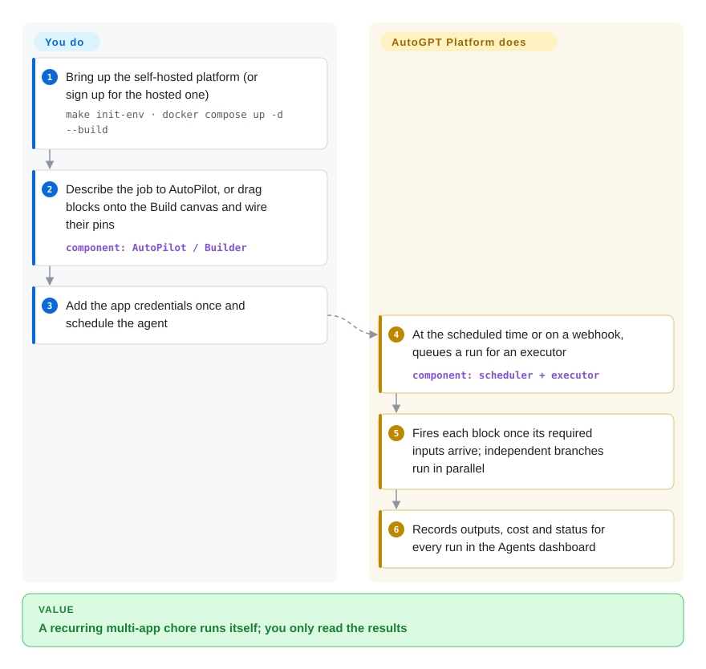

# AutoGPT

You keep doing the same multi-app chore every week — pull data from Gmail and a spreadsheet, have an LLM summarize or draft something, post it to Slack or Notion — and a one-off chat with ChatGPT doesn't run on its own next Monday. AutoGPT turns that chore into a saved agent: a graph of blocks (an LLM call, a Gmail read, a Slack post) that you sketch on a canvas or describe in plain English, then run on demand, on a schedule or from a webhook.

> **Two projects, one repo.** "AutoGPT" today means the **AutoGPT Platform** (`autogpt_platform/`, PolyForm Shield license): a visual agent builder + runtime with a paid hosted version at platform.agpt.co. The 2023 "autonomous GPT-4 loop" you may remember lives on as **AutoGPT Classic** (`classic/`, MIT) and is not what this page evaluates.

## When to use

You run operations, sales or research for a small team and keep repeating the same chain across tools: every morning, read new emails with a certain label, look up the sender in HubSpot, have an LLM draft a reply and a one-line brief, drop both into a Slack channel. Zapier-style tools can wire the apps together but treat the LLM as one bolt-on step; writing it yourself in LangChain means owning a server, a scheduler and a secrets store. You open AutoGPT, either describe the job to **AutoPilot** ("every weekday at 9am, research each account on my calendar and send me a brief") and let it build the agent, or drag blocks onto the **Build** canvas and connect their typed pins. You add credentials for the 45+ integrations once, hit **Schedule Task**, and the agent runs itself, with every run, its cost and its outputs visible in the Agents dashboard.

Pick AutoGPT over n8n when the job is mostly LLM reasoning with a few app hops rather than app plumbing with an occasional LLM call; over Dify when you want ready-made agents from a marketplace and scheduled/triggered runs rather than a chat app or RAG endpoint you embed; and over writing code when non-developers need to read and edit the workflow.

## How it works

An AutoGPT agent is a **graph of blocks**: each block is one typed step — an AI text generator, a Gmail read, an HTTP request, a sub-agent — and you connect one block's output pin to the next block's input pin. Execution starts at the input blocks and a downstream block fires as soon as all its required inputs have arrived, so independent branches run in parallel and dependent ones wait. The platform does the rest for you: it stores your encrypted credentials, queues runs through RabbitMQ to executor workers, runs schedules and webhook triggers, and records each run's outputs and cost. What you do is design the graph (by hand, or by asking AutoPilot to draft it), supply inputs and credentials, and decide when it runs. Self-hosting gives you the same builder and runtime on your own Docker host, with your own model keys.

<!-- flow-steps:begin (generated from flows/autogpt.json by tools/flow_card.py — do not edit) -->

Text version of the flow

1. **You**: Bring up the self-hosted platform (or sign up for the hosted one) — `make init-env · docker compose up -d --build`
2. **You**: Describe the job to AutoPilot, or drag blocks onto the Build canvas and wire their pins — component: `AutoPilot / Builder`
3. **You**: Add the app credentials once and schedule the agent
4. **AutoGPT**: At the scheduled time or on a webhook, queues a run for an executor — component: `scheduler + executor`
5. **AutoGPT**: Fires each block once its required inputs arrive; independent branches run in parallel
6. **AutoGPT**: Records outputs, cost and status for every run in the Agents dashboard

**Value**: A recurring multi-app chore runs itself; you only read the results

<!-- flow-steps:end -->

## When NOT to use

- **You need an OSI open-source license or plan to host it for others.** `autogpt_platform/` is under **PolyForm Shield 1.0.0** — free for personal and internal business use, but you may not offer it as a product that competes with AutoGPT's own hosted service; only `classic/` is MIT, and platform contributions go through a CLA. If you want to embed or resell a visual agent builder, use [Langflow](langflow.md) (MIT) instead, because its license puts no competition restriction on you.
- **You want to self-host on a small box.** The manual setup runs Postgres, three Redis nodes, RabbitMQ, FalkorDB, ClamAV and about eight backend services plus the Next.js frontend; even the upcoming single-container appliance measured about 5–6 GiB of memory. For a lightweight visual LLM-flow builder on a small VPS, use [Flowise](flowise.md) or Langflow instead, because they run as one process/container.
- **The job is deterministic app-to-app plumbing.** If the workflow is "when a form is submitted, create a CRM row and send an email" with no reasoning in the middle, use [n8n](../../workflow-orchestration/n8n.md) instead of AutoGPT, because its 400+ integrations and node-level error handling are built for exactly that and an LLM-centred builder adds cost and non-determinism.
- **You want a chat app, RAG knowledge base or an API to embed in your product.** AutoGPT is centred on scheduled/triggered agents and a personal agent library. Use [Dify](dify.md) instead when the deliverable is a chatbot or retrieval endpoint, because it ships knowledge-base ingestion, a prompt IDE and per-app APIs out of the box.
- **You want to write the agent in code.** The platform is a builder UI first. For agents defined in Python, use [CrewAI](../agent-runtimes/agent-sdks/crewai.md) or [LangChain](langchain.md) instead, because your logic stays in version-controlled code rather than a graph stored in the platform's database.
- **You need a settled self-hosted product.** Releases are still tagged `autogpt-platform-beta-v0.8.x`, the self-host installer endpoint is not public yet, upgrades can require hands-on data migrations (the 2026 move off the bundled Supabase is documented step by step), and self-hosters get community support only. If you can't absorb that, use the paid hosted Platform or a v1.x product like Dify.

## Comparison

| Alternative | In index | Our verdict | Tradeoff |
| --- | --- | --- | --- |
| [Dify](dify.md) | ✅ | When the output is a chatbot, RAG endpoint or embeddable AI app, pick Dify; pick AutoGPT when the output is a scheduled agent that does a chore across your apps. | Dify is stronger on knowledge bases, prompt tooling and app APIs; AutoGPT is stronger on marketplace agents, AutoPilot drafting and triggers. Both carry non-OSI license conditions. |
| [n8n](../../workflow-orchestration/n8n.md) | ✅ | For mostly deterministic integrations with an occasional LLM node, pick n8n; pick AutoGPT when LLM reasoning is the core of each step. | n8n has far more integrations and mature error handling; AutoGPT makes LLM blocks and agent-drafting first-class but with fewer app connectors. |
| [Langflow](langflow.md) | ✅ | If you need an MIT-licensed visual builder you can embed or resell, pick Langflow; pick AutoGPT when you want hosted-or-self-hosted scheduled agents with a marketplace. | Langflow is lighter to run and permissively licensed but is a flow designer, not a run-it-every-morning agent dashboard. |
| [Flowise](flowise.md) | ✅ | On a small server where you just need a visual LLM/RAG chain behind an API, pick Flowise; pick AutoGPT when you need many integrations and scheduled runs. | Flowise deploys as one container; AutoGPT needs a dozen-plus services but adds triggers, credentials management and run history. |
| [CrewAI](../agent-runtimes/agent-sdks/crewai.md) | ✅ | When developers own the agent and want it in Python under code review, pick CrewAI; pick AutoGPT when non-developers must build and edit the workflow. | CrewAI is code-first with no hosting layer; AutoGPT gives a UI and runtime but stores logic as graphs in its database. |

## Tech stack

- **Backend:** Python (FastAPI REST server, executor, scheduler, websocket, notification and database-manager services), Prisma ORM on PostgreSQL.
- **Messaging & state:** Redis (three-node setup in Compose), RabbitMQ for run queues, FalkorDB graph store used through Graphiti for agent memory (both are backend dependencies), ClamAV for uploaded-file scanning.
- **Frontend:** Next.js / React / TypeScript builder, with embedded auth (Better Auth) after the 2026 move off Supabase.
- **Packaging:** Docker Compose for self-hosting; a single-container "appliance" image in preparation.
- **Legacy:** `classic/` — the original Python AutoGPT agent, Forge agent template and `agbenchmark`, MIT.

## Dependencies

- **Hosted:** none beyond a browser; model access and credentials are managed, billed per plan plus agent usage.
- **Self-hosted (manual):** Docker + Docker Compose, Git, Node.js/NPM; you run `make init-env` to generate secrets and `docker compose up -d --build` in `autogpt_platform/`. Network access to GitHub on first start (to load the skills catalogue).
- **Self-hosted (appliance, upcoming):** a Docker daemon with Linux containers on amd64/arm64 and roughly 5–6 GiB of memory.
- **Model providers:** your own API keys (OpenAI, Anthropic, etc.) or a local model via Ollama.
- **Integrations:** OAuth/API credentials for each app the agent touches (Gmail, Slack, GitHub, HubSpot…).

## Ops difficulty

**High self-hosted, low hosted.** Self-hosting means operating a dozen-plus containers — Postgres backups, Redis, RabbitMQ, encryption-key rotation, and multi-step migrations on upgrade — on a beta-numbered release line, with community-only support. Agents themselves also need watching: LLM steps are non-deterministic and each run costs model tokens, so schedules need budgets and someone checking outputs. The hosted Platform removes the infrastructure work at a usage-based price.

## Health & viability
- **Maintenance**: Grade A — 13/13 active weeks in trailing 13; last commit 0 days ago.
- **Responsiveness**: Grade A — median first-response time 3.7 hours across 28 qualifying issues/PRs.
- **Adoption**: Cannot be scored — unknown.
- **Longevity**: Grade B — 1302 days old.
- **Governance**: Grade A — top-3 contributor share 50.3% (22 active maintainers in the trailing 12 months).
- **Risk / License**: Cannot be scored — unknown.
- **Verdict (2026-10-08): actively built by a funded company, but a pivoted, source-available product.** Significant Gravitas ships platform releases roughly weekly (v0.8.0 → v0.8.3 between 2026-09-19 and 2026-10-08) with a ~20-person core, and now funds development through the paid hosted Platform. The repo is 3.5 years old, but the Platform is a rebuild of the 2023 agent, so the Lindy prior applies to the team more than to this codebase. Risk flags: PolyForm Shield (non-OSI, competition clause) plus a CLA, and a still-"beta" version line. [推断]

## Caveats (unverified)

- [未验证] Repo facts as of 2026-10-08 via GitHub API: created 2023-03-16, default branch `master`, last push 2026-10-08, not archived, ~188k stars, ~45.9k forks, license reported `NOASSERTION` (the README's license table and `autogpt_platform/LICENSE.md` give PolyForm Shield 1.0.0 for the platform and MIT for the rest), language Python, owner Organization. Most stars date from the 2023 Classic hype and say little about Platform adoption.
- [未验证] Latest release `autogpt-platform-beta-v0.8.3` on 2026-10-08.
- [未验证] The ~5–6 GiB memory figure is from `docs/platform/single-container.md` ("test installations"); there is no published CPU minimum. The service list comes from `autogpt_platform/docker-compose.yml` on 2026-10-08.
- [未验证] The 45+ integrations, AutoPilot capabilities and hosted pricing model are from the README and docs; they were not exercised here.
- [推断] Whether a given self-hosted use counts as "competing" under PolyForm Shield depends on your business; get legal review before offering AutoGPT-based services to third parties.
