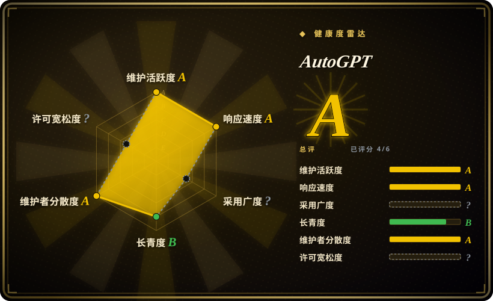
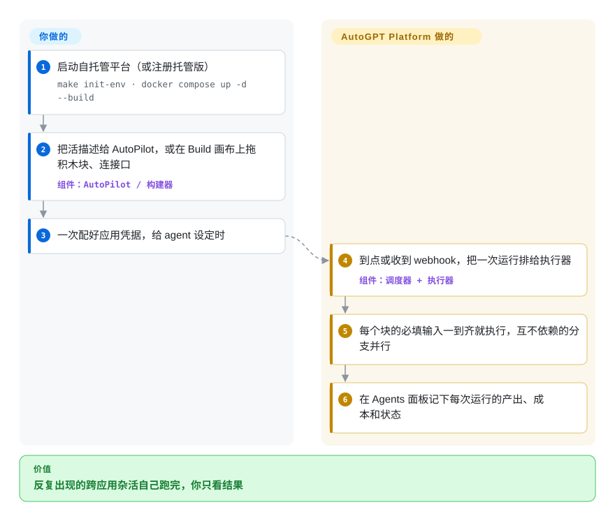

# AutoGPT

你每周都在重复同一件跨应用的杂活——从 Gmail 和表格里拉数据，让大模型总结或起草，再贴到 Slack 或 Notion——而和 ChatGPT 聊一次，下周一它不会自己再跑一遍。AutoGPT 把这件杂活存成一个 agent：一张由积木块（一次大模型调用、一次读 Gmail、一次发 Slack）连成的图，你在画布上拖出来或者用大白话描述出来，然后按需、定时或由 webhook 触发运行。

> **一个仓库，两个项目。** 今天说的“AutoGPT”指 **AutoGPT Platform**（`autogpt_platform/`，PolyForm Shield 许可）：一个可视化 agent 构建器加运行时，在 platform.agpt.co 有付费托管版。你可能记得的 2023 年那个“自主 GPT-4 循环”如今叫 **AutoGPT Classic**（`classic/`，MIT），不在本页评估范围内。

## 何时使用

你在一个小团队里管运营、销售或研究，总在跨工具重复同一条链：每天早上读某个标签下的新邮件，去 HubSpot 查发件人，让大模型起草回复和一句话简报，再一起丢进 Slack 频道。Zapier 那类工具能把应用串起来，但大模型只是挂在上面的一个步骤；自己用 LangChain 写，就得自己管服务器、调度器和密钥存储。你打开 AutoGPT，要么对 **AutoPilot** 说一句（“每个工作日 9 点，把我日历上每个客户调研一遍，给我发简报”）让它把 agent 搭出来，要么在 **Build** 画布上拖积木块、把带类型的接口连起来。45+ 个集成的凭据只配一次，点 **Schedule Task**，agent 就自己跑，每次运行的成本和产出都能在 Agents 面板里看到。

当这件事主要是大模型推理、中间夹几次应用调用，而不是以应用对接为主、偶尔调一下大模型时，选 AutoGPT 而不是 n8n；当你想要市场里的现成 agent 和定时 / 触发运行，而不是嵌进产品的聊天应用或 RAG 接口时，选它而不是 Dify；当非开发人员需要看懂、改动这个流程时，选它而不是自己写代码。

## 怎么用起来

一个 AutoGPT agent 就是一张**积木块组成的图**：每块是一个带类型的步骤——AI 文本生成、读 Gmail、HTTP 请求、子 agent——你把上一块的输出接口连到下一块的输入接口。执行从输入块开始，下游块的必填输入一到齐就触发，所以互不依赖的分支并行跑，有依赖的就等着。其余的平台替你做：加密保存你的凭据，经 RabbitMQ 把运行任务排队交给执行器，执行定时和 webhook 触发，并记下每次运行的产出和成本。你要做的是设计这张图（手工拖，或让 AutoPilot 起草）、提供输入和凭据、决定什么时候跑。自托管时，同一套构建器和运行时跑在你自己的 Docker 主机上，用你自己的模型 key。

<!-- flow-steps:begin (generated from flows/autogpt.json by tools/flow_card.py — do not edit) -->

流程文字版

1. **你**：启动自托管平台（或注册托管版） — `make init-env · docker compose up -d --build`
2. **你**：把活描述给 AutoPilot，或在 Build 画布上拖积木块、连接口 — 组件：`AutoPilot / 构建器`
3. **你**：一次配好应用凭据，给 agent 设定时
4. **AutoGPT**：到点或收到 webhook，把一次运行排给执行器 — 组件：`调度器 + 执行器`
5. **AutoGPT**：每个块的必填输入一到齐就执行，互不依赖的分支并行
6. **AutoGPT**：在 Agents 面板记下每次运行的产出、成本和状态

**价值**：反复出现的跨应用杂活自己跑完，你只看结果

<!-- flow-steps:end -->

## 何时不用

- **你需要 OSI 认可的开源许可，或打算拿它给别人提供服务。** `autogpt_platform/` 采用 **PolyForm Shield 1.0.0**——个人和企业内部使用免费，但不能拿它做和 AutoGPT 自家托管服务竞争的产品；只有 `classic/` 是 MIT，而且给平台贡献代码要签 CLA。想把可视化 agent 构建器嵌进产品或转售，用 [Langflow](langflow.zh.md)（MIT），因为它的许可不对你设竞争限制。
- **你想在一台小机器上自托管。** 手动部署要跑 Postgres、三个 Redis 节点、RabbitMQ、FalkorDB、ClamAV、大约八个后端服务加 Next.js 前端；就连还没正式发布的单容器版，实测也要 5–6 GiB 内存。在小 VPS 上只想要一个轻量的可视化大模型流程构建器，用 [Flowise](flowise.zh.md) 或 Langflow，因为它们一个进程 / 一个容器就能跑。
- **这件事是确定性的应用对接。** 如果流程是“表单一提交就建一条 CRM 记录再发封邮件”，中间没有推理，用 [n8n](../../workflow-orchestration/n8n.zh.md) 而不是 AutoGPT，因为它的 400+ 集成和节点级错误处理就是为这个做的，以大模型为中心的构建器只会多花钱、多不确定性。
- **你要的是聊天应用、RAG 知识库或嵌进产品的 API。** AutoGPT 的重心是定时 / 触发的 agent 和个人 agent 库。交付物是聊天机器人或检索接口时用 [Dify](dify.zh.md)，因为它开箱就有知识库导入、提示词调试台和每个应用一套 API。
- **你想用代码写 agent。** 这个平台首先是个构建器界面。想用 Python 定义 agent，就用 [CrewAI](../agent-runtimes/agent-sdks/crewai.zh.md) 或 [LangChain](langchain.zh.md)，因为逻辑留在受版本控制的代码里，而不是存在平台数据库里的一张图。
- **你需要一个成熟稳定的自托管产品。** 版本号仍是 `autogpt-platform-beta-v0.8.x`，自托管安装器的地址还没公开，升级可能要手动迁移数据（2026 年去掉内置 Supabase 的迁移文档写了一长串步骤），自托管用户只有社区支持。扛不住这些，就用付费托管版，或者 Dify 这类已到 v1.x 的产品。

## 横向对比

| 替代品 | 是否收录 | 我们的评价 | 取舍 |
| --- | --- | --- | --- |
| [Dify](dify.zh.md) | ✅ | 交付物是聊天机器人、RAG 接口或可嵌入的 AI 应用，选 Dify；交付物是跨应用定时干活的 agent，选 AutoGPT。 | Dify 在知识库、提示词工具和应用 API 上更强；AutoGPT 在市场现成 agent、AutoPilot 起草和触发器上更强。两者都带非 OSI 的许可附加条件。 |
| [n8n](../../workflow-orchestration/n8n.zh.md) | ✅ | 以确定性集成为主、偶尔一个大模型节点，选 n8n；每一步的核心都是大模型推理，选 AutoGPT。 | n8n 集成多得多、错误处理成熟；AutoGPT 把大模型块和 agent 起草当一等公民，但应用连接器少。 |
| [Langflow](langflow.zh.md) | ✅ | 需要可嵌入或转售的 MIT 可视化构建器，选 Langflow；要托管或自托管、带市场的定时 agent，选 AutoGPT。 | Langflow 更轻、许可宽松，但它是流程设计器，不是“每天早上自动跑”的 agent 面板。 |
| [Flowise](flowise.zh.md) | ✅ | 小服务器上只需要一个藏在 API 后面的可视化大模型 / RAG 链，选 Flowise；需要大量集成和定时运行，选 AutoGPT。 | Flowise 一个容器就能部署；AutoGPT 要十几个服务，但多了触发器、凭据管理和运行历史。 |
| [CrewAI](../agent-runtimes/agent-sdks/crewai.zh.md) | ✅ | 由开发者负责 agent、想让它以 Python 代码接受评审，选 CrewAI；需要非开发人员搭建和修改流程，选 AutoGPT。 | CrewAI 代码优先、没有托管层；AutoGPT 给你界面和运行时，但逻辑以图的形式存在它的数据库里。 |

## 技术栈

- **后端：** Python（FastAPI REST 服务、执行器、调度器、websocket、通知和数据库管理等服务），PostgreSQL 上用 Prisma ORM。
- **消息与状态：** Redis（Compose 里是三节点）、RabbitMQ 做运行队列、FalkorDB 图数据库经 Graphiti 存 agent 记忆（两者都是后端依赖）、ClamAV 扫描上传文件。
- **前端：** Next.js / React / TypeScript 构建器；2026 年去掉 Supabase 后改用内嵌认证（Better Auth）。
- **打包：** 自托管用 Docker Compose；单容器“appliance”镜像在准备中。
- **遗留：** `classic/`——原版 Python AutoGPT agent、Forge agent 模板和 `agbenchmark`，MIT。

## 依赖

- **托管版：** 只要浏览器；模型访问和凭据由平台管理，按套餐加 agent 用量计费。
- **自托管（手动）：** Docker + Docker Compose、Git、Node.js / NPM；在 `autogpt_platform/` 里跑 `make init-env` 生成密钥，再跑 `docker compose up -d --build`。首次启动需要能访问 GitHub（加载 skills 目录）。
- **自托管（appliance，即将推出）：** 一个跑 amd64 / arm64 Linux 容器的 Docker 守护进程，约 5–6 GiB 内存。
- **模型 provider：** 你自己的 API key（OpenAI、Anthropic 等），或经 Ollama 跑本地模型。
- **集成：** agent 要碰的每个应用（Gmail、Slack、GitHub、HubSpot……）各自的 OAuth / API 凭据。

## 运维难度

**自托管高，托管版低。** 自托管意味着要运维十几个容器——Postgres 备份、Redis、RabbitMQ、加密密钥轮换、升级时的多步迁移——版本线还挂着 beta，只有社区支持。agent 本身也得有人盯：大模型步骤结果不确定，每次运行都花 token，定时任务要设预算、要有人看产出。托管版按用量收费，把基础设施的活全拿走了。

## 健康度与可持续性
- **维护活跃度**：Grade A——最近 13 周中 13 周有提交；最后提交距今 0 天。
- **响应速度**：Grade A——中位首次响应时间 3.7 小时，基于 28 个 qualifying issues/PRs。
- **采用广度**：无法计算——unknown。
- **长青度**：Grade B——仓库已创建 1302 天。
- **治理集中度**：Grade A——前三贡献者占比 50.3%（过去 12 个月内 22 位活跃维护者）。
- **许可风险**：无法计算——unknown。
- **结论（2026-10-08）：有资金的公司在积极开发，但这是一个转过型、源码可见而非开源的产品。** Significant Gravitas 大约每周发一个平台版本（2026-09-19 到 2026-10-08 从 v0.8.0 到 v0.8.3），核心约 20 人，如今靠付费托管版给开发输血。仓库已有 3.5 年，但 Platform 是对 2023 年那个 agent 的重做，所以 Lindy 先验更多落在团队身上，而不是这套代码上。风险信号：PolyForm Shield（非 OSI，带竞争条款）加 CLA，以及仍挂着“beta”的版本线。[推断]

## 存疑（未验证）

- [未验证] 截至 2026-10-08 的 GitHub API 仓库事实：2023-03-16 创建，默认分支 `master`，最后推送 2026-10-08，未归档，约 188k star、约 45.9k fork，许可报为 `NOASSERTION`（README 的许可表和 `autogpt_platform/LICENSE.md` 写明平台是 PolyForm Shield 1.0.0，其余为 MIT），语言 Python，owner 为 Organization。大部分 star 来自 2023 年 Classic 的热潮，对 Platform 的采用情况说明不了多少。
- [未验证] 最新版本 `autogpt-platform-beta-v0.8.3`，发布于 2026-10-08。
- [未验证] 约 5–6 GiB 内存出自 `docs/platform/single-container.md`（“test installations”）；没有公布最低 CPU 要求。服务清单取自 2026-10-08 的 `autogpt_platform/docker-compose.yml`。
- [未验证] 45+ 个集成、AutoPilot 的能力和托管版计费方式出自 README 和文档，未在此实际使用。
- [推断] 某种自托管用法在 PolyForm Shield 下算不算“竞争”，取决于你的业务；对第三方提供基于 AutoGPT 的服务前，先做法务审查。
