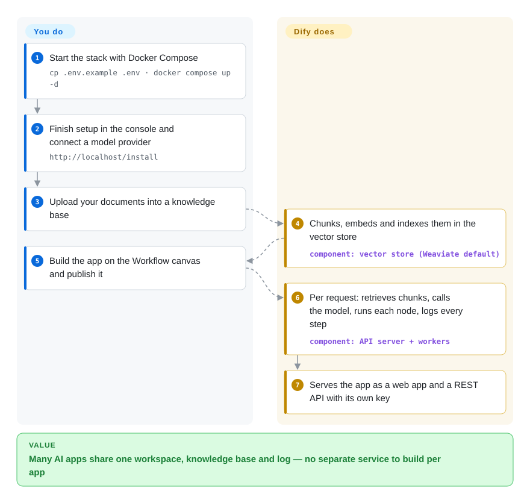

# Dify

Your team wants a support bot over the company docs and a few LLM workflows, and every prototype turns into its own Python service that someone has to host, secure, log and expose as an API. Dify puts all of those apps in one self-hostable workspace: you upload documents into a knowledge base, wire the flow on a canvas, and each app gets a web UI and an API key the moment you publish it.

## When to use

You're on a product or platform team asked for three AI features this quarter: an internal Q&A bot over Confluence exports and PDFs, a ticket-triage workflow that classifies and drafts replies, and an "ask our docs" widget for customers. Writing each in LangChain means three codebases, three deployments and nobody able to tweak a prompt without a release. You run Dify with Docker Compose, connect your model providers once (OpenAI, Anthropic, a local Ollama — installed as plugins), upload the documents into a **Knowledge** base that Dify chunks and indexes for you, and build each feature as an app on the **Workflow** canvas: a knowledge-retrieval node, an LLM node, an if/else, an HTTP call. Product people adjust prompts in the UI, the logs show every conversation, and your backend calls each app's REST API.

Choose Dify over Langflow or Flowise when you want the knowledge-base management, multi-app workspace, run logs and published web apps in one product rather than a flow designer you wrap yourself; choose it over n8n because its nodes are built around LLM calls, retrieval and agents rather than general SaaS plumbing.

## How it works

Dify is a web console plus an API server backed by Postgres, Redis and a vector database (Weaviate by default). You do the design work in the browser: connect model providers, create a knowledge base by uploading files (Dify splits them into chunks, turns them into embeddings — numeric fingerprints of meaning — and stores them for similarity search), then build an app as a graph of nodes. When a request comes in, Dify walks that graph for you: retrieves the relevant chunks, calls the model with your prompt, runs any code node inside an isolated sandbox service, calls tools and MCP servers, and streams the answer back while logging every step. Models and tools are plugins run by a separate plugin daemon, so adding a provider is an install from the marketplace, not a code change. What stays yours: the graph and prompts, the documents, the provider keys, and — when self-hosting — keeping that stack of containers healthy.

<!-- flow-steps:begin (generated from flows/dify.json by tools/flow_card.py — do not edit) -->

Text version of the flow

1. **You**: Start the stack with Docker Compose — `cp .env.example .env · docker compose up -d`
2. **You**: Finish setup in the console and connect a model provider — `http://localhost/install`
3. **You**: Upload your documents into a knowledge base
4. **Dify**: Chunks, embeds and indexes them in the vector store — component: `vector store (Weaviate default)`
5. **You**: Build the app on the Workflow canvas and publish it
6. **Dify**: Per request: retrieves chunks, calls the model, runs each node, logs every step — component: `API server + workers`
7. **Dify**: Serves the app as a web app and a REST API with its own key

**Value**: Many AI apps share one workspace, knowledge base and log — no separate service to build per app

<!-- flow-steps:end -->

## When NOT to use

- **You plan to run it as a multi-tenant service or white-label it.** Dify's license is Apache 2.0 *plus* conditions: without written permission you may not use the source to operate a multi-tenant environment (one tenant = one workspace), and you may not remove or change the logo/copyright in its frontend; contributors also agree the producer can tighten the license later. If you're building a SaaS where each customer gets their own workspace, use [Langflow](langflow.md) (MIT) instead, because it carries no tenancy or branding conditions.
- **You need SSO, fine-grained RBAC or a support SLA without buying anything.** The README puts those in **Dify Enterprise** (sales-led); the self-hosted Community Edition does not include them. If you can't buy Enterprise, put an authenticating reverse proxy in front of Community Edition, or choose Langflow and build access control yourself — either way, don't assume it ships in the free edition.
- **Your team is code-first.** If prompts, retrieval and agent logic should live in Python under code review, use [LlamaIndex](llamaindex.md) (RAG-first) or [LangChain](langchain.md) instead of Dify, because a canvas stored in Dify's database is harder to diff, test and review than code.
- **You need something tiny.** The README asks for at least 2 CPU cores and 4 GiB RAM, and the default Compose stack is about ten containers (api, worker, beat, web, Postgres, Redis, code sandbox, plugin daemon, SSRF proxy, nginx, Weaviate). For a single prompt-and-retrieve script, call the provider SDK directly or use [Flowise](flowise.md) instead, because one process is enough.
- **The workflow is general business automation.** "When a deal closes, update five SaaS tools" with an occasional LLM step belongs in [n8n](../../workflow-orchestration/n8n.md), not Dify, because n8n's 400+ integrations and node-level error handling are built for app plumbing.

## Comparison

| Alternative | In index | Our verdict | Tradeoff |
| --- | --- | --- | --- |
| [Langflow](langflow.md) | ✅ | If you need an MIT license you can embed, resell or run multi-tenant, pick Langflow; pick Dify when knowledge-base management, logs and published apps in one workspace matter more. | Langflow is lighter and permissively licensed but leaves app hosting, KB management and operator UI to you; Dify bundles them under license conditions. |
| [Flowise](flowise.md) | ✅ | On a small server where one container must serve a chatflow or RAG chain behind an API, pick Flowise; pick Dify for a team workspace running many AI apps with shared knowledge bases. | Flowise is simpler to deploy; Dify's ~10-service stack buys plugin marketplace, sandboxed code nodes and per-app logs. |
| [n8n](../../workflow-orchestration/n8n.md) | ✅ | For cross-SaaS business automation with occasional AI steps, pick n8n; pick Dify when retrieval, prompts and agents are the core of the app. | n8n has far more integrations; Dify has far deeper LLM/RAG tooling. Both are source-available with commercial conditions. |
| [AutoGPT](autogpt.md) | ✅ | For agents that run a multi-app chore on a schedule from a marketplace template, pick AutoGPT; pick Dify when the deliverable is a chat app, RAG endpoint or API you embed. | AutoGPT centres on scheduled/triggered agents; Dify centres on publishable apps and knowledge bases. |
| [LlamaIndex](llamaindex.md) | ✅ | When engineers want RAG pipelines in Python with full control over indexing and retrieval, pick LlamaIndex; pick Dify when non-engineers must build and tune the app. | LlamaIndex is a library you deploy yourself; Dify is a platform with UI, hosting and ops built in. |

## Tech stack

- **Backend:** Python 3.12 — Flask API server with Celery workers and beat scheduler (`api/`), plus a separate Go-based plugin daemon and code sandbox images.
- **Frontend:** TypeScript / Next.js console and published web apps (`web/`).
- **Data:** PostgreSQL (or MySQL) for metadata, Redis for cache and the Celery broker, a vector store — Weaviate by default, with Qdrant, Milvus, pgvector, Elasticsearch/OpenSearch, Chroma and many others selectable by Compose profile — and object storage via OpenDAL.
- **Edges:** nginx in front, a Squid SSRF proxy for outbound calls, optional certbot.
- **Extensibility:** `.difypkg` plugins for model providers, tools, agent strategies; MCP servers; per-app REST APIs; observability exports to Langfuse, Opik and Arize Phoenix.

## Dependencies

- Docker and Docker Compose v2.24.0+ (the documented self-hosting path).
- At least 2 CPU cores and 4 GiB RAM per the README; more once a large knowledge base and several workers are in play.
- PostgreSQL, Redis and a vector database — bundled in the Compose file, or external managed services in production.
- LLM provider credentials or a local model endpoint, plus an embedding model for knowledge bases.

## Ops difficulty

**Medium.** `docker compose up -d` gets a working stack in minutes, but production means owning about ten containers: Postgres backups, Redis, the vector store's disk and memory, Celery worker scaling for document ingestion, the plugin daemon and sandbox, and upgrades that ship roughly every two to four weeks (often with migrations). Dify Cloud removes this at the cost of a SaaS dependency.

## Health & viability
- **Maintenance**: Grade A — 13/13 active weeks in trailing 13; last commit 0 days ago.
- **Responsiveness**: Grade A — median first-response time 0.0 hours across 45 qualifying issues/PRs.
- **Adoption**: Grade D — 15,453 monthly downloads via npmjs.org (package: dify-client).
- **Longevity**: Grade B — 1275 days old.
- **Governance**: Grade A — top-3 contributor share 33.6% (247 active maintainers in the trailing 12 months).
- **Risk / License**: Cannot be scored — custom_modified_license. Upstream `LICENSE` is a modified Apache License 2.0 with extra commercial-license conditions for multi-tenant service use and frontend logo/copyright removal; treat GitHub `NOASSERTION` as a real license-review signal, not a parser glitch.
- **Verdict (2026-10-08): healthy, vendor-steered, license is the thing to check.** LangGenius ships steady minor releases (1.15.0 on 2026-06-25 through 1.17.1 on 2026-09-10) with a broad contributor base, and funds the project through Dify Cloud and Enterprise. At ~3.5 years and still very active, the Lindy prior is moderately favourable; the low Adoption grade measures the npm client SDK, not the platform. The real risk flag is the custom license — including the clause letting the producer change terms — rather than maintenance. [推断]

## Caveats (unverified)

- [未验证] Repo facts as of 2026-10-08 via GitHub API: created 2023-04-12, last push 2026-10-08, not archived, ~158k stars, ~24.9k forks, license `NOASSERTION` (the `LICENSE` file is the "Dify Open Source License", a modified Apache 2.0), language TypeScript (Python is nearly as large), owner Organization; latest release 1.17.1 on 2026-09-10.
- [未验证] The 2 CPU / 4 GiB minimum is the README's stated floor for trying Dify, not a production sizing guide.
- [未验证] The 0.0-hour median first response likely reflects an automated triage bot answering issues; it does not mean humans reply instantly.
- [推断] Whether a given deployment counts as "multi-tenant" under the license (e.g. one workspace per internal department vs per external customer) needs legal reading of the `LICENSE` text; this page does not give legal advice.
- [未验证] The SSO / RBAC / SLA split between Community and Enterprise is taken from the README's edition list; the exact Community-edition role model was not tested.
- [推断] The plugin daemon and sandbox being Go-based is inferred from the repo's Go code share and the separate `dify-plugin-daemon` / `dify-sandbox` images; their sources live in other repositories.
