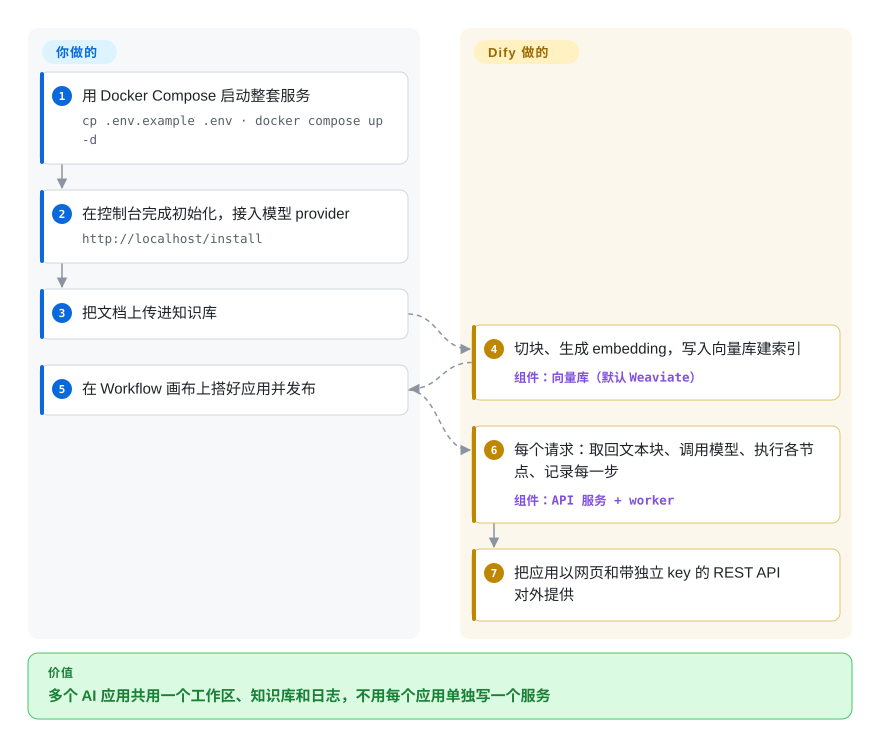

# Dify

团队想要一个基于公司文档的客服机器人，外加几个大模型工作流，结果每个原型都变成一个独立的 Python 服务，得有人去部署、加固、记日志、包成 API。Dify 把这些应用都收进一个可自托管的工作区：文档上传进知识库，流程在画布上连好，一点发布，每个应用就有了网页界面和 API key。

## 何时使用

你在产品或平台团队，这个季度要交三个 AI 功能：一个基于 Confluence 导出和 PDF 的内部问答机器人、一个给工单分类并起草回复的工作流、一个给客户用的“问我们的文档”小部件。全用 LangChain 写，就是三套代码、三次部署，而且改一句提示词都得发版。你用 Docker Compose 跑起 Dify，模型 provider 只接一次（OpenAI、Anthropic、本地 Ollama——都以插件形式安装），把文档上传进 **知识库**，由 Dify 负责切块和建索引，再在 **Workflow** 画布上把每个功能搭成一个应用：知识检索节点、大模型节点、条件分支、HTTP 调用。产品同学在界面里直接调提示词，日志里能看到每一轮对话，你的后端调用各个应用的 REST API。

想要知识库管理、多应用工作区、运行日志和可发布网页应用都在一个产品里，而不是一个还得自己包一层的流程设计器时，选 Dify 而不是 Langflow 或 Flowise；它的节点围绕大模型调用、检索和 agent 设计，而不是通用 SaaS 对接，所以这类场景选它而不是 n8n。

## 怎么用起来

Dify 是一个网页控制台加一个 API 服务，背后是 Postgres、Redis 和一个向量数据库（默认 Weaviate）。设计工作都在浏览器里做：接入模型 provider；上传文件建知识库（Dify 把文件切成小块，转成 embedding——一串代表语义的数字指纹——存起来供相似度检索）；再用节点搭出一张应用图。请求进来时，Dify 替你把这张图走一遍：取回相关文本块，用你的提示词调用模型，在隔离的沙箱服务里执行代码节点，调用工具和 MCP 服务，把答案流式返回，同时记录每一步。模型和工具都是插件，由单独的插件守护进程运行，所以加一个 provider 是去市场装一下，而不是改代码。留给你的：应用图和提示词、文档、provider 凭据，以及自托管时让这一堆容器保持健康。

<!-- flow-steps:begin (generated from flows/dify.json by tools/flow_card.py — do not edit) -->

流程文字版

1. **你**：用 Docker Compose 启动整套服务 — `cp .env.example .env · docker compose up -d`
2. **你**：在控制台完成初始化，接入模型 provider — `http://localhost/install`
3. **你**：把文档上传进知识库
4. **Dify**：切块、生成 embedding，写入向量库建索引 — 组件：`向量库（默认 Weaviate）`
5. **你**：在 Workflow 画布上搭好应用并发布
6. **Dify**：每个请求：取回文本块、调用模型、执行各节点、记录每一步 — 组件：`API 服务 + worker`
7. **Dify**：把应用以网页和带独立 key 的 REST API 对外提供

**价值**：多个 AI 应用共用一个工作区、知识库和日志，不用每个应用单独写一个服务

<!-- flow-steps:end -->

## 何时不用

- **你打算把它做成多租户服务或贴牌。** Dify 的许可是 Apache 2.0 *外加*条件：未经书面许可，不能用源码运营多租户环境（一个租户 = 一个工作区），也不能删改前端里的 logo 和版权信息；贡献者还同意出品方日后可以收紧许可。如果你在做每个客户一个工作区的 SaaS，用 [Langflow](langflow.zh.md)（MIT），因为它没有租户和品牌方面的附加条件。
- **你需要 SSO、细粒度 RBAC 或支持 SLA，又不想花钱。** README 把这些放在 **Dify Enterprise**（走销售）里；自托管的社区版不含这些。买不了企业版，就在社区版前面放一个带认证的反向代理，或者选 Langflow 自己做访问控制——总之别默认免费版自带。
- **你的团队代码优先。** 如果提示词、检索和 agent 逻辑应当以 Python 代码形式接受评审，用 [LlamaIndex](llamaindex.zh.md)（RAG 优先）或 [LangChain](langchain.zh.md)，而不是 Dify，因为存在 Dify 数据库里的画布，比代码更难 diff、测试和评审。
- **你只需要很小的东西。** README 要求至少 2 核 CPU、4 GiB 内存，默认 Compose 栈大约十个容器（api、worker、beat、web、Postgres、Redis、代码沙箱、插件守护进程、SSRF 代理、nginx、Weaviate）。只是一个“提示词 + 检索”的脚本，就直接调 provider SDK，或者用 [Flowise](flowise.zh.md)，因为一个进程就够了。
- **流程是通用业务自动化。** “成交后同步更新五个 SaaS 工具”、偶尔夹一步大模型，这该放进 [n8n](../../workflow-orchestration/n8n.zh.md)，而不是 Dify，因为 n8n 的 400+ 集成和节点级错误处理就是为应用对接做的。

## 横向对比

| 替代品 | 是否收录 | 我们的评价 | 取舍 |
| --- | --- | --- | --- |
| [Langflow](langflow.zh.md) | ✅ | 需要能嵌入、转售或做多租户的 MIT 许可，选 Langflow；知识库管理、日志和可发布应用集中在一个工作区更重要时，选 Dify。 | Langflow 更轻、许可宽松，但应用托管、知识库管理和运营界面要你自己补；Dify 把它们打包好了，代价是许可附加条件。 |
| [Flowise](flowise.zh.md) | ✅ | 小服务器上一个容器就要把 chatflow 或 RAG 链挂在 API 后面，选 Flowise；团队工作区里跑很多共享知识库的 AI 应用，选 Dify。 | Flowise 部署更简单；Dify 那十来个服务换来插件市场、沙箱化的代码节点和按应用的日志。 |
| [n8n](../../workflow-orchestration/n8n.zh.md) | ✅ | 跨 SaaS 的业务自动化、偶尔用 AI，选 n8n；检索、提示词和 agent 是应用核心时，选 Dify。 | n8n 集成多得多；Dify 的大模型 / RAG 工具深得多。两者都是带商业条件的源码可见许可。 |
| [AutoGPT](autogpt.zh.md) | ✅ | 想让 agent 照市场模板定时跑跨应用的杂活，选 AutoGPT；交付物是要嵌入的聊天应用、RAG 接口或 API，选 Dify。 | AutoGPT 以定时 / 触发的 agent 为中心；Dify 以可发布的应用和知识库为中心。 |
| [LlamaIndex](llamaindex.zh.md) | ✅ | 工程师想用 Python 完全掌控索引和检索来写 RAG 管线，选 LlamaIndex；需要非工程师搭建和调优应用，选 Dify。 | LlamaIndex 是你自己部署的库；Dify 是自带界面、托管和运维能力的平台。 |

## 技术栈

- **后端：** Python 3.12——Flask API 服务，配 Celery worker 和 beat 调度器（`api/`），另有独立的、基于 Go 的插件守护进程和代码沙箱镜像。
- **前端：** TypeScript / Next.js 控制台和发布出去的网页应用（`web/`）。
- **数据：** PostgreSQL（或 MySQL）存元数据，Redis 做缓存和 Celery 消息代理，向量库默认 Weaviate，也能按 Compose profile 换成 Qdrant、Milvus、pgvector、Elasticsearch / OpenSearch、Chroma 等众多选项，对象存储走 OpenDAL。
- **边缘：** 前面是 nginx，出站调用经 Squid SSRF 代理，可选 certbot。
- **扩展：** `.difypkg` 插件（模型 provider、工具、agent 策略）；MCP 服务；每个应用一套 REST API；可观测数据导出到 Langfuse、Opik 和 Arize Phoenix。

## 依赖

- Docker 和 Docker Compose v2.24.0+（文档给出的自托管路径）。
- README 要求至少 2 核 CPU、4 GiB 内存；知识库一大、worker 一多，还要更多。
- PostgreSQL、Redis 和向量数据库——Compose 文件里已捆绑，生产环境也可以换成外部托管服务。
- 大模型 provider 凭据或本地模型端点，外加一个给知识库用的 embedding 模型。

## 运维难度

**中等。** `docker compose up -d` 几分钟就能起一套可用的栈，但上生产就得管大约十个容器：Postgres 备份、Redis、向量库的磁盘和内存、文档导入用的 Celery worker 扩容、插件守护进程和沙箱，以及大约每两到四周一次、经常带数据迁移的升级。Dify Cloud 能把这些都拿走，代价是依赖一个 SaaS。

## 健康度与可持续性
- **维护活跃度**：Grade A——最近 13 周中 13 周有提交；最后提交距今 0 天。
- **响应速度**：Grade A——中位首次响应时间 0.0 小时，基于 45 个 qualifying issues/PRs。
- **采用广度**：Grade D——npmjs.org 上月下载量 15,453（包名：dify-client）。
- **长青度**：Grade B——仓库已创建 1275 天。
- **治理集中度**：Grade A——前三贡献者占比 33.6%（过去 12 个月内 247 位活跃维护者）。
- **许可风险**：无法计算——custom_modified_license。上游 `LICENSE` 是修改版 Apache License 2.0，对多租户服务使用、移除前端 logo / 版权信息附加了商业许可条件；应把 GitHub 返回的 `NOASSERTION` 当成真实的许可审查信号，而不是解析器误差。
- **结论（2026-10-08）：健康、由厂商主导，要查的是许可。** LangGenius 稳定发布小版本（2026-06-25 的 1.15.0 到 2026-09-10 的 1.17.1），贡献者基础广，靠 Dify Cloud 和企业版养项目。约 3.5 年且仍非常活跃，Lindy 先验算是中等有利；采用度评级低，测的是 npm 客户端 SDK，而不是平台本身。真正的风险信号是自定义许可——包括允许出品方修改条款的那一条——而不是维护。[推断]

## 存疑（未验证）

- [未验证] 截至 2026-10-08 的 GitHub API 仓库事实：2023-04-12 创建，最后推送 2026-10-08，未归档，约 158k star、约 24.9k fork，许可报为 `NOASSERTION`（`LICENSE` 文件是“Dify Open Source License”，即修改版 Apache 2.0），语言 TypeScript（Python 体量几乎一样大），owner 为 Organization；最新版本 1.17.1，发布于 2026-09-10。
- [未验证] 2 核 / 4 GiB 是 README 给出的试用下限，不是生产容量规划。
- [未验证] 中位首次响应 0.0 小时，很可能是自动分诊机器人在回复 issue，不代表有人类秒回。
- [推断] 某个部署在许可下算不算“多租户”（比如按内部部门分工作区 vs 按外部客户分）需要法务细读 `LICENSE` 原文；本页不构成法律意见。
- [未验证] 社区版和企业版在 SSO / RBAC / SLA 上的划分取自 README 的版本列表；社区版的具体角色模型未实测。
- [推断] 插件守护进程和沙箱基于 Go，是从仓库里的 Go 代码占比以及独立的 `dify-plugin-daemon` / `dify-sandbox` 镜像推断的；它们的源码在其他仓库。
