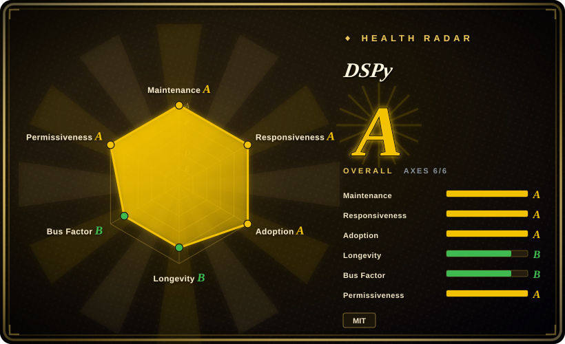
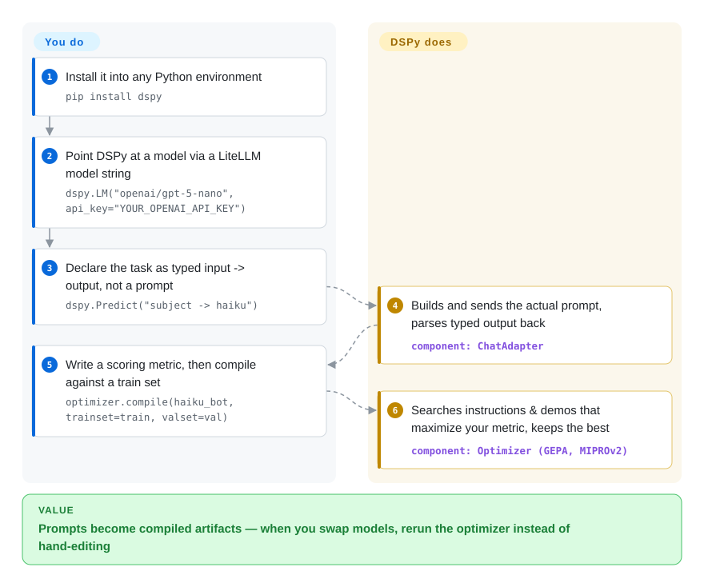

# DSPy

Hand-tuned prompts work today and silently break when the model updates or the data drifts, and "this version feels better" is unverifiable. DSPy makes the prompt a compiled artifact: you declare typed input→output signatures plus a scoring metric, and its optimizers generate the actual prompts (optionally weights) that maximize the metric — recompile when the model changes.

## When to use

You're an applied ML or platform engineer building an LLM pipeline — say a RAG system or a multi-step classification/extraction flow — and you're tired of hand-tuning megaprompts that silently break every time you swap the model or the data drifts. You've got a few dozen labeled examples and a metric you actually care about (exact-match, F1, an LLM judge), but no good way to systematically turn "this prompt feels better" into "this prompt measurably scores higher." DSPy resolves this by letting you write the *logic* declaratively: you define a `Signature` like `question -> answer`, wrap it in a `Module` (`Predict`, `ChainOfThought`, `ReAct`), and then hand the whole program plus your metric to an optimizer. The optimizer (BootstrapFewShot, MIPROv2, GEPA, BootstrapFinetune) searches over demonstrations, instructions, or finetuned weights to maximize your metric — so the prompt becomes a compiled artifact instead of a hand-edited string.

It's also a good fit when you expect to swap models often. Because DSPy routes calls through LiteLLM, the same program runs across OpenAI, Anthropic, local vLLM/Ollama, and others, and you can re-compile when you change backends rather than rewriting prompts per provider. If your value is in *structure that survives model churn* — and you have data and a metric to optimize against — that's DSPy's sweet spot.

## How it works

A DSPy program is plain Python. You write a `Signature` — a typed input→output declaration like `"subject -> haiku"`, no prompt text involved — and wrap it in a `Module` (`Predict`, `ChainOfThought`, `ReAct`) that decides how the call is made. At run time DSPy builds the real prompt, sends it through its LiteLLM gateway (a provider-agnostic adapter layer) to whichever model you configured, and parses the reply back into your declared output fields. The compiler part: you hand an optimizer a small train set plus a metric — any function that scores an output, e.g. exact-match, F1, or an LLM judge — and it searches over instruction wording and few-shot demonstrations (or finetuned weights) until your metric stops improving, emitting a compiled program. What is yours: the program structure, the examples, and the metric; what DSPy owns: every prompt string in between, regenerable with one `optimizer.compile(...)` call when you swap models.

<!-- flow-steps:begin (generated from flows/dspy.json by tools/flow_card.py — do not edit) -->

Text version of the flow

1. **You**: Install it into any Python environment — `pip install dspy`
2. **You**: Point DSPy at a model via a LiteLLM model string — `dspy.LM("openai/gpt-5-nano", api_key="YOUR_OPENAI_API_KEY")`
3. **You**: Declare the task as typed input -> output, not a prompt — `dspy.Predict("subject -> haiku")`
4. **DSPy**: Builds and sends the actual prompt, parses typed output back — component: `ChatAdapter`
5. **You**: Write a scoring metric, then compile against a train set — `optimizer.compile(haiku_bot, trainset=train, valset=val)`
6. **DSPy**: Searches instructions & demos that maximize your metric, keeps the best — component: `Optimizer (GEPA, MIPROv2)`

**Value**: Prompts become compiled artifacts — when you swap models, rerun the optimizer instead of hand-editing

<!-- flow-steps:end -->

## When NOT to use

- **You have no metric and no eval data.** DSPy's whole payoff is optimization against a measurable objective. With zero labeled examples and no scoring function, the optimizers have nothing to climb, and you're left with a heavier, more abstract way to write a single prompt — use a thin SDK or a template library instead.
- **You want a visual/low-code agent builder or a big tool/integration catalog.** DSPy is a Python programming model, not a drag-and-drop canvas or an integrations marketplace. For document loaders, vector-store connectors, and prebuilt chains, LangChain / LlamaIndex cover more surface out of the box.
- **You need a thin, fully-transparent prompt you can read and ship verbatim.** DSPy *generates* the final prompt; what the model sees is an artifact of compilation, not a string you wrote. Teams that need every token auditable and version-controlled by hand may find the indirection unwelcome.
- **Hard latency/cost budgets during development.** Optimizers (especially MIPROv2/GEPA) issue many LM calls to search the space; a compile run can be slow and token-expensive [未验证]. Production inference is cheap, but the optimize loop is not free.
- **You want long-term API stability.** DSPy has moved fast and renamed core surfaces across versions (teleprompters → optimizers, `dspy.Predict` ergonomics, signature syntax) [推断]; pin a version and expect migration work on upgrades.
- **Pure orchestration of deterministic multi-agent workflows** (queues, schedulers, durable state) — DSPy optimizes LM programs; it is not a workflow engine.

## Comparison

| Alternative | In index | Our verdict | Tradeoff |
|---|---|---|---|
| [AgentScope](../agent-runtimes/agent-sdks/agentscope.md) | ✅ | Pick AgentScope when you need a multi-agent runtime and messaging platform rather than prompt/program optimization. | Multi-agent runtime/messaging platform; focuses on agent orchestration & coordination, not compiling/optimizing single LM programs against a metric. |
| [Symphony](../agent-runtimes/agent-services/symphony.md) | ✅ | Pick Symphony when you need a different agent orchestration model and not DSPy's optimizer layer. | Agent framework with a different orchestration model; DSPy's distinctive feature is the optimizer layer, which most agent frameworks don't have. |
| [LangChain](langchain.md) | ✅ | Pick LangChain when ecosystem breadth and integrations matter more than systematic prompt/program optimization. | Far broader integration/chain/agent catalog and ecosystem; prompts stay hand-authored. DSPy trades breadth for systematic prompt/weight optimization. |
| [LlamaIndex](llamaindex.md) | ✅ | Pick LlamaIndex when RAG/data connectors and indices are the core need. | RAG/data-framework heavyweight with rich connectors and indices; DSPy is lighter on data plumbing but optimizes the reasoning program itself. |
| TextGrad | 未收录 | Pick TextGrad when textual-gradient optimization is the mechanism you want to explore. | Also optimizes LM pipelines, via "textual gradients" / backprop-through-text; narrower module model than DSPy's signatures+optimizers. |
| AdalFlow (LightRAG) | 未收录 | Pick AdalFlow when you want a smaller PyTorch-like LM app library with a similar optimize-don't-hand-prompt philosophy. | "PyTorch-like" library for building & auto-optimizing LM apps; closest in philosophy (optimize, don't hand-prompt), smaller ecosystem. |

## Tech stack

- **Language:** Python (`>=3.10, <3.15` per pyproject).
- **Core abstractions:** `Signature` (typed I/O spec), `Module` (`Predict`, `ChainOfThought`, `ReAct`, `ProgramOfThought`, etc.), and optimizers / "teleprompters" — verified against `dspy/teleprompt/` at v3.4.0: `GEPA`, `MIPROv2`, `BootstrapFewShot`(+RandomSearch), `BootstrapFinetune`, `COPRO`, `SIMBA`, plus `Ensemble`, `GRPO`, `AvatarOptimizer`, `InferRules`, `KNNFewShot` and others.
- **LM gateway:** LiteLLM, giving provider-agnostic access (OpenAI, Anthropic, local vLLM/Ollama, etc.).
- **Validation/serialization:** Pydantic v2, orjson, json-repair (for coercing model output into typed fields).
- **Caching/robustness:** diskcache + cachetools (LM response caching), tenacity (retries), cloudpickle (program serialization).
- **Optimization helper:** `gepa` package (pinned dependency) for the GEPA optimizer.

## Dependencies

- **Runtime:** Python ≥ 3.10 and < 3.15. No GPU required for the framework itself (you call hosted or local LMs); finetune-based optimizers need whatever the target finetuning backend requires.
- **Required Python deps (v3.4.0, per pyproject):** `litellm` ≥ 1.65.8, `openai` ≥ 1.66.2, `pydantic` ≥ 2.11.0, `regex` ≥ 2023.10.3, `orjson`, `tqdm`, `requests` ≥ 2.31, `diskcache` ≥ 5.6, `json-repair` ≥ 0.54.2, `tenacity`, `anyio`, `cachetools` ≥ 5.5, `cloudpickle` ≥ 3.1.2, `gepa[dspy]` ==0.1.4. Optional extras exist for `anthropic`, `mcp`, `weaviate`, `langchain`, `optuna`, `deno`, and `typesafe`.
- **External services:** at least one LM provider/endpoint (API key for a hosted model, or a local server like Ollama/vLLM). Optional: a vector store/retriever for RAG, and tracking/observability backends.
- **Install:** `pip install dspy` (formerly `dspy-ai`).

## Ops difficulty

**Low-to-medium.** As a library it's `pip install` and run — no servers, no datastore, no cluster to operate; the framework just makes LM calls through LiteLLM. The medium-tier friction is conceptual and economic rather than infrastructural: you must build an eval set and metric to get value, optimizer runs can be slow and token-costly so you'll want LM caching and budget controls, and the fast-moving API means upgrades can require migration. Production *serving* of a compiled DSPy program is light (it's just code + saved prompts/state); the cost and care concentrate in the compile/optimize loop and in keeping pinned versions stable.

## Health & viability

- **Responsiveness**: Grade A — median first-response time 23.2 hours across 25 qualifying issues/PRs (re-scored 2026-09).
- **Maintenance — very active (as of 2026-09).** Last push 2026-09; latest release 3.4.0 (2026-09-25). Steady release flow on a v3.x line; not archived. Reads as healthily maintained, with hundreds of open issues reflecting a large active user base rather than neglect.
- **Governance & backing — org/academic-anchored.** Lives under `stanfordnlp` (Stanford NLP), a research-org owner rather than a single vendor or lone maintainer; provenance (the original DSP/DSPy papers) gives it academic credibility. Not foundation-governed, but the bus factor is broader than a personal repo. [推断]
- **Age & Lindy — ~3.7 years old and still active ⇒ strong prior.** Created 2023-01, still shipping weekly (as of 2026-09). By age × still-active it clears the Lindy bar that the younger agent frameworks in this category do not — a comparatively safe long-term bet for the *paradigm*, even though the API churns within it.
- **Adoption & ecosystem — widely referenced, with named production cases.** 5,174,682 PyPI downloads/month (measured 2026-09) and ~38.4k stars. The docs cite Shopify (GPT-5 task converted to DSPy + GEPA on a small Qwen model, ~75× cheaper and ~2× more reliable) and Dropbox (doubled relevance-judge accuracy on a smaller model) — these are the project's own reported numbers, not independently reproduced.
- **Risk flags — API instability, not licensing.** MIT-licensed with no relicense history; the real risk is migration cost across major versions (teleprompter→optimizer renames), so pin a version.

## Caveats (unverified)

- [未验证] Star count ~38.4k as of 2026-09 (GitHub API) — stars are unreliable and date-sensitive; indicative only, not adoption or vetting evidence.
- [未验证] Optimizer compile runs being slow / token-expensive is a general characteristic of search-based prompt optimization; exact cost depends entirely on optimizer choice, program size, model, and dataset — no first-party number is asserted here.
- [推断] API churn / renames across major versions (teleprompter→optimizer terminology, signature ergonomics) is inferred from DSPy's release history and community reports, not confirmed against a specific changelog here; treat upgrade-migration cost as a risk to check.
- [未验证] LiteLLM enabling specific providers (Anthropic, vLLM, Ollama) is per DSPy/LiteLLM documentation; confirm the exact provider/model is supported for your version before depending on it.
- [未验证] The Shopify (~75× cheaper, ~2× more reliable) and Dropbox (doubled accuracy) figures are the project's own claims in its docs (getting-started/gepa-optimization.md), not independently reproduced.
