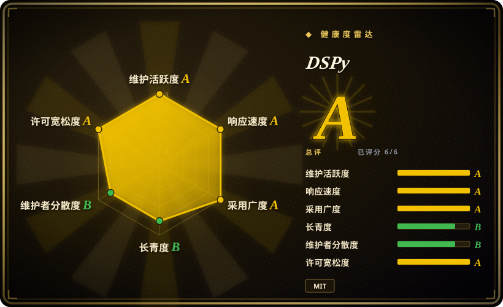
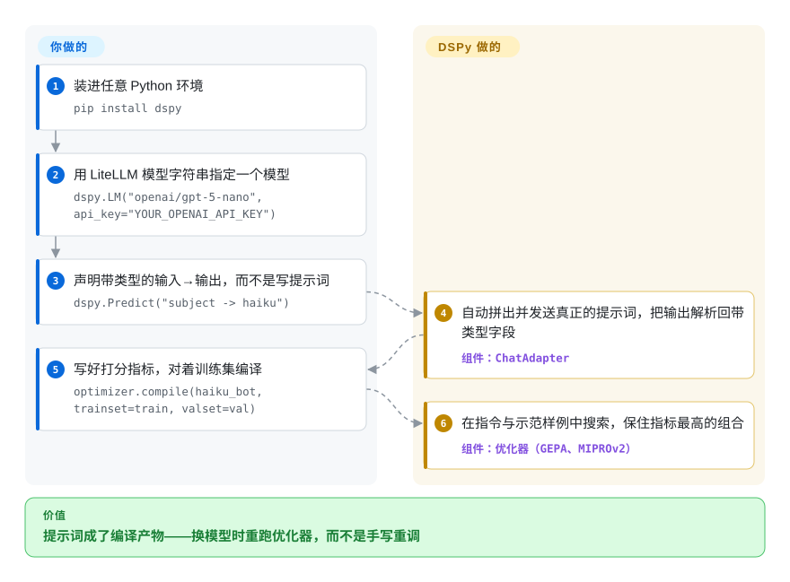

# DSPy

手写调好的提示词今天在 GPT 上好用，明天模型一更新或数据一漂移就悄悄失效，而且“这版感觉更好”根本无法验证。DSPy 把提示词变成编译产物：你声明带类型的输入→输出接口和一个打分指标，优化器替你生成（并在换模型时重新生成）真正上线的提示词，必要时连微调权重一起优化。

## 何时使用

你是应用 ML 或平台工程师，正在搭一条 LLM 流水线——比如一套 RAG 系统，或一个多步的分类/抽取流程——而你已经厌倦了手工调那种一换模型或数据漂移就悄悄失效的超长提示词。你手里有几十条标注样本和一个你真正在乎的指标（exact-match、F1、或一个 LLM 评审），却没有好办法把“这个提示词感觉更好”系统地变成“这个提示词分数实测更高”。DSPy 用声明式的方式解决它：你定义一个像 `question -> answer` 的 `Signature`，用 `Module`（`Predict`、`ChainOfThought`、`ReAct`）包起来，然后把整个程序连同指标一起交给优化器。优化器（BootstrapFewShot、MIPROv2、GEPA、BootstrapFinetune）会在示范样例、指令或微调权重上做搜索，以最大化你的指标——于是提示词变成了一个被编译出来的产物，而不是手工编辑的字符串。

当你预计会频繁更换模型时，它同样合适。因为 DSPy 通过 LiteLLM 路由调用，同一个程序可以跑在 OpenAI、Anthropic、本地 vLLM/Ollama 等之上，换后端时你重新编译即可，而不必为每个 provider 重写提示词。如果你的价值在于“能扛住模型更迭的结构”——而且你有数据、有可优化的指标——那就是 DSPy 的最佳落点。

## 怎么用起来

DSPy 程序就是普通 Python。你写一个 `Signature`——形如 `"subject -> haiku"` 的带类型输入→输出声明，完全不含提示词文本——再包进一个 `Module`（`Predict`、`ChainOfThought`、`ReAct`）决定这次调用怎么执行。运行时，DSPy 拼出真正的提示词，经它的 LiteLLM 网关（一层与厂商无关的适配层）发给你配置的任意模型，再把回复解析回你声明的输出字段。编译器的那一半：你交给优化器一小份训练集加一个指标——任何能给输出打分的函数，比如 exact-match、F1 或一个 LLM 评审——它在指令措辞与少样本示范（或微调权重）上搜索，直到指标不再提升，产出一份编译好的程序。属于你的：程序结构、样本和指标；属于 DSPy 的：中间所有提示词字符串，换模型时一句 `optimizer.compile(...)` 就能重新生成。

<!-- flow-steps:begin (generated from flows/dspy.json by tools/flow_card.py — do not edit) -->

流程文字版

1. **你**：装进任意 Python 环境 — `pip install dspy`
2. **你**：用 LiteLLM 模型字符串指定一个模型 — `dspy.LM("openai/gpt-5-nano", api_key="YOUR_OPENAI_API_KEY")`
3. **你**：声明带类型的输入→输出，而不是写提示词 — `dspy.Predict("subject -> haiku")`
4. **DSPy**：自动拼出并发送真正的提示词，把输出解析回带类型字段 — 组件：`ChatAdapter`
5. **你**：写好打分指标，对着训练集编译 — `optimizer.compile(haiku_bot, trainset=train, valset=val)`
6. **DSPy**：在指令与示范样例中搜索，保住指标最高的组合 — 组件：`优化器（GEPA、MIPROv2）`

**价值**：提示词成了编译产物——换模型时重跑优化器，而不是手写重调

<!-- flow-steps:end -->

## 何时不用

- **你没有指标、也没有评测数据。** DSPy 的全部回报来自“对照可度量目标做优化”。零标注样本、无评分函数时，优化器无坡可爬，你得到的只是一种更重、更抽象的写单条提示词的方式——这时用一个薄 SDK 或模板库即可。
- **你想要可视化/低代码的 agent 搭建器，或一个庞大的工具/集成目录。** DSPy 是 Python 编程模型，不是拖拽画布，也不是集成市场。文档加载器、向量库连接器、预制 chain 这些，LangChain / LlamaIndex 开箱即覆盖更广。
- **你需要一份能逐字读懂、原样交付的薄提示词。** DSPy 是*生成*最终提示词的；模型实际看到的是编译产物，而非你手写的字符串。需要每个 token 都可审计、由人手版本管理的团队，可能会嫌这层间接讨厌。
- **开发期有硬性延迟/成本预算。** 优化器（尤其 MIPROv2/GEPA）会发出大量 LM 调用来搜索空间；一次 compile 可能又慢又费 token [未验证]。生产推理很便宜，但 optimize 循环并不免费。
- **你想要长期稳定的 API。** DSPy 迭代很快，核心命名跨版本变过（teleprompter → optimizer、`dspy.Predict` 用法、signature 语法）[推断]；请 pin 住版本，并预期升级时要做迁移工作。
- **纯粹编排确定性的多 agent 工作流**（队列、调度、持久状态）——DSPy 优化的是 LM 程序，它不是工作流引擎。

## 横向对比

| 替代品 | 是否收录 | 我们的评价 | 取舍 |
|---|---|---|---|
| [AgentScope](../agent-runtimes/agent-sdks/agentscope.zh.md) | ✅ | 需要多 agent 运行时和消息平台，而不是 prompt/程序优化时，选 AgentScope。 | 多 agent 运行时/消息平台；聚焦 agent 编排与协作，而非把单个 LM 程序对照指标编译/优化。 |
| [Symphony](../agent-runtimes/agent-services/symphony.zh.md) | ✅ | 需要另一种 agent 编排模型，而不是 DSPy 的优化器层时，选 Symphony。 | 编排模型不同的 agent 框架；DSPy 的标志特性是优化器层，这是多数 agent 框架所没有的。 |
| [LangChain](langchain.zh.md) | ✅ | 生态广度和集成数量比系统化 prompt/程序优化更重要时，选 LangChain。 | 集成/chain/agent 目录与生态广得多；提示词仍靠手写。DSPy 用广度换取系统化的提示词/权重优化。 |
| [LlamaIndex](llamaindex.zh.md) | ✅ | 核心需求是 RAG/数据连接器与索引时，选 LlamaIndex。 | RAG/数据框架重量级，连接器与索引丰富；DSPy 数据管线更轻，但优化的是推理程序本身。 |
| TextGrad | 未收录 | 想探索“文本梯度”优化机制时，选 TextGrad。 | 同样优化 LM 流水线，走“文本梯度”/对文本反向传播；模块模型比 DSPy 的 signatures+optimizers 更窄。 |
| AdalFlow（LightRAG） | 未收录 | 想要更小的类 PyTorch LM 应用库，且理念同样是优化而非手写提示词时，选 AdalFlow。 | “类 PyTorch”的库，用来构建并自动优化 LM 应用；理念最接近（优化而非手写提示词），生态更小。 |

## 技术栈

- **语言：** Python（pyproject 要求 `>=3.10, <3.15`）。
- **核心抽象：** `Signature`（带类型的 I/O 规格）、`Module`（`Predict`、`ChainOfThought`、`ReAct`、`ProgramOfThought` 等），以及优化器 / “teleprompter”——已对照 v3.4.0 的 `dspy/teleprompt/` 源码核实：`GEPA`、`MIPROv2`、`BootstrapFewShot`（含 RandomSearch）、`BootstrapFinetune`、`COPRO`、`SIMBA`，另有 `Ensemble`、`GRPO`、`AvatarOptimizer`、`InferRules`、`KNNFewShot` 等。
- **LM 网关：** LiteLLM，提供 provider 无关的访问（OpenAI、Anthropic、本地 vLLM/Ollama 等）。
- **校验/序列化：** Pydantic v2、orjson、json-repair（把模型输出强转成带类型的字段）。
- **缓存/健壮性：** diskcache + cachetools（LM 响应缓存）、tenacity（重试）、cloudpickle（程序序列化）。
- **优化辅助：** `gepa` 包（pin 死的依赖），用于 GEPA 优化器。

## 依赖

- **运行时：** Python ≥ 3.10 且 < 3.15。框架本身不需要 GPU（你调用托管或本地 LM 即可）；基于微调的优化器则需要目标微调后端所要求的资源。
- **必需 Python 依赖（v3.4.0，依 pyproject）:** `litellm` ≥ 1.65.8、`openai` ≥ 1.66.2、`pydantic` ≥ 2.11.0、`regex` ≥ 2023.10.3、`orjson`、`tqdm`、`requests` ≥ 2.31、`diskcache` ≥ 5.6、`json-repair` ≥ 0.54.2、`tenacity`、`anyio`、`cachetools` ≥ 5.5、`cloudpickle` ≥ 3.1.2、`gepa[dspy]` ==0.1.4。另有 `anthropic`、`mcp`、`weaviate`、`langchain`、`optuna`、`deno`、`typesafe` 等可选 extra。
- **外部服务：** 至少一个 LM provider/端点（托管模型的 API key，或 Ollama/vLLM 之类的本地服务）。可选：RAG 用的向量库/检索器，以及跟踪/可观测后端。
- **安装：** `pip install dspy`（原名 `dspy-ai`）。

## 运维难度

**低到中。** 作为库它就是 `pip install` 即用——无服务、无数据存储、无集群可运维；框架只是通过 LiteLLM 发 LM 调用。中等档的摩擦是概念与经济上的，而非基础设施上的：你必须先建评测集和指标才能拿到价值；优化器跑起来可能又慢又费 token，所以你会想要 LM 缓存和预算控制；而快速变动的 API 意味着升级可能要做迁移。把编译好的 DSPy 程序拿去生产*服务*很轻（无非是代码 + 存下来的提示词/状态）；成本与心力集中在 compile/optimize 循环，以及把 pin 死的版本维持稳定上。

## 健康度与可持续性

- **响应速度**：Grade A——中位首次响应时间 23.2 小时，基于 25 个 qualifying issues/PRs（2026-09 重算）。
- **维护——非常活跃（截至 2026-09）。** 最后推送 2026-09；最新发布 3.4.0（2026-09-25）。在 v3.x 线上稳定出版本；未归档。读起来维护健康，数百个未决 issue 反映的是庞大的活跃用户群而非疏于打理。
- **治理与背书——组织 / 学术锚定。** 归在 `stanfordnlp`（斯坦福 NLP）名下，owner 是研究组织而非单一厂商或孤身维护者；其出身（最初的 DSP/DSPy 论文）带来学术可信度。虽非基金会治理，但 bus factor 比个人仓库更宽。[推断]
- **年龄与 Lindy——约 3.7 岁且仍在周更 ⇒ 强先验。** 2023-01 创建，截至 2026-09 仍在每周出版本。按「年龄 × 仍活跃」，它跨过了本类目里更年轻的 agent 框架跨不过的 Lindy 门槛——对这一*范式*而言是相对安全的长期押注，尽管其内部 API 仍在变动。
- **采用与生态——被广泛引用，且有具名生产案例。** 每月 5,174,682 次 PyPI 下载（2026-09 实测）、约 38.4k star。文档引用了 Shopify（GPT-5 单提示词任务转为 DSPy + GEPA 跑小 Qwen 模型，成本约降 75 倍、可靠性约提升 2 倍）与 Dropbox（评审程序换小模型后准确率翻倍）——这些是项目自报数字，未独立复现。
- **风险信号——是 API 不稳定，不是许可。** MIT 许可、无重许可历史；真正的风险是跨大版本的迁移成本（teleprompter→optimizer 改名），所以请 pin 住版本。

## 存疑（未验证）

- [未验证] 截至 2026-09，约 38.4k GitHub star（GitHub API 计数）——star 数不可靠且对时间敏感，只作参考，不作采用/检验程度证据。
- [未验证] 优化器 compile 又慢又费 token 是搜索式提示词优化的通性；具体成本完全取决于优化器选择、程序规模、模型与数据集——此处不主张任何官方数字。
- [推断] 跨大版本的 API 变动/改名（teleprompter→optimizer 术语、signature 用法）是依 DSPy 发版历史与社区反馈推断的，未在此对照具体 changelog 确认；请把升级迁移成本当作需要核查的风险。
- [未验证] LiteLLM 能启用具体 provider（Anthropic、vLLM、Ollama）是依 DSPy/LiteLLM 文档；依赖前请确认你的版本确实支持目标 provider/模型。
- [未验证] Shopify（约 75× 降本、约 2× 可靠性）与 Dropbox（准确率翻倍）数字来自项目文档（getting-started/gepa-optimization.md）自述，未独立复现。
