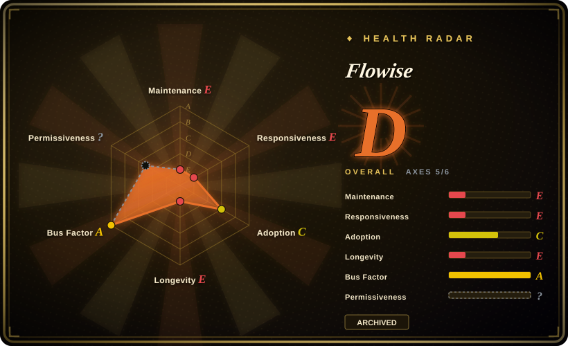
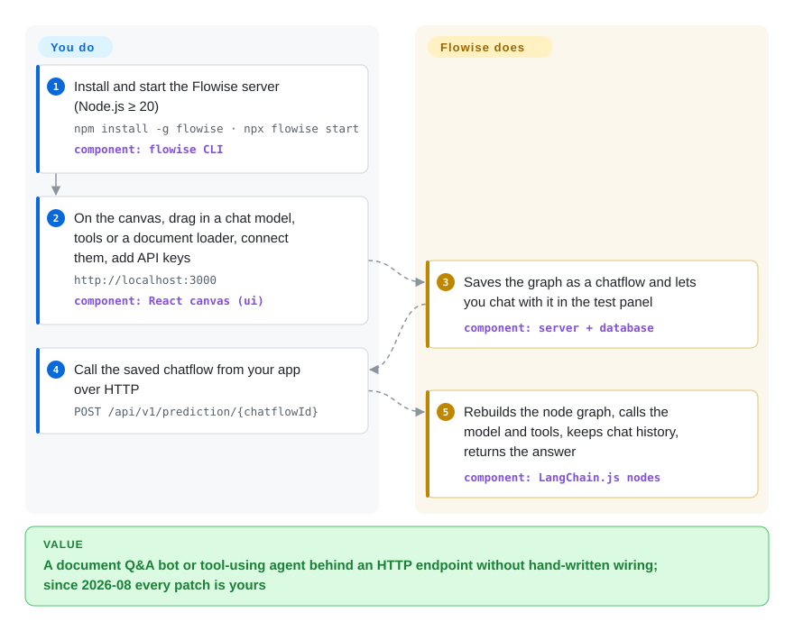

# Flowise

A chatbot that answers from your documents or calls a few tools used to mean writing the model, retriever and tool wiring in code; Flowise let you drag those pieces together on a browser canvas and got you an HTTP endpoint for the result. Its maintainers archived the repository on 2026-08-13 and ended support on 2026-08-31, so today it is code you fork or migrate off, not a place to start.

## When to use

You run an internal Flowise instance: a support bot over the product manual, a lead-qualification agent, a dozen chatflows that sales and support poke at through the embedded chat widget. Then the 2026-07-29 code-freeze notice lands, followed by a read-only repo and a `SECURITY.md` that says vulnerability reports are no longer accepted. Your question is no longer "is Flowise a good builder?" but "what am I carrying, and can my team own it?" This page is for that decision: what runs where, which parts are Apache-2.0 and which are commercial-licensed, and what to move to.

The other legitimate trigger is a Node/TypeScript team that wants a self-hostable visual LLM builder whose node catalogue wraps LangChain.js, and that is prepared to maintain its own fork, because the Apache-2.0 core lets you. If you are not prepared to own patches, the deciding tradeoff has flipped: Langflow (Python, MIT, maintained) or Dify gives you the same drag-a-graph workflow with someone else still fixing it.

## How it works

Flowise is one Node.js server plus a React canvas. Each box you drag onto the canvas is a node, a thin wrapper around a LangChain.js component (chat model, document loader, vector store, tool) or one of Flowise's own Agentflow nodes. Flowise ships the node catalogue, the canvas and the runtime: you only pick nodes, connect them and paste in credentials. The finished graph is saved as a "chatflow" (JSON stored in its database, SQLite by default), and every chatflow gets its own prediction endpoint. When your app calls it, the server rebuilds the graph, calls the model and tools, keeps the chat history, and returns the answer. The same flow can also be dropped into a website as an embedded chat widget.

<!-- flow-steps:begin (generated from flows/flowise.json by tools/flow_card.py — do not edit) -->

Text version of the flow

1. **You**: Install and start the Flowise server (Node.js ≥ 20) — `npm install -g flowise · npx flowise start` — component: `flowise CLI`
2. **You**: On the canvas, drag in a chat model, tools or a document loader, connect them, add API keys — `http://localhost:3000` — component: `React canvas (ui)`
3. **Flowise**: Saves the graph as a chatflow and lets you chat with it in the test panel — component: `server + database`
4. **You**: Call the saved chatflow from your app over HTTP — `POST /api/v1/prediction/{chatflowId}`
5. **Flowise**: Rebuilds the node graph, calls the model and tools, keeps chat history, returns the answer — component: `LangChain.js nodes`

**Value**: A document Q&A bot or tool-using agent behind an HTTP endpoint without hand-written wiring; since 2026-08 every patch is yours

<!-- flow-steps:end -->

## When NOT to use

- **⚠️ Archived and end-of-life (as of 2026-10-08).** The team froze code on 2026-07-29, archived the repo on 2026-08-13 and ended GitHub/Discord presence on 2026-08-31 ("The Future of Flowise", discussion #6727). For any new project, use [Langflow](langflow.md) or [Dify](dify.md) instead, because both are visual builders that are still releasing and still patching.
- **An internet-facing instance with nobody to patch it.** GitHub lists 41 critical and 69 high-severity advisories for this repo across 2024–2026, and `SECURITY.md` now refuses new reports, so the next one will not be fixed upstream. If you cannot staff a fork, migrate to Langflow or Dify, or at minimum put the instance behind your VPN/SSO and treat it as frozen.
- **You need SSO, RBAC or workspace features.** Those live under `packages/server/src/enterprise`, which the README puts under a separate commercial license, and the company that sold it has wound down. Use Dify if the enterprise controls matter, because it ships them in a maintained product.
- **Your agent logic is getting complicated.** The maintainers' own sunset post says rigid low-code workflows "quickly hit the limit" as models get better at reasoning. Once your graph needs loops, retries and branching state, write it in code with [LangGraph](../agent-runtimes/agent-sdks/langgraph.md) or [LangChain](langchain.md) instead, because a canvas JSON file is a poor place for that logic.
- **You expect the package managers to warn you.** The sunset post promised to mark the npm and Docker packages deprecated, but `npm view flowise` showed no deprecation flag on 2026-10-08, so `npm install -g flowise` still installs 3.1.4 without a warning. Pin and audit explicitly instead of trusting the registry.

## Comparison

| Alternative | In index | Our verdict | Tradeoff |
|---|---|---|---|
| [Langflow](langflow.md) | ✅ | For a new visual LLM builder, or for migrating Flowise chatflows, pick Langflow: it is the closest drag-a-graph equivalent that is still shipping weekly. | You switch from Node/LangChain.js to Python, so Flowise flows must be rebuilt rather than imported, and Langflow carries its own heavy advisory history to patch against. |
| [Dify](dify.md) | ✅ | Pick Dify when the Flowise deployment served non-developers and needed workspaces, built-in RAG management and access control. | You get a fuller, maintained platform with enterprise controls, but a heavier stack to run and a license with conditions to read before commercial use. |
| [n8n](../../workflow-orchestration/n8n.md) | ✅ | Pick n8n when the "agent" was really a business automation (CRM update, email triage) with an LLM step in the middle. | Hundreds of SaaS connectors and a mature scheduler, but LLM/RAG composition is shallower than in a purpose-built LLM canvas. |
| [LangChain](langchain.md) | ✅ | Pick LangChain (Python, or its JS twin) when the team can write code; it is the library Flowise's nodes were wrapping all along. | Code you can diff, test and review instead of canvas JSON, at the cost of losing the visual editor and embed widget. |
| Maintained community fork | not a repo | Only stay on Flowise if your own team forks it; as of 2026-10-08 no fork has meaningful adoption (the most-starred fork has 15 stars). | Zero migration cost now, but every future security fix, dependency bump and LangChain.js upgrade becomes your work. |

## Tech stack

- **TypeScript monorepo** (pnpm + Turbo) with three main packages: `server` (Express API), `ui` (React canvas) and `components` (the node catalogue).
- **LangChain.js** underneath the nodes: `@langchain/core` 1.1.20 and `langchain` 1.2.18 in the final 3.1.4 release, plus about 25 `@langchain/*` provider packages.
- **TypeORM** for persistence, with SQLite, PostgreSQL and MySQL drivers.
- **BullMQ** for the optional queue/worker mode.

## Dependencies

- **Node.js ≥ 20** (`npm install -g flowise`), or the Docker image / `docker compose` setup in the repo's `docker/` folder.
- **A database**: SQLite by default; PostgreSQL or MySQL for anything shared.
- **Redis** if you run queue mode (BullMQ workers).
- **Model-provider credentials** (OpenAI, Anthropic, local endpoints, etc.) and, for RAG flows, a vector store.

## Ops difficulty

**High now, medium before the sunset.** Running it is easy: one Node process and a database, or one container. The burden is that you now own everything upstream used to do: tracking CVEs in a codebase with a dense advisory history, bumping LangChain.js and provider SDKs as model APIs change, and keeping the enterprise directory's licensing straight if you patch it. Budget a fork maintainer or a migration project. "Leave it running" is the expensive option.

## Health & viability

- **Maintenance: ended (as of 2026-10-08).** Last release `flowise@3.1.4` on 2026-07-29; last commit on 2026-08-13 (the README archive notice); the repo is read-only. The radar's maintenance E reflects archival, not slow activity.
- **Governance & backing: gone.** The project was run by FlowiseAI, Inc.; the sunset post (by `HenryHengZJ`, the project's main maintainer) announces that the team is winding down its Flowise operations. There is no foundation and no successor org.
- **Age & Lindy: does not apply.** About 3.5 years old (created 2023-03), but an archived project gets no Lindy credit: age only helps while the project is alive.
- **Adoption: large but stranded.** About 55.5k stars, 25k forks and roughly 7.0M Docker Hub pulls of `flowiseai/flowise` (scorer reading, 2026-10-08). That is a big installed base with no upstream left.
- **Risk flags.** Split license (Apache-2.0 core, commercial `enterprise/` directory); a dense security-advisory history with no upstream patching from here on; npm package not yet marked deprecated.

## Caveats (unverified)

- [未验证] Advisory counts (41 critical / 69 high, 2024–2026) come from the GitHub security-advisories API on 2026-10-08; they count published repository advisories, not distinct exploitable bugs in 3.1.4.
- [未验证] Whether the Docker Hub image `flowiseai/flowise` has been marked deprecated was not checked; only npm was checked.
- [未验证] Whether the hosted Flowise Cloud service keeps running after the 2026-08-31 EOL is not stated in the repo; the README still links to it.
- [推断] No community fork had meaningful adoption as of 2026-10-08; a fork could still emerge, so recheck before deciding to self-maintain.
- [推断] Exactly where the commercial-licensed code reaches beyond `packages/server/src/enterprise` (the README also names files with explicit copyright notices, e.g. `IdentityManager.ts`) was not audited file by file.
