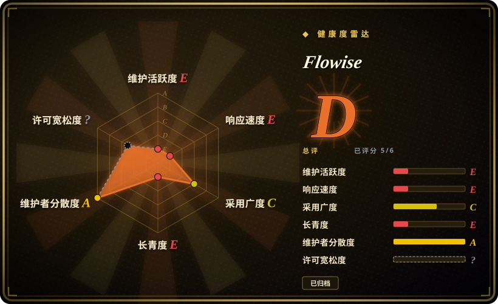
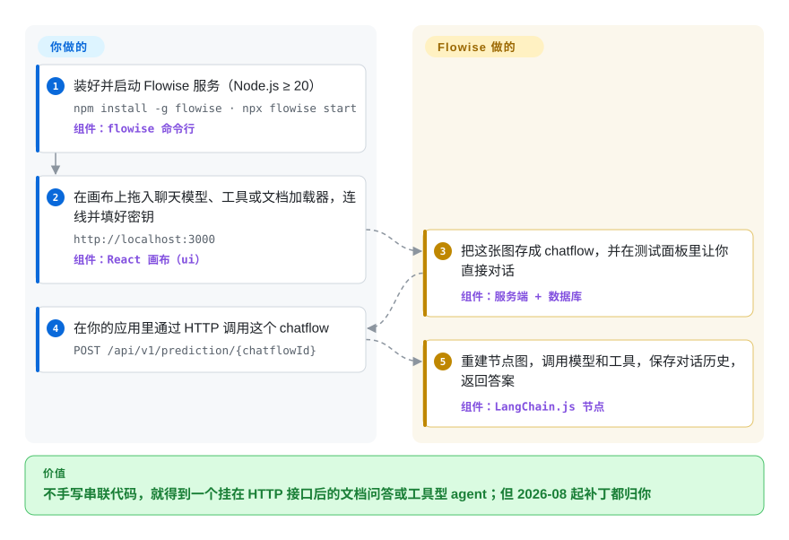

# Flowise

想做一个能照着你的文档回答、还会调几个工具的聊天机器人，原本得自己写代码把模型、检索和工具调用串起来；Flowise 让你在浏览器画布上把这些零件拖到一起连好线，直接拿到一个 HTTP 接口。但维护方已在 2026-08-13 把仓库归档，2026-08-31 停止支持，今天它只能是你要自己 fork 接着养、或者尽快迁走的代码，不该再拿来起新项目。

## 何时使用

你在公司内部跑着一个 Flowise 实例：一个照着产品手册答疑的客服机器人，一个筛销售线索的 agent，十来个销售和客服天天通过嵌入式聊天窗口在用的 chatflow。然后 2026-07-29 的代码冻结公告来了，接着仓库变成只读，`SECURITY.md` 写着不再接收漏洞报告。这时你要回答的已经不是“Flowise 好不好用”，而是“我手上背着什么、我的团队接不接得住”。这一页就是为这个决定准备的：哪些东西跑在哪里、哪部分是 Apache-2.0、哪部分是商业许可、该迁到哪里去。

另一个说得通的触发场景：一个 Node/TypeScript 团队想要一个能自托管的可视化 LLM 构建器，节点库正好是 LangChain.js 的封装，而且团队准备自己维护一个 fork（Apache-2.0 的核心部分允许你这样做）。如果你不打算自己打补丁，决定性的取舍已经反过来了：Langflow（Python、MIT、仍在维护）或 Dify 给你同样的“拖一张图”式体验，修 bug 的人还在。

## 怎么用起来

Flowise 就是一个 Node.js 服务加一块 React 画布。你往画布上拖的每个方块是一个节点，它是 LangChain.js 某个组件（聊天模型、文档加载器、向量库、工具）的薄封装，或者是 Flowise 自己的 Agentflow 节点。节点库、画布和运行时都是 Flowise 自带的：你只负责挑节点、连线、填上各家模型的密钥。画好的图会存成一个 chatflow（一段存进它数据库的 JSON，默认用 SQLite），每个 chatflow 都有自己的预测接口。你的应用一调用，服务端就把这张图重新搭起来，依次调模型和工具，记住对话历史，把答案返回。同一个流程也能以嵌入式聊天窗口的形式直接挂到网站上。

<!-- flow-steps:begin (generated from flows/flowise.json by tools/flow_card.py — do not edit) -->

流程文字版

1. **你**：装好并启动 Flowise 服务（Node.js ≥ 20） — `npm install -g flowise · npx flowise start` — 组件：`flowise 命令行`
2. **你**：在画布上拖入聊天模型、工具或文档加载器，连线并填好密钥 — `http://localhost:3000` — 组件：`React 画布（ui）`
3. **Flowise**：把这张图存成 chatflow，并在测试面板里让你直接对话 — 组件：`服务端 + 数据库`
4. **你**：在你的应用里通过 HTTP 调用这个 chatflow — `POST /api/v1/prediction/{chatflowId}`
5. **Flowise**：重建节点图，调用模型和工具，保存对话历史，返回答案 — 组件：`LangChain.js 节点`

**价值**：不手写串联代码，就得到一个挂在 HTTP 接口后的文档问答或工具型 agent；但 2026-08 起补丁都归你

<!-- flow-steps:end -->

## 何时不用

- **⚠️ 已归档、已停止支持（截至 2026-10-08）。** 团队 2026-07-29 冻结代码，2026-08-13 归档仓库，2026-08-31 撤出 GitHub 和 Discord（见讨论 #6727 “The Future of Flowise”）。任何新项目都请改用 [Langflow](langflow.zh.md) 或 [Dify](dify.zh.md)，因为两者都是仍在发版、仍在修安全问题的可视化构建器。
- **实例暴露在公网，却没人打补丁。** GitHub 上这个仓库在 2024–2026 年共有 41 条严重级、69 条高危级安全公告，而 `SECURITY.md` 已经拒收新报告，下一个漏洞上游不会再修。如果你配不出人维护 fork，就迁到 Langflow 或 Dify；至少也要把实例放到 VPN/SSO 后面，当成冻结系统看待。
- **你需要 SSO、RBAC 或工作空间功能。** 这些代码在 `packages/server/src/enterprise` 目录下，README 写明这部分适用单独的商业许可，而卖这份许可的公司已经收摊。企业管控是硬需求就用 Dify，因为它在一个仍维护的产品里提供这些能力。
- **你的 agent 逻辑越来越复杂。** 维护方自己的停服公告就说，模型推理越来越强之后，僵硬的低代码工作流“很快就会碰到天花板”。一旦你的图需要循环、重试和带状态的分支，请改用 [LangGraph](../agent-runtimes/agent-sdks/langgraph.zh.md) 或 [LangChain](langchain.zh.md) 用代码写，因为画布导出的 JSON 不适合承载这种逻辑。
- **你指望包管理器会提醒你。** 停服公告说会把 npm 和 Docker 包标记为弃用，但 2026-10-08 执行 `npm view flowise` 并没有弃用标记，`npm install -g flowise` 仍会不声不响地装上 3.1.4。请自己锁版本、自己审计，别依赖仓库源给你报警。

## 横向对比

| 替代品 | 是否收录 | 我们的评价 | 取舍 |
|---|---|---|---|
| [Langflow](langflow.zh.md) | 已收录 | 新起一个可视化 LLM 构建器，或者迁移现有 Flowise chatflow，选 Langflow：它是最接近“拖一张图”体验、而且仍在每周发版的替代品。 | 技术栈从 Node/LangChain.js 换成 Python，Flowise 的流程只能重搭不能导入；Langflow 自己的安全公告也很密，同样要盯补丁。 |
| [Dify](dify.zh.md) | 已收录 | 如果原来的 Flowise 部署是给非开发者用的，需要工作空间、内置 RAG 管理和权限控制，选 Dify。 | 换来一个更完整、仍在维护、带企业管控的平台；代价是部署更重，商用前还要读清它带附加条件的许可证。 |
| [n8n](../../workflow-orchestration/n8n.zh.md) | 已收录 | 如果所谓“agent”其实是一条中间夹着 LLM 步骤的业务自动化（更新 CRM、分拣邮件），选 n8n。 | 有几百个 SaaS 连接器和成熟的调度器，但 LLM/RAG 的组合能力比专门的 LLM 画布浅。 |
| [LangChain](langchain.zh.md) | 已收录 | 团队能写代码时选 LangChain（Python 版或其 JS 版）：Flowise 的节点本来封装的就是它。 | 得到能 diff、能测试、能评审的代码，而不是画布 JSON；代价是失去可视化编辑器和嵌入式聊天窗口。 |
| 仍维护的社区 fork | 非仓库 | 只有你自己的团队打算 fork 时才留在 Flowise；截至 2026-10-08 没有任何 fork 形成规模（star 最多的 fork 只有 15 个 star）。 | 眼下零迁移成本，但以后每个安全修复、依赖升级和 LangChain.js 升级都是你自己的活。 |

## 技术栈

- **TypeScript monorepo**（pnpm + Turbo），三个主要包：`server`（Express API）、`ui`（React 画布）、`components`（节点库）。
- 节点底层是 **LangChain.js**：最后一个版本 3.1.4 用的是 `@langchain/core` 1.1.20 和 `langchain` 1.2.18，另有约 25 个 `@langchain/*` 模型提供方包。
- **TypeORM** 做持久化，带 SQLite、PostgreSQL、MySQL 驱动。
- **BullMQ** 支撑可选的队列 / worker 模式。

## 依赖

- **Node.js ≥ 20**（`npm install -g flowise`），或用仓库 `docker/` 目录里的镜像 / `docker compose` 方案。
- **数据库**：默认 SQLite；多人共用时上 PostgreSQL 或 MySQL。
- **Redis**：开队列模式（BullMQ worker）时需要。
- **模型提供方凭据**（OpenAI、Anthropic、本地模型端点等）；做 RAG 流程还要一个向量库。

## 运维难度

**现在是高，停服前是中。** 跑起来很容易：一个 Node 进程加一个数据库，或者一个容器。难处在于上游以前替你做的事现在都归你：在一个安全公告密集的代码库里跟踪 CVE，随着模型 API 变化升级 LangChain.js 和各家 SDK，打补丁时还得分清 enterprise 目录的许可边界。要么安排一个人专门维护 fork，要么立一个迁移项目；“先放着让它跑”反而是最贵的选择。

## 健康度与可持续性

- **维护：已终止（截至 2026-10-08）。** 最后一个版本 `flowise@3.1.4` 发布于 2026-07-29；最后一次提交在 2026-08-13（README 加归档说明）；仓库只读。雷达上维护度 E 反映的是归档，而不是活跃度低。
- **治理与背书：已撤离。** 项目由 FlowiseAI, Inc. 运营；停服公告（由项目头号维护者 `HenryHengZJ` 发布）宣布团队结束 Flowise 的运营。没有基金会，也没有接手的组织。
- **年龄与 Lindy：不适用。** 约 3.5 岁（2023-03 创建），但已归档的项目拿不到 Lindy 加分：年龄只在项目还活着时才有意义。
- **采用：体量大，但已无人接手。** 约 55.5k star、25k fork，Docker Hub 上 `flowiseai/flowise` 约 700 万次拉取（2026-10-08 评分器读数）。存量用户很多，上游已经没了。
- **风险信号。** 许可证分裂（Apache-2.0 核心 + 商业许可的 `enterprise/` 目录）；安全公告历史密集，今后上游不再修补；npm 包尚未标记弃用。

## 存疑（未验证）

- [未验证] 安全公告数量（2024–2026 年严重 41 条 / 高危 69 条）取自 2026-10-08 的 GitHub security-advisories API，统计的是已发布的仓库公告，不等于 3.1.4 中仍可利用的独立漏洞数。
- [未验证] Docker Hub 镜像 `flowiseai/flowise` 是否已标记弃用没有核查，只查了 npm。
- [未验证] 托管版 Flowise Cloud 在 2026-08-31 停止支持后是否继续运行，仓库里没有说明；README 仍然链接着它。
- [推断] 截至 2026-10-08 没有形成规模的社区 fork；之后仍可能出现，决定自维护前请再查一次。
- [推断] 商业许可代码是否只在 `packages/server/src/enterprise` 之内（README 还点名了带显式版权声明的文件，如 `IdentityManager.ts`）没有逐文件审计。
