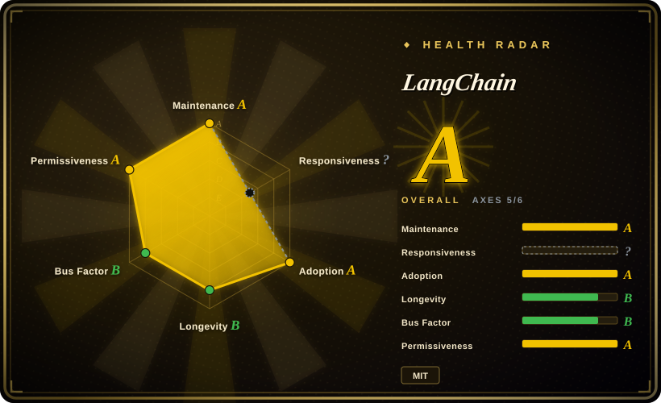
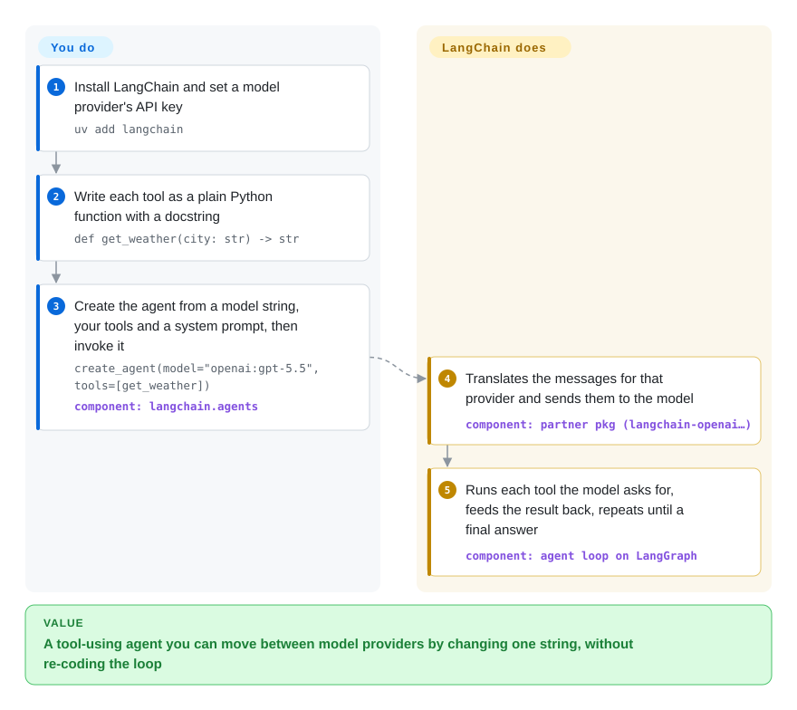

# LangChain

Every model provider has its own SDK, message format and tool-calling shape, so an agent written against one is half a rewrite to move to another, and the "ask the model → run the tool it picked → feed the result back" loop gets re-coded in every project. LangChain gives you one interface over hundreds of model and tool integrations plus a prebuilt agent loop: you write plain Python functions as tools and call `create_agent`.

## When to use

You are a Python developer building an assistant that has to look things up in your systems: query the order database, call the shipping API, search the docs. Your first version calls the OpenAI SDK directly, and it works until product asks to try Claude and a local model. Now your tool schemas, message objects and the `while response.tool_calls:` loop all need a second and third implementation. You want to write each tool once as a function, name the model with a string, and have the loop, retries and message bookkeeping handled for you.

You choose LangChain over [Dify](dify.md) or [Langflow](langflow.md) because you want code-level control that you can review in a pull request, not a visual canvas. You choose it over a bare provider SDK because of the integration catalogue: partner packages for the major model providers, vector stores and tools, all behind the same interfaces. And over a lighter agent library such as [Pydantic AI](../agent-runtimes/agent-sdks/pydantic-ai.md), the deciding tradeoff is breadth: LangChain's catalogue and its upgrade path into [LangGraph](../agent-runtimes/agent-sdks/langgraph.md), when the agent later needs durable state, in exchange for a heavier dependency tree and a vendor-shaped ecosystem.

## How it works

You write tools as ordinary Python functions; the docstring becomes the description the model reads to decide when to call them. `create_agent` takes a model string such as `"openai:gpt-5.5"`, your tools and a system prompt, and resolves the string to a partner package (`langchain-openai`, `langchain-anthropic`, …) that translates LangChain's standard messages into that provider's API. When you invoke the agent, LangChain runs the loop for you: it sends the conversation to the model; if the model replies with a tool call (a structured request to run one of your functions with given arguments), it runs that function, appends the result and asks again, until the model gives a final answer. Under the hood the agent is a LangGraph graph, so streaming, persistence and human-in-the-loop are available when you need them, and middleware lets you hook into each step. The older chain classes (`LLMChain`, `RetrievalQA` and friends) now live in the separate `langchain-classic` package.

<!-- flow-steps:begin (generated from flows/langchain.json by tools/flow_card.py — do not edit) -->

Text version of the flow

1. **You**: Install LangChain and set a model provider's API key — `uv add langchain`
2. **You**: Write each tool as a plain Python function with a docstring — `def get_weather(city: str) -> str`
3. **You**: Create the agent from a model string, your tools and a system prompt, then invoke it — `create_agent(model="openai:gpt-5.5", tools=[get_weather])` — component: `langchain.agents`
4. **LangChain**: Translates the messages for that provider and sends them to the model — component: `partner pkg (langchain-openai…)`
5. **LangChain**: Runs each tool the model asks for, feeds the result back, repeats until a final answer — component: `agent loop on LangGraph`

**Value**: A tool-using agent you can move between model providers by changing one string, without re-coding the loop

<!-- flow-steps:end -->

## When NOT to use

- **Simple single-prompt apps.** If you call an LLM once per request with no tools, LangChain is abstraction with no payoff. Use the provider's SDK directly instead, because a direct call has no framework dependency and nothing to upgrade.
- **Low-code or no-code needs.** If the builders won't write Python, use [Dify](dify.md) or [Langflow](langflow.md) instead, because they provide a visual builder plus hosting.
- **Hand-designed control flow, deterministic steps mixed with agent steps, tight latency control.** LangChain's own README sends these cases to LangGraph. Use [LangGraph](../agent-runtimes/agent-sdks/langgraph.md) directly instead of `create_agent`, because you get explicit nodes, edges and state rather than a prebuilt loop.
- **You are maintaining a pre-1.0 codebase or following an old tutorial.** `from langchain.chains import LLMChain`-style code no longer lives in `langchain`; it moved to `langchain-classic`. Pin `langchain-classic` to keep old code running, and port to `create_agent` deliberately, because mixing both styles doubles your surface area.
- **Framework-level lock-in aversion.** Tools, messages and middleware written against LangChain types are costly to move later. If independence matters most, use [LiteLLM](../../api-gateway/litellm.md) for model routing plus your own small loop, or Pydantic AI, because they keep your code closer to plain provider APIs.
- **You want a ready-to-run agent.** LangChain is a library; nothing runs until you write the app. Use [AutoGPT](autogpt.md) or [Hermes Agent](../agent-runtimes/personal-assistants/hermes-agent.md) instead, because they ship a runtime and UI.

## Comparison

| Alternative | In index | Our verdict | Tradeoff |
| --- | --- | --- | --- |
| [LangGraph](../agent-runtimes/agent-sdks/langgraph.md) | ✅ | When you need to design the agent's control flow yourself (branches, checkpoints, human approval), pick LangGraph; when a standard tool-calling loop is enough, start with LangChain's `create_agent`, which runs on LangGraph anyway. | LangGraph gives explicit state and durable execution at the cost of writing the graph; LangChain gives a one-call agent but hides the graph until you drop down. |
| [LlamaIndex](llamaindex.md) | ✅ | When answer quality over your own documents is the hard problem, pick LlamaIndex; when the app is an agent and retrieval is one tool among several, pick LangChain. | LlamaIndex has finer control over chunking, indexing and retrieval; LangChain has the broader agent/tool ecosystem and is its vendor's main OSS product. |
| [Pydantic AI](../agent-runtimes/agent-sdks/pydantic-ai.md) | ✅ | When you want a typed, lightweight agent library with few dependencies, pick Pydantic AI; pick LangChain when the integration catalogue and the LangGraph upgrade path matter more. | Pydantic AI gives smaller surface area and strong typing; LangChain gives more prebuilt integrations and a bigger dependency tree. |
| [smolagents](../agent-runtimes/agent-sdks/smolagents.md) | ✅ | When you want to read the whole agent loop in an afternoon, or want agents that act by writing Python code, pick smolagents; pick LangChain for production integrations. | smolagents is minimal and transparent; LangChain is comprehensive but more layered to debug. |
| [Dify](dify.md) | ✅ | When non-developers must build and operate the app, pick Dify; when engineers own it in code review, pick LangChain. | Dify gives a visual builder, built-in RAG and hosting; LangChain gives code-level control with no UI or server of its own. |

## Tech stack

- **Python** (≥ 3.10). The JS/TS equivalent is the separate `langchainjs` repository.
- **`langchain-core`**: the base interfaces (messages, chat models, tools, runnables).
- **`langchain`** (v1): `create_agent` and middleware, built on **LangGraph** (pinned `langgraph>=1.2.11,<1.3.0` in langchain 1.4.3).
- **Partner packages** in `libs/partners` (`langchain-openai`, `langchain-anthropic`, …) plus the community-maintained `langchain-community`.
- **Pydantic v2** for schemas. LangServe, the old deployment layer, has been deprecated since 2024-11 and is now archived; deployment moved to the commercial LangSmith Deployment.

## Dependencies

- Python ≥ 3.10.
- An LLM provider API key (OpenAI, Anthropic, Gemini, …) or a local model endpoint, plus the matching partner package (`uv add langchain` then e.g. `langchain-openai`).
- Optional: a vector store integration for retrieval, tool integrations (search APIs, databases).
- Optional: LangSmith (commercial SaaS) for tracing, via `LANGSMITH_TRACING` / `LANGSMITH_API_KEY`.

## Ops difficulty

**Low.** LangChain is a library inside your process, not a service. The ops burden is your application's: API keys, provider rate limits, and latency of multi-step tool loops. The recurring cost is version alignment: `langchain`, `langchain-core`, `langgraph` and each partner package release independently and pin each other with tight ranges, so upgrade them as a set and run your agent tests.

## Health & viability

- **Maintenance**: Grade A — 13/13 active weeks in the trailing 13; last commit 0 days ago. Packages release weekly (`langchain-core` 1.6.7 on 2026-10-06, `langchain` 1.4.3 on 2026-09-28).
- **Responsiveness**: Grade A — median first-response time 1.1 hours across 20 qualifying issues/PRs (newly scorable on the 2026-10-08 re-score).
- **Governance**: Grade B — top-3 contributor share 74.8% (38 active maintainers in the trailing 12 months); the roadmap is owned by one company, LangChain (the vendor behind LangSmith).
- **Longevity**: Grade B — 1452 days old (created 2022-10) and active daily, a solid prior for this young field.
- **Adoption**: Grade A — 144,826,657 monthly downloads via pypi.org (package: langchain-core), ~147.6k stars.
- **Risk flags**: MIT, no relicense. The company sells LangSmith (observability, evals, deployment), so deployment and tracing features are pulled toward the paid product. The 0.x → 1.0 transition moved the legacy chains into `langchain-classic`; expect such reorganisations again at the next major.

## Caveats (unverified)

- [未验证] Exactly which LangSmith Deployment capabilities have an open-source self-hosted equivalent was not re-checked for this page.
- [推断] Breaking changes within the 1.x line appear rarer than in 0.x (tight but semver-shaped pins, a published versioning policy), but this page did not audit 1.x changelogs for breaks.
- [推断] As a venture-backed company, LangChain may keep shifting value into paid products; the MIT code stays forkable, but nobody currently maintains a fork at scale.
