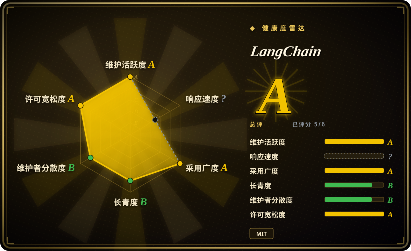
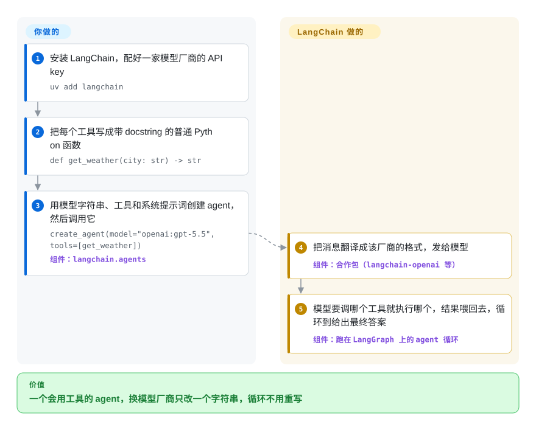

# LangChain

每家模型厂商都有自己的 SDK、消息格式和工具调用格式，照着一家写好的 agent 想换到另一家，差不多要重写一半；“问模型 → 执行它选中的工具 → 把结果喂回去”这个循环也得在每个项目里重写一遍。LangChain 用一套统一接口包住几百个模型和工具集成，再附上一个现成的 agent 循环：你把工具写成普通 Python 函数，调一下 `create_agent` 就行。

## 何时使用

你是一名 Python 开发者，在做一个要去你们系统里查东西的助手：查订单库、调物流 API、搜内部文档。第一版直接调 OpenAI SDK，一直好好的，直到产品说要试试 Claude 和一个本地模型。这下你的工具 schema、消息对象和 `while response.tool_calls:` 循环都得写第二份、第三份。你希望每个工具只写一次函数，用一个字符串指定模型，循环、重试和消息记账都有人替你管。

你选 LangChain 而不是 [Dify](dify.zh.md) 或 [Langflow](langflow.zh.md)，是因为你要的是能在 pull request 里评审的代码级控制，不是可视化画布。你选它而不是裸用厂商 SDK，是因为它的集成目录：主流模型厂商、向量库和工具都有合作包，而且都在同一套接口后面。和 [Pydantic AI](../agent-runtimes/agent-sdks/pydantic-ai.zh.md) 这类更轻的 agent 库比，决定性的取舍是广度：LangChain 有更大的集成目录，agent 以后需要持久状态时可以平滑升级到 [LangGraph](../agent-runtimes/agent-sdks/langgraph.zh.md)；代价是更重的依赖树和一个由厂商主导的生态。

## 怎么用起来

你把工具写成普通的 Python 函数，函数的 docstring 就是模型读来判断何时调用它的说明。`create_agent` 接收一个模型字符串（比如 `"openai:gpt-5.5"`）、你的工具和一段系统提示词，再把字符串解析到对应的合作包（`langchain-openai`、`langchain-anthropic` 等），由合作包把 LangChain 的标准消息翻译成那家厂商的 API。你调用 agent 后，循环由 LangChain 来跑：把对话发给模型；如果模型回的是一次工具调用（一条结构化请求：用这些参数执行你的某个函数），它就执行这个函数、把结果追加进对话再问一次，直到模型给出最终答案。这个 agent 底层是一张 LangGraph 图，所以需要时可以直接用上流式输出、持久化和人工介入，中间件还能让你挂到每一步上。老的 chain 类（`LLMChain`、`RetrievalQA` 等）现在搬到了单独的 `langchain-classic` 包里。

<!-- flow-steps:begin (generated from flows/langchain.json by tools/flow_card.py — do not edit) -->

流程文字版

1. **你**：安装 LangChain，配好一家模型厂商的 API key — `uv add langchain`
2. **你**：把每个工具写成带 docstring 的普通 Python 函数 — `def get_weather(city: str) -> str`
3. **你**：用模型字符串、工具和系统提示词创建 agent，然后调用它 — `create_agent(model="openai:gpt-5.5", tools=[get_weather])` — 组件：`langchain.agents`
4. **LangChain**：把消息翻译成该厂商的格式，发给模型 — 组件：`合作包（langchain-openai 等）`
5. **LangChain**：模型要调哪个工具就执行哪个，结果喂回去，循环到给出最终答案 — 组件：`跑在 LangGraph 上的 agent 循环`

**价值**：一个会用工具的 agent，换模型厂商只改一个字符串，循环不用重写

<!-- flow-steps:end -->

## 何时不用

- **简单的单次提示词应用。** 如果每个请求只调一次大模型、不用工具，LangChain 只增加抽象、没有回报。请直接用厂商 SDK，因为直接调用没有框架依赖，也没有要升级的东西。
- **低代码或无代码需求。** 如果搭应用的人不写 Python，请改用 [Dify](dify.zh.md) 或 [Langflow](langflow.zh.md)，因为它们提供可视化构建器和托管能力。
- **要自己设计控制流、确定性步骤和 agent 步骤混排、严格控制延迟。** LangChain 自己的 README 就把这些情况指向 LangGraph。请直接用 [LangGraph](../agent-runtimes/agent-sdks/langgraph.zh.md)，不要用 `create_agent`，因为你会得到显式的节点、边和状态，而不是一个预制循环。
- **你在维护 1.0 之前的代码库，或者照着旧教程写。** `from langchain.chains import LLMChain` 这类代码已经不在 `langchain` 里，搬到了 `langchain-classic`。想让旧代码继续跑就锁定 `langchain-classic`，再有计划地迁到 `create_agent`，因为两种写法混用会让你要维护的面翻倍。
- **在框架层面排斥锁定。** 基于 LangChain 类型写的工具、消息和中间件，以后搬走成本很高。如果独立性最重要，请用 [LiteLLM](../../api-gateway/litellm.zh.md) 做模型路由、再写一个自己的小循环，或者用 Pydantic AI，因为它们让你的代码更贴近厂商原生 API。
- **你想要开箱即用的 agent。** LangChain 是库，你不写应用就什么都不会跑。请改用 [AutoGPT](autogpt.zh.md) 或 [Hermes Agent](../agent-runtimes/personal-assistants/hermes-agent.zh.md)，因为它们自带运行时和界面。

## 横向对比

| 替代品 | 是否收录 | 我们的评价 | 取舍 |
| --- | --- | --- | --- |
| [LangGraph](../agent-runtimes/agent-sdks/langgraph.zh.md) | ✅ | 需要自己设计 agent 控制流（分支、检查点、人工审批）时选 LangGraph；一个标准的工具调用循环就够用时，从 LangChain 的 `create_agent` 起步，它本来就跑在 LangGraph 上。 | LangGraph 给你显式状态和持久执行，代价是要自己画图；LangChain 一次调用就得到 agent，但图被藏起来，直到你下沉一层。 |
| [LlamaIndex](llamaindex.zh.md) | ✅ | 难点在于针对自有文档答得准时选 LlamaIndex；应用是一个 agent、检索只是若干工具之一时选 LangChain。 | LlamaIndex 对切分、建索引和检索的控制更细；LangChain 的 agent/工具生态更广，而且是厂商的主力开源产品。 |
| [Pydantic AI](../agent-runtimes/agent-sdks/pydantic-ai.zh.md) | ✅ | 想要依赖少、类型严格的轻量 agent 库时选 Pydantic AI；更看重集成目录和升级到 LangGraph 的路径时选 LangChain。 | Pydantic AI 面更小、类型更强；LangChain 预置集成更多，依赖树也更大。 |
| [smolagents](../agent-runtimes/agent-sdks/smolagents.zh.md) | ✅ | 想在一个下午读完整个 agent 循环，或者想让 agent 通过写 Python 代码来行动时，选 smolagents；生产级集成选 LangChain。 | smolagents 极简透明；LangChain 功能全，但层次多、调试更费劲。 |
| [Dify](dify.zh.md) | ✅ | 应用要由非开发者搭建和运营时选 Dify；由工程师在代码评审里负责时选 LangChain。 | Dify 提供可视化构建器、内置 RAG 和托管；LangChain 提供代码级控制，但没有自己的界面和服务端。 |

## 技术栈

- **Python**（≥ 3.10）。JS/TS 版本是单独的 `langchainjs` 仓库。
- **`langchain-core`**：基础接口（消息、聊天模型、工具、runnable）。
- **`langchain`**（v1）：`create_agent` 和中间件，构建在 **LangGraph** 之上（langchain 1.4.3 锁定 `langgraph>=1.2.11,<1.3.0`）。
- `libs/partners` 下的**合作包**（`langchain-openai`、`langchain-anthropic` 等），外加社区维护的 `langchain-community`。
- **Pydantic v2** 定义 schema。老的部署层 LangServe 自 2024-11 起弃用、现已归档；部署能力转到了收费的 LangSmith Deployment。

## 依赖

- Python ≥ 3.10。
- 一个大模型厂商的 API key（OpenAI、Anthropic、Gemini 等）或本地模型端点，以及对应的合作包（先 `uv add langchain`，再加比如 `langchain-openai`）。
- 可选：用于检索的向量库集成，工具集成（搜索 API、数据库等）。
- 可选：LangSmith（收费 SaaS）做 tracing，通过 `LANGSMITH_TRACING` / `LANGSMITH_API_KEY` 开启。

## 运维难度

**低。** LangChain 是你进程里的一个库，不是服务。运维负担在你的应用身上：API key、厂商限流、多步工具循环的延迟。反复出现的成本是版本对齐：`langchain`、`langchain-core`、`langgraph` 和各合作包各自发版，彼此用很窄的范围互相约束，所以要成套升级，并把 agent 测试重跑一遍。

## 健康度与可持续性

- **维护活跃度**：Grade A——最近 13 周中 13 周有提交；最后提交距今 0 天。各包每周发版（`langchain-core` 1.6.7 于 2026-10-06，`langchain` 1.4.3 于 2026-09-28）。
- **响应速度**：Grade A——中位首次响应时间 1.1 小时，基于 20 个 qualifying issues/PRs（2026-10-08 重算时首次可计分）。
- **治理集中度**：Grade B——前三贡献者占比 74.8%（过去 12 个月内 38 位活跃维护者）；路线图由一家公司掌握，即 LangChain（LangSmith 背后的厂商）。
- **长青度**：Grade B——仓库已创建 1452 天（2022-10），且每天都有活动，在这个年轻领域里是不错的先验。
- **采用广度**：Grade A——pypi.org 上月下载量 144,826,657（包名：langchain-core），约 147.6k star。
- **风险信号**：MIT 许可，没有改许可证。公司在卖 LangSmith（可观测性、评测、部署），部署和 tracing 能力会被拉向收费产品。0.x → 1.0 时老 chain 被整体挪进 `langchain-classic`；下一个大版本时预计还会有类似的重组。

## 存疑（未验证）

- [未验证] LangSmith Deployment 的哪些能力有开源可自托管的对应物，这次没有重新核查。
- [推断] 1.x 线内的破坏性变更看起来比 0.x 少（版本约束窄但符合语义化版本，且有公开的版本策略），但本页没有逐条审计 1.x 的变更日志。
- [推断] 作为风投支持的公司，LangChain 可能继续把价值往收费产品挪；MIT 代码随时可以 fork，但目前没有成规模维护的 fork。
