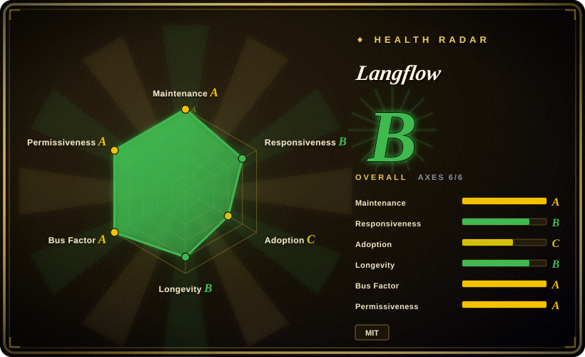

# Langflow

A visual platform for building and deploying AI-powered agents and workflows, with a drag-and-drop interface, built-in API and MCP servers, component-level customization in Python, and support for all major LLMs and vector databases.

## When to use

You're a developer or AI engineer who needs to prototype and deploy LLM-powered workflows — RAG pipelines, multi-agent orchestration, or chatbot backends — without writing boilerplate integration code for every LLM provider and vector database. You want a visual canvas where you can connect nodes (LLM, retriever, tool, memory) into a flow, test it interactively, and then expose it as an API endpoint or MCP tool. You need support for major models (OpenAI, Anthropic, local), vector stores (Pinecone, Weaviate, Chroma), and the ability to drop into Python when the visual editor isn't enough. Choose Langflow over LangChain because Langflow gives you a visual canvas plus source-code access rather than requiring you to write chaining code by hand; choose it over Dify because Langflow is fully MIT-licensed and more open to community-driven customization. The deciding tradeoff is a visual builder for rapid prototyping combined with the freedom to customize any component in Python.

## When NOT to use

- If you prefer pure code without visual editors, use LangChain or CrewAI instead of Langflow, because the visual layer adds friction for code-first teams who find node-based GUIs limiting.
- If you need a simple one-off script or a single API call, use a direct Python script or HTTP client instead of Langflow, because standing up a Langflow instance is overkill for trivial tasks.
- If your team requires strict git-based workflow versioning with clean diffs and PR reviews, use LangChain or Prefect instead of Langflow, because visual flows saved as JSON are harder to diff, review, and merge than code.
- If you need a full production MLOps platform with built-in monitoring, tracing, and A/B testing, use MLflow or Weights & Biases instead of Langflow, because Langflow does not replace a complete observability stack.
- If you need enterprise-grade multi-tenancy, fine-grained RBAC, and audit trails, use Dify or a commercial platform instead of Langflow, because self-hosted Langflow has only basic auth and tenant isolation is not its primary focus.

## Comparison

| Alternative | In index | Our verdict | Tradeoff |
|---|---|---|---|
| [LangChain](langchain.md) | ✅ | Pick LangChain when code-first custom agent development is preferable to a visual canvas. | LangChain is a library to code with; Langflow is a visual layer on top of similar concepts. Code-first teams prefer LangChain; visual-first teams prefer Langflow. |
| [n8n](../../workflow-orchestration/n8n.md) | ✅ | Pick n8n when broad workflow automation and integrations matter more than LLM-native flow composition. | n8n is general-purpose automation with AI bolted on; Langflow is purpose-built for LLM/agent workflows with deeper model and vector-DB integration. |
| [Dify](dify.md) | ✅ | Pick Dify when production platform features, RBAC, and cloud options outweigh Langflow's MIT/community customization. | Similar visual builder with stronger enterprise RBAC and cloud offering; Langflow is fully MIT-licensed and more open to community-driven customization. |
| [AutoGPT](autogpt.md) | ✅ | Pick AutoGPT when the target is autonomous continuous task execution. | AutoGPT targets autonomous task execution; Langflow targets composed, interactive workflows with human oversight. |
| [CrewAI](../agent-runtimes/agent-sdks/crewai.md) | ✅ | Pick CrewAI when code-first role-based multi-agent teams are the core abstraction. | CrewAI is code-first role-based multi-agent orchestration; Langflow is visual flow-based orchestration. |
| [Flowise](flowise.md) | ✅ | Pick Flowise when you want a similar visual LLM builder and its ecosystem fits your stack better. | Very similar feature set; Langflow has a larger community and more active GitHub presence as of 2026-07. |

## Tech stack

- **Python** — backend runtime and component logic
- **React / React Flow** — visual frontend for the drag-and-drop canvas
- **FastAPI** — API layer for exposing workflows as REST endpoints
- **SQLAlchemy** — database abstraction for persistence
- **LangChain** — underlying LLM integration and chaining primitives (components wrap LangChain concepts)

## Dependencies

- **Python 3.10+** — backend runtime
- **Database** — SQLite for local dev, PostgreSQL recommended for production persistence
- **LLM API keys** — OpenAI, Anthropic, or local model endpoints (Ollama, vLLM, etc.)
- **Optional vector database** — Chroma, Pinecone, Weaviate, or Qdrant for RAG workflows
- **Node.js** — for building the frontend if modifying the UI

## Ops difficulty

**Medium**. Local development is straightforward (`pip install langflow` or Docker). Production deployment requires managing a Python backend, a database for flow persistence, and potentially a vector database. The visual flows themselves need versioning discipline — flows saved as JSON can be committed to git, but diffing and code-reviewing them is awkward. The main ongoing burden is keeping the Langflow version, LangChain dependencies, and model provider APIs in sync.

## Health & viability
- **Maintenance**: Grade A — 13/13 active weeks in trailing 13; last commit 7 days ago.
- **Responsiveness**: Grade B — median first-response time 56.6 hours across 33 qualifying issues/PRs.
- **Adoption**: Grade C — 41,135 monthly downloads via pypi.org (package: langflow).
- **Longevity**: Grade B — 1322 days old.
- **Governance**: Grade A — top-3 contributor share 44.9% (?).
- **Risk / License**: Grade A — MIT license.
## Caveats (unverified)

- [未验证] The exact relationship between `langflow-ai` and any commercial entity or funding source is not publicly documented.
- [未验证] The LangChain dependency means Langflow inherits LangChain's API stability and versioning decisions; breaking changes upstream may propagate.
- [推断] Visual workflow diff/merge remains awkward compared to code; teams using Langflow in production should establish a JSON-flow review discipline.
- [未验证] The MCP server and built-in API features are relatively new; their production stability and performance characteristics under load are not independently verified.
- [未验证] Some advanced features or integrations may require specific dependency versions that conflict with other packages in a project's environment.
