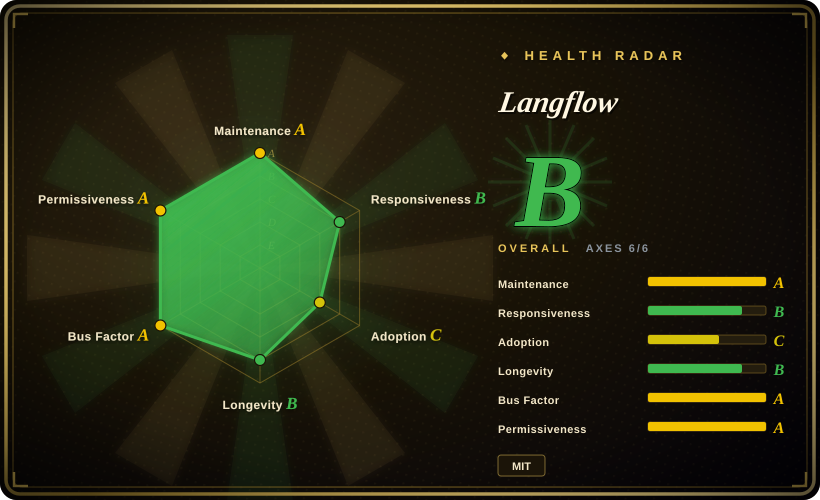
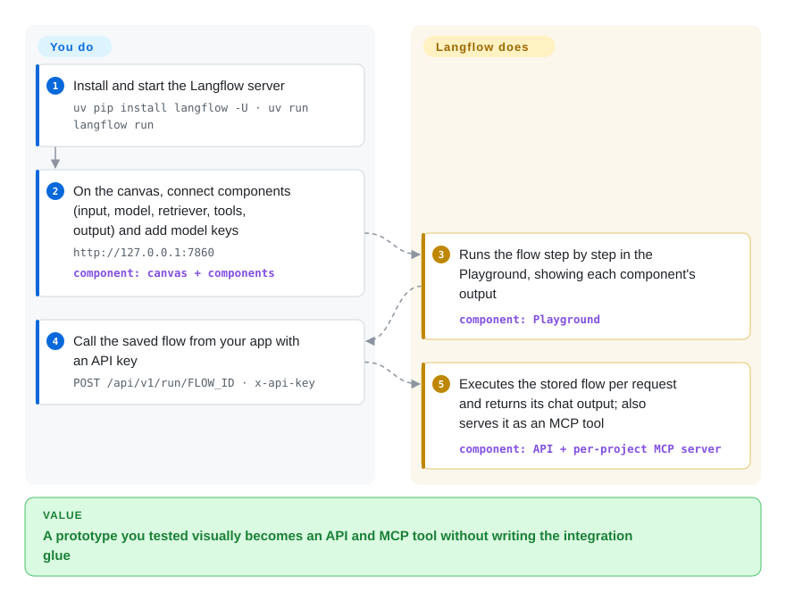

# Langflow

Finding out whether a particular prompt + retriever + tool combination actually works usually means writing the glue code first and learning the answer second. Langflow lets you wire those pieces together on a browser canvas, try the result in a chat panel straight away, and then call the same flow from your app as an HTTP API or an MCP tool, with editable Python behind every box when the canvas isn't enough.

## When to use

You're a developer or AI engineer who has to prototype and ship LLM-powered workflows: a RAG pipeline over the support knowledge base, a multi-agent research assistant, a chatbot backend. You don't want to write boilerplate integration code for every LLM provider and vector database just to learn that the retriever returns the wrong chunks. Each experiment in plain code means another `retriever = ...; chain = ...; print(chain.invoke(q))` script, and nobody else on the team can see or tweak it. You want a canvas where you connect nodes (LLM, retriever, tool, memory) into a flow, test it interactively, and then expose that exact flow as an API endpoint or an MCP tool, dropping into Python when a component doesn't do what you need.

Choose Langflow over [LangChain](langchain.md) when the visual canvas plus playground speeds up iteration more than hand-written chaining code does, given that every component is still editable Python. Choose it over [Dify](dify.md) when you want MIT licensing and component-level code customisation more than Dify's platform features. The deciding tradeoff is a visual builder for fast iteration combined with code-level escape hatches, paid for with a large self-hosted server whose security you must keep patched.

## How it works

Every box on the canvas is a component: a Python class (many of them wrap LangChain building blocks) that you can open and edit in place. Langflow ships the canvas, the component library, the Playground and the server. You choose components, connect their inputs and outputs, and fill in model keys. Flows are saved as JSON in Langflow's database (SQLite locally, PostgreSQL recommended for production). The Playground runs the flow step by step so you can see each component's output. Once it works, every flow is callable at `POST /api/v1/run/<flow_id>` with an `x-api-key` header, and each project also runs an MCP server that exposes its flows as tools for MCP clients such as coding agents. For lighter deployment, the separate `lfx` executor can run or serve an exported flow JSON without the full Langflow UI.

<!-- flow-steps:begin (generated from flows/langflow.json by tools/flow_card.py — do not edit) -->

Text version of the flow

1. **You**: Install and start the Langflow server — `uv pip install langflow -U · uv run langflow run`
2. **You**: On the canvas, connect components (input, model, retriever, tools, output) and add model keys — `http://127.0.0.1:7860` — component: `canvas + components`
3. **Langflow**: Runs the flow step by step in the Playground, showing each component's output — component: `Playground`
4. **You**: Call the saved flow from your app with an API key — `POST /api/v1/run/FLOW_ID · x-api-key`
5. **Langflow**: Executes the stored flow per request and returns its chat output; also serves it as an MCP tool — component: `API + per-project MCP server`

**Value**: A prototype you tested visually becomes an API and MCP tool without writing the integration glue

<!-- flow-steps:end -->

## When NOT to use

- **You can't patch an exposed instance quickly.** GitHub lists 17 critical and 13 high-severity advisories for this repo in 2025–2026, including unauthenticated remote code execution through the public flow build endpoint (CVE-2026-33017) and authenticated RCE via the MCP stdio transport (CVE-2026-105740). Custom components are Python that runs on the server, so anyone who can edit flows can effectively run code on the host. If you can't track releases weekly, ship the logic as a code-first service with [LangChain](langchain.md) or [LangGraph](../agent-runtimes/agent-sdks/langgraph.md) instead, because then the attack surface is only the endpoints you wrote.
- **You prefer pure code.** If your team finds node-based GUIs limiting, use LangChain or [CrewAI](../agent-runtimes/agent-sdks/crewai.md) instead of Langflow, because the visual layer adds friction rather than value for code-first teams.
- **One-off scripts or single API calls.** Use a direct Python script or HTTP client instead of Langflow, because standing up a Langflow server for a trivial task is overkill.
- **You need strict git-based review of workflow changes.** Use LangChain or [Prefect](../../workflow-orchestration/prefect.md) instead of Langflow, because flows saved as JSON are harder to diff, review and merge than code.
- **You need a full MLOps / observability stack.** Langflow integrates with tracing tools (LangSmith, Langfuse) but is not one. Pair it with [Langfuse](../../llm-eval/langfuse.md) or MLflow (not indexed) for monitoring, tracing and evaluation, because Langflow doesn't replace them.
- **Strict multi-tenant isolation is a hard requirement.** Several 2026 advisories were cross-user access bugs (IDOR in `/api/v1/responses`, cross-user flow access via the deprecated build endpoints, cross-project file disclosure via MCP resources). Use Dify or a commercial platform with audited tenancy instead, or run one Langflow instance per trust boundary, because per-user isolation inside one instance has been the weak spot.

## Comparison

| Alternative | In index | Our verdict | Tradeoff |
|---|---|---|---|
| [LangChain](langchain.md) | ✅ | Pick LangChain when code-first agent development with PR review beats a visual canvas; pick Langflow when fast visual iteration with a built-in playground matters more. | LangChain is a library you code against; Langflow is a server and canvas built partly on LangChain components, which adds UI and API hosting but also a large attack surface to patch. |
| [n8n](../../workflow-orchestration/n8n.md) | ✅ | Pick n8n when broad business automation and SaaS connectors matter more than LLM-native flow composition. | n8n is general-purpose automation with AI steps; Langflow is purpose-built for LLM/agent flows, with deeper model and vector-DB components. |
| [Dify](dify.md) | ✅ | Pick Dify when platform features (workspaces, RBAC, a hosted cloud option) outweigh Langflow's MIT license and editable-Python components. | Similar visual builder with stronger multi-user platform features; Langflow is MIT-licensed and lets you rewrite any component in Python. |
| [CrewAI](../agent-runtimes/agent-sdks/crewai.md) | ✅ | Pick CrewAI when code-first, role-based multi-agent teams are the core abstraction. | CrewAI keeps orchestration in Python code you review; Langflow keeps it in a visual flow you test in the Playground. |
| [Flowise](flowise.md) | ✅ | Do not start on Flowise: it was archived on 2026-08-13 and is end-of-life. Pick Langflow as the maintained visual builder, including as the migration target for existing Flowise chatflows. | Flowise was the Node/LangChain.js equivalent; moving means rebuilding flows in Langflow's Python components rather than importing them. |

## Tech stack

- **Python** backend with **FastAPI**; persistence through SQLModel/SQLAlchemy with Alembic migrations.
- **React / React Flow** frontend for the drag-and-drop canvas.
- **LangChain** (`langchain` ~1.3, `langchain-core` ≥ 1.3.3) underneath many components.
- **`lfx`** (Langflow Executor): a lightweight CLI and runtime that runs (`lfx run`) or serves (`lfx serve`) flows; provider integrations ship as `lfx-*` bundle packages (`lfx-openai`, `lfx-anthropic`, `lfx-ibm`, `lfx-datastax`, …).

## Dependencies

- **Python 3.10–3.14** with `uv` (`uv pip install langflow -U`, then `uv run langflow run`), or Docker (`langflowai/langflow`), or the Langflow Desktop app (Windows/macOS).
- **Database**: SQLite for local use; PostgreSQL recommended for production persistence.
- **LLM API keys**: OpenAI, Anthropic, or local model endpoints (Ollama, vLLM, etc.).
- **Optional vector database**: Chroma, Pinecone, Weaviate, Qdrant, Astra DB, etc. for RAG flows.
- **Node.js**: only if you modify and rebuild the frontend.

## Ops difficulty

**Medium, trending high if exposed.** Local use is easy (`uv run langflow run`, or one Docker container). Production means a Python server, a PostgreSQL database for flows, possibly a vector database, and an upgrade discipline: minor versions ship every week or two (1.12.0 → 1.12.5 between 2026-09-01 and 2026-10-06), and with the advisory rate above, staying current is part of the job, not optional. Flows-as-JSON can be committed to git, but reviewing them is awkward. Keep Langflow, its LangChain dependencies and provider APIs moving together.

## Health & viability

- **Maintenance**: Grade A — 13/13 active weeks in the trailing 13; last commit 2 days ago; v1.12.5 released 2026-10-06.
- **Responsiveness**: Grade B — median first-response time 82.4 hours across 32 qualifying issues/PRs.
- **Adoption**: Grade C — 37,742 monthly downloads via pypi.org (package: langflow), against ~155.6k GitHub stars. Much usage likely goes through Docker and Desktop, which the PyPI figure misses.
- **Longevity**: Grade B — 1337 days old (created 2023-02).
- **Governance**: Grade A — top-3 contributor share 47.3% (143 active maintainers in the trailing 12 months). Backing: langflow.org is run by DataStax, an IBM subsidiary; IBM sells "Elite Support for Langflow", and vulnerability reports go through IBM's HackerOne program.
- **Risk / License**: Grade A — MIT license. The risk flag is security, not licensing: a dense 2025–2026 advisory history means you are betting on IBM/DataStax's patch speed as much as on the code.

## Caveats (unverified)

- [未验证] Advisory counts (17 critical / 13 high in 2025–2026) come from the GitHub security-advisories API on 2026-10-08; how many affect the current 1.12.x line was not checked one by one.
- [推断] That much Langflow usage runs via Docker/Desktop rather than PyPI is inferred from the gap between ~155.6k stars and ~38k monthly PyPI downloads, not measured.
- [未验证] Whether the "Elite Support" offering includes features absent from the MIT repo (an open-core split) was not checked.
- [推断] Visual-flow diff/merge stays awkward compared to code; teams running Langflow in production should set up a JSON-flow review discipline.
- [未验证] Some components or bundles may require dependency versions that conflict with other packages in a shared Python environment; installing Langflow in its own environment avoids this.
