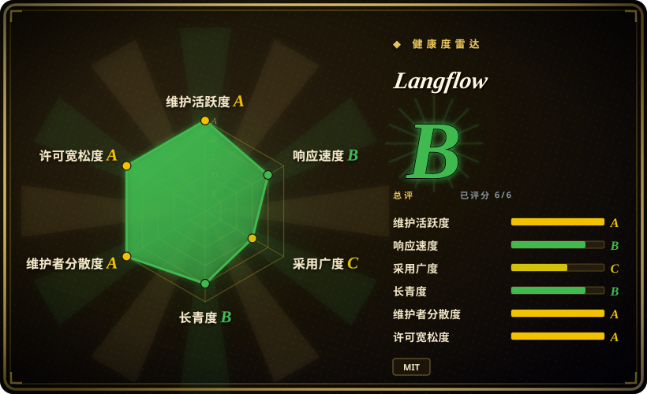
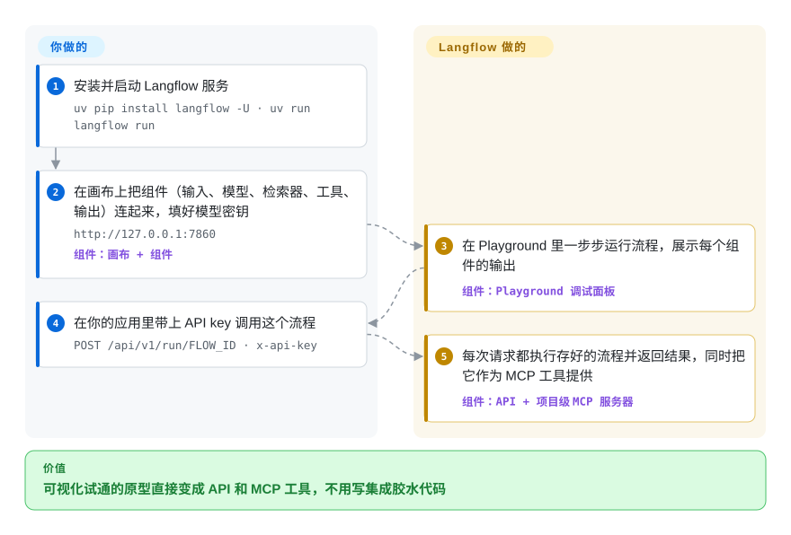

# Langflow

想知道某个“提示词 + 检索器 + 工具”的组合到底行不行，通常得先把串联代码写完才能看到结果。Langflow 让你在浏览器画布上把这些零件连起来，马上在聊天面板里试；试好了，你的应用就能把同一个流程当 HTTP API 或 MCP 工具来调用。画布不够用时，每个方块背后都是可以直接改的 Python。

## 何时使用

你是一名开发者或 AI 工程师，要快速做出并上线大模型工作流：一条基于客服知识库的 RAG 管线、一个多智能体研究助手、一个聊天机器人后端。你不想为了确认“检索器是不是取错了段落”，就先给每个大模型厂商和向量库写一遍样板集成代码。用纯代码做实验，每次都是又一个 `retriever = ...; chain = ...; print(chain.invoke(q))` 脚本，团队里别人既看不到也改不了。你想要一块画布：把节点（大模型、检索器、工具、记忆）连成流程，交互式测试，再把这个流程原样暴露成 API 端点或 MCP 工具；某个组件不合用时，直接下沉到 Python 去改。

和 [LangChain](langchain.zh.md) 比：如果“可视化画布 + 调试面板”比手写串联代码迭代得更快，就选 Langflow，反正每个组件仍然是可编辑的 Python。和 [Dify](dify.zh.md) 比：如果你更看重 MIT 许可和组件级的代码定制，而不是 Dify 的平台功能，就选 Langflow。决定性的取舍是：可视化构建带来的快速迭代，加上随时能下沉到代码的出口；代价是要自托管一个体量不小的服务，并且必须持续打安全补丁。

## 怎么用起来

画布上的每个方块都是一个组件：一个 Python 类（其中很多封装的是 LangChain 的积木），可以当场打开修改。画布、组件库、Playground（调试面板）和服务端都是 Langflow 自带的；你负责挑组件、连好输入输出、填上模型密钥。流程以 JSON 形式存在 Langflow 的数据库里（本地用 SQLite，生产建议 PostgreSQL）。Playground 会一步步运行流程，让你看到每个组件的输出。跑通之后，每个流程都能通过 `POST /api/v1/run/<flow_id>` 加 `x-api-key` 请求头来调用；每个项目还自带一个 MCP 服务器，把项目里的流程暴露成工具，供编码 agent 这类 MCP 客户端调用。想部署得更轻，可以用单独的 `lfx` 执行器直接运行或托管导出的流程 JSON，不必带上完整的 Langflow 界面。

<!-- flow-steps:begin (generated from flows/langflow.json by tools/flow_card.py — do not edit) -->

流程文字版

1. **你**：安装并启动 Langflow 服务 — `uv pip install langflow -U · uv run langflow run`
2. **你**：在画布上把组件（输入、模型、检索器、工具、输出）连起来，填好模型密钥 — `http://127.0.0.1:7860` — 组件：`画布 + 组件`
3. **Langflow**：在 Playground 里一步步运行流程，展示每个组件的输出 — 组件：`Playground 调试面板`
4. **你**：在你的应用里带上 API key 调用这个流程 — `POST /api/v1/run/FLOW_ID · x-api-key`
5. **Langflow**：每次请求都执行存好的流程并返回结果，同时把它作为 MCP 工具提供 — 组件：`API + 项目级 MCP 服务器`

**价值**：可视化试通的原型直接变成 API 和 MCP 工具，不用写集成胶水代码

<!-- flow-steps:end -->

## 何时不用

- **你没法及时给暴露在外的实例打补丁。** GitHub 上这个仓库 2025–2026 年共有 17 条严重级、13 条高危级安全公告，其中包括通过公开流程构建接口的未认证远程代码执行（CVE-2026-33017），以及通过 MCP stdio 传输的认证后远程代码执行（CVE-2026-105740）。自定义组件就是跑在服务器上的 Python，所以能编辑流程的人实际上就能在主机上执行代码。如果你做不到每周跟版本，请用 [LangChain](langchain.zh.md) 或 [LangGraph](../agent-runtimes/agent-sdks/langgraph.zh.md) 把逻辑写成代码优先的服务，因为那样攻击面只有你自己写的接口。
- **你偏爱纯代码。** 如果团队觉得节点式图形界面束手束脚，请用 LangChain 或 [CrewAI](../agent-runtimes/agent-sdks/crewai.zh.md) 而不用 Langflow，因为对代码优先的团队来说，可视化层只增加摩擦。
- **一次性脚本或单次 API 调用。** 请直接写 Python 脚本或用 HTTP 客户端，因为为这点小事起一个 Langflow 服务是杀鸡用牛刀。
- **你要求对工作流变更做严格的 git 评审。** 请用 LangChain 或 [Prefect](../../workflow-orchestration/prefect.zh.md) 而不用 Langflow，因为存成 JSON 的流程比代码更难做 diff、评审和合并。
- **你需要完整的 MLOps / 可观测性体系。** Langflow 能对接 tracing 工具（LangSmith、Langfuse），但它自己不是。请搭配 [Langfuse](../../llm-eval/langfuse.zh.md) 或 MLflow（未收录）来做监控、tracing 和评测，因为 Langflow 替代不了它们。
- **严格的多租户隔离是硬需求。** 2026 年有好几条公告是跨用户访问类问题（`/api/v1/responses` 的越权访问、经已弃用构建接口的跨用户流程访问、经 MCP 资源处理器的跨项目文件泄露）。请改用 Dify 或经过租户隔离审计的商业平台，或者按信任边界一组人一个 Langflow 实例，因为单实例内的用户隔离一直是它的薄弱点。

## 横向对比

| 替代品 | 是否收录 | 我们的评价 | 取舍 |
|---|---|---|---|
| [LangChain](langchain.zh.md) | ✅ | 代码优先、走 PR 评审的 agent 开发比可视化画布更合适时，选 LangChain；带调试面板的快速可视化迭代更重要时，选 Langflow。 | LangChain 是你写代码调用的库；Langflow 是部分建立在 LangChain 组件之上的服务端加画布，多了界面和 API 托管，也多了一大块要持续打补丁的攻击面。 |
| [n8n](../../workflow-orchestration/n8n.zh.md) | ✅ | 广泛的业务自动化和 SaaS 连接器比 LLM 原生的流程编排更重要时，选 n8n。 | n8n 是带 AI 步骤的通用自动化；Langflow 专为 LLM/agent 流程设计，模型和向量库组件更深。 |
| [Dify](dify.zh.md) | ✅ | 平台功能（工作空间、RBAC、托管云选项）比 Langflow 的 MIT 许可和可编辑 Python 组件更重要时，选 Dify。 | 同类可视化构建器，多用户平台能力更强；Langflow 是 MIT 许可，任何组件都能用 Python 重写。 |
| [CrewAI](../agent-runtimes/agent-sdks/crewai.zh.md) | ✅ | 核心抽象是代码优先、按角色分工的多 agent 团队时，选 CrewAI。 | CrewAI 把编排留在你能评审的 Python 代码里；Langflow 把编排留在你能在 Playground 里测试的可视化流程里。 |
| [Flowise](flowise.zh.md) | ✅ | 别在 Flowise 上起新项目：它已于 2026-08-13 归档并停止支持。选 Langflow 作为仍在维护的可视化构建器，也可以作为现有 Flowise chatflow 的迁移目标。 | Flowise 是 Node/LangChain.js 版的同类产品；迁过来要用 Langflow 的 Python 组件把流程重搭一遍，没法直接导入。 |

## 技术栈

- **Python** 后端，**FastAPI** 提供接口；通过 SQLModel/SQLAlchemy 持久化，用 Alembic 做迁移。
- **React / React Flow** 前端，实现拖拽画布。
- 很多组件底下是 **LangChain**（`langchain` ~1.3，`langchain-core` ≥ 1.3.3）。
- **`lfx`**（Langflow Executor）：一个轻量的命令行和运行时，可以运行（`lfx run`）或托管（`lfx serve`）流程；各厂商集成以 `lfx-*` 扩展包发布（`lfx-openai`、`lfx-anthropic`、`lfx-ibm`、`lfx-datastax` 等）。

## 依赖

- **Python 3.10–3.14** 配 `uv`（`uv pip install langflow -U`，再 `uv run langflow run`），或 Docker（`langflowai/langflow`），或 Langflow Desktop 桌面版（Windows/macOS）。
- **数据库**：本地用 SQLite；生产持久化建议 PostgreSQL。
- **大模型 API key**：OpenAI、Anthropic，或本地模型端点（Ollama、vLLM 等）。
- **可选向量数据库**：Chroma、Pinecone、Weaviate、Qdrant、Astra DB 等，用于 RAG 流程。
- **Node.js**：只有修改并重新构建前端时才需要。

## 运维难度

**中等；一旦对外暴露就趋向高。** 本地用很简单（`uv run langflow run`，或一个 Docker 容器）。生产环境意味着一个 Python 服务、一个存流程的 PostgreSQL、可能还有一个向量库，再加上升级纪律：小版本每一两周就发一个（2026-09-01 到 2026-10-06 之间从 1.12.0 发到 1.12.5），配合上面的安全公告频率，跟上版本是本职工作而不是可选项。流程以 JSON 形式可以提交到 git，但评审起来很别扭。要让 Langflow 本身、它依赖的 LangChain 和各厂商 API 一起往前走。

## 健康度与可持续性

- **维护活跃度**：Grade A——最近 13 周中 13 周有提交；最后提交距今 2 天；v1.12.5 于 2026-10-06 发布。
- **响应速度**：Grade B——中位首次响应时间 82.4 小时，基于 32 个 qualifying issues/PRs。
- **采用广度**：Grade C——pypi.org 上月下载量 37,742（包名：langflow），而 GitHub star 约 155.6k。很多使用可能走的是 Docker 和桌面版，PyPI 数字统计不到。
- **长青度**：Grade B——仓库已创建 1337 天（2023-02）。
- **治理集中度**：Grade A——前三贡献者占比 47.3%（过去 12 个月内 143 位活跃维护者）。背书方：langflow.org 由 IBM 旗下子公司 DataStax 运营；IBM 售卖“Elite Support for Langflow”，漏洞报告走 IBM 的 HackerOne 计划。
- **许可风险**：Grade A——MIT 许可证。风险信号在安全而不在许可：2025–2026 年安全公告密集，意味着你押的不只是代码，还有 IBM/DataStax 的修补速度。

## 存疑（未验证）

- [未验证] 安全公告数量（2025–2026 年严重 17 条 / 高危 13 条）取自 2026-10-08 的 GitHub security-advisories API；其中有多少影响当前 1.12.x 版本线没有逐条核查。
- [推断] “很多使用走 Docker/桌面版而非 PyPI”是从约 155.6k star 与约 3.8 万次 PyPI 月下载之间的落差推出来的，没有实测。
- [未验证] “Elite Support”是否包含 MIT 仓库里没有的功能（即开源核心式拆分）没有核查。
- [推断] 可视化流程的 diff/合并比代码别扭；在生产中用 Langflow 的团队应建立 JSON 流程评审纪律。
- [未验证] 某些组件或扩展包可能要求特定依赖版本，与共享 Python 环境里的其他包冲突；把 Langflow 装在独立环境里可以避开。
