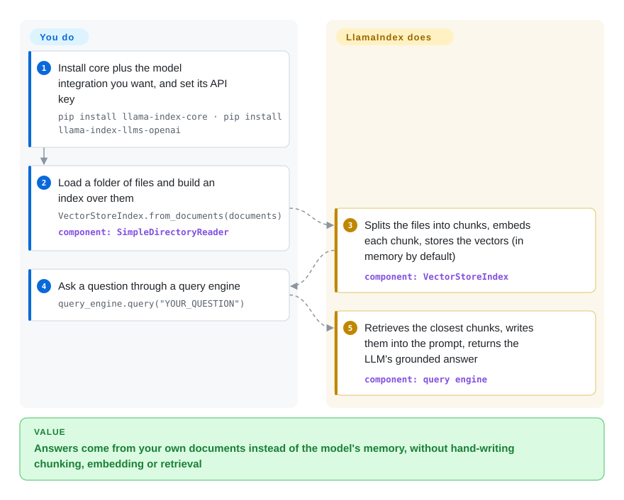

# LlamaIndex

You ask a model about your own PDFs, wiki pages or tickets, and it answers from memory: confident, wrong, and with no source to check. LlamaIndex reads those files, cuts them into chunks it can search by meaning, and puts only the relevant chunks into each prompt, so the answer comes from your documents. The basic version is about five lines of Python.

## When to use

You are a Python developer asked to add "chat with our docs" to an internal tool: 3,000 PDFs of contracts and policies, plus a Confluence export. The first prototype pastes text into the prompt and immediately hits the context limit; the second answers "the refund window is 30 days" when the policy PDF says 14. What you need is the unglamorous pipeline in between: load files, split them, embed them, store the vectors, retrieve the right five chunks per question, and build the prompt. You don't want to hand-write and re-tune each stage.

You reach for LlamaIndex because that data pipeline is its core abstraction (readers → nodes → index → retriever → query engine), with over 300 integration packages for LLMs, embedding models and vector stores, and every stage swappable when the defaults stop being good enough. Pick it over [LangChain](langchain.md) when retrieval quality over your documents is the hard part and the agent loop is secondary: LangChain's centre of gravity is the agent and its tool calls, with retrieval as one integration among many. Pick it over a no-code platform like [Dify](dify.md) when you need to control chunking and retrieval in code rather than through a settings page.

## How it works

You point LlamaIndex at your data and choose which model and storage to use; it does the plumbing. `SimpleDirectoryReader` reads a folder of files into documents. `VectorStoreIndex.from_documents` splits them into nodes (chunks of a few hundred words) and sends each chunk to an embedding model, which turns text into a vector: a list of numbers where passages with similar meaning end up close together. The vectors are kept in memory by default; you can persist them to `./storage` or plug in a real vector database. At question time the query engine embeds your question the same way, pulls the closest chunks, writes them into the prompt and asks the LLM, so the model is effectively doing an open-book exam on the pages it was handed. For agent-style apps, `FunctionAgent` and `AgentWorkflow` sit on the same building blocks and run on its event-driven `llama-index-workflows` engine.

<!-- flow-steps:begin (generated from flows/llamaindex.json by tools/flow_card.py — do not edit) -->

Text version of the flow

1. **You**: Install core plus the model integration you want, and set its API key — `pip install llama-index-core · pip install llama-index-llms-openai`
2. **You**: Load a folder of files and build an index over them — `VectorStoreIndex.from_documents(documents)` — component: `SimpleDirectoryReader`
3. **LlamaIndex**: Splits the files into chunks, embeds each chunk, stores the vectors (in memory by default) — component: `VectorStoreIndex`
4. **You**: Ask a question through a query engine — `query_engine.query("YOUR_QUESTION")`
5. **LlamaIndex**: Retrieves the closest chunks, writes them into the prompt, returns the LLM's grounded answer — component: `query engine`

**Value**: Answers come from your own documents instead of the model's memory, without hand-writing chunking, embedding or retrieval

<!-- flow-steps:end -->

## When NOT to use

- **You are betting years on the framework's roadmap.** The README now says the company's "primary focus has shifted towards LlamaParse" (its hosted parsing product), and the OSS framework is "still available as an open toolkit". If long-term investment in the orchestration layer matters, prefer [LangGraph](../agent-runtimes/agent-sdks/langgraph.md) or LangChain, because those are their vendor's main open-source product, not a side line.
- **Your documents are hard to parse (scanned PDFs, complex tables, forms).** Retrieval is only as good as the extracted text, and the README routes hard documents to LlamaParse, a paid hosted service. To keep parsing self-hosted, put [Docling](../../document-parsing/docling.md) or [Marker](../../document-parsing/marker.md) in front of LlamaIndex instead of relying on its default readers, because they reconstruct layout and tables locally.
- **Your app is mostly agent control flow, not retrieval.** If the hard part is branching, retries, human approval steps and durable state, use LangGraph instead of LlamaIndex, because its graph runtime is built around that state and LlamaIndex's strength is the data side.
- **You want a minimal dependency footprint.** `llama-index-core` alone pulls SQLAlchemy, NLTK, tiktoken, NumPy, networkx, Pillow and aiohttp, and ships bundled NLTK/tiktoken caches. For a single similarity lookup, call a vector store such as [FAISS](../../rag-retrieval/vector-search/faiss.md) or [Milvus](../../rag-retrieval/vector-search/milvus.md) directly, because you skip the framework and its upgrade matrix.
- **You need a stable 1.0 API contract.** It is still `0.14.x` after almost four years, and integration packages pin tight bounds that move with each core release (October 2026 commits are mostly provider dependency-bound bumps). If upgrades must be boring, pin every `llama-index-*` package together or keep retrieval in your own code.

## Comparison

| Alternative | In index | Our verdict | Tradeoff |
|---|---|---|---|
| [LangChain](langchain.md) | ✅ | When the app is an agent that calls tools and retrieval is one of them, pick LangChain; when answer quality over your own documents is the hard part, pick LlamaIndex. | LangChain gives a broader agent/tool ecosystem and a vendor whose main OSS product it is; LlamaIndex gives finer control over chunking, indexing and retrieval. |
| [LangGraph](../agent-runtimes/agent-sdks/langgraph.md) | ✅ | Pick LangGraph when durable, branching agent state is the core problem; keep LlamaIndex as the retrieval layer it calls. | Explicit graph state, checkpoints and human-in-the-loop, but no document pipeline of its own: you bring retrieval. |
| Haystack | not indexed | Pick Haystack (deepset) when you want an explicit pipeline-of-components RAG framework with a company still centred on it. | Pipelines are explicit and serialisable, with a smaller integration catalogue than LlamaIndex's 300+ packages. |
| [Docling](../../document-parsing/docling.md) | ✅ | Pair Docling with LlamaIndex, not instead of it, when PDFs with tables or scans are the input; Docling parses, LlamaIndex indexes and retrieves. | Better self-hosted extraction (layout, tables) at the cost of one more heavy component in the ingest path. |
| LlamaParse | not a repo | Choose LlamaParse only if you accept a hosted, paid parser from the same company for the hardest documents. | The vendor's own best parsing, but your documents leave your infrastructure and usage is billed. |

## Tech stack

- **Python**: `llama-index-core` plus namespaced integration packages (`llama-index-llms-*`, `llama-index-embeddings-*`, `llama-index-vector-stores-*`); the `llama-index` starter package bundles core with a selection of them.
- **Pydantic v2** for data models; **SQLAlchemy / aiosqlite** for internal stores.
- **`llama-index-workflows`**: the event-driven workflow engine under agents (`FunctionAgent`, `ReActAgent`, `CodeActAgent`, `AgentWorkflow`).
- **NLTK and tiktoken** caches shipped inside the core package, with build-provenance attestations you can verify with `gh attestation verify`.

## Dependencies

- **Python ≥ 3.10.**
- **An LLM and an embedding model**: the README example uses OpenAI (`OPENAI_API_KEY`); the local alternative is Ollama for the LLM plus a Hugging Face embedding model.
- **Storage**: in-memory by default and `./storage` on disk via `persist()`; a vector database integration for anything larger or shared.
- **Optional**: a LlamaParse API key if you use the hosted parser.

## Ops difficulty

**Low to run, medium to keep current.** It is a library inside your Python process, with no server of its own. The real operational work is outside it: a persistent vector store, a re-ingestion job when documents change, and evaluation of retrieval quality. The recurring cost is the version matrix: core and each integration package move together, so upgrades mean bumping a set of `llama-index-*` pins at once and re-running your retrieval tests.

## Health & viability

- **Maintenance: active (as of 2026-10-08).** Commits land most days (12 of the last 13 weeks); latest release `v0.14.25` on 2026-09-21. Releases have slowed to about one a month (2026-06-24, 2026-08-19, 2026-09-21), down from two or three a month in spring 2026 (0.14.18–0.14.21 shipped between 2026-03-16 and 2026-04-21).
- **Governance: one company, broad core team.** Owned by `run-llama` (LlamaIndex, Inc.); the core-package maintainers listed in `pyproject.toml` are company staff. Contribution is spread rather than single-person (top contributor ~29% of the last year's commits per the scorer).
- **Backing: a strategic shift away from the framework.** The README states the company's primary focus is now LlamaParse and its parsing benchmarks. Expect the framework to be maintained, but treat new orchestration features as lower priority than before. [推断]
- **Age & Lindy: ~3.9 years and still active.** Created 2022-11 and still shipping, which is a reasonable prior for an LLM-era framework, tempered by the pivot above.
- **Adoption: large.** About 52.4k stars and 8.3k forks; 4,634,294 PyPI downloads in the last month on the scorer's reading (package `llama-index-instrumentation`, which every install pulls in).
- **Risk flags.** MIT, no relicense history. The risk is open-core gravity: the best parsing sits in a paid hosted product, and the README's calls to action point there.

## Caveats (unverified)

- [推断] "Lower priority for new orchestration features" is read from the README's focus statement and the slowing release cadence, not from a published roadmap.
- [未验证] The health scorer's adoption reading uses `llama-index-instrumentation` as the canonical package; downloads of the `llama-index` / `llama-index-core` packages themselves were not separately checked.
- [未验证] How well the default `SimpleDirectoryReader` PDF path handles tables and scans was not tested; the claim that hard documents need a dedicated parser follows the README's own routing to LlamaParse.
- [未验证] Haystack's integration count and current company focus were not re-read for this page; it is named as the closest unindexed pipeline-style substitute.
