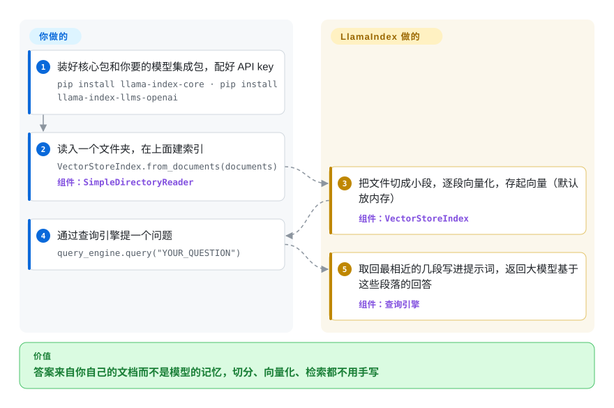

# LlamaIndex

你拿自己的 PDF、wiki 页面或工单去问大模型，它却凭记忆作答：说得笃定，内容是错的，还给不出出处。LlamaIndex 先把这些文件读进来，切成能按意思检索的小段，每次提问只把相关的几段塞进提示词，让答案来自你的文档。最基础的用法大约五行 Python。

## 何时使用

你是一名 Python 开发者，被要求给内部工具加上“和我们的文档对话”：3000 份合同和制度 PDF，外加一份 Confluence 导出。第一个原型把全文塞进提示词，马上撞上上下文长度上限；第二个原型回答“退款期限是 30 天”，而制度 PDF 里写的是 14 天。你缺的是中间那条不起眼的流水线：读文件、切分、向量化、存起来、每个问题取回最相关的五段、拼出提示词。你不想每一环都自己手写、自己调。

你选 LlamaIndex，是因为这条数据流水线正是它的核心抽象（reader → node → index → retriever → query engine），有 300 多个集成包对接各家大模型、嵌入模型和向量库，默认实现不够用时每一环都能单独替换。和 [LangChain](langchain.zh.md) 比：当难点在“针对你的文档检索得准”、agent 循环是次要的时候选 LlamaIndex；LangChain 的重心是 agent 和它的工具调用，检索只是众多集成之一。和 [Dify](dify.zh.md) 这类无代码平台比：当你需要在代码里控制切分和检索、而不是在设置页里点选时，选 LlamaIndex。

## 怎么用起来

你负责把 LlamaIndex 指向你的数据、选好用哪个模型和存储，剩下的管道活它来做。`SimpleDirectoryReader` 把一个文件夹读成文档；`VectorStoreIndex.from_documents` 把文档切成 node（几百字一段的小块），再把每一段交给嵌入模型变成向量，也就是一串数字，意思相近的段落在这串数字上也挨得近。向量默认放在内存里，可以持久化到 `./storage`，也可以接一个真正的向量数据库。提问时，查询引擎用同样的方法把问题变成向量，取回最接近的几段，写进提示词再去问大模型，相当于让模型拿着递给它的那几页纸开卷答题。要做 agent 类应用时，`FunctionAgent` 和 `AgentWorkflow` 建在同一套积木上，跑在它的事件驱动引擎 `llama-index-workflows` 里。

<!-- flow-steps:begin (generated from flows/llamaindex.json by tools/flow_card.py — do not edit) -->

流程文字版

1. **你**：装好核心包和你要的模型集成包，配好 API key — `pip install llama-index-core · pip install llama-index-llms-openai`
2. **你**：读入一个文件夹，在上面建索引 — `VectorStoreIndex.from_documents(documents)` — 组件：`SimpleDirectoryReader`
3. **LlamaIndex**：把文件切成小段，逐段向量化，存起向量（默认放内存） — 组件：`VectorStoreIndex`
4. **你**：通过查询引擎提一个问题 — `query_engine.query("YOUR_QUESTION")`
5. **LlamaIndex**：取回最相近的几段写进提示词，返回大模型基于这些段落的回答 — 组件：`查询引擎`

**价值**：答案来自你自己的文档而不是模型的记忆，切分、向量化、检索都不用手写

<!-- flow-steps:end -->

## 何时不用

- **你要押注这个框架未来好几年的路线图。** README 现在写明公司的“主要精力已转向 LlamaParse”（它的托管文档解析产品），开源框架只是“仍作为开放工具包提供”。如果编排层的长期投入对你很重要，请优先考虑 [LangGraph](../agent-runtimes/agent-sdks/langgraph.zh.md) 或 LangChain，因为它们是背后厂商的主力开源产品，而不是副业。
- **你的文档很难解析（扫描件、复杂表格、表单）。** 检索效果取决于抽出来的文字质量，而 README 把难解析的文档引向 LlamaParse，一个收费的托管服务。想把解析留在自己机器上，就在 LlamaIndex 前面放 [Docling](../../document-parsing/docling.zh.md) 或 [Marker](../../document-parsing/marker.zh.md)，不要依赖它的默认 reader，因为它们会在本地还原版面和表格。
- **你的应用主要是 agent 控制流，而不是检索。** 如果难点在分支、重试、人工审批和持久状态，请改用 LangGraph，因为它的图运行时就是围绕这些状态设计的，而 LlamaIndex 的长处在数据这一侧。
- **你想要尽量小的依赖面。** 光 `llama-index-core` 就会拉进 SQLAlchemy、NLTK、tiktoken、NumPy、networkx、Pillow 和 aiohttp，还内置一份 NLTK/tiktoken 缓存。如果只是做一次相似度查找，请直接调用 [FAISS](../../rag-retrieval/vector-search/faiss.zh.md) 或 [Milvus](../../rag-retrieval/vector-search/milvus.zh.md) 这类向量库，因为这样能省掉整个框架和它的升级矩阵。
- **你需要稳定的 1.0 API 承诺。** 项目快满四年仍是 `0.14.x`，各集成包对核心包的版本约束很紧，每次核心发版都跟着动（2026 年 10 月的提交大多是各模型提供方依赖范围的调整）。如果升级必须平淡无事，就把所有 `llama-index-*` 包一起锁版本，或者把检索留在自己的代码里。

## 横向对比

| 替代品 | 是否收录 | 我们的评价 | 取舍 |
|---|---|---|---|
| [LangChain](langchain.zh.md) | ✅ | 如果应用是一个会调工具的 agent、检索只是其中一个工具，选 LangChain；如果难点在于针对自有文档答得准，选 LlamaIndex。 | LangChain 的 agent/工具生态更广，而且是厂商的主力开源产品；LlamaIndex 对切分、建索引和检索的控制更细。 |
| [LangGraph](../agent-runtimes/agent-sdks/langgraph.zh.md) | ✅ | 当核心问题是持久、带分支的 agent 状态时选 LangGraph，并把 LlamaIndex 留作它调用的检索层。 | 显式的图状态、检查点和人工介入能力，但它自己没有文档流水线，检索得你自己带。 |
| Haystack | 未收录 | 如果你想要“组件串成显式管道”的 RAG 框架，并且背后公司仍以它为中心，选 Haystack（deepset 出品）。 | 管道显式、可序列化；集成目录比 LlamaIndex 的 300 多个包小。 |
| [Docling](../../document-parsing/docling.zh.md) | ✅ | 输入是带表格或扫描件的 PDF 时，把 Docling 和 LlamaIndex 搭配使用，而不是二选一：Docling 负责解析，LlamaIndex 负责建索引和检索。 | 换来更好的本地抽取（版面、表格），代价是摄入链路里多一个重组件。 |
| LlamaParse | 非仓库 | 只有当你接受由同一家公司提供的收费托管解析器来处理最难的文档时，才选 LlamaParse。 | 厂商自家最好的解析效果，但文档要离开你的基础设施，并且按量计费。 |

## 技术栈

- **Python**：`llama-index-core` 加按命名空间拆分的集成包（`llama-index-llms-*`、`llama-index-embeddings-*`、`llama-index-vector-stores-*`）；入门包 `llama-index` 把核心和一批常用集成打包在一起。
- **Pydantic v2** 做数据模型；**SQLAlchemy / aiosqlite** 做内部存储。
- **`llama-index-workflows`**：agent（`FunctionAgent`、`ReActAgent`、`CodeActAgent`、`AgentWorkflow`）底下的事件驱动工作流引擎。
- 核心包内置 **NLTK 和 tiktoken** 缓存，并附构建来源证明，可用 `gh attestation verify` 校验。

## 依赖

- **Python ≥ 3.10。**
- **一个大模型和一个嵌入模型**：README 示例用 OpenAI（`OPENAI_API_KEY`）；本地方案是 Ollama 跑大模型、配一个 Hugging Face 嵌入模型。
- **存储**：默认在内存里，`persist()` 后落到磁盘 `./storage`；数据量大或多人共用时接一个向量数据库集成。
- **可选**：用托管解析器时需要 LlamaParse API key。

## 运维难度

**跑起来容易，跟上版本中等。** 它是你 Python 进程里的一个库，自己没有服务端。真正的运维工作在它外面：一个持久化的向量库、文档变动时的重新摄入任务、对检索质量的评估。反复出现的成本是版本矩阵：核心包和各集成包要一起动，所以每次升级都是一组 `llama-index-*` 版本号一起改，再把检索测试重跑一遍。

## 健康度与可持续性

- **维护：活跃（截至 2026-10-08）。** 几乎每天都有提交（最近 13 周里 12 周有提交）；最新版本 `v0.14.25` 发布于 2026-09-21。发版节奏已放慢到约每月一次（2026-06-24、2026-08-19、2026-09-21），而 2026 年春季是每月两三次（0.14.18–0.14.21 在 2026-03-16 到 2026-04-21 之间发出）。
- **治理：单一公司，但核心团队较宽。** 归 `run-llama`（LlamaIndex, Inc.）所有；`pyproject.toml` 里列出的核心包维护者都是公司员工。贡献分散，不依赖某一个人（评分器读数：过去一年头号贡献者约占 29% 的提交）。
- **背书：公司战略正从框架移开。** README 写明公司的主要精力已转向 LlamaParse 及其解析基准。预计框架会继续维护，但新的编排功能优先级会比以前低。[推断]
- **年龄与 Lindy：约 3.9 岁且仍活跃。** 2022-11 创建，至今仍在发版；对一个大模型时代的框架来说是不错的先验，但要打上面那次转向的折扣。
- **采用：规模大。** 约 52.4k star、8.3k fork；按评分器 2026-10-09 的读数，入门包 `llama-index` 在 PyPI 上月下载 2,937,852 次，有 1,464 个依赖它的仓库。
- **风险信号。** MIT 许可，没有改许可证的历史。风险在开源核心的引力：最好的解析能力放在收费托管产品里，README 的引导也都指向那里。

## 存疑（未验证）

- [推断] “新的编排功能优先级降低”是从 README 的重心声明和放慢的发版节奏推出来的，不是来自公开路线图。
- [推断] 健康度评分器读的是入门包 `llama-index`；直接装 `llama-index-core` 加单个集成包的项目不计入这个数，所以读数很可能低估了总体使用量。
- [未验证] 默认 `SimpleDirectoryReader` 的 PDF 路径处理表格和扫描件的效果没有实测；“难文档需要专门解析器”这一判断沿用了 README 自己把难文档引向 LlamaParse 的说法。
- [未验证] Haystack 的集成数量和公司当前重心这次没有重读；它在这里只是作为最接近的未收录管道式替代品出现。
