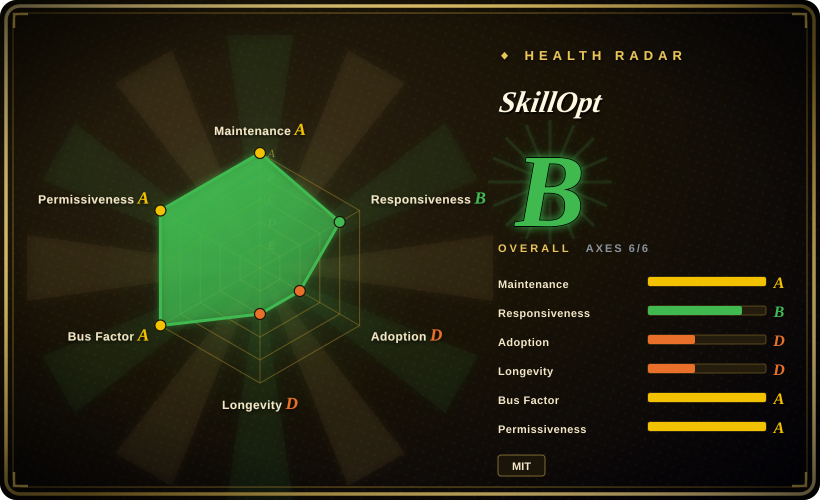
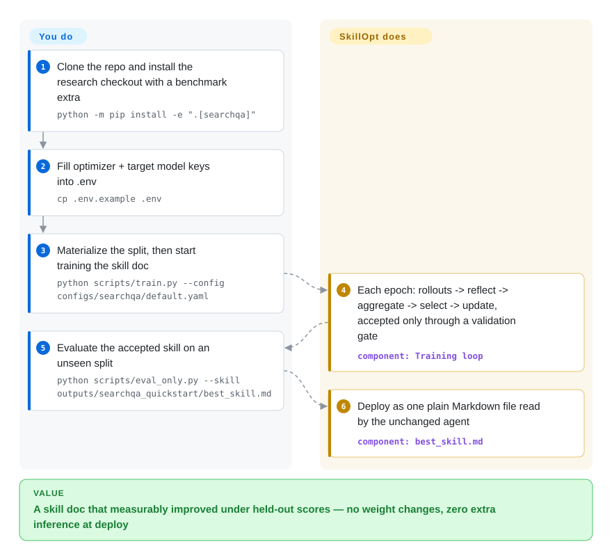

# SkillOpt

You keep rewriting your agent's skill document and can't tell which edit actually helped — every "it got better" is vibes. SkillOpt trains the skill text the way you'd train weights: an optimizer model proposes bounded add/delete/replace edits from scored agent rollouts, and each edit is accepted only if a held-out validation score rises, ending in a small `best_skill.md` you deploy with zero extra inference.

## When to use

You're an applied-AI engineer who's hit a wall hand-tuning a long skill/prompt document for an agent: you keep tweaking the instructions, but you can't fine-tune the model (it's frozen behind an API) and you can't tell whether each edit actually helps or just feels better. SkillOpt treats the *skill document itself* as the thing to optimize. You point it at a benchmark/task with a scoring function, and an optimizer LLM proposes bounded edits (add/delete/replace) to the skill text; each edit is kept only if it raises a held-out validation score, driven by actual agent rollouts rather than vibes. The output is a small `best_skill.md` (~300–2,000 tokens) you drop into your agent — no extra inference at deploy time, and it's plain text you can read, diff, and version. It supports multiple LLM backends (OpenAI/Azure, Claude via the Claude Code CLI, Qwen, MiniMax, Copilot, plus a generic `openai_compatible` path for any OpenAI-protocol provider) and integrates with direct-chat, Codex CLI, and Claude Code execution harnesses — with v0.2.0 adding integration shells for Claude Code, Codex, Copilot, and Devin — so you can optimize skills against the harness you actually ship on.

## How it works

SkillOpt's inner loop is a six-stage training step on a single Markdown document: the target agent runs scored tasks (rollout); a separate optimizer LLM reads the trajectories and proposes bounded add/delete/replace edits (reflect); patches are merged, ranked, and clipped by a textual "learning rate" (max edits per step), applied, and the candidate skill is kept only if the held-out validation score strictly improves (gate). Epoch boundaries run slow/meta updates that consolidate what worked, with a rejected-edit buffer keeping failed ideas out of the next proposals — the whole thing is deliberately shaped like SGD on weights, except the trainable state is text. Your part: wire up a scorable task (one of six built-in benchmarks — SearchQA, DocVQA, OfficeQA, ALFWorld, LiveMathematicianBench, SpreadsheetBench — or your own) plus keys for the optimizer and target models, then run the loop; the part you deploy is the `best_skill.md` it emits, dropped into an unchanged agent with zero extra inference calls. Since v0.2.0 a second entry point, `skillopt-sleep`, runs the same idea offline at night against your local coding-agent sessions: it harvests past work, replays recurring tasks, and stages proposed skill/memory updates behind the same validation gate for a human to adopt.

<!-- flow-steps:begin (generated from flows/skillopt.json by tools/flow_card.py — do not edit) -->

Text version of the flow

1. **You**: Clone the repo and install the research checkout with a benchmark extra — `python -m pip install -e ".[searchqa]"`
2. **You**: Fill optimizer + target model keys into .env — `cp .env.example .env`
3. **You**: Materialize the split, then start training the skill doc — `python scripts/train.py --config configs/searchqa/default.yaml`
4. **SkillOpt**: Each epoch: rollouts -> reflect -> aggregate -> select -> update, accepted only through a validation gate — component: `Training loop`
5. **You**: Evaluate the accepted skill on an unseen split — `python scripts/eval_only.py --skill outputs/searchqa_quickstart/best_skill.md`
6. **SkillOpt**: Deploy as one plain Markdown file read by the unchanged agent — component: `best_skill.md`

**Value**: A skill doc that measurably improved under held-out scores — no weight changes, zero extra inference at deploy

<!-- flow-steps:end -->

## When NOT to use

- **You don't have a scorable benchmark.** The whole method is validation-gated — without a task with a reliable score/eval, there's nothing to gate edits on and the optimizer has no signal.
- **Your bottleneck is the model, not the prompt.** SkillOpt optimizes *text*, not weights. If the frozen model fundamentally can't do the task, a better skill doc won't fix it — you need a different/fine-tuned model.
- **You want a mature, stable framework.** This is a v0.2.0 research release (2026) with no documented failure modes, cost bounds, or scalability limits — expect rough edges and API churn.
- **Optimization cost is a concern.** Trajectory-driven edits mean many agent rollouts and optimizer-LLM calls across epochs; the API/compute cost of a run isn't bounded in the docs — budget before committing. [推断]
- **You need offline / no-egress.** It drives external LLM APIs for the optimizer and target models; primary workloads run via those APIs, not locally.

## Comparison

| Alternative | In index | Our verdict | Tradeoff |
|---|---|---|---|
| [DSPy](dspy.md) | ✅ | Pick DSPy when you need a mature framework for optimizing LM programs and pipelines, not one deployable skill document. | Mature framework for programmatic prompt/pipeline optimization (compilers, teleprompters) over frozen LLMs; broader and battle-tested, but optimizes prompts/programs rather than a single deployable skill doc. |
| TextGrad | 未收录 | Pick TextGrad when "backprop through text" and natural-language gradients are the mechanism you want. | "Backprop through text" — optimizes prompts/text via natural-language gradients; similar text-space spirit, different update mechanism, not skill-doc-artifact-centric. |
| PromptBreeder / APE / OPRO | 未收录 | Pick these methods when you want LLM-driven prompt search/evolution rather than validation-gated reusable skills. | LLM-driven prompt-search/evolution methods; overlap on automated prompt improvement, but typically prompt strings, not validation-gated reusable skill artifacts. |
| Manual prompt engineering | 非仓库 | Pick manual prompting when no tooling, full control, and zero infra matter more than measurement and reproducibility. | Not a repository but a practice — the baseline SkillOpt replaces; no tooling, full control, zero infra; but unmeasured, non-reproducible, and exactly the toil SkillOpt automates. |

## Tech stack

- **Language:** Python (>=3.10, per pyproject).
- **Method:** text-space optimization — an optimizer LLM emits bounded add/delete/replace edits to a skill doc; a textual learning-rate budget caps edits per step, a rejected-edit buffer suppresses failed proposals, and updates are validation-gated on held-out scores from agent rollouts.
- **LLM backends:** `openai_chat` (Azure), generic `openai_compatible`, `claude_chat` (launches the Claude Code CLI, not a direct API client), Qwen, MiniMax, Copilot; target-only exec harnesses for Codex, Claude Code, Cursor, and Copilot.
- **Benchmarks & harnesses:** six built-in benchmarks (SearchQA, DocVQA, OfficeQA, ALFWorld, LiveMathematicianBench, SpreadsheetBench) across direct-chat, Codex CLI, and Claude Code harnesses; optional Gradio WebUI dashboard; v0.2.0 adds a `skillopt-sleep` nightly offline-evolution CLI plus integration shells for Claude Code, Codex, Copilot, and Devin.
- **Output:** a `best_skill.md` text artifact (~300–2,000 tokens), zero extra inference at deploy.

## Dependencies

- **Install:** `pip install skillopt` (PyPI, v0.2.0) for the packaged engine, or the research checkout (`git clone` + `python -m pip install -e ".[searchqa]"`) which the docs' quickstart uses for benchmarks and runnable training scripts.
- **Core Python deps (per pyproject):** `openai`, `pyyaml`, `numpy`, `openpyxl`, `azure-identity`, `azure-core`, `httpx`. Extras pull `claude-agent-sdk` (claude), `vllm` (qwen local), `datasets` (searchqa), `alfworld`, and `gradio` (webui).
- **LLM API access:** keys for the optimizer and target models (one or more of OpenAI/Azure/Claude/Qwen/MiniMax/Copilot, or any OpenAI-compatible endpoint). Primary workloads run via these APIs.
- **Benchmarks/datasets:** the six built-in benchmark packages, or your own scorable task wired in.
- **Hardware:** optional GPU only if you serve a local target (the `qwen` extra pulls vLLM); the main loop is API-driven, not GPU-bound.
- **Network:** outbound to the chosen LLM providers — not an offline tool.

## Ops difficulty

**Medium.** There's no service or datastore to run — it's a Python training/optimization loop you invoke with config (epochs, batch size, etc.). The operational work is: provisioning API keys for optimizer + target models, defining or wiring a scorable benchmark, and managing the *cost and runtime* of many rollouts/edits across epochs. Output is a static text file, so deployment is trivial (drop in `best_skill.md`); the burden is the optimization run itself — its API spend, reproducibility, and tuning the optimizer — not operating anything long-lived.

## Health & viability

- **Responsiveness**: Grade B — median first-response time 82.2 hours across 34 qualifying issues/PRs.
- **Maintenance (2026-09).** Created 2026-05-08; v0.2.0 released 2026-07-02; last push 2026-09-05 — commits in 10 of the last 13 weeks. **Active** and **not archived**, but the launch-period sprint has eased to a slower cadence, with no release since v0.2.0.
- **Governance / backing.** Published under the **microsoft** org with 62 active contributors in 12 months — strong institutional backing and a real team. Caveat: Microsoft/MSR research repos vary widely in long-term support; org backing is not a maintenance guarantee.
- **Age & Lindy verdict.** **~4.5 months old** (created 2026-05) — **no Lindy whatsoever**. Treat durability as entirely unproven; this is a research artifact with a paper (arXiv 2605.23904) and an MSR blog feature (2026-07).
- **Adoption.** ~17.6k stars (as of 2026-09) kept climbing after the launch spike, and the README lists third-party integrations (gbrain, gbrain-evals, darwin-skill) — but measured PyPI use is 10,945 downloads/month with zero dependent repos: visibility still far outpaces evidence of production use. Treat as a hype-plus-early-traction signal, not social proof. [推断]
- **Risk flags.** MIT (clean). Main flags: research-grade v0.2.0 with undocumented failure modes/cost bounds, a cooling commit/release cadence right after the hype window, and adoption metrics that still read as visibility rather than usage.

## Caveats (unverified)

- [未验证] ~17.6k stars / ~1.6k forks as of 2026-09 (GitHub API) — API-verified counts, but unusually high for a ~4.5-month-old research repo; measured PyPI use is 10,945 downloads/month with zero dependent repos, so the visibility/usage gap persists; treat with strong skepticism as adoption evidence.
- [未验证] The "52 model-benchmark-harness combinations, best or tied-best" result, the GPT-5.5 lift numbers (+23.5/+24.8/+19.1), and the skill-doc size range (~300–2,000 tokens) are the project's own claims from the README/paper — not independently reproduced.
- [未验证] The listed third-party integrations (gbrain, gbrain-evals, darwin-skill) are from the README's News section; their depth and currency were not checked.
- [推断] Cost/runtime of an optimization run is unbounded in the docs — the "budget before committing" warning is an inference from the trajectory-driven method, not a measured figure.
- [推断] "Microsoft backing ≠ maintenance guarantee" and the read of the post-July cadence slowdown as a research-project pattern rather than abandonment are general inferences about MSR/Microsoft research repos, not statements about this project's roadmap commitment.
