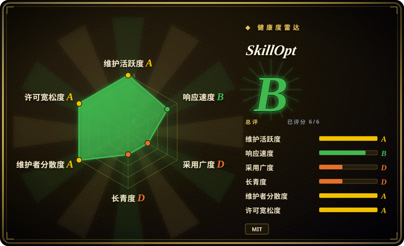
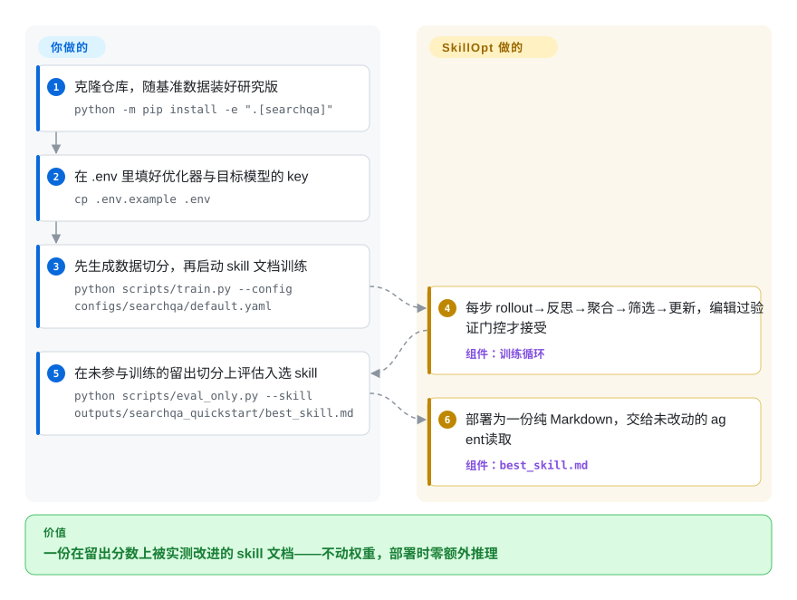

# SkillOpt

你反复改写 agent 的 skill 文档，却说不清哪次编辑真的有用——每次“变好了”都只是感觉。SkillOpt 像训练权重一样训练这份文本：优化器模型从有分数的 agent 轨迹中提出有界的增/删/替编辑，每一笔只有通过留出验证分数上升才被接受，最后产出一份小小的 `best_skill.md`，部署时零额外推理。

## 何时使用

你是应用 AI 工程师，手工调一份给 agent 用的长 skill/prompt 文档调到撞墙：你一直在改指令，但你没法微调模型（它被冻结在 API 后面），也分不清每次改动是真有帮助还是只是感觉更好。SkillOpt 把 *skill 文档本身*当作要优化的对象。你把它指向一个带打分函数的基准/任务，一个优化器 LLM 提出对 skill 文本的有界编辑（增/删/替）；每次编辑只有在它抬高一个留出验证分数时才被保留，由真实的 agent rollout 而非感觉来驱动。产出是一份小小的 `best_skill.md`（约 300–2,000 token），你把它放进 agent——部署时无额外推理，而且它是你能读、能 diff、能版本管理的纯文本。它支持多个 LLM 后端（OpenAI/Azure、经 Claude Code CLI 的 Claude、Qwen、MiniMax、Copilot，外加可接任意 OpenAI 协议厂商的 `openai_compatible` 通路），并与 direct-chat、Codex CLI、Claude Code 执行 harness 集成——v0.2.0 还给 Claude Code、Codex、Copilot、Devin 加了集成外壳——因此你可以对着你真正发布所用的 harness 来优化 skill。

## 怎么用起来

SkillOpt 的内循环是对一份 Markdown 文档做六阶段训练步：目标 agent 跑有分数的任务（rollout）；另一个优化器 LLM 读这些轨迹并提出有界的增/删/替编辑（reflect）；补丁被合并、排序，并被一个文本侧的「学习率」（每步最多几笔编辑）裁剪后应用，候选 skill 只有在留出验证分数严格上升时才被保留（gate）。epoch 边界上再做 slow/meta 更新，把有效的经验固化下来，还有一个「被拒编辑缓冲区」让失败提案不再反复出现——整套流程刻意做成对权重做 SGD 的样子，只不过可训练的状态是文本。你做的：接好一个可打分的任务（六个内置基准之一——SearchQA、DocVQA、OfficeQA、ALFWorld、LiveMathematicianBench、SpreadsheetBench——或你自己的），备好优化器与目标模型的 key，然后跑循环；你拿去部署的，是它产出的 `best_skill.md`，放进未改动的 agent，零额外推理调用。自 v0.2.0 起有了第二个入口 `skillopt-sleep`：同一个想法在夜间离线跑——审阅你本地编程 agent 的历史会话、重放反复出现的任务，把候选的 skill/记忆更新推到同一道验证门后，交给人采纳。

<!-- flow-steps:begin (generated from flows/skillopt.json by tools/flow_card.py — do not edit) -->

流程文字版

1. **你**：克隆仓库，随基准数据装好研究版 — `python -m pip install -e ".[searchqa]"`
2. **你**：在 .env 里填好优化器与目标模型的 key — `cp .env.example .env`
3. **你**：先生成数据切分，再启动 skill 文档训练 — `python scripts/train.py --config configs/searchqa/default.yaml`
4. **SkillOpt**：每步 rollout→反思→聚合→筛选→更新，编辑过验证门控才接受 — 组件：`训练循环`
5. **你**：在未参与训练的留出切分上评估入选 skill — `python scripts/eval_only.py --skill outputs/searchqa_quickstart/best_skill.md`
6. **SkillOpt**：部署为一份纯 Markdown，交给未改动的 agent 读取 — 组件：`best_skill.md`

**价值**：一份在留出分数上被实测改进的 skill 文档——不动权重，部署时零额外推理

<!-- flow-steps:end -->

## 何时不用

- **你没有可打分的基准。** 整个方法是验证门控的——没有一个带可靠分数/eval 的任务，就没有东西能给编辑做门控，优化器也没有信号。
- **你的瓶颈是模型，不是 prompt。** SkillOpt 优化的是*文本*，不是权重。如果冻结模型从根本上做不了这个任务，再好的 skill 文档也救不了——你需要换一个/微调过的模型。
- **你想要一个成熟稳定的框架。** 这是个 v0.2.0 研究发布（2026），没有文档化的失败模式、成本上界或可扩展性边界——预期会有毛刺和 API churn。
- **优化成本是顾虑。** 轨迹驱动的编辑意味着跨多个 epoch 的大量 agent rollout 和优化器 LLM 调用；一次运行的 API/算力成本在文档里没有上界——投入前先估预算。[推断]
- **你需要离线 / 不出网。** 它驱动外部 LLM API 跑优化器和目标模型；主要工作负载经这些 API 运行，而非本地。

## 横向对比

| 替代品 | 是否收录 | 我们的评价 | 取舍 |
|---|---|---|---|
| [DSPy](dspy.zh.md) | ✅ | 需要成熟框架来优化 LM 程序和管线，而不是单份可部署 skill 文档时，选 DSPy。 | 在冻结 LLM 上做程序化 prompt/管线优化的成熟框架（compiler、teleprompter）；更广、久经考验，但优化的是 prompt/程序而非单份可部署的 skill 文档。 |
| TextGrad | 未收录 | 想要“对文本反向传播”和自然语言梯度这个机制时，选 TextGrad。 | “对文本反向传播”——用自然语言梯度优化 prompt/文本；文本空间精神相近，更新机制不同，不以 skill 文档产物为中心。 |
| PromptBreeder / APE / OPRO | 未收录 | 想要 LLM 驱动的 prompt 搜索/演化，而不是验证门控的可复用 skill 时，选这些方法。 | LLM 驱动的 prompt 搜索/演化方法；在自动改进 prompt 上有重叠，但通常产出 prompt 字符串，而非经验证门控的可复用 skill 产物。 |
| 手工提示工程 | 非仓库 | 无工具、完全掌控、零基础设施比度量和可复现更重要时，选手工提示工程。 | 它是一项实践而非仓库——正是 SkillOpt 要替代的基线；无工具、完全掌控、零基础设施；但不可度量、不可复现。 |

## 技术栈

- **语言：** Python（pyproject 要求 >=3.10）。
- **方法：** 文本空间优化——优化器 LLM 对 skill 文档发出有界的增/删/替编辑；文本侧「学习率」预算限制每步编辑数，被拒编辑缓冲区抑制失败提案重复出现，更新以来自 agent rollout 的留出分数做验证门控。
- **LLM 后端：** `openai_chat`（Azure）、通用的 `openai_compatible`、`claude_chat`（实际启动 Claude Code CLI，并非直连 API）、Qwen、MiniMax、Copilot；另有只作为目标侧的 Codex、Claude Code、Cursor、Copilot 执行 harness。
- **基准与 harness：** 六个内置基准（SearchQA、DocVQA、OfficeQA、ALFWorld、LiveMathematicianBench、SpreadsheetBench），覆盖 direct-chat、Codex CLI、Claude Code 三种 harness；可选 Gradio WebUI 面板；v0.2.0 新增夜间离线自演化 CLI `skillopt-sleep`，以及 Claude Code、Codex、Copilot、Devin 的集成外壳。
- **产出：** 一份 `best_skill.md` 文本产物（约 300–2,000 token），部署时零额外推理。

## 依赖

- **安装：** `pip install skillopt`（PyPI，v0.2.0）拿到打包好的引擎；或按文档 quickstart 用研究版 checkout（`git clone` + `python -m pip install -e ".[searchqa]"`）以使用基准与可运行的训练脚本。
- **核心 Python 依赖（依 pyproject）：** `openai`、`pyyaml`、`numpy`、`openpyxl`、`azure-identity`、`azure-core`、`httpx`。可选 extra 会拉取 `claude-agent-sdk`（claude）、`vllm`（qwen 本地）、`datasets`（searchqa）、`alfworld`、`gradio`（webui）。
- **LLM API 访问：** 优化器和目标模型的 key（OpenAI/Azure/Claude/Qwen/MiniMax/Copilot 之一或多个，或任意 OpenAI 兼容端点）。主要工作负载经这些 API 运行。
- **基准/数据集：** 六个内置基准包，或你自己接入的可打分任务。
- **硬件：** 仅当本地起目标模型（`qwen` extra 会拉 vLLM）时才需要 GPU；主循环由 API 驱动，不受 GPU 约束。
- **网络：** 向所选 LLM 提供方出网——不是离线工具。

## 运维难度

**中。** 没有要跑的服务或数据存储——它是一个你用配置（epoch、batch size 等）调起的 Python 训练/优化循环。运维工作是：为优化器 + 目标模型备好 API key、定义或接入一个可打分基准，以及管理跨 epoch 的大量 rollout/编辑的*成本与耗时*。产出是一份静态文本文件，所以部署很简单（放入 `best_skill.md`）；负担在优化运行本身——它的 API 花费、可复现性以及调优化器——而不是运维任何长期存在的东西。

## 健康度与可持续性

- **响应速度**：Grade B——中位首次响应时间 82.2 小时，基于 34 个 qualifying issues/PRs。
- **维护（2026-09）。** 2026-05-08 创建；v0.2.0 发布于 2026-07-02；最后 push 于 2026-09-05——近 13 周里有 10 周有提交。**活跃**且**未归档**，但发布期的冲刺节奏已放缓，v0.2.0 之后没有再出版本。
- **治理 / 背书。** 发布于 **microsoft** 组织下，12 个月内有 62 名活跃贡献者——强机构背书加真实团队。注意：Microsoft/MSR 研究仓库的长期支持差异极大；组织背书不是维护保证。
- **年龄与 Lindy 判断。** **约 4.5 个月**（2026-05 创建）——**毫无 Lindy**。耐久性视为完全未经验证；这是一个带论文（arXiv 2605.23904）与 MSR 官方博客报道（2026-07）的研究产物。
- **采用度。** 约 17.6k star（2026-09）在发布热度后仍在上涨，README 列出了第三方集成（gbrain、gbrain-evals、darwin-skill）——但可度量的 PyPI 使用是每月 10,945 次下载、零依赖仓库：曝光度仍远超生产使用的证据。视为「热度 + 早期牵引」信号，而非社会证明。[推断]
- **风险标记。** MIT（干净）。主要标记：研究级 v0.2.0 且失败模式/成本上界无文档、热度窗口之后提交与发布节奏降温、采用指标读起来仍是曝光而非使用。

## 存疑（未验证）

- [未验证] 截至 2026-09，约 17.6k star / 约 1.6k fork（GitHub API）——计数经 API 核实，但对一个约 4.5 个月大的研究仓库异常地高；可度量的 PyPI 使用是每月 10,945 次下载、零依赖仓库，曝光与使用的落差仍在；作为采用证据请高度存疑。
- [未验证] “52 种 model-benchmark-harness 组合全部最优或并列最优”、GPT-5.5 提升数字（+23.5/+24.8/+19.1）与 skill 文档体量区间（约 300–2,000 token）均为项目 README/论文自报——未独立复现。
- [未验证] README「News」列出的第三方集成（gbrain、gbrain-evals、darwin-skill）未核实其深度与现状。
- [推断] 一次优化运行的成本/耗时在文档里没有上界——“投入前先估预算”的提醒是从轨迹驱动方法做出的推断，而非实测数字。
- [推断] “Microsoft 背书≠维护保证”，以及把 7 月后的节奏放缓读作研究型项目的常态而非弃坑，都是对 MSR/Microsoft 研究仓库的一般推断，而非对本项目路线图承诺的陈述。
