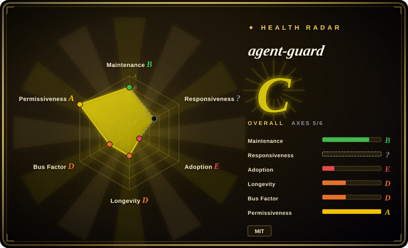
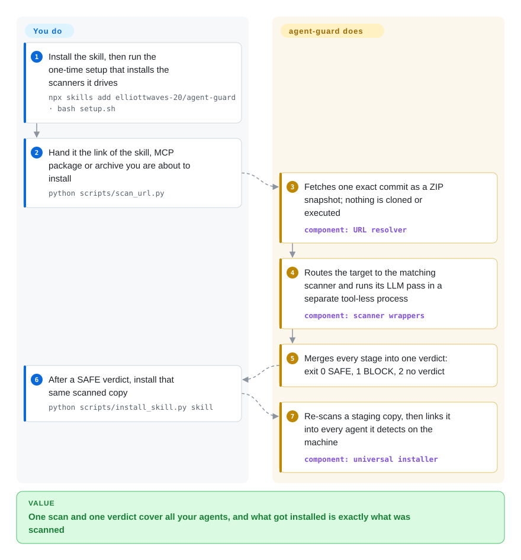

# agent-guard

Your agent says "I'll install this skill for you" and thirty seconds later a stranger's `SKILL.md`, an npm MCP server and a `curl | bash` installer are all running under your account — and each of those needs a different security scanner you have not set up. agent-guard is a skill plus a set of Python wrapper scripts that sends each kind of install target to an existing scanner and boils the results down to one answer (safe, blocked, or no verdict) with no detection of its own — and with one author and three stars, you are trusting that wrapper as much as the scanners behind it.

## When to use

You work across two or three coding agents — Claude Code in the morning, Codex when the rate limit hits — and you install third-party things into all of them: a skill from a GitHub repo, an MCP server from PyPI, a CLI tool the agent decided it needs. You know [SkillSpector](skillspector.md) exists, but it covers skills and static source; the npm package needs a package-malware scanner, the release binary needs a hash-reputation lookup, and the MCP server registers tools only once it is running. What you actually do today is type `npx skills add someone/something` and hope. You want one command that takes whatever link you were given, works out what it is, runs the right scanner without executing the target first, and gives back an exit code your agent can act on: `0` safe, `1` blocked, `2` no verdict.

That routing-and-gating layer is what agent-guard adds on top of the scanners it calls. Against SkillSpector alone, it buys coverage of MCP packages, npm/PyPI/Go/cargo packages, release binaries and install scripts, a commit-pinned download so the thing scanned is the thing installed, and an installer that links the scanned copy into every agent on the machine. Against a hosted service such as [Snyk Agent Scan](agent-scan.md), it keeps the verdict logic local and inspectable, and its default LLM pass runs through the coding-agent CLI you are already logged into rather than a separate account. The price is a deep toolchain (uv, Python, Docker for half the modes) and a wrapper maintained by one person with no known outside users. Pick it when you install from many source types into several agents and are willing to read and pin the wrapper yourself.

## How it works

Think of it as a customs desk, not a customs officer: it does not inspect anything itself, it decides which inspector each parcel goes to and refuses entry whenever an inspector fails to report. You install the skill and run a setup script once; the script uses `uv` (a Python package and tool installer) to put SkillSpector, pinned to one exact commit, and Cisco's mcp-scanner into isolated tool environments. From then on you — or your agent, following the bundled `SKILL.md` — give a wrapper script a link or a package name. The wrapper downloads a GitHub repo as a ZIP snapshot of one commit instead of cloning it (a ZIP download runs nothing; a clone can), then sends skills and source code to SkillSpector, npm/PyPI/Go/cargo packages to Datadog GuardDog, release binaries to VirusTotal's hash lookup, and — if you ask for it — a running MCP server to Cisco's scanner inside a throwaway Docker container whose network traffic is recorded. For npm and PyPI packages it additionally installs the package inside OpenSSF package-analysis, a sandbox (an isolated environment the package cannot escape from) with planted fake credentials, and judges what the package touched. The wrapper's own contribution is the rule that turns all this into a verdict: any stage that blocks wins, and a scanner that crashed, timed out or inspected only part of the files yields "no verdict", never "safe". What stays yours: running setup and trusting that toolchain, starting Docker, supplying a VirusTotal key for binary scans, and reading the findings when the answer is not SAFE.

<!-- flow-steps:begin (generated from flows/agent-guard.json by tools/flow_card.py — do not edit) -->

Text version of the flow

1. **You**: Install the skill, then run the one-time setup that installs the scanners it drives — `npx skills add elliottwaves-20/agent-guard · bash setup.sh`
2. **You**: Hand it the link of the skill, MCP package or archive you are about to install — `python scripts/scan_url.py`
3. **agent-guard**: Fetches one exact commit as a ZIP snapshot; nothing is cloned or executed — component: `URL resolver`
4. **agent-guard**: Routes the target to the matching scanner and runs its LLM pass in a separate tool-less process — component: `scanner wrappers`
5. **agent-guard**: Merges every stage into one verdict: exit 0 SAFE, 1 BLOCK, 2 no verdict
6. **You**: After a SAFE verdict, install that same scanned copy — `python scripts/install_skill.py skill`
7. **agent-guard**: Re-scans a staging copy, then links it into every agent it detects on the machine — component: `universal installer`

**Value**: One scan and one verdict cover all your agents, and what got installed is exactly what was scanned

<!-- flow-steps:end -->

## When NOT to use

- **You only scan skills, or you need a CI gate with SARIF.** agent-guard's skill scan *is* SkillSpector at a pinned commit, driven through about 560 KB of wrapper Python whose budget adapter, by the project's own pin file, "patches SkillSpector internals and must be re-verified against every new release". Use [SkillSpector](skillspector.md) directly: you get its baselines and SARIF output without a second layer that can lag or break on an upstream release.
- **You want to know what is already installed, with no toolchain to set up.** agent-guard has an `audit_installed.py` inventory, but it needs the whole scanner stack in place, and it never starts an installed MCP server on the host to read its live tool list — runtime checks are routed to the Docker sandbox instead. Use [Snyk Agent Scan](agent-scan.md) for a one-command inventory across agents that reads live tool descriptions — accepting that its analysis is hosted and closed.
- **You cannot run Docker, or cannot run a privileged container.** npm and PyPI scans end in "no verdict" without Docker unless you pass `--no-dynamic`; the dynamic analysis starts the OpenSSF image with `--privileged --cgroupns=host`; GuardDog on Windows only runs through Docker. On a locked-down laptop or a shared CI runner, call GuardDog (`DataDog/guarddog`) natively for the static package scan and SkillSpector for skills, and skip this wrapper.
- **Scanned content must not leave the machine.** By default the LLM pass sends file contents to the vendor of whichever coding-agent CLI is logged in; static scans still query OSV.dev; binary scans send hashes to VirusTotal; the dynamic stage lets the analysed package reach the network on purpose. `AGENT_GUARD_STATIC_ONLY=1` turns off only the LLM part. For a scan with no network at all, use [claude-skill-audit](claude-skill-audit.md) — far shallower, but offline.
- **You need the scanner toolchain itself to be reproducible.** The pinning is real but partial: SkillSpector is pinned to a commit, the OpenSSF and packet-capture images to digests, the `skills` CLI to a version plus registry digests — while Cisco's mcp-scanner is installed and upgraded to the latest PyPI release by `setup.sh`, the GuardDog Docker image defaults to the `:latest` tag (`scripts/scan_cli.py`), and SkillSpector's transitive dependencies are not locked (the README says so). If an auditor will ask "which scanner build produced this verdict", build your own pinned images and run GuardDog and the Cisco scanner directly.
- **You need a dangerous action stopped while the agent runs.** A pre-install verdict says nothing about what a skill does next week, and the README's own limits table lists time-delayed code, second-stage downloads and novel binaries as invisible. Use [agent-governance-toolkit](agent-governance-toolkit.md) for policy-gated tool calls; the README itself recommends an install-time firewall such as Socket Firewall (`SocketDev/sfw-free`) as a second net.
- **You need a dependency someone else is vouching for.** Three stars, zero forks, no issue or pull request ever opened, one personal account, no CI in the repository (as of 2026-10-08). This is a tool that writes into every agent's config and starts a privileged container; if that single account were compromised, the blast radius is your whole agent setup. Use the upstream scanners directly — SkillSpector (NVIDIA) and Cisco's mcp-scanner — or adopt agent-guard only at a commit SHA you have read.
- **You are scanning binaries in a commercial workflow on a free VirusTotal key.** The README notes the public API is limited to 4 lookups per minute and restricted to non-commercial use. Run malcontent (`chainguard-dev/malcontent`) directly for capability analysis, or pay for a VirusTotal licence.

Two more scanners sit in this category: [Cisco MCP Scanner](mcp-scanner.md) (the runtime MCP scanner agent-guard itself calls — use it directly if MCP servers are all you check) and [skills-scanner](skills-scanner.md); read them before settling.

## Comparison

| Alternative | In index | Our verdict | Tradeoff |
|---|---|---|---|
| [SkillSpector](skillspector.md) | ✅ | When the only thing you install is skills, or the scan runs in CI, pick SkillSpector itself; pick agent-guard when the same gate must also cover MCP packages, CLI packages, binaries and install scripts, and then link the result into several agents. | SkillSpector is the NVIDIA-owned engine with baselines and SARIF and no wrapper in between; agent-guard adds routing, commit-pinned download and cross-agent install, at the cost of a one-author layer that tracks SkillSpector's internals and can fall behind its releases. |
| [Snyk Agent Scan](agent-scan.md) | ✅ | To inventory and risk-score what is *already* installed across agents with one command and no setup, pick Agent Scan; to gate a *new* install with verdict logic you can read and an LLM pass on your own CLI login, pick agent-guard. | Agent Scan discovers everything and is vendor-maintained, but verdicts come from Snyk's closed hosted API and it starts the MCP servers it inspects; agent-guard keeps the decision local and sandboxes the target, but needs uv, Docker and your own trust in an unreviewed wrapper. |
| [AI-Infra-Guard](../llm-eval/ai-infra-guard.md) | ✅ | When a team wants a deployed platform with a web UI that also covers model servers with known CVEs and jailbreak testing, pick AI-Infra-Guard; pick agent-guard for a per-developer gate that runs inside the agent's own install step. | AI-Infra-Guard is a self-hosted service with its own rule library and a large user base, but it is something to deploy and operate; agent-guard is a folder of scripts with nothing to host, and no detection of its own to fall back on. |
| GuardDog (`DataDog/guarddog`) | not indexed | If the targets are only npm, PyPI, Go or cargo packages, run GuardDog directly; agent-guard is worth the extra layer when you also want the sandboxed install analysis and one exit-code contract shared with skill and MCP scans. | GuardDog alone is one maintained tool (Apache-2.0, about 1.2k stars as of 2026-10) with its findings unfiltered; agent-guard demotes most `capability-*` findings to informational and adds a dynamic stage, which is useful but is the wrapper author's judgment, not Datadog's. Not added in this tab batch. |
| [Vercel Skills](../agent-tooling/harness-extensions/vercel-skills.md) | ✅ | If you trust the source and only need a skill placed into many agents, use the `skills` CLI on its own; put agent-guard in front when the source is a stranger's repository. | The `skills` CLI is the widely used distribution tool and does no security scanning; agent-guard calls a pinned version of that same CLI after its verdict, so you pay scan time and toolchain weight for the gate. |

## Tech stack

- **Python wrapper scripts** (about 564 KB of Python per the GitHub language API, 2026-10-08) under `scripts/`: one entry point per target type — `scan_skill.py`, `scan_mcp.py`, `scan_cli.py`, `scan_url.py` — plus `install_skill.py`, `audit_installed.py`, and LLM-profile and budget helpers. There is no package manifest; the scripts run in place from the skill directory.
- **A `SKILL.md`** (about 32 KB) that tells the installing agent when to trigger the scan and how to read the exit code; this is what makes it a skill rather than only a CLI.
- **`setup.sh` / `setup.ps1`** bootstrap the external scanners with `uv tool install`.
- **Scanners it drives, none of them its own code:** NVIDIA SkillSpector (skills, static source, install scripts, crate source), Cisco mcp-scanner (live MCP runtime check), Datadog GuardDog (npm/PyPI/Go/cargo), OpenSSF package-analysis in gVisor (dynamic npm/PyPI install analysis), VirusTotal and malcontent (binaries).
- **Tests:** 18 files under `tests/` with about 380 `def test_` functions (counted 2026-10-08); a runner script that refuses to report green when any test was skipped. There is no CI workflow in the repository, so they run only where someone runs them.

## Dependencies

- **Always:** Python 3.10+ for the wrappers, and `uv`, which fetches the Python 3.12 that SkillSpector needs and installs SkillSpector and Cisco's mcp-scanner into isolated tool environments.
- **For full skill-scan coverage:** a logged-in `claude`, `codex` or `gemini` CLI on PATH, or a hosted-provider API key. Without either, scans run static-only and say so.
- **Docker, running:** required for the default npm/PyPI dynamic analysis (image about 1 GB, cache volume growing to a few GB, privileged container), for the sandboxed live MCP check, for GuardDog on Windows, and for `binary --deep`.
- **Keys:** a VirusTotal API key for binary scans; a separate LiteLLM-style provider key and model for Cisco's runtime scan, which has no CLI-login path.
- **Optional:** Node.js/`npx` for the delegated skill distribution and npm MCP servers; Git only for installs after a SAFE verdict; an operator-configured page renderer for marketplace pages behind bot checks.

## Ops difficulty

**Medium, and higher than a "skill" suggests.** Skill-only scanning is light: one setup script, one command. The full surface is not: five external scanners with different install paths, two independent LLM configurations, a Docker daemon that must be running, a privileged container, gigabytes of image and cache, and first-run times of minutes. Updating is a deliberate act — the SkillSpector pin has to be raised together with the wrapper, and the project's own changelog records a release where the pin bump left a report-field check out of step until a later fix (0.4.0, "reference gate"). Expect to read `LIMIT:` and `NOTE:` lines in the output and to handle "no verdict" exits, which are frequent by design when anything in the chain is missing.

## Health & viability

- **Maintenance (2026-10-08):** active but bursty. 22 commits in four bursts — 2026-07-09 (initial public release), 2026-09-05, 2026-09-25 and 2026-09-29/30 — with three tags (v0.2.0, v0.3.0, v0.4.0) and two GitHub releases, the latest on 2026-09-30. The author has tracked SkillSpector closely so far: the pinned commit was verified here to be SkillSpector's `v2.12.0` tag, released one week before agent-guard 0.4.0.
- **Governance / bus factor:** one contributor on a personal account created in 2025, all 22 commits. No `CONTRIBUTING`, no `SECURITY.md`, no CI workflow. The author states the reviewed self-scan baseline is kept outside the repository, so outsiders cannot reproduce the release self-check.
- **Adoption — close to none, stated plainly:** 3 stars, 0 forks, 0 watchers, no issue or pull request ever opened, and 2 total installs on its skills.sh page (all 2026-10-08). Three stars means nobody outside the author is known to have exercised this code against real malicious packages, reported a false negative, or reviewed the logic that turns scanner output into SAFE. For a security gate that matters more than for most tools, because its failure mode is a silent pass. The homepage URL set on the repository returned HTTP 404 when fetched on 2026-10-08.
- **Age / Lindy:** repository created 2026-06-12, about four months old. No longevity prior applies; it also depends on five upstream tools staying compatible, and its value disappears if the author stops chasing their releases.
- **Risk flags:** MIT (root `LICENSE` read), no relicense history, no open-core layer. The real risks are structural: a wrapper that patches a pinned scanner's internals, two unpinned scanner inputs (Cisco's package, the GuardDog image tag), and a privileged-container step. In its favour, the README is unusually candid — it documents its own detection limits per stage and explains why other scanners flag the skill itself.

## Caveats (unverified)

- [未验证] This pass read the README, `CHANGELOG.md`, `setup.sh` and `scripts/_pins.py` and grepped the other scripts (the GuardDog image default in `scan_cli.py`, the privileged `docker run` in `_dynamic.py`, the static-only switch in `_skillspector.py`) from a tarball of commit `1bc89bc`; nothing was installed or run, so every behaviour described (fail-closed merging, traffic capture, byte-identical copy verification, the tool-less LLM subprocess) is the author's documentation plus spot-checked source lines, not an observed scan.
- [未验证] The README's description of SkillSpector as "71 vulnerability patterns across 17 categories" and of VirusTotal as "70+ AV vendors" was not checked against those projects.
- [未验证] The claim that the GuardDog `capability-process-hooks` rule was "verified against DataDog's own malicious-package dataset" is the author's; no test data or result is published in the repository.
- [未验证] The claim that the distribution CLI serves "80+ agents" (README body) or "70+" (README quick start) is inconsistent within the README and was not counted.
- [推断] "Can lag or break on an upstream release" is inferred from the pin file's own docstring and the 0.4.0 changelog entry about the reference gate; no broken release was reproduced.
- [推断] The blast-radius statement about a compromised maintainer account follows from what the scripts are documented to do (write agent configs, start a privileged container); no incident is known.
- [未验证] The skills.sh install count (2 on 2026-10-08) is that site's own telemetry; who installed it, and whether the author's own installs are among the two, cannot be seen.
- [未验证] `CHANGELOG.md` records a 0.3.1 (2026-09-06) that has no git tag or GitHub release; which commit it corresponds to was not established.
- [未验证] Verdicts on GuardDog, malcontent, Socket Firewall and OpenSSF package-analysis rest on GitHub metadata and agent-guard's README; none was read at source level here. Verdicts on indexed alternatives rest on their pages in this index.
- [未验证] The changelog dates version 0.2.0 to 2026-06-15, but the public git history starts on 2026-07-09 with "Initial public release"; what existed before that is not visible.
