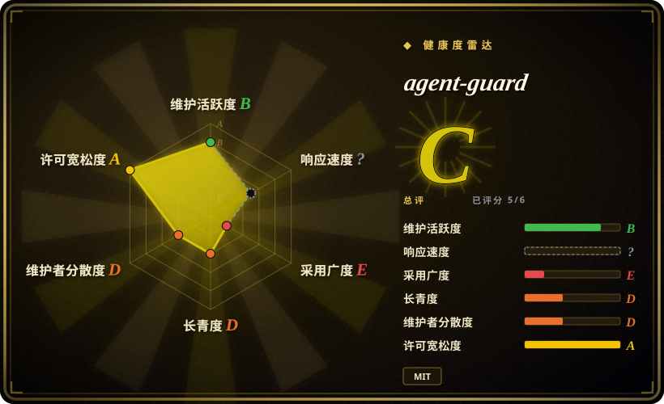
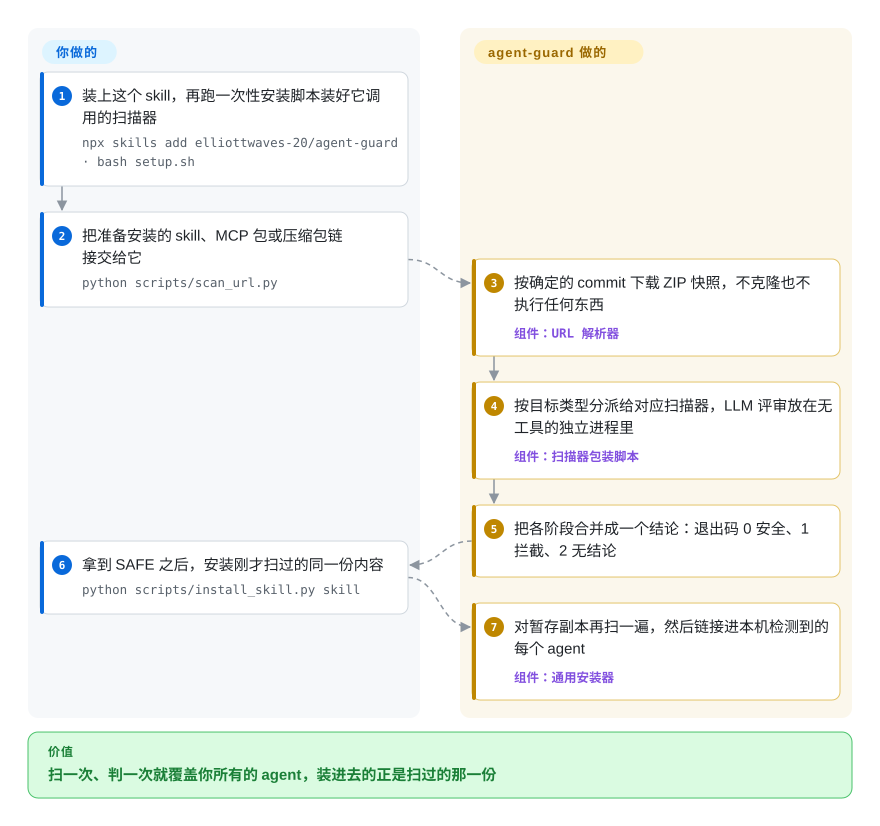

# agent-guard

你的 agent 说一句“我帮你把这个 skill 装上”，半分钟后，陌生人写的 `SKILL.md`、一个 npm 上的 MCP server、一段 `curl | bash` 安装脚本就都以你的账号身份跑起来了，而这三样东西各自需要一种你还没装好的安全扫描器。agent-guard 是一个 skill 加一组 Python 包装脚本：把不同类型的安装目标分派给现成的扫描器，再把结果收敛成一个答案（安全、拦截或无结论），自己不写任何检测逻辑；它只有一位作者、3 个 star，所以你信任的不只是背后的扫描器，还有这层包装本身。

## 何时使用

你同时用两三个编程 agent，上午 Claude Code，撞到限流就换 Codex，而且往每一个里都装第三方的东西：GitHub 仓库里的 skill、PyPI 上的 MCP server、agent 自己决定要装的命令行工具。你知道有 [SkillSpector](skillspector.zh.md)，但它管的是 skill 和静态源码；npm 包需要查恶意包的扫描器，release 里的二进制需要查哈希信誉，MCP server 的工具又要等它跑起来才注册。你现在实际的做法是敲一句 `npx skills add someone/something`，然后听天由命。你想要的是一条命令：不管别人给的是什么链接，它自己判断这是什么，在不先执行目标的前提下跑对应的扫描器，然后还给你一个 agent 能直接照办的退出码——`0` 安全，`1` 拦截，`2` 无结论。

agent-guard 在它调用的扫描器之上加的就是这层“分派加闸门”。相比单用 SkillSpector，它多覆盖了 MCP 包、npm/PyPI/Go/cargo 包、release 二进制和安装脚本；按固定 commit 下载，保证扫的和装的是同一份；还带一个安装器，把扫过的副本链接进本机所有 agent。相比 [Snyk Agent Scan](agent-scan.zh.md) 这类托管服务，它的判定逻辑留在本地、可以读，默认的 LLM 评审走你已经登录的编程 agent CLI，不用另开账号。代价是一条很深的工具链（uv、Python，一半的模式还要 Docker），以及一层由一个人维护、没有已知外部用户的包装。只有当你要从多种来源往多个 agent 里装东西，并且愿意自己读一遍、锁定这层包装时，才选它。

## 怎么用起来

可以把它想成海关的分拣台，而不是查验员：它自己不查任何东西，只决定每个包裹交给哪位查验员，并且只要有查验员没交回报告就不放行。你装上这个 skill，跑一次安装脚本；脚本用 `uv`（一个 Python 包与工具安装器）把锁定到某个确切 commit 的 SkillSpector 和 Cisco 的 mcp-scanner 装进各自隔离的工具环境。此后由你，或者由照着自带 `SKILL.md` 行事的 agent，把一个链接或包名交给包装脚本。脚本把 GitHub 仓库按某个 commit 下载成 ZIP 快照，而不是克隆（下载 ZIP 不会执行任何东西，克隆有可能），然后把 skill 和源码交给 SkillSpector，把 npm/PyPI/Go/cargo 包交给 Datadog GuardDog，把 release 二进制交给 VirusTotal 查哈希；如果你要求，还会把 MCP server 放进一个用完即弃、网络流量全程记录的 Docker 容器里跑起来，交给 Cisco 的扫描器看。对 npm 和 PyPI 包，它还会在 OpenSSF package-analysis 里真的安装一遍——那是一个沙箱，也就是包逃不出去的隔离环境，里面预先放了假凭据——再根据这个包碰过什么来判定。包装层自己的贡献是把这一切变成结论的那条规则：任何一个阶段拦截就算拦截；扫描器崩溃、超时或只检查了部分文件时，结论是“无结论”，绝不是“安全”。留给你的事：跑安装脚本并信任那套工具链，启动 Docker，为二进制扫描提供 VirusTotal 密钥，以及在结论不是 SAFE 时去读那些 finding。

<!-- flow-steps:begin (generated from flows/agent-guard.json by tools/flow_card.py — do not edit) -->

流程文字版

1. **你**：装上这个 skill，再跑一次性安装脚本装好它调用的扫描器 — `npx skills add elliottwaves-20/agent-guard · bash setup.sh`
2. **你**：把准备安装的 skill、MCP 包或压缩包链接交给它 — `python scripts/scan_url.py`
3. **agent-guard**：按确定的 commit 下载 ZIP 快照，不克隆也不执行任何东西 — 组件：`URL 解析器`
4. **agent-guard**：按目标类型分派给对应扫描器，LLM 评审放在无工具的独立进程里 — 组件：`扫描器包装脚本`
5. **agent-guard**：把各阶段合并成一个结论：退出码 0 安全、1 拦截、2 无结论
6. **你**：拿到 SAFE 之后，安装刚才扫过的同一份内容 — `python scripts/install_skill.py skill`
7. **agent-guard**：对暂存副本再扫一遍，然后链接进本机检测到的每个 agent — 组件：`通用安装器`

**价值**：扫一次、判一次就覆盖你所有的 agent，装进去的正是扫过的那一份

<!-- flow-steps:end -->

## 何时不用

- **你只扫 skill，或者需要带 SARIF 的 CI 闸门。** agent-guard 的 skill 扫描**就是**锁定在某个 commit 的 SkillSpector，外面包了大约 560 KB 的 Python；项目自己的 pin 文件写明，其中的预算适配器会修改 SkillSpector 的内部实现，每次上游发版都必须重新核对。直接用 [SkillSpector](skillspector.zh.md)：baseline 和 SARIF 都有，还少一层可能落后于上游或被上游发版弄坏的东西。
- **你想知道机器上已经装了什么，而且不想搭工具链。** agent-guard 有 `audit_installed.py` 做清点，但前提是整套扫描器已经装好，而且它不会在宿主机上启动已安装的 MCP server 去读实时的工具列表，运行时检查一律转进 Docker 沙箱。想一条命令清点所有 agent 并读取运行中的工具描述，用 [Snyk Agent Scan](agent-scan.zh.md)，同时接受它的分析是托管且闭源的。
- **你跑不了 Docker，或者跑不了特权容器。** 没有 Docker 时，npm 和 PyPI 扫描会以“无结论”收场，除非加 `--no-dynamic`；动态分析用 `--privileged --cgroupns=host` 启动 OpenSSF 的镜像；GuardDog 在 Windows 上只能通过 Docker 运行。在管控严格的笔记本或共享 CI runner 上，包的静态扫描直接原生调用 GuardDog（`DataDog/guarddog`），skill 用 SkillSpector，跳过这层包装。
- **被扫描的内容不能离开本机。** 默认情况下，LLM 评审会把文件内容发给当前登录的那个编程 agent CLI 的厂商；静态扫描仍会查询 OSV.dev；二进制扫描会把哈希发给 VirusTotal；动态分析阶段则是有意让被分析的包联网。`AGENT_GUARD_STATIC_ONLY=1` 只关掉 LLM 那一部分。要完全不联网的扫描，用 [claude-skill-audit](claude-skill-audit.zh.md)，它浅得多，但离线。
- **你要求扫描工具链本身可复现。** 它确实做了版本锁定，但只锁了一部分：SkillSpector 锁到 commit，OpenSSF 镜像和抓包镜像锁到 digest，`skills` CLI 锁到版本加 registry 摘要；而 Cisco 的 mcp-scanner 由 `setup.sh` 安装并升级到 PyPI 最新版，GuardDog 的 Docker 镜像默认用 `:latest` 标签（见 `scripts/scan_cli.py`），SkillSpector 的传递依赖也没有锁（README 自己承认）。如果审计方会问“这个结论是哪一版扫描器给出的”，请自己构建锁定版本的镜像，直接运行 GuardDog 和 Cisco 的扫描器。
- **你要在 agent 运行时拦住危险动作。** 安装前的结论管不了这个 skill 下周做什么；README 自己的局限表就列出了延时触发的代码、二段下载和全新的二进制都看不到。策略门控 tool call 用 [agent-governance-toolkit](agent-governance-toolkit.zh.md)；README 本身也建议再加一层安装期防火墙，比如 Socket Firewall（`SocketDev/sfw-free`）。
- **你需要一个有别人替它背书的依赖。** 3 个 star，0 个 fork，从未有人开过 issue 或 pull request，一个个人账号，仓库里没有 CI（截至 2026-10-08）。这个工具会改写每个 agent 的配置，还会启动特权容器；一旦那个唯一的账号被攻破，波及的是你整套 agent 环境。直接用上游扫描器，也就是 SkillSpector（NVIDIA）和 Cisco 的 mcp-scanner；或者只在一个你亲自读过的 commit SHA 上采用 agent-guard。
- **你在商业流程里用免费的 VirusTotal 密钥扫二进制。** README 注明公共 API 每分钟限 4 次查询，且仅限非商业用途。能力分析可以直接跑 malcontent（`chainguard-dev/malcontent`），或者购买 VirusTotal 授权。

本分类里还有两个扫描器：[Cisco MCP Scanner](mcp-scanner.zh.md)（也就是 agent-guard 自己调用的那个 MCP 运行时扫描器，只查 MCP 服务的话直接用它）和 [skills-scanner](skills-scanner.zh.md)；定选型之前先读一读。

## 横向对比

| 替代品 | 是否收录 | 我们的评价 | 取舍 |
|---|---|---|---|
| [SkillSpector](skillspector.zh.md) | ✅ | 只装 skill，或者扫描跑在 CI 里，就直接选 SkillSpector；同一道闸门还要管 MCP 包、命令行包、二进制和安装脚本，并且要把结果链接进多个 agent 时，才选 agent-guard。 | SkillSpector 是 NVIDIA 名下的引擎，自带 baseline 和 SARIF，中间没有包装层；agent-guard 多了分派、按 commit 下载和跨 agent 安装，代价是一层单人维护、紧跟 SkillSpector 内部实现、可能落后于其发版的代码。 |
| [Snyk Agent Scan](agent-scan.zh.md) | ✅ | 要一条命令、零准备地清点并评估各 agent 里**已经装好**的东西，选 Agent Scan；要给**新的**安装加一道判定逻辑可读、LLM 评审走自己 CLI 登录的闸门，选 agent-guard。 | Agent Scan 什么都能发现，由厂商维护，但结论来自 Snyk 闭源的托管接口，并且会启动它检查的 MCP server；agent-guard 把决定权留在本地、把目标关进沙箱，但需要 uv、Docker，以及你对一层没人评审过的包装的信任。 |
| [AI-Infra-Guard](../llm-eval/ai-infra-guard.zh.md) | ✅ | 团队想要一个部署起来、带 Web 界面、顺带覆盖模型服务已知 CVE 和越狱测试的平台，选 AI-Infra-Guard；想要一个嵌在 agent 安装步骤里、每个开发者各自跑的闸门，选 agent-guard。 | AI-Infra-Guard 是自托管服务，有自己的规则库和大量用户，但需要部署和运维；agent-guard 只是一个脚本目录，不用托管任何东西，也没有属于自己的检测能力可以兜底。 |
| GuardDog（`DataDog/guarddog`） | 未收录 | 目标只有 npm、PyPI、Go 或 cargo 包时，直接跑 GuardDog；还想要沙箱里的安装行为分析，并且和 skill、MCP 扫描共用同一套退出码约定时，agent-guard 这层才值得加。 | 单用 GuardDog 是一个有人维护的工具（Apache-2.0，截至 2026-10 约 1.2k star），finding 原样给出；agent-guard 把大部分 `capability-*` 命中降级为提示信息，并加了动态分析阶段，这有用，但那是包装层作者的判断，不是 Datadog 的。本批次标签页收录未添加。 |
| [Vercel Skills](../agent-tooling/harness-extensions/vercel-skills.zh.md) | ✅ | 来源可信、只需要把 skill 放进多个 agent 时，单用 `skills` CLI 就够；来源是陌生人的仓库时，在它前面加上 agent-guard。 | `skills` CLI 是广泛使用的分发工具，不做任何安全扫描；agent-guard 在给出结论之后调用的正是锁定版本的同一个 CLI，所以你为这道闸门付出的是扫描时间和工具链的重量。 |

## 技术栈

- **Python 包装脚本**（按 GitHub 语言统计约 564 KB，2026-10-08），位于 `scripts/`：每种目标一个入口，即 `scan_skill.py`、`scan_mcp.py`、`scan_cli.py`、`scan_url.py`，另有 `install_skill.py`、`audit_installed.py`，以及 LLM profile 和预算相关的辅助模块。没有包清单文件，脚本就在 skill 目录里原地运行。
- **一份 `SKILL.md`**（约 32 KB），告诉执行安装的 agent 何时触发扫描、怎么读退出码；正是它让这个项目成为 skill，而不只是一个命令行工具。
- **`setup.sh` / `setup.ps1`** 用 `uv tool install` 装好外部扫描器。
- **它调用的扫描器，没有一个是它自己的代码：** NVIDIA SkillSpector（skill、静态源码、安装脚本、crate 源码），Cisco mcp-scanner（MCP 运行时检查），Datadog GuardDog（npm/PyPI/Go/cargo），跑在 gVisor 里的 OpenSSF package-analysis（npm/PyPI 的动态安装分析），VirusTotal 和 malcontent（二进制）。
- **测试：** `tests/` 下 18 个文件，约 380 个 `def test_` 函数（2026-10-08 统计）；自带一个只要有测试被跳过就拒绝报绿的运行脚本。仓库里没有 CI workflow，所以这些测试只在有人手动运行的地方跑。

## 依赖

- **始终需要：** 运行包装脚本的 Python 3.10+，以及 `uv`；后者会拉取 SkillSpector 所需的 Python 3.12，并把 SkillSpector 和 Cisco 的 mcp-scanner 装进隔离的工具环境。
- **想让 skill 扫描覆盖完整：** PATH 上有一个已登录的 `claude`、`codex` 或 `gemini` CLI，或者一把托管 provider 的 API key。两者都没有时，扫描只跑静态部分，并在输出里说明。
- **运行中的 Docker：** 默认的 npm/PyPI 动态分析需要它（镜像约 1 GB，缓存卷会涨到几个 GB，特权容器），沙箱里的 MCP 运行时检查、Windows 上的 GuardDog 以及 `binary --deep` 也都需要。
- **密钥：** 二进制扫描要 VirusTotal API key；Cisco 的运行时扫描要另一套 LiteLLM 风格的 provider key 和模型，它没有走 CLI 登录的路径。
- **可选：** Node.js/`npx`，用于委托的 skill 分发和 npm 的 MCP server；Git 只在拿到 SAFE 之后的安装环节用到；带反爬校验的 marketplace 页面需要操作者自己配置一个页面渲染器。

## 运维难度

**中等，比“一个 skill”听上去要重。** 只扫 skill 很轻：一个安装脚本，一条命令。完整功能则不然：五个安装方式各不相同的外部扫描器，两套互相独立的 LLM 配置，一个必须处于运行状态的 Docker 守护进程，一个特权容器，几个 GB 的镜像和缓存，首次运行以分钟计。升级是一件需要专门去做的事：SkillSpector 的 pin 必须和包装层一起抬；项目自己的 changelog 就记着一次发版——抬了 pin 之后，某个报告字段的检查没跟上，直到后续修复才对齐（0.4.0，“reference gate”）。要有心理准备去读输出里的 `LIMIT:` 和 `NOTE:` 行，并处理“无结论”退出；按它的设计，链路上缺任何一环都会走到这里，所以这种情况很常见。

## 健康度与可持续性

- **维护（2026-10-08）：** 活跃，但是一阵一阵的。22 个 commit 分四批：2026-07-09（首次公开发布）、2026-09-05、2026-09-25、2026-09-29 至 30；三个 tag（v0.2.0、v0.3.0、v0.4.0），两个 GitHub release，最近一个在 2026-09-30。到目前为止作者跟 SkillSpector 跟得很紧：本页核对过，它锁定的 commit 正是 SkillSpector 的 `v2.12.0` tag，该版本比 agent-guard 0.4.0 早一周发布。
- **治理与 bus factor：** 一个 2025 年注册的个人账号，22 个 commit 全部出自这一位贡献者。没有 `CONTRIBUTING`，没有 `SECURITY.md`，没有 CI workflow。作者说明经过评审的自扫 baseline 保存在仓库之外，所以外人无法复现它发版前的自检。
- **采用度——接近于零，直说：** 3 个 star，0 个 fork，0 个 watcher，从未有人开过 issue 或 pull request，skills.sh 页面上总安装量为 2（均为 2026-10-08 数据）。3 个 star 的意思是：除了作者，没有已知的人拿这份代码对付过真实的恶意包、报告过漏检，或者评审过“把扫描器输出变成 SAFE”的那段逻辑。对一道安全闸门来说，这比对别的工具更要紧，因为它出错的方式是无声放行。仓库上填写的主页地址在 2026-10-08 抓取时返回 HTTP 404。
- **年龄与 Lindy：** 仓库创建于 2026-06-12，大约四个月。没有长寿先验可用；它还依赖五个上游工具保持兼容，一旦作者不再追它们的发版，它的价值就没了。
- **风险信号：** MIT（已读根目录 `LICENSE`），没有换许可证的历史，没有 open-core 分层。真正的风险是结构性的：一层去改已锁定扫描器内部实现的包装，两处没有锁版本的扫描器输入（Cisco 的包、GuardDog 的镜像标签），以及一个特权容器步骤。值得肯定的是 README 少见地坦率：它逐阶段写明了自己的检测局限，也解释了为什么别的扫描器会给这个 skill 本身报警。

## 存疑（未验证）

- [未验证] 本轮在 commit `1bc89bc` 的源码包里读了 README、`CHANGELOG.md`、`setup.sh` 和 `scripts/_pins.py`，并对其余脚本做了 grep（`scan_cli.py` 里 GuardDog 镜像的默认值、`_dynamic.py` 里的特权 `docker run`、`_skillspector.py` 里的纯静态开关）；没有安装或运行任何东西。因此这里描述的所有行为（fail-closed 合并、流量抓取、逐字节一致的副本校验、无工具的 LLM 子进程）都是作者的文档加上抽查到的源码行，不是实际观察到的一次扫描。
- [未验证] README 说 SkillSpector 有“71 vulnerability patterns across 17 categories”、VirusTotal 覆盖“70+ AV vendors”，这两处没有对照那两个项目核实。
- [未验证] “GuardDog 的 `capability-process-hooks` 规则已用 DataDog 自己的恶意包数据集验证过”是作者的说法；仓库里没有公开测试数据或结果。
- [未验证] 分发 CLI 支持的 agent 数量，README 正文写“80+”，quick start 写“70+”，两处自相矛盾，本页也没有去数。
- [推断] “可能落后于上游或被上游发版弄坏”是从 pin 文件自己的 docstring 和 0.4.0 changelog 里关于 reference gate 的那一条推出来的；没有复现过某个坏掉的版本。
- [推断] “维护者账号被攻破后的波及范围”一句，依据是文档所述脚本的行为（改写 agent 配置、启动特权容器）；并没有已知的事故。
- [未验证] skills.sh 上的安装量（2026-10-08 为 2）是该站自己的统计；看不到是谁装的，也无法判断这两次里有没有作者本人。
- [未验证] `CHANGELOG.md` 记有 0.3.1（2026-09-06），但没有对应的 git tag 或 GitHub release；它对应哪个 commit，本页没有查清。
- [未验证] 对 GuardDog、malcontent、Socket Firewall 和 OpenSSF package-analysis 的评价只依据 GitHub 元数据和 agent-guard 的 README，都没有在这里读到源码层面。对已收录替代品的评价依据的是它们在本索引里的页面。
- [未验证] changelog 把 0.2.0 版标在 2026-06-15，但公开的 git 历史从 2026-07-09 的“Initial public release”开始；在那之前存在过什么，看不到。
