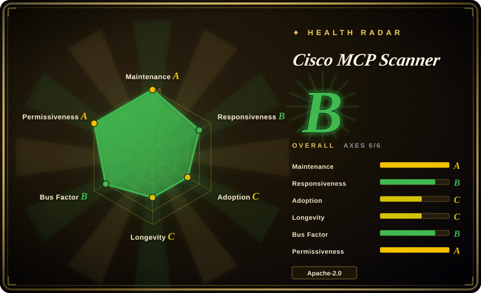
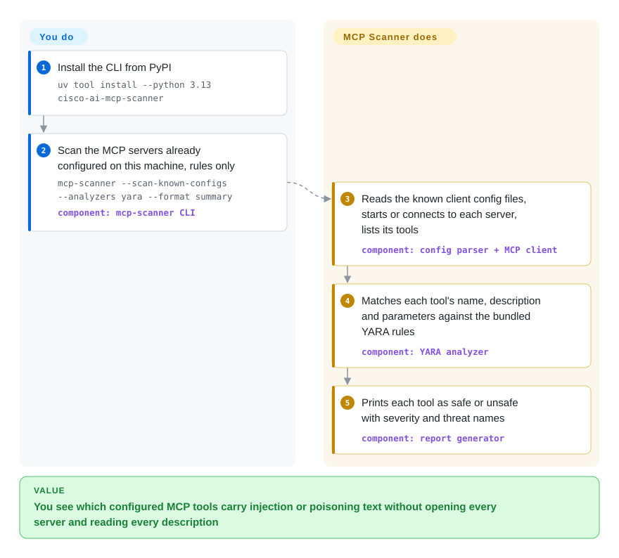

# Cisco MCP Scanner

You are about to add a stranger's MCP server to Cursor or Claude Desktop, and the only thing you will ever look at is a tool name like `add` — not the paragraph in its description telling the model to read your SSH key first. MCP Scanner connects to the server (or reads a saved tool list), pulls every tool, prompt and resource description, and checks them with pattern rules that run on your machine, plus an optional LLM pass and an optional Cisco cloud API, then lists which ones look hostile.

## When to use

You're the engineer who approves MCP servers for a team — or the one wiring a new server into your own editor — and the review you can realistically do is "the README looks fine". What the model actually obeys is text you never see: tool descriptions, prompt templates, resource bodies and the server's startup instructions. The README's own sample shows the gap: a tool called `execute_system_command` comes back as `Safe: No`, with `yara_analyzer: Severity: HIGH, Threat Names: SECURITY VIOLATION, SUSPICIOUS CODE EXECUTION`. Finding that by hand means starting each server and reading every description it advertises.

Reach for MCP Scanner when the target is **MCP servers specifically** and you want the rules on your side. The deciding tradeoff against [Snyk Agent Scan](agent-scan.md) is where the verdict is made: Agent Scan inventories fourteen agents and their skills but every verdict comes from Snyk's hosted, closed API; MCP Scanner's YARA rules, readiness heuristics and prompt templates ship inside the package, every API key is optional, and a `static` mode scans a saved `tools/list` JSON with no server and no network — which is what makes it usable in CI and in air-gapped review. Against skill scanners such as [SkillSpector](skillspector.md) the split is the artifact: those read `SKILL.md` bundles, this reads the MCP protocol surface and, with an LLM key, the server's source code. You pay for the openness with a narrower reach (four clients' config locations, no skills) and with the fact that the strongest engines are the ones that need a key.

## How it works

Think of a customs desk with three inspectors, of which only the first works for free. You point the CLI at a target — a URL, a command that starts a local server, a client config file, or a JSON file you saved earlier — and it speaks MCP (Model Context Protocol, the convention by which an agent discovers a server's tools) to collect every tool name, description and parameter schema, and optionally prompts, resources and the server's startup instructions. Each item then goes through the analyzers you selected. The YARA analyzer — YARA is a pattern-matching rule language borrowed from malware analysis — matches the text against ten bundled rule files (prompt injection, tool poisoning, credential harvesting, command injection and so on) entirely on your machine. The LLM analyzer sends the same text to a model you configure and asks whether it is malicious; the API analyzer sends it to Cisco's paid AI Defense service. A separate `behavioral` command reads a server's *source code* instead: it finds the tool functions, traces where their parameters flow, and asks the LLM whether what the code does matches what its description claims. What stays yours: choosing analyzers explicitly (the default set is `api,yara,llm`, two of which need keys), sandboxing the run when the server is untrusted — a stdio server is really started — and acting on the result, because the scanner only reports.

<!-- flow-steps:begin (generated from flows/mcp-scanner.json by tools/flow_card.py — do not edit) -->

Text version of the flow

1. **You**: Install the CLI from PyPI — `uv tool install --python 3.13 cisco-ai-mcp-scanner`
2. **You**: Scan the MCP servers already configured on this machine, rules only — `mcp-scanner --scan-known-configs --analyzers yara --format summary` — component: `mcp-scanner CLI`
3. **Cisco MCP Scanner**: Reads the known client config files, starts or connects to each server, lists its tools — component: `config parser + MCP client`
4. **Cisco MCP Scanner**: Matches each tool's name, description and parameters against the bundled YARA rules — component: `YARA analyzer`
5. **Cisco MCP Scanner**: Prints each tool as safe or unsafe with severity and threat names — component: `report generator`

**Value**: You see which configured MCP tools carry injection or poisoning text without opening every server and reading every description

<!-- flow-steps:end -->

## When NOT to use

- **The server config is untrusted and you have no sandbox.** Scanning a stdio server *launches its command* to ask for the tool list, and `known-configs` does that for every server in your client configs; the only interactive `input(` in the `mcpscanner/` package at v4.8.6 is the OAuth callback paste, so there is no per-server consent prompt. Run it inside a container or VM, or dump the tool list once in an isolated environment and use `static` on the JSON. If you want a per-server yes/no prompt, [Snyk Agent Scan](agent-scan.md) asks before starting each server.
- **You need a gate in front of live tool calls.** This is a point-in-time scanner: it reports, it does not block, pin or re-check when a server later changes its descriptions (open issue #267 asks for exactly that rescan trigger). For runtime policy enforcement use [agent-governance-toolkit](agent-governance-toolkit.md).
- **You expect to scan source code with no LLM key.** `behavioral`, `pypi-scan` and `npm-scan` all depend on an LLM for the alignment check; open issue #171 (2026-05) documents that there is no offline pattern-only path over a source directory, and the maintainer's answer so far is a still-open docs PR (#207) stating that behavioral scanning requires an LLM key. For zero-key static scanning of a code directory use a general static analyzer (Semgrep, not indexed here), or [SkillSpector](skillspector.md) with `--no-llm` when the artifact is a skill.
- **Your CI must fail the build on a finding out of the box.** In `cli.py` at v4.8.6 every `sys.exit` sits in an error branch (bad config, incomplete scan, Docker missing); an unsafe result prints and exits normally, and `--format` offers `raw`, `summary`, `detailed`, `by_tool`, `by_analyzer`, `by_severity` and `table` — the string "sarif" appears nowhere in the README, `docs/` or the package. You have to parse `--format raw` and decide yourself; since the October 2026 releases (PR #268) also treat `is_safe: null` and `status: partial` as "not scanned", not as clean. SkillSpector emits SARIF if your artifacts are skills.
- **Nothing may leave the machine but you run the defaults.** `--analyzers` defaults to `api,yara,llm`: with keys set, tool descriptions go to Cisco's AI Defense endpoint and to your LLM provider. Pass `--analyzers yara` (optionally `readiness`, `prompt_defense`) for a local-only run, or point the LLM analyzer at a local endpoint such as Ollama. The reverse trap also holds: with *no* keys, the server-wide scan path in `scanner.py` skips the API analyzer silently and the LLM analyzer with only a log warning, so a default run quietly becomes YARA-only while each tool still reads `completed`.
- **You want one command for everything an agent has installed.** Auto-discovery covers the config locations of Windsurf, Cursor, Claude Desktop (macOS and Windows only — the Linux list has no Claude entry) and VS Code, and skills are out of scope entirely. For a machine-wide inventory across many agents including skills use [Snyk Agent Scan](agent-scan.md); for a whole self-hosted AI estate (model servers with CVEs, MCP repos, skills) use [AI-Infra-Guard](../llm-eval/ai-infra-guard.md).
- **The servers are large Go/TypeScript codebases and you need coverage you can trust.** Open issue #231 (2026-08) reports `behavioral` returning tools from 2 of 64 Go files in `grafana/mcp-grafana`, missing programmatically registered Python tools, and finding zero tools in a TypeScript codebase that wraps the SDK in its own helper — each time with status `completed` and exit code 0; the npm doc states JS/TS gets lexical signals, not the Python dataflow analysis. Treat a clean behavioral result on non-Python code as "unknown", and compare the reported tool count with the server's real one.
- **YARA-only results will be read as a verdict.** The free tier of this tool is ten regex-style rule files: issues report false positives on ordinary forceful or restrictive wording (#235, closed 2026-09-29; #252, open), and an open PR (#256) documents an evasion by splitting signals across tool fields. Use it as a tripwire, with the LLM analyzer or a human as the second opinion.
- **You need the dependency tree of an `npx -y` server audited.** `vulnerable-package` wraps pip-audit and covers Python requirements only; whether packages resolved at launch time are inspected is an unanswered question in issue #254 (2026-09). Use a lockfile-based dependency scanner (OSV-Scanner or `npm audit`, neither indexed here) for that.

## Comparison

| Alternative | In index | Our verdict | Tradeoff |
|---|---|---|---|
| [Snyk Agent Scan](agent-scan.md) | ✅ | Pick Agent Scan when the first problem is finding everything installed across many agents, skills included, and a hosted verdict is acceptable; pick MCP Scanner when MCP servers must be checked with rules you can read, offline or from saved JSON in CI. | Agent Scan discovers 14 agents' configs and asks consent per server, but needs a Snyk account, sends descriptions out and hides its detectors; MCP Scanner keeps rules local and keys optional, but finds only four clients' configs, ignores skills, and its free engine is pattern matching. |
| [AI-Infra-Guard](../llm-eval/ai-infra-guard.md) | ✅ | Pick AI-Infra-Guard when the audit spans the whole self-hosted AI estate from a deployed platform with a web UI; pick MCP Scanner for a pip-installable CLI/SDK that checks one MCP server's live descriptions or a saved tool list. | A.I.G adds CVE fingerprinting of model servers, skill audits and jailbreak tests, but is a multi-container platform whose MCP audit is LLM-driven over source repositories; MCP Scanner is one Python package with a no-key rule path, and narrower. |
| [SkillSpector](skillspector.md) | ✅ | Pick SkillSpector when the thing being installed is an agent skill bundle and you want SARIF and baselines in CI; pick MCP Scanner when it is an MCP server, whose risk lives in protocol-level descriptions a skill scanner never fetches. | SkillSpector has a documented static-only mode over a directory and CI-ready output, but does not connect to MCP servers; MCP Scanner reads the live protocol surface, but its source-code analysis requires an LLM and it has no SARIF. |
| [agent-governance-toolkit](agent-governance-toolkit.md) | ✅ | Pick AGT when the requirement is to allow, deny and audit tool calls while the agent runs; pick MCP Scanner to vet a server before it is connected at all. | AGT enforces at runtime but has to be wired into your agent framework; MCP Scanner needs no integration and therefore stops nothing — a server that turns hostile after the scan is not caught. |
| cisco-ai-defense/skill-scanner | not indexed | Pick the sibling skill-scanner when the artifact is a skill and you want the same vendor's rules with a documented no-LLM default; pick MCP Scanner for MCP servers — the two do not overlap in input. | Same team and threat taxonomy, different input: skill-scanner works without an LLM by default (per issue #171's comparison), MCP Scanner's source path does not. Apache-2.0 LICENSE file, ~2.6k stars, last push 2026-10-05; not added in this tab batch. |

## Tech stack

- **Python ≥ 3.11.4 package** `cisco-ai-mcp-scanner` (setuptools), import name `mcpscanner`; console entries `mcp-scanner` (CLI) and `mcp-scanner-api` (FastAPI/uvicorn REST server). A PyInstaller spec and a macOS build workflow are in the repo.
- **MCP client**: the official `mcp` Python SDK (`mcp[cli]>=1.25.0`) over stdio, SSE and streamable HTTP, with bearer, custom-header and OAuth authentication.
- **Analyzers**: `yara-python` over ten bundled `.yara` rule files; LiteLLM (pinned `litellm==1.93.2`) for the LLM, behavioral, readiness-judge and meta analyzers; `httpx` for the Cisco AI Defense inspect API and VirusTotal hash lookups; `pip-audit` for Python dependency CVEs; optional OPA/Rego policies for readiness.
- **Source analysis**: Python `ast` plus tree-sitter grammars for JavaScript, TypeScript, Go, Java, Kotlin, C#, Ruby, Rust and PHP; control-flow, dataflow, taint and call-graph modules under `mcpscanner/core/static_analysis/`.
- **Extras in the repo**: a Claude Code plugin (nine slash commands plus one skill) that shells out to the CLI, and an `evals/` set of 141 deliberately malicious MCP server files.

## Dependencies

- **Python 3.11.4+ and `uv`** (the documented install path); `yara-python` and the tree-sitter grammars are compiled wheels pulled in as hard dependencies.
- **Nothing else for the rule path**: `--analyzers yara`, `readiness` and `prompt_defense` need no key and no service.
- **Optional, each unlocking one engine**: an LLM provider key or a local OpenAI-compatible endpoint (LLM, behavioral, package scans, meta-analyzer); a Cisco AI Defense subscription and API key (API analyzer); a VirusTotal key (binary hash lookups, free tier 4 requests/minute); Docker (the default sandbox for `pypi-scan` / `npm-scan`).
- **Whatever each scanned stdio server needs to start** (Node, Python, credentials in its env) — a server that cannot start within the 60-second default timeout is not scanned.

## Ops difficulty

**Low for an ad-hoc scan, medium as a pipeline control.** One `uv tool install` and one command gives a rule-based report. Making it a control takes work that the tool does not do for you: wrapping the JSON output in your own pass/fail logic, sandboxing stdio launches, budgeting LLM cost and latency per scan, pinning the scanner version (a patch release in the 4.8.x line introduced `is_safe: null`), tuning or supplying YARA rules to manage false positives, and — if you run `mcp-scanner-api` as a service — putting your own authentication in front of it.

## Health & viability

- **Maintenance (2026-10-08).** Active: last push 2026-10-07, 44 PyPI releases since 1.0.1 (2025-09-25) — four in July 2026, two in August, none in September, two in early October — and 5–11 commits on the default branch each month from 2025-12 through 2026-09. A LiteLLM CVE pin was merged on 2026-10-06 and released as v4.8.6 the next day (PR #270).
- **Governance / bus factor.** A single-vendor project: CODEOWNERS routes everything to one Cisco team, and one account holds 72 of the commits credited to the top twelve contributors (next: 14, 14, 7). External PRs are accepted — several open ones come from outside — but many sit for months (#110 since 2026-01, #194 since 2026-06).
- **Backing & Lindy.** Owned by the `cisco-ai-defense` organization, which also publishes skill-scanner; the scanner doubles as the on-ramp to Cisco's paid AI Defense product, which is both the reason it is funded and the reason the roadmap is Cisco's. About 12.5 months old (created 2025-09-24) × actively maintained ⇒ a weak Lindy prior carried by vendor backing, not age.
- **Adoption.** ~1.1k stars, 138 forks and 76,358 PyPI downloads in the last month per the measured health block (2026-10-08; a direct pypistats query the same day returned ~113k, and both count CI installs); issue reports describe real CI evaluation against third-party servers (#231). No list of production users was found.
- **Risk flags.** Open-core by engine rather than by license: the code is Apache-2.0 with no relicense history, but the API analyzer is a paid hosted service and the README ends with a sales link. 65 open issues and PRs, several of them correctness bugs in a security tool (silent under-count #231, multi-finding loss in JSON #198). A fast major-version clock — 1.0 to 4.8 in a year — means SDK and JSON consumers should pin.

## Caveats (unverified)

- [未验证] This pass read the README, `docs/` (architecture, behavioral, npm, virustotal, readiness), `pyproject.toml` and the PyPI `requires_dist`, SECURITY, CODEOWNERS, the Claude Code plugin tree, `evals/README.md`, the relevant parts of `cli.py`, `constants.py` and `scanner.py` from the default-branch tarball (2026-10-08), the referenced issues/PRs and GitHub/PyPI metadata. The tool was **not installed or run** — no sandbox for launching third-party servers was available to this pass.
- [未验证] Detection quality: `evals/README.md` shows an example run with a 95.7% detection rate on the repo's own 141 malicious samples using an LLM; that is the maintainers' sample output on their own positives, with no false-positive rate on benign servers. No independent benchmark was found, and reproducing it needs an LLM key and 30–60 minutes per the same README.
- [推断] "No consent prompt before launching stdio servers" rests on a grep of the whole `mcpscanner/` package at v4.8.6 (the only `input(` is the OAuth callback paste); not observed by running.
- [推断] "Findings do not change the exit code" rests on reading every `sys.exit` in `cli.py` at v4.8.6 (bad arguments, Docker missing, LLM not configured, package scan incomplete, and an exception during scanning); not confirmed by running a scan against a malicious server.
- [推断] "A keyless default run silently becomes YARA-only" rests on reading `_analyze_tool` in `scanner.py` at v4.8.6: the API branch runs only `if ... self._api_analyzer`, the LLM branch logs a warning when the analyzer is missing, and status is `completed` when no analyzer raised. The up-front key check (`_validate_analyzer_requirements`) is called only by the single-tool path. Not observed by running.
- [推断] The README says the prompt-defense analyzer "always runs by default", but the CLI builds the analyzer list only from `--analyzers` (default `api,yara,llm`) plus `--enable-meta`, and `scanner.py` runs prompt-defense only when it is in that list; the page therefore treats it as opt-in for CLI use. Not observed by running.
- [未验证] Documentation is internally inconsistent on language support: the README and the "Supported Languages" heading of `docs/behavioral-scanning.md` list ten languages, the same file's "Limitations" still says "Python Only", and `docs/architecture.md` describes finding `.py` files. The under-count in issue #231 is the reporter's account, not reproduced.
- [未验证] Data handling by Cisco's AI Defense inspect API (retention, training use) is governed by Cisco's commercial terms, which were not read; the VirusTotal analyzer's "hash lookup only, no upload by default" is the README's statement.
- [未验证] The YARA false-positive and evasion reports (#235, #252, #256) are issue and PR titles/bodies as filed and were not reproduced; #235 is closed, the other two were open on 2026-10-08.
- [未验证] Cisco skill-scanner's no-LLM default comes from issue #171's description, not from reading that repo; GitHub's API reports its license as `NOASSERTION` while its LICENSE file opens as Apache License 2.0 (checked 2026-10-08).
- [未验证] Stars, forks, open-issue, release and download counts are 2026-10-08 snapshots; PyPI downloads count installs, not distinct users; the two same-day readings (~76k and ~113k a month) were not reconciled, and how much of either is CI re-installs is unknown.
