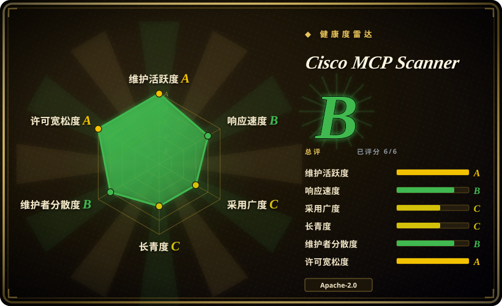
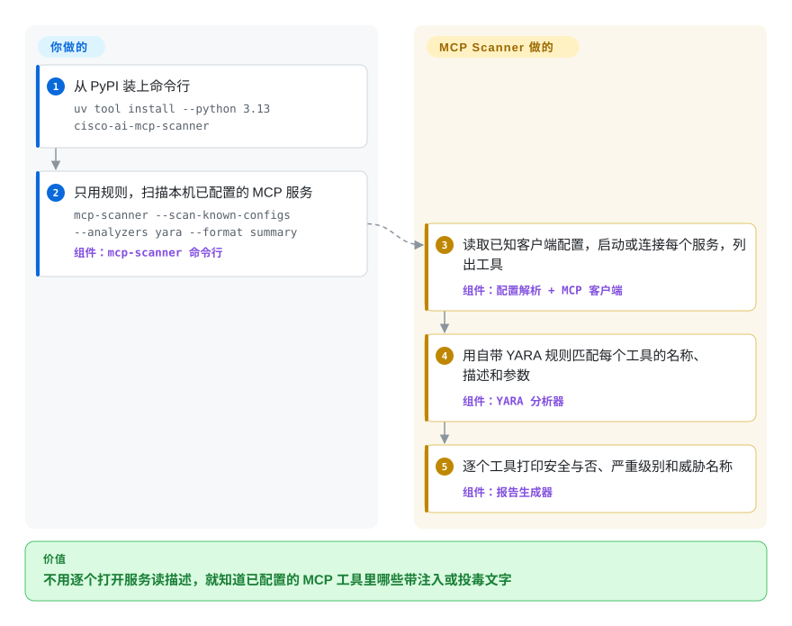

# Cisco MCP Scanner

你正要把一个陌生人写的 MCP 服务接进 Cursor 或 Claude Desktop，而你这辈子只会看到 `add` 这样的工具名——看不到它的描述里那段让模型“先读一下用户的 SSH 密钥”的话。MCP Scanner 连上这个服务（或者读一份事先存好的工具清单），把每个工具、提示词和资源的描述都拉下来，先用跑在你本机的模式规则查一遍，再可选地交给一个 LLM 和 Cisco 的云端接口各查一遍，最后列出哪些看起来不怀好意。

## 何时使用

你是替团队审批 MCP 服务的工程师，或者只是想给自己的编辑器接一个新服务，而你实际做得到的审查不过是“README 看着没问题”。模型真正听从的，是你从来看不到的文字：工具描述、提示词模板、资源正文，还有服务启动时下发的说明。README 自带的示例把这个落差摆了出来：一个叫 `execute_system_command` 的工具，扫描结果是 `Safe: No`，其中 `yara_analyzer: Severity: HIGH, Threat Names: SECURITY VIOLATION, SUSPICIOUS CODE EXECUTION`。靠人工找出这一条，得把每个服务都启动起来，再逐条读它对外宣告的描述。

当目标**就是 MCP 服务**，并且你希望规则握在自己手里时，用 MCP Scanner。它和 [Snyk Agent Scan](agent-scan.zh.md) 的决定性区别在于结论由谁给出：Agent Scan 能清点十四种 agent 及其 skill，但每个结论都来自 Snyk 托管的闭源接口；MCP Scanner 的 YARA 规则、就绪度启发式规则和提示词模板都打在安装包里，所有 API key 都是可选的，还有一个 `static` 模式，只读一份存好的 `tools/list` JSON，不需要服务在跑，也不需要网络——这正是它能放进 CI、能在隔离网络里做审查的原因。和 [SkillSpector](skillspector.zh.md) 这类 skill 扫描器相比，分界线是扫描对象：它们读的是 `SKILL.md` 包，这个工具读的是 MCP 协议层暴露的内容，配上 LLM key 之后还能读服务的源码。换来这份开放的代价是覆盖面更窄（只认四种客户端的配置位置，不管 skill），而且最强的几个引擎恰恰是要 key 的那几个。

## 怎么用起来

把它想成一个有三名检查员的海关柜台，其中只有第一名是免费上班的。你把命令行指向一个目标——一个网址、一条能启动本地服务的命令、一个客户端配置文件，或者一份你早先存下的 JSON——它就用 MCP（Model Context Protocol，agent 用来发现服务提供了哪些工具的约定）把每个工具的名称、描述和参数结构收集回来，还可以一并收集提示词、资源和服务的启动说明。接着每一项都要过一遍你选中的分析器。YARA 分析器——YARA 是从恶意软件分析领域借来的一种模式匹配规则语言——用自带的十个规则文件（提示注入、工具投毒、凭据窃取、命令注入等）在你的机器上完成匹配。LLM 分析器把同样的文字发给你配置的模型，问它这是不是恶意内容；API 分析器则把文字发给 Cisco 收费的 AI Defense 服务。另有一条独立的 `behavioral` 命令读的是服务的*源码*：它找出工具函数，追踪参数流向哪里，再让 LLM 判断代码实际做的事和描述里声称的是否一致。留给你的事：明确指定用哪些分析器（默认是 `api,yara,llm`，其中两个要 key），在服务不可信时把扫描放进沙箱——stdio 类服务是真的会被启动的——以及拿到结果后自己处置，因为扫描器只报告。

<!-- flow-steps:begin (generated from flows/mcp-scanner.json by tools/flow_card.py — do not edit) -->

流程文字版

1. **你**：从 PyPI 装上命令行 — `uv tool install --python 3.13 cisco-ai-mcp-scanner`
2. **你**：只用规则，扫描本机已配置的 MCP 服务 — `mcp-scanner --scan-known-configs --analyzers yara --format summary` — 组件：`mcp-scanner 命令行`
3. **Cisco MCP Scanner**：读取已知客户端配置，启动或连接每个服务，列出工具 — 组件：`配置解析 + MCP 客户端`
4. **Cisco MCP Scanner**：用自带 YARA 规则匹配每个工具的名称、描述和参数 — 组件：`YARA 分析器`
5. **Cisco MCP Scanner**：逐个工具打印安全与否、严重级别和威胁名称 — 组件：`报告生成器`

**价值**：不用逐个打开服务读描述，就知道已配置的 MCP 工具里哪些带注入或投毒文字

<!-- flow-steps:end -->

## 何时不用

- **服务配置不可信，而你又没有沙箱。** 扫描 stdio 类服务会*执行它的启动命令*来索取工具列表，`known-configs` 会对客户端配置里的每个服务都这么做；v4.8.6 的整个 `mcpscanner/` 包里唯一的交互式 `input(` 是粘贴 OAuth 回调地址，所以不存在逐个服务征求同意的提示。请在容器或虚拟机里运行，或者先在隔离环境里把工具列表导出一次，再对那份 JSON 用 `static`。想要逐个服务回答 y/n 的话，[Snyk Agent Scan](agent-scan.zh.md) 会在启动每个服务之前先问你。
- **你要的是拦在实时工具调用前面的闸门。** 这是一次性的时点扫描：只报告，不拦截、不锁定版本，服务事后改了描述也不会重新检查（未关闭的 issue #267 要的正是这个重扫触发器）。要运行时策略执行，用 [agent-governance-toolkit](agent-governance-toolkit.zh.md)。
- **你指望不配 LLM key 就能扫源码。** `behavioral`、`pypi-scan`、`npm-scan` 的一致性检查都依赖 LLM；未关闭的 issue #171（2026-05）记录了它没有针对源码目录的离线纯规则路径，维护者目前的回应只是一个仍未合并的文档 PR（#207），写明行为扫描需要 LLM key。要对代码目录做零 key 的静态扫描，用通用静态分析器（Semgrep，本索引未收录）；扫描对象是 skill 时，用加 `--no-llm` 的 [SkillSpector](skillspector.zh.md)。
- **你的 CI 必须开箱即用地在发现问题时让构建失败。** v4.8.6 的 `cli.py` 里，所有 `sys.exit` 都位于错误分支（配置错误、扫描不完整、缺少 Docker）；结果不安全时只是打印出来，然后正常退出。`--format` 的可选值是 `raw`、`summary`、`detailed`、`by_tool`、`by_analyzer`、`by_severity`、`table`——README、`docs/` 和整个包里都找不到“sarif”这个词。你得自己解析 `--format raw` 的输出再做判定；自 2026 年 10 月的版本（PR #268）起，还要把 `is_safe: null` 和 `status: partial` 当成“没扫到”，而不是“干净”。如果你的扫描对象是 skill，SkillSpector 能输出 SARIF。
- **任何数据都不能离开本机，而你却用了默认参数。** `--analyzers` 默认是 `api,yara,llm`：配了 key 之后，工具描述会发往 Cisco 的 AI Defense 接口和你的 LLM 服务商。只想本地运行，就显式传 `--analyzers yara`（可再加 `readiness`、`prompt_defense`），或者把 LLM 分析器指向 Ollama 这类本地端点。反过来的坑也存在：一个 key 都没配时，`scanner.py` 里整服务扫描的路径会悄悄跳过 API 分析器、只给 LLM 分析器记一条日志警告，于是默认运行实际上只剩 YARA，而每个工具的状态照样显示 `completed`。
- **你想一条命令查清 agent 装过的所有东西。** 自动发现只覆盖 Windsurf、Cursor、Claude Desktop（仅 macOS 和 Windows，Linux 的路径表里没有 Claude）和 VS Code 的配置位置，skill 完全不在范围内。要跨多种 agent、连 skill 一起清点整台机器，用 [Snyk Agent Scan](agent-scan.zh.md)；要覆盖整套自托管 AI 资产（带 CVE 的模型服务、MCP 仓库、skill），用 [AI-Infra-Guard](../llm-eval/ai-infra-guard.zh.md)。
- **被扫的服务是大型 Go 或 TypeScript 代码库，而你需要信得过的覆盖率。** 未关闭的 issue #231（2026-08）报告：对 `grafana/mcp-grafana` 运行 `behavioral`，64 个 Go 文件里只有 2 个的工具被识别出来，用程序方式注册的 Python 工具也被漏掉，一个用自家辅助函数包了一层 SDK 的 TypeScript 代码库更是一个工具都没找到——每次状态都是 `completed`、退出码都是 0；npm 文档也写明 JS／TS 走的是词法信号，没有 Python 那套数据流分析。非 Python 代码上的“干净”结果只能当“未知”，并且要拿它报告的工具数和服务真实的工具数对一下。
- **只跑 YARA 的结果会被人当成结论。** 这个工具免费的那一档就是十个偏正则风格的规则文件：有 issue 报告了对普通强硬或限制性措辞的误报（#235，已于 2026-09-29 关闭；#252，未关闭），还有一个未合并的 PR（#256）记录了把信号拆到不同工具字段里就能绕过的问题。把它当绊线用，再让 LLM 分析器或人来给第二意见。
- **你需要审计 `npx -y` 类服务的依赖树。** `vulnerable-package` 只是对 pip-audit 的封装，只管 Python 依赖；启动时才解析出来的包会不会被检查，是 issue #254（2026-09）里尚无答复的问题。这件事请用基于锁文件的依赖扫描器（OSV-Scanner 或 `npm audit`，本索引均未收录）。

## 横向对比

| 替代品 | 是否收录 | 我们的评价 | 取舍 |
|---|---|---|---|
| [Snyk Agent Scan](agent-scan.zh.md) | ✅ | 首要问题是把多种 agent 里装的东西（含 skill）全找出来，并且能接受托管判定时选 Agent Scan；MCP 服务必须用你读得到的规则检查，或要在 CI 里离线、对存好的 JSON 检查时选 MCP Scanner。 | Agent Scan 能发现 14 种 agent 的配置，并逐个服务征求同意，但需要 Snyk 账号、描述会外传、检测器不公开；MCP Scanner 规则在本地、key 全可选，但只找四种客户端的配置，不管 skill，免费引擎只是模式匹配。 |
| [AI-Infra-Guard](../llm-eval/ai-infra-guard.zh.md) | ✅ | 审计范围是整套自托管 AI 资产，并且愿意部署一个带网页界面的平台时选 AI-Infra-Guard；只想用一个 pip 能装的命令行或 SDK 检查某个 MCP 服务的实时描述或一份存好的工具清单时选 MCP Scanner。 | A.I.G 多出模型服务的 CVE 指纹识别、skill 审计和越狱测试，但它是多容器平台，MCP 审计是由 LLM 驱动、针对源码仓库的；MCP Scanner 只是一个 Python 包，有不要 key 的规则路径，范围更窄。 |
| [SkillSpector](skillspector.zh.md) | ✅ | 要装的东西是 agent skill 包，并且想在 CI 里用 SARIF 和基线时选 SkillSpector；要装的是 MCP 服务时选 MCP Scanner，因为它的风险藏在协议层的描述里，skill 扫描器根本不会去取。 | SkillSpector 有文档写明的纯静态目录扫描模式和可直接进 CI 的输出，但不会去连 MCP 服务；MCP Scanner 读得到实时的协议内容，但源码分析离不开 LLM，也没有 SARIF。 |
| [agent-governance-toolkit](agent-governance-toolkit.zh.md) | ✅ | 要求在 agent 运行时放行、拒绝并审计工具调用时选 AGT；想在服务接入之前先把它审一遍时选 MCP Scanner。 | AGT 在运行时执行策略，但必须接进你的 agent 框架；MCP Scanner 不需要任何集成，因此也拦不住任何东西——扫描之后才变坏的服务它抓不到。 |
| cisco-ai-defense/skill-scanner | 未收录 | 扫描对象是 skill，并且想用同一家厂商的规则、默认不依赖 LLM 时选同门的 skill-scanner；扫描对象是 MCP 服务时选 MCP Scanner——两者的输入并不重叠。 | 同一个团队、同一套威胁分类，输入不同：skill-scanner 默认不需要 LLM（依据 issue #171 里的对比），MCP Scanner 的源码路径则需要。LICENSE 文件是 Apache-2.0，约 2.6 千星，最近一次推送 2026-10-05；本批未收录。 |

## 技术栈

- **Python ≥ 3.11.4 包** `cisco-ai-mcp-scanner`（setuptools 构建），导入名 `mcpscanner`；命令行入口 `mcp-scanner` 和 `mcp-scanner-api`（基于 FastAPI 与 uvicorn 的 REST 服务）。仓库里还有 PyInstaller 配置和一个 macOS 构建工作流。
- **MCP 客户端**：官方 `mcp` Python SDK（`mcp[cli]>=1.25.0`），支持 stdio、SSE 和 streamable HTTP，认证方式有 bearer、自定义请求头和 OAuth。
- **分析器**：`yara-python` 加十个自带的 `.yara` 规则文件；LiteLLM（锁定为 `litellm==1.93.2`）供 LLM、行为、就绪度裁判和元分析器使用；`httpx` 用来调用 Cisco AI Defense 的 inspect 接口和 VirusTotal 的哈希查询；`pip-audit` 查 Python 依赖的 CVE；就绪度检查可选接 OPA／Rego 策略。
- **源码分析**：Python 的 `ast`，加上 JavaScript、TypeScript、Go、Java、Kotlin、C#、Ruby、Rust、PHP 的 tree-sitter 语法；`mcpscanner/core/static_analysis/` 下有控制流、数据流、污点和调用图模块。
- **仓库里的附带物**：一个 Claude Code 插件（九条斜杠命令加一个 skill），内部调用这个命令行；以及 `evals/` 下 141 个故意写成恶意的 MCP 服务样本。

## 依赖

- **Python 3.11.4 以上和 `uv`**（文档给出的安装方式）；`yara-python` 和各 tree-sitter 语法是作为硬依赖装进来的编译型 wheel。
- **规则路径不再需要别的东西**：`--analyzers yara`、`readiness`、`prompt_defense` 不要 key，也不依赖任何服务。
- **可选项，每项解锁一个引擎**：LLM 服务商的 key 或一个兼容 OpenAI 接口的本地端点（LLM、行为分析、包扫描、元分析器）；Cisco AI Defense 订阅和 API key（API 分析器）；VirusTotal key（二进制哈希查询，免费档每分钟 4 次请求）；Docker（`pypi-scan`／`npm-scan` 的默认沙箱）。
- **每个被扫的 stdio 服务自己启动所需的一切**（Node、Python、环境变量里的凭据）——在默认 60 秒超时内启动不起来的服务不会被扫描。

## 运维难度

**临时扫一次很低，做成流水线里的控制点是中等。** 一条 `uv tool install` 加一条命令就能拿到基于规则的报告。把它变成控制点，有一堆工具不替你做的事：给 JSON 输出包一层自己的通过／失败逻辑，给 stdio 启动加沙箱，为每次扫描预留 LLM 的费用和耗时，锁定扫描器版本（4.8.x 的一个补丁版本就引入了 `is_safe: null`），调整或自备 YARA 规则来压误报，以及——如果把 `mcp-scanner-api` 当服务跑——在它前面自己加认证。

## 健康度与可持续性

- **维护（2026-10-08）。** 活跃：最近一次推送是 2026-10-07，自 1.0.1（2025-09-25）起共 44 个 PyPI 版本——2026 年 7 月四个、8 月两个、9 月没有、10 月初两个——默认分支从 2025-12 到 2026-09 每月有 5–11 次提交。一次 LiteLLM 的 CVE 版本锁定在 2026-10-06 合并，次日作为 v4.8.6 发布（PR #270）。
- **治理与 bus factor。** 单一厂商项目：CODEOWNERS 把所有文件都指给 Cisco 的一个团队，在前十二名贡献者名下的提交里，一个账号占了 72 次（其后是 14、14、7）。外部 PR 是接受的——未合并的 PR 里有好几个来自外部——但不少一放就是几个月（#110 从 2026-01 起，#194 从 2026-06 起）。
- **背书与 Lindy。** 归 `cisco-ai-defense` 组织所有，该组织还发布了 skill-scanner；这个扫描器同时是 Cisco 收费产品 AI Defense 的入口，这既是它有人出钱维护的原因，也是路线图由 Cisco 说了算的原因。仓库约 12.5 个月大（创建于 2025-09-24），并且在积极维护，所以 Lindy 先验偏弱，撑着它的是厂商背书而不是年龄。
- **采用。** 约 1.1 千星、138 个 fork，按机器计算的健康度区块，最近一个月 PyPI 下载 76,358 次（2026-10-08；同一天直接查 pypistats 得到的是约 11.3 万次，两者都包含 CI 安装）；issue 里有人描述了拿它在 CI 里评估第三方服务的真实经历（#231）。没有找到生产用户名单。
- **风险信号。** 它的 open-core 不体现在许可证上，而体现在引擎上：代码是 Apache-2.0，没有改许可证的历史，但 API 分析器是收费的托管服务，README 结尾是一个销售链接。未关闭的 issue 和 PR 共 65 个，其中有几个是安全工具里的正确性缺陷（静默漏数 #231、JSON 里丢失多条发现 #198）。主版本号走得很快——一年内从 1.0 到 4.8——所以用 SDK 或解析 JSON 的一方应当锁定版本。

## 存疑（未验证）

- [未验证] 本次读了 README、`docs/`（architecture、behavioral、npm、virustotal、readiness）、`pyproject.toml` 和 PyPI 的 `requires_dist`、SECURITY、CODEOWNERS、Claude Code 插件目录、`evals/README.md`，默认分支源码包（2026-10-08）里 `cli.py`、`constants.py`、`scanner.py` 的相关部分，被引用的 issue 与 PR，以及 GitHub 和 PyPI 的元数据。工具本身**没有安装，也没有运行**——这一轮没有可用来启动第三方服务的沙箱。
- [未验证] 检测质量：`evals/README.md` 里有一段示例输出，显示用 LLM 在仓库自带的 141 个恶意样本上达到 95.7% 的检出率；那是维护者在自己的正样本上的示例输出，没有给出在正常服务上的误报率。没有找到独立基准；按同一份 README，复现需要 LLM key 和 30–60 分钟。
- [推断] “启动 stdio 服务之前没有征求同意的提示”依据的是在 v4.8.6 整个 `mcpscanner/` 包里的搜索（唯一的 `input(` 是粘贴 OAuth 回调地址）；没有通过实际运行观察。
- [推断] “发现问题不会改变退出码”依据的是逐个读了 v4.8.6 `cli.py` 里的每一处 `sys.exit`（参数错误、缺少 Docker、未配置 LLM、包扫描不完整、扫描中抛出异常）；没有拿一个恶意服务实际跑一遍来确认。
- [推断] “没配 key 的默认运行会悄悄变成只跑 YARA”依据的是 v4.8.6 `scanner.py` 里的 `_analyze_tool`：API 分支只在 `self._api_analyzer` 存在时才跑，LLM 分支在分析器缺失时只记一条警告，没有分析器抛错时状态就是 `completed`；预先检查 key 的 `_validate_analyzer_requirements` 只被单工具扫描路径调用。没有通过实际运行观察。
- [推断] README 说 prompt-defense 分析器“默认总会运行”，但命令行只根据 `--analyzers`（默认 `api,yara,llm`）和 `--enable-meta` 组装分析器列表，`scanner.py` 也只在列表里有它时才运行；所以本页把它当成命令行下需要显式开启的选项。没有通过实际运行观察。
- [未验证] 文档在语言支持上自相矛盾：README 和 `docs/behavioral-scanning.md` 的“Supported Languages”一节列了十种语言，同一文件的“Limitations”里仍写着“Python Only”，`docs/architecture.md` 描述的也是查找 `.py` 文件。issue #231 里的漏数是报告者的说法，没有复现。
- [未验证] Cisco AI Defense inspect 接口怎么处理数据（保留多久、是否用于训练）由 Cisco 的商业条款决定，条款没有读；VirusTotal 分析器“只查哈希、默认不上传文件”是 README 的说法。
- [未验证] YARA 的误报和绕过报告（#235、#252、#256）取自 issue 和 PR 的标题与正文，没有复现；#235 已关闭，另外两个在 2026-10-08 仍未关闭。
- [未验证] Cisco skill-scanner 默认不依赖 LLM 这一点来自 issue #171 里的描述，没有读那个仓库；GitHub 接口把它的许可证报告为 `NOASSERTION`，而它的 LICENSE 文件开头是 Apache License 2.0（2026-10-08 核对）。
- [未验证] star、fork、未关闭 issue 数、版本数和下载量都是 2026-10-08 的快照；PyPI 下载量统计的是安装次数而不是独立用户；同一天的两个读数（约 7.6 万和约 11.3 万次／月）没有核对清楚，其中多少是 CI 反复安装也不得而知。
