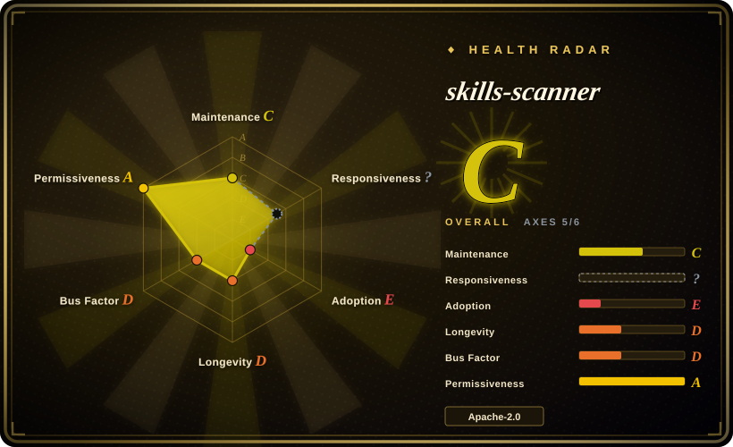
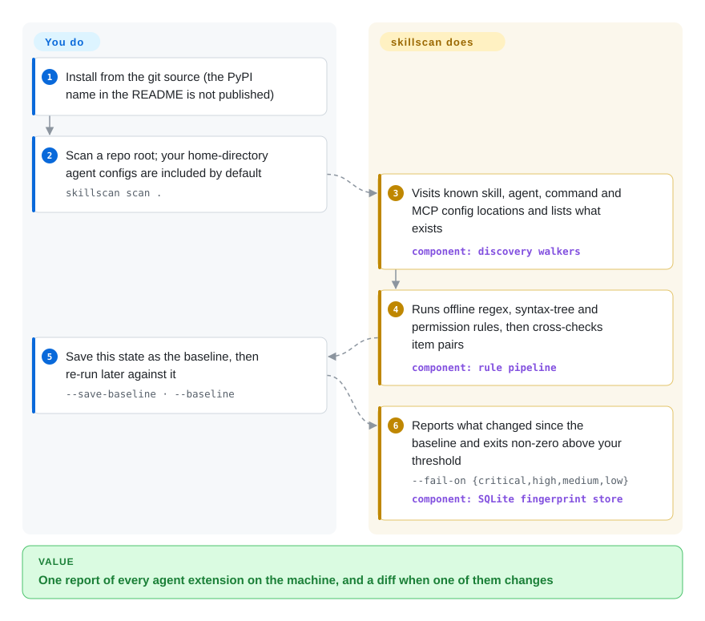

# skills-scanner

Your laptop has collected agent skills, slash commands and MCP servers across Claude Code, Claude Desktop, Cursor and Windsurf, and nobody can list them, let alone say which one quietly gained a `curl | bash` installer last week. `skillscan` walks those known config locations in one pass, runs offline pattern rules over what it finds, and remembers a fingerprint of each item so the next run can tell you what changed.

## When to use

You are the one person on a small team who gets asked "what agent extensions are actually installed on our machines?" You do not have a single suspect skill to vet; you have an inventory problem. A developer's home directory holds `~/.claude/skills/`, marketplace plugins, `~/.cursor/mcp.json`, a Claude Desktop config, and each repo adds its own `.mcp.json`. A finding you would want to see looks like `allowed-tools: "*"` in a skill's frontmatter, or an MCP server declared with a bare `"url": "https://…/sse"` and no auth. You run `skillscan scan .` and get one JSON, Markdown or SARIF report covering every location it knows, with a non-zero exit code when `--fail-on high` is crossed.

The deciding tradeoff against [SkillSpector](skillspector.md) and Cisco's `skill-scanner` is breadth of *where it looks* versus depth of *how hard it looks*. Those tools take one skill bundle and analyse it deeply, optionally with an LLM. This one takes a machine or a repo, enumerates skills plus agents, commands, `CLAUDE.md`, settings files and MCP server entries, and adds two things the single-bundle scanners do not centre on: a SQLite baseline that reports drift between runs (`--save-baseline` then `--baseline`), and a cross-item check that flags a skill reading `~/.ssh` sitting next to something with network egress. It also has no runtime dependencies at all, so it runs anywhere Python 3.11 does. Reach for it as a readable, forkable reference for that inventory-and-drift shape, not as a maintained product: the repository has been silent since 2026-05-21 (see Health & viability).

## How it works

Think of it as a stock-take, not a lab test. The scanner has a hard-coded list of places where agent tooling keeps its files, and it visits each one: skill folders (a skill is a directory with a `SKILL.md` instruction file that an agent loads on demand), agent and slash-command definitions, `CLAUDE.md`, settings files, and the JSON files where MCP servers are declared (MCP servers are the external tool processes an agent is allowed to call). Each item found becomes a record, and every record is pushed through a fixed pipeline of offline checks: regular expressions for shell droppers and API-key shapes, a walk of the Python syntax tree (the parsed structure of the code, so `subprocess` calls are found even when spread across lines), hidden-character detection, and metadata rules on the skill's declared tool permissions. Nothing is executed and, by default, nothing leaves the machine. What the scanner does for you is discovery, rules, the local SQLite fingerprint baseline, and report formatting. What stays with you is installing it from source, deciding which severity fails a build, triaging the hits (there is no suppression or ignore mechanism in the code), and scheduling the re-runs. Three opt-in extras call out: a VirusTotal hash lookup, a YARA rule pack you supply, and `--judge`, which sends text to the Anthropic API. The `agent` and `push` subcommands post results to an "HTS-ASPM" endpoint, a sibling product whose server is not in this repository.

<!-- flow-steps:begin (generated from flows/skills-scanner.json by tools/flow_card.py — do not edit) -->

Text version of the flow

1. **You**: Install from the git source (the PyPI name in the README is not published)
2. **You**: Scan a repo root; your home-directory agent configs are included by default — `skillscan scan .`
3. **skills-scanner**: Visits known skill, agent, command and MCP config locations and lists what exists — component: `discovery walkers`
4. **skills-scanner**: Runs offline regex, syntax-tree and permission rules, then cross-checks item pairs — component: `rule pipeline`
5. **You**: Save this state as the baseline, then re-run later against it — `--save-baseline · --baseline`
6. **skills-scanner**: Reports what changed since the baseline and exits non-zero above your threshold — `--fail-on {critical,high,medium,low}` — component: `SQLite fingerprint store`

**Value**: One report of every agent extension on the machine, and a diff when one of them changes

<!-- flow-steps:end -->

## When NOT to use

- **You need something that will still be maintained next quarter.** All 11 commits landed between 2026-05-13 and 2026-05-21 from one account, and nothing has moved since. Use [SkillSpector](skillspector.md) (NVIDIA, active) or Cisco's `skill-scanner` (active, published on PyPI as `cisco-ai-skill-scanner`) when the scanner is a control you will depend on. Agent attack patterns change monthly; a frozen rule set ages fast.
- **You want to `pip install` it.** The README's `pip install skills-scanner` fails: that name returns 404 on PyPI (checked 2026-10-08). Worse, `pip install skillscan` succeeds and installs an unrelated project by a different author. You must install from the git source. If a registry-published, version-pinned scanner is a requirement, use SkillSpector or `cisco-ai-skill-scanner` instead.
- **You are vetting one downloaded skill before installing it.** Discovery only looks at fixed layouts (`<root>/.claude/skills/`, `~/.claude/skills/`, marketplace plugin folders). A loose skill directory, a zip or a GitHub URL is not a valid target. Use SkillSpector, which takes a single target and returns an install recommendation.
- **Your skills live outside `.claude/`.** Despite the repo description naming Codex and Gemini, the code has no walker for `~/.codex/`, `~/.gemini/`, `.agents/skills/` or Cursor rules; "Codex / Gemini" coverage is only a generic `<root>/.mcp.json` / `mcp.json` read. Cline discovery is macOS-only and Windsurf is user-level only. For Codex- and Cursor-format skills, Cisco's `skill-scanner` states support for both.
- **You need semantic detection of prompt injection.** The default pipeline is regex and AST. The optional `--judge` reads only a skill's description plus the first 2,000 characters of its body, uses a hard-coded model id, and silently falls back to a six-phrase keyword stub on any API error. For LLM-driven multi-stage audits use [AI-Infra-Guard](../llm-eval/ai-infra-guard.md) or SkillSpector's LLM mode.
- **Your MCP configs hold secrets and you were about to enable `--judge`.** For MCP servers the judge concatenates every string value in the server's config entry, which includes `env` values, and sends that to the Anthropic API. Keep `--judge` off, or scan with SkillSpector's `--no-llm`.
- **You want to block a dangerous tool call while the agent runs.** This is a static file scanner. Use [agent-governance-toolkit](agent-governance-toolkit.md) for policy-gated tool calls and audit at runtime.
- **You need CVE matching on dependencies or on the AI services themselves.** There is no vulnerability database here. Use AI-Infra-Guard for service CVEs or SkillSpector for OSV dependency lookups.
- **You need a trustworthy reputation feed.** `--reputation` matches three hard-coded substrings, one of which flags any skill whose description contains the word "exfiltrate" as suspicious, so a legitimate security skill trips it. Treat it as a hook for your own registry file (`SKILLSCAN_REPUTATION_REGISTRY`), not as threat intelligence.
- **You want fleet reporting out of the box.** `skillscan agent` requires `--aspm-url`, and the SIEM mirror only fires alongside that post. Without an HTS-ASPM server, run `skillscan scan --format sarif` from cron or CI and upload the SARIF to a code-scanning tool you already operate.

## Comparison

Two neighbours added to this index on the same day belong in the same decision: Snyk's [agent-scan](agent-scan.md) (a security scanner for AI agents, MCP servers and agent skills whose verdict engine is hosted by Snyk) and [claude-skill-audit](claude-skill-audit.md) (a one-command, zero-dependency audit of a whole Claude Code setup: skills, agents, hooks, permissions and MCP configs). Both overlap this project's scope directly. Read their pages before choosing this one for anything you intend to keep.

| Alternative | In index | Our verdict | Tradeoff |
|---|---|---|---|
| [SkillSpector](skillspector.md) | ✅ | When the question is "is this one skill safe to install?", pick SkillSpector: it takes a single target, has an active NVIDIA team behind it, and adds LLM review plus OSV lookups. Pick skills-scanner only when you want a machine-wide inventory with drift between runs and can own the code yourself. | SkillSpector brings a heavy dependency tree and optional LLM egress; skills-scanner is zero-dependency and offline by default, but shallow, unpublished and unmaintained. |
| cisco-ai-defense/skill-scanner | not indexed | For a depended-on CI gate over Codex-, Cursor- or Claude-format skills, pick Cisco's scanner: it is actively pushed (2026-10-05), installable from PyPI, and publishes false-positive rates for its presets. skills-scanner's own README concedes Cisco's static analysis is deeper. | Cisco scans skill bundles and does not centre on MCP config inventory, SQLite drift baselines or alert fan-out; you give those up for depth and maintenance. Not added in this tab batch. |
| [AI-Infra-Guard](../llm-eval/ai-infra-guard.md) | ✅ | When the audit must cover live AI services and their CVEs as well as MCP servers and skills, pick AI-Infra-Guard. Pick skills-scanner when you only need a no-server, no-model sweep of local config files. | AI-Infra-Guard needs a Docker deployment and an LLM key for its skill and MCP audits; skills-scanner is a single CLI with no model, and correspondingly weaker at judging intent. |
| [agent-governance-toolkit](agent-governance-toolkit.md) | ✅ | When the risk is what the agent does at run time, pick agent-governance-toolkit; a file scan finds a wildcard permission but cannot stop the call it enables. Use skills-scanner, if at all, as the inventory step before runtime policy. | The toolkit is a broad runtime stack to integrate and operate; skills-scanner is a one-shot static report with no enforcement. |

## Tech stack

- **Pure Python, standard library only.** `pyproject.toml` declares `dependencies = []` and `requires-python = ">=3.11"`; HTTP calls use `urllib`, the baseline uses `sqlite3`, argument parsing uses `argparse`. About 6,100 lines under `src/skillscan/`.
- **Rule modules** under `rules/`: frontmatter, hidden characters, secrets (10 regex patterns), shell and Python static patterns, MCP config rules, capability scoring, Python AST deep scan, a regex pass for JS/TS, `.pyc` integrity, plus opt-in YARA and VirusTotal modules.
- **Cross-item logic** in `collusion.py` (exfiltration pairs, shared MCP servers, tool-permission union) and `store.py` (SQLite fingerprints for drift).
- **Outputs:** JSON, Markdown, SARIF 2.1.0, and a self-contained HTML dashboard. Alert senders for Slack, Teams, PagerDuty and Opsgenie; formatters for Splunk HEC, Elastic ECS and Microsoft Sentinel.
- **Tests:** 152 `unittest` functions across 11 files; CI matrix on Python 3.11–3.13, Ubuntu and macOS.

## Dependencies

- **Runtime:** Python 3.11 or newer. Nothing else is required.
- **Install path:** from the git repository. There is no PyPI package and no GitHub release; the only tag is `v0.1.0`, while `pyproject.toml` says `0.2.0` and the package's `__version__` says `0.1.0`.
- **Optional, each off unless you supply it:** `yara-python` plus your own `.yar` rule files; `VIRUSTOTAL_API_KEY` (sends SHA-256 hashes of bundled binaries to VirusTotal); `anthropic` SDK plus `ANTHROPIC_API_KEY` and `--judge` (sends skill and MCP text to Anthropic).
- **Local state:** a SQLite baseline file under the user home directory unless `--db` is given.
- **For `agent` / `push`:** an HTTP endpoint speaking the payload in `docs/hts_aspm_protocol.md`. No server implementation ships here.

## Ops difficulty

**Low to run, high to rely on.** A scan is one command with no services, and the SARIF output drops into existing code-scanning pipelines. The cost is everything around it: you install from a git commit you pin yourself, there is no suppression file so every accepted finding re-appears on each run, baselines are keyed on the absolute scan-root path (so CI runners with changing workspace paths need a fixed `--db` and path), and nobody upstream will update the rules. Budget for owning a fork.

## Health & viability

- **Maintenance (2026-10-08): dormant.** Created 2026-05-13; 11 commits, the last on 2026-05-21; no push in the four and a half months since. One tag (`v0.1.0`), zero GitHub releases, no PyPI publication. The last CI run on `main` passed.
- **Governance / bus factor: one account.** Ten pull requests, all opened and merged by the same contributor within eight days, with titles `S1`…`S10` that read as a planned build-out rather than community development. No external issues, no forks.
- **Backing: unclear, and the signals point away from investment.** The repo was built under the `HTS-ASPM` organisation ("HTS Consulting" in `pyproject.toml`) and now resolves to `HTS-Sleeping-Place`, an organisation created 2026-07-09 with no description. The README's links still point at the old owner, and the sibling `aibom` it says it pairs with has likewise moved to a different organisation. We read the move as the project being parked [推断].
- **Age / Lindy: fails on both halves.** Under five months old *and* inactive; there is no track record to extrapolate from.
- **Adoption: none measurable.** 1 star, 0 forks, 0 watchers as of 2026-10-08. No registry package means no download signal either.
- **Risk flags:** install-name collision on PyPI (see When NOT to use); a README comparison table against Cisco's scanner that we did not verify and that describes a tool which has since moved on; marketing breadth (Codex, Gemini) not matched by the code. License is clean: Apache-2.0 in `LICENSE` and `pyproject.toml`.
- **Verdict:** a competent, readable design sketch for inventory-plus-drift scanning. Use it as a pattern source or fork it deliberately; do not adopt it as a dependency you expect someone else to keep current.

## Caveats (unverified)

- [未验证] We read the source, tests, manifest and CI config but did not install or execute `skillscan`; behaviour described here (exit codes, the judge fallback, what the judge sends) is from code reading, not from a run. Reason: batch policy keeps downloaded code unexecuted.
- [未验证] The README's capability table against Cisco AI Defense `skill-scanner` ("partial", "no") was not checked row by row; Cisco's current README describes features (LLM judge, CEL decision layer, Codex and Cursor formats) that the table does not reflect.
- [未验证] Detection quality: no benchmark, false-positive rate or labelled corpus is published, and we measured none.
- [推断] That the transfer to `HTS-Sleeping-Place` means the project is parked is inferred from the organisation's name, its creation date and the absence of commits; no upstream statement says so.
- [未验证] Whether an HTS-ASPM server product is available to outside users. The former owner organisation's three public repositories do not include one (listed 2026-10-08); a private or commercial offering could not be checked from here.
- [未验证] The research and advisory references embedded in the default reputation registry (an arXiv id, vendor blog posts) were not opened.
- [推断] The hard-coded judge model id (`claude-opus-4-7`) will stop resolving at some point; when it does the code falls back to the keyword stub without an error, so `--judge` would keep "working" while doing almost nothing.
