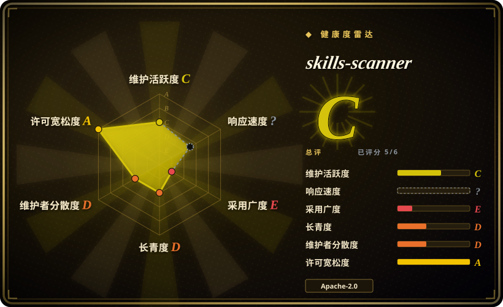
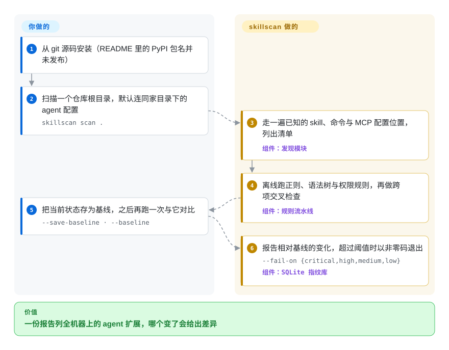

# skills-scanner

你的电脑上攒了一堆 agent skill、斜杠命令和 MCP server，分散在 Claude Code、Claude Desktop、Cursor、Windsurf 各自的配置里，没人列得出清单，更说不清哪一个上周悄悄多了一个 `curl | bash` 安装脚本。`skillscan` 把这些已知的配置位置一次走完，对找到的东西离线跑一遍模式规则，并给每一项记下指纹，下次再跑就能告诉你什么变了。

## 何时使用

你是小团队里那个被问到“我们机器上到底装了哪些 agent 扩展”的人。你手里没有某个可疑 skill 要审，你面对的是盘点问题：一个开发者的家目录里有 `~/.claude/skills/`、marketplace 插件、`~/.cursor/mcp.json`、Claude Desktop 配置，每个仓库还各带一份 `.mcp.json`。你想看到的发现长这样：某个 skill 的 frontmatter 里写着 `allowed-tools: "*"`，或者某个 MCP server 只声明了一个裸的 `"url": "https://…/sse"`，没有任何鉴权。你运行 `skillscan scan .`，拿到一份覆盖它认识的所有位置的 JSON、Markdown 或 SARIF 报告，越过 `--fail-on high` 时以非零码退出。

和 [SkillSpector](skillspector.zh.md)、Cisco 的 `skill-scanner` 相比，决定性的取舍是“看多少地方”对“看多深”。那两个工具拿一个 skill 包做深度分析，还可以加 LLM。这个工具拿一台机器或一个仓库，枚举 skill 以及 agent 定义、命令、`CLAUDE.md`、settings 文件和 MCP server 条目，并多出两样单包扫描器不主打的东西：一个 SQLite 基线，用来报告两次运行之间的漂移（先 `--save-baseline` 再 `--baseline`）；一个跨项检查，会标出“读 `~/.ssh` 的 skill 旁边恰好有带网络出口的东西”。它完全没有运行时依赖，有 Python 3.11 的地方就能跑。把它当作“盘点加漂移”这种形态的一份可读、可 fork 的参考实现来用，而不是一个有人维护的产品：这个仓库从 2026-05-21 起就没有动静了（见“健康度与可持续性”）。

## 怎么用起来

把它想成盘库存，而不是送化验。扫描器内置了一张写死的清单，列着 agent 工具把文件放在哪些位置，然后逐个去看：skill 目录（skill 是一个带 `SKILL.md` 说明文件的目录，agent 按需加载）、agent 与斜杠命令定义、`CLAUDE.md`、settings 文件，以及声明 MCP server 的 JSON 文件（MCP server 是 agent 被允许调用的外部工具进程）。找到的每一项变成一条记录，每条记录都要过一条固定的离线检查流水线：用正则找 shell 下载执行和 API key 的形状；遍历 Python 语法树（代码解析后的结构，所以分散在多行的 `subprocess` 调用也找得到）；检测隐藏字符；按 skill 声明的工具权限做元数据规则。它不执行任何被扫描的东西，默认也不向外发送任何内容。它替你做的是发现、规则、本地的 SQLite 指纹基线库和报告格式化。留给你的是从源码安装、决定哪个严重级别让构建失败、逐条研判命中结果（代码里没有任何抑制或忽略机制），以及安排定期重跑。有三个需要主动开启的附加项：VirusTotal 哈希查询、你自己提供的 YARA 规则包，以及会把文本发给 Anthropic API 的 `--judge`。`agent` 和 `push` 两个子命令把结果发往一个“HTS-ASPM”端点，那是一个姊妹产品，它的服务端不在这个仓库里。

<!-- flow-steps:begin (generated from flows/skills-scanner.json by tools/flow_card.py — do not edit) -->

流程文字版

1. **你**：从 git 源码安装（README 里的 PyPI 包名并未发布）
2. **你**：扫描一个仓库根目录，默认连同家目录下的 agent 配置 — `skillscan scan .`
3. **skills-scanner**：走一遍已知的 skill、命令与 MCP 配置位置，列出清单 — 组件：`发现模块`
4. **skills-scanner**：离线跑正则、语法树与权限规则，再做跨项交叉检查 — 组件：`规则流水线`
5. **你**：把当前状态存为基线，之后再跑一次与它对比 — `--save-baseline · --baseline`
6. **skills-scanner**：报告相对基线的变化，超过阈值时以非零码退出 — `--fail-on {critical,high,medium,low}` — 组件：`SQLite 指纹库`

**价值**：一份报告列全机器上的 agent 扩展，哪个变了会给出差异

<!-- flow-steps:end -->

## 何时不用

- **你需要一个下个季度还有人维护的东西。** 全部 11 个 commit 都落在 2026-05-13 到 2026-05-21 之间，出自同一个账号，此后再无变动。当扫描器是你要依赖的一道控制时，用 [SkillSpector](skillspector.zh.md)（NVIDIA，活跃）或 Cisco 的 `skill-scanner`（活跃，已在 PyPI 以 `cisco-ai-skill-scanner` 发布）。agent 攻击手法按月更新，一套冻结的规则老得很快。
- **你想直接 `pip install`。** README 里的 `pip install skills-scanner` 会失败：这个包名在 PyPI 上返回 404（2026-10-08 查证）。更糟的是 `pip install skillscan` 会成功，但装上的是另一位作者的无关项目。你只能从 git 源码安装。如果“从注册表安装、可钉版本”是硬要求，改用 SkillSpector 或 `cisco-ai-skill-scanner`。
- **你要在安装前审一个刚下载的 skill。** 发现逻辑只看固定布局（`<root>/.claude/skills/`、`~/.claude/skills/`、marketplace 插件目录）。一个散放的 skill 目录、一个 zip 或一个 GitHub URL 都不是合法的扫描目标。用 SkillSpector，它接受单个目标并给出是否安装的建议。
- **你的 skill 不在 `.claude/` 之下。** 尽管仓库简介点名了 Codex 和 Gemini，代码里并没有针对 `~/.codex/`、`~/.gemini/`、`.agents/skills/` 或 Cursor rules 的遍历器；所谓“Codex / Gemini”覆盖只是读取通用的 `<root>/.mcp.json` 与 `mcp.json`。Cline 的发现只支持 macOS，Windsurf 只看用户级配置。要扫 Codex 和 Cursor 格式的 skill，Cisco 的 `skill-scanner` 明确声明两者都支持。
- **你需要对 prompt injection 做语义检测。** 默认流水线是正则加语法树。可选的 `--judge` 只读 skill 的描述和正文前 2000 个字符，模型 id 是写死的，任何 API 错误都会静默退回一个只有六个短语的关键词桩。要 LLM 驱动的多阶段审计，用 [AI-Infra-Guard](../llm-eval/ai-infra-guard.zh.md) 或 SkillSpector 的 LLM 模式。
- **你的 MCP 配置里有密钥，而你正打算开 `--judge`。** 对 MCP server，judge 会把该 server 配置条目里的所有字符串值拼起来，其中包含 `env` 的值，然后发给 Anthropic API。保持 `--judge` 关闭，或者用 SkillSpector 的 `--no-llm` 扫。
- **你想在 agent 运行时拦下一次危险的工具调用。** 这是一个静态文件扫描器。运行时的策略门控和审计用 [agent-governance-toolkit](agent-governance-toolkit.zh.md)。
- **你需要对依赖或 AI 服务本身做 CVE 匹配。** 这里没有漏洞库。服务 CVE 用 AI-Infra-Guard，依赖的 OSV 查询用 SkillSpector。
- **你需要可信的信誉情报源。** `--reputation` 只匹配三条写死的子串，其中一条把描述里含有“exfiltrate”一词的 skill 一律标为可疑，一个正当的安全类 skill 也会中招。把它当作接入你自己注册表文件（`SKILLSCAN_REPUTATION_REGISTRY`）的挂点，而不是威胁情报。
- **你想要开箱即用的机群上报。** `skillscan agent` 必须带 `--aspm-url`，SIEM 镜像也只在那次上报成功后才发。没有 HTS-ASPM 服务端时，改为在 cron 或 CI 里跑 `skillscan scan --format sarif`，把 SARIF 上传到你已经在运维的代码扫描工具。

## 横向对比

同一天收录的两个邻居也属于这次决策：Snyk 的 [agent-scan](agent-scan.zh.md)（面向 AI agent、MCP server 和 agent skill 的安全扫描器，判定引擎是 Snyk 托管的）和 [claude-skill-audit](claude-skill-audit.zh.md)（一条命令、零依赖地审计整套 Claude Code 配置：skill、agent、hook、权限和 MCP 配置）。两者都与本项目的范围直接重叠。凡是打算长期保留的用途，先读它们的页面再决定要不要选这个。

| 替代品 | 是否收录 | 我们的评价 | 取舍 |
|---|---|---|---|
| [SkillSpector](skillspector.zh.md) | ✅ | 问题是“这一个 skill 能不能装”时选 SkillSpector：它接受单个目标，背后是活跃的 NVIDIA 团队，还带 LLM 评审和 OSV 查询。只有当你要的是整机盘点加两次运行之间的漂移、并且愿意自己接管代码时，才选 skills-scanner。 | SkillSpector 依赖树重，LLM 模式有数据外发；skills-scanner 零依赖、默认离线，但检测浅、未发布、无人维护。 |
| cisco-ai-defense/skill-scanner | 未收录 | 要给 Codex、Cursor 或 Claude 格式的 skill 设一道可依赖的 CI 闸门时选 Cisco 的扫描器：它仍在持续推送（2026-10-05），可从 PyPI 安装，并公布了各预设档位的误报率。skills-scanner 自己的 README 也承认 Cisco 的静态分析更深。 | Cisco 扫的是 skill 包，不主打 MCP 配置盘点、SQLite 漂移基线和告警分发；选它是拿这些换深度和维护。本批标签页收录未添加。 |
| [AI-Infra-Guard](../llm-eval/ai-infra-guard.zh.md) | ✅ | 审计范围除了 MCP server 和 skill 还要覆盖在线 AI 服务及其 CVE 时选 AI-Infra-Guard。只需要对本地配置文件做一次不起服务、不用模型的清扫时选 skills-scanner。 | AI-Infra-Guard 要部署 Docker，skill 与 MCP 审计还要一把 LLM key；skills-scanner 是单个 CLI、不用模型，判断意图的能力也相应更弱。 |
| [agent-governance-toolkit](agent-governance-toolkit.zh.md) | ✅ | 风险在于 agent 运行时做了什么，就选 agent-governance-toolkit；文件扫描能发现一条通配权限，却拦不住它放行的那次调用。skills-scanner 如果要用，只适合作为上运行时策略之前的盘点步骤。 | 该工具包是一整套要集成和运维的运行时栈；skills-scanner 是一次性的静态报告，不做任何强制。 |

## 技术栈

- **纯 Python，只用标准库。** `pyproject.toml` 声明 `dependencies = []` 和 `requires-python = ">=3.11"`；HTTP 调用走 `urllib`，基线用 `sqlite3`，参数解析用 `argparse`。`src/skillscan/` 下约 6100 行。
- **规则模块**位于 `rules/`：frontmatter、隐藏字符、密钥（10 条正则）、shell 与 Python 静态模式、MCP 配置规则、能力评分、Python AST 深度扫描、针对 JS/TS 的正则扫描、`.pyc` 完整性，外加需主动开启的 YARA 和 VirusTotal 模块。
- **跨项逻辑**在 `collusion.py`（外传组合、共享 MCP server、工具权限并集）和 `store.py`（用于漂移的 SQLite 指纹）。
- **输出：** JSON、Markdown、SARIF 2.1.0，以及一个自包含的 HTML 仪表盘。告警可发往 Slack、Teams、PagerDuty、Opsgenie；格式化器支持 Splunk HEC、Elastic ECS 和 Microsoft Sentinel。
- **测试：** 11 个文件共 152 个 `unittest` 函数；CI 矩阵覆盖 Python 3.11–3.13、Ubuntu 与 macOS。

## 依赖

- **运行时：** Python 3.11 或更新版本，除此之外不需要任何东西。
- **安装途径：** 从 git 仓库安装。没有 PyPI 包，也没有 GitHub release；唯一的 tag 是 `v0.1.0`，而 `pyproject.toml` 写的是 `0.2.0`，包内 `__version__` 写的是 `0.1.0`。
- **可选项，不提供就不启用：** `yara-python` 加上你自己提供的 `.yar` 规则文件；`VIRUSTOTAL_API_KEY`（把打包二进制的 SHA-256 哈希发给 VirusTotal）；`anthropic` SDK 加 `ANTHROPIC_API_KEY` 和 `--judge`（把 skill 与 MCP 的文本发给 Anthropic）。
- **本地状态：** 不指定 `--db` 时，一个放在用户家目录下的 SQLite 基线文件。
- **`agent` 与 `push` 需要：** 一个按 `docs/hts_aspm_protocol.md` 所述载荷通信的 HTTP 端点。本仓库不附带任何服务端实现。

## 运维难度

**跑起来低，靠得住高。** 一次扫描就是一条命令，不需要任何服务，SARIF 输出可以直接接进现有的代码扫描流水线。成本都在周边：你要自己钉住一个 git commit 来安装；没有抑制文件，所以每条已接受的发现每次运行都会再出现；基线以扫描根目录的绝对路径为键（工作区路径会变的 CI runner 需要固定 `--db` 和路径）；上游也不会有人更新规则。按“自己养一个 fork”来做预算。

## 健康度与可持续性

- **维护（2026-10-08）：休眠。** 2026-05-13 创建；共 11 个 commit，最后一个在 2026-05-21；此后四个半月没有任何推送。只有一个 tag（`v0.1.0`），GitHub release 为零，未发布到 PyPI。`main` 上最后一次 CI 运行是通过的。
- **治理与 bus factor：一个账号。** 十个 pull request 全部由同一位贡献者在八天内提交并合并，标题是 `S1`…`S10`，读起来像一次按计划的搭建，而不是社区开发。没有外部 issue，没有 fork。
- **背书：不明，而且信号指向“不再投入”。** 仓库是在 `HTS-ASPM` 组织下建成的（`pyproject.toml` 里写的是“HTS Consulting”），现在解析到 `HTS-Sleeping-Place`，这是一个 2026-07-09 创建、没有任何简介的组织。README 里的链接仍指向旧的所有者，它自称配套的姊妹项目 `aibom` 也同样搬到了另一个组织。我们把这次迁移读作项目被搁置 [推断]。
- **年龄与 Lindy：两头都不成立。** 不到五个月大，并且不活跃；没有可供外推的履历。
- **采用度：无可测信号。** 截至 2026-10-08 为 1 star、0 fork、0 watcher。没有注册表包，也就没有下载量信号。
- **风险信号：** PyPI 上的安装名撞车（见“何时不用”）；README 里那张与 Cisco 扫描器的对比表我们没有核实，而且它描述的是一个此后已经演进的工具；宣传的覆盖面（Codex、Gemini）与代码不符。许可证是干净的：`LICENSE` 和 `pyproject.toml` 均为 Apache-2.0。
- **结论：** 这是一份合格、可读的“盘点加漂移”扫描设计草图。把它当作模式来源，或者有意识地 fork 下来自己养；不要把它当作一个指望别人保持更新的依赖来采用。

## 存疑（未验证）

- [未验证] 我们读了源码、测试、清单文件和 CI 配置，但没有安装或执行 `skillscan`；这里描述的行为（退出码、judge 的回退、judge 发送的内容）来自读代码，而不是实际运行。原因：本批次策略是不执行下载下来的代码。
- [未验证] README 中与 Cisco AI Defense `skill-scanner` 的能力对比表（“partial”“no”）没有逐行核对；Cisco 当前的 README 描述了该表没有体现的能力（LLM judge、CEL 决策层、Codex 与 Cursor 格式）。
- [未验证] 检测质量：上游没有公布基准、误报率或带标注的语料，我们也没有测。
- [推断] “迁到 `HTS-Sleeping-Place` 意味着项目被搁置”是从该组织的名字、创建日期和此后没有 commit 推出来的；上游没有任何声明这么说。
- [未验证] 外部用户能否拿到 HTS-ASPM 的服务端产品。原所有者组织的三个公开仓库里没有它（2026-10-08 列出）；是否存在私有或商业版本，从这里查不了。
- [未验证] 默认信誉注册表里内嵌的研究与通告引用（一个 arXiv 编号、几篇厂商博客）没有打开核对。
- [推断] 写死的 judge 模型 id（`claude-opus-4-7`）迟早会失效；失效后代码会不报错地退回关键词桩，于是 `--judge` 看起来仍在“工作”，实际几乎什么都没做。
