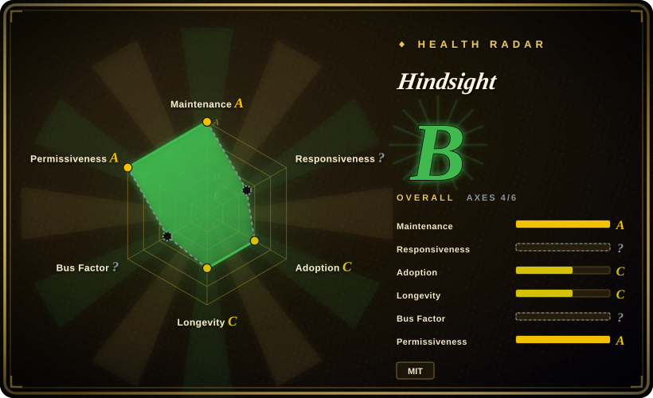
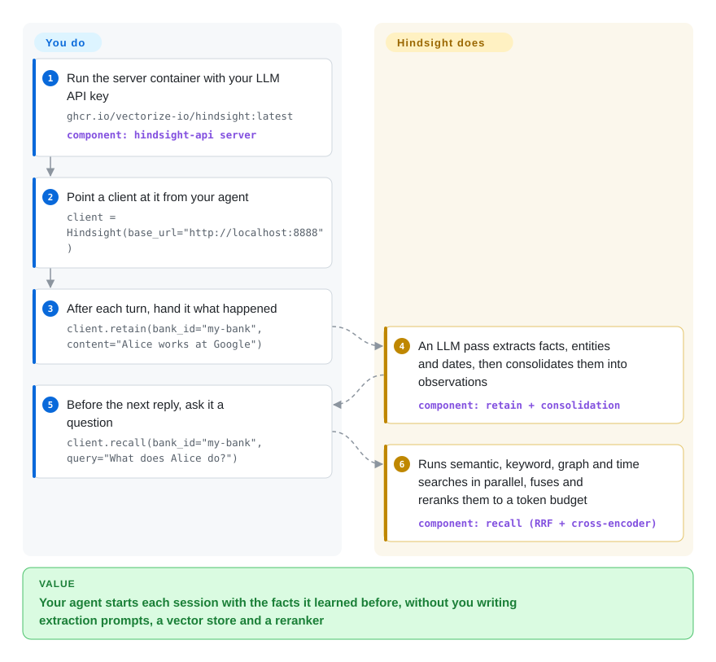

# Hindsight

Your agent keeps asking a returning user things it was already told, and pasting old transcripts back into the prompt costs a fortune while still missing "what did we decide last spring?". Hindsight is a memory server you run beside the agent: it has an LLM turn each conversation into dated facts about people and things, links them, and on the next turn answers a question with the handful of facts that matter.

## When to use

You're building an assistant, support bot or autonomous "AI employee" that talks to the same users or works on the same project for weeks. By week three, the naive approaches break visibly: a vector search over old transcripts returns "Alice mentioned Kubernetes" when the question was "was Alice affected by Tuesday's outage?", and "what did she work on last spring?" pulls every Alice fact regardless of date. You want memory that knows *who* a fact is about, *when* it was true, and how facts connect — and you want to run it yourself on Postgres rather than send user data to a memory SaaS.

Reach for Hindsight when that server-shaped, self-hosted memory is the point. You run one container (API + UI, embedded Postgres) or point it at your own PostgreSQL, then call `retain` / `recall` / `reflect` from the Python, Node, Go or CLI clients, over REST, or through the built-in per-bank MCP endpoint. Compared with [Mem0](mem0.md), it does more work at write time (entities, time series, background consolidation into "observations" and "mental models") and runs four retrieval strategies at read time, at the price of more LLM spend and a heavier server; compared with [Graphiti](../graph-memory/graphiti.md), it gives you a complete memory service with clients, UI, MCP and 60+ integrations instead of a graph library you assemble around Neo4j. It is MIT-licensed, with a hosted Hindsight Cloud as the vendor's paid option — the self-hosted server is the full engine, not a teaser.

## How it works

Hindsight is a server that owns your memory; your agent only talks to it. When you `retain` text, the server spends an LLM call — "retain", its write operation — extracting facts, entities, relationships and dates, normalizing names, and storing each fact with dense and sparse vectors (numeric fingerprints for meaning and for exact words) in PostgreSQL with pgvector. In the background it then merges related facts into "observations" — deduplicated beliefs that keep their supporting quotes, like a detective's case notes that get revised rather than rewritten. When you `recall`, it runs four searches at once — by meaning, by keyword (BM25), by following entity links, and by date range — fuses the lists, reranks them with a cross-encoder (a small model that scores each query/fact pair directly), and trims the result to a token budget. What stays yours: choosing the LLM (25+ providers, including local Ollama/llama.cpp), deciding which bank (one isolated memory per user, agent or project) each call goes to, and composing the recalled facts into your prompt; `reflect` is the optional heavier path where the server itself reasons over the bank and writes an answer.

<!-- flow-steps:begin (generated from flows/hindsight.json by tools/flow_card.py — do not edit) -->

Text version of the flow

1. **You**: Run the server container with your LLM API key — `ghcr.io/vectorize-io/hindsight:latest` — component: `hindsight-api server`
2. **You**: Point a client at it from your agent — `client = Hindsight(base_url="http://localhost:8888")`
3. **You**: After each turn, hand it what happened — `client.retain(bank_id="my-bank", content="Alice works at Google")`
4. **Hindsight**: An LLM pass extracts facts, entities and dates, then consolidates them into observations — component: `retain + consolidation`
5. **You**: Before the next reply, ask it a question — `client.recall(bank_id="my-bank", query="What does Alice do?")`
6. **Hindsight**: Runs semantic, keyword, graph and time searches in parallel, fuses and reranks them to a token budget — component: `recall (RRF + cross-encoder)`

**Value**: Your agent starts each session with the facts it learned before, without you writing extraction prompts, a vector store and a reranker

<!-- flow-steps:end -->

## When NOT to use

- **Your write volume is high and your LLM budget is thin.** Every `retain` is an LLM fact-extraction pass, and observations, auto-consolidation and mental-model refresh are **on by default** (`config.py`, 2026-09-28), adding more background LLM calls. One user reported ~$650 of retain spend in a month before finding a coding-agent bank running with default settings (issue #4725, open). If you just need "remember these few preferences", a table row or [Mem0](mem0.md)'s single extraction pass is cheaper; if you need no LLM at write time at all, use plain pgvector search.
- **You only need document Q&A over a static corpus.** The project's own "RAG vs Memory" doc recommends plain RAG for static-corpus Q&A and searches with no temporal requirement. Use a RAG pipeline from `rag-retrieval` instead of paying for entity/temporal extraction you won't query.
- **You want memory as an in-process library with nothing else to run.** The main shape is a server (FastAPI + PostgreSQL, worker, optional UI), with local embedding and reranker models by default; `hindsight-all` embeds the server in your Python process but still starts that stack, and model warm-up can keep even `/health/live` unreachable for ~3 minutes (issue #4374, open). For a light dependency inside your app, pick [Mem0](mem0.md) or [Memori](memori.md).
- **You need a graph you query yourself.** Hindsight's entity links are internal plumbing for recall, not a graph API you traverse with Cypher. If bi-temporal edges, explicit invalidation and direct graph queries are the product, use [Graphiti](../graph-memory/graphiti.md) / [Zep](../graph-memory/zep.md) or [Cognee](../graph-memory/cognee.md).
- **You're exposing it on a network and assume it's locked down.** Authentication is **off by default** — no tenant extension means no API-key check, and the MCP endpoint is open unless `HINDSIGHT_API_MCP_AUTH_TOKEN` is set (docs `configuration.mdx`, 2026-09-28). Keep it on localhost or configure `ApiKeyTenantExtension` / an MCP token before sharing it.
- **You need a frozen API and quiet upgrades.** It is pre-1.0 and shipping about every one to three weeks; 0.9.3 moved the Supabase tenant extension out of the core package, so installs still pointing at the old path fail at startup (docs `extensions.md`). Pin versions and read release notes, or choose a slower-moving library.
- **Your agent should own its memory inside its own runtime.** If you want the agent loop and self-edited memory blocks in one stateful platform, [Letta](letta.md) fits better; Hindsight sits beside whatever agent you already have.

## Comparison

| Alternative | In index | Our verdict | Tradeoff |
|---|---|---|---|
| [Mem0](mem0.md) | ✅ | Pick Mem0 when you want a drop-in library with one extraction call per write; pick Hindsight when temporal/entity recall and a self-hosted server with UI and MCP are worth heavier writes. | Mem0 is lighter to embed and older (2023), but its ADD-only extraction piles up stale facts; Hindsight consolidates facts into observations and supports per-fact invalidation, but spends more LLM calls and runs a Postgres-backed server. |
| [Graphiti](../graph-memory/graphiti.md) / [Zep](../graph-memory/zep.md) | ✅ | Pick Graphiti when you want a temporal knowledge graph you query and control yourself; pick Hindsight when you want a finished memory service rather than a graph toolkit. | Graphiti gives bi-temporal edges and direct graph queries on Neo4j/FalkorDB but leaves clients, UI and integrations to you; Hindsight hides the graph behind retain/recall/reflect and ships the service around it on plain PostgreSQL. |
| [Letta (MemGPT)](letta.md) | ✅ | Pick Letta when the platform should run the agent loop and manage memory blocks; pick Hindsight when memory must attach to an agent you already built. | Letta owns the runtime (one stack for agents plus memory); Hindsight only owns memory and integrates with 60+ frameworks, so you keep your orchestration but run a separate service. |
| [Cognee](../graph-memory/cognee.md) | ✅ | Pick Cognee when the input is documents you want turned into a queryable knowledge graph; pick Hindsight when the input is conversation and agent experience over time. | Cognee's pipelines are document-to-graph ETL with pluggable stores; Hindsight is tuned for conversational streams, per-user banks and time-aware recall, and is less of a document ingestion tool. |
| [claude-mem](../coding-agent-memory/claude-mem.md) | ✅ | For memory on one developer's Claude Code sessions, claude-mem's local hooks are the smaller install; pick Hindsight's coding-agents package when several agents or repos should share one server-side bank. | claude-mem is local and Claude-Code-first with nothing to operate; Hindsight covers 13 coding-agent CLIs but needs the server running and inherits its default-on consolidation cost. |

## Tech stack

- **Server:** Python ≥3.11, FastAPI + uvicorn, SQLAlchemy 2.0 + Alembic migrations, asyncpg/psycopg2, pgvector; OpenTelemetry + Prometheus metrics (`hindsight-api-slim/pyproject.toml`, v0.10.1).
- **Storage:** PostgreSQL with pgvector (or the bundled `pg0` embedded Postgres), or Oracle AI Database 23ai; object storage via `obstore` (S3/GCS/Azure) for files.
- **Models:** LLM via OpenAI, Anthropic, Gemini, Cohere, LiteLLM and 25+ providers (config default provider `openai`); embeddings default to local `BAAI/bge-small-en-v1.5`, reranker to local `cross-encoder/ms-marco-MiniLM-L-6-v2` (`config.py`), via sentence-transformers/torch, ONNX Runtime, or MLX on Apple Silicon; optional built-in llama.cpp.
- **Retrieval:** semantic + BM25 + entity-graph + temporal searches fused with reciprocal rank fusion and a cross-encoder rerank.
- **Surfaces:** REST API, per-bank MCP endpoint (`/mcp/{bank_id}/`), web control plane (Next.js), clients for Python, Node and Go plus a Rust CLI, an LLM-client wrapper (`hindsight-litellm`), a coding-agents installer, Helm chart.

## Dependencies

- **An LLM endpoint is mandatory** — retain, consolidation and reflect all call it. Hosted keys, local Ollama/LM Studio/llama.cpp, or existing subscriptions (`claude-code`, `openai-codex`, `cursor`, `github-copilot` providers).
- **PostgreSQL + pgvector** — embedded `pg0` in the default container (data in a Docker volume), or external Postgres via the compose file / Helm (`postgresql.enabled=true`).
- **Local ML models** — the full `hindsight-api` install pulls `hindsight-api-slim[all]`: torch, transformers, sentence-transformers, ONNX Runtime and embedded Postgres; the `-slim` package drops them if you point embeddings/reranking at an external service (Intel Macs must use slim).
- **Clients:** `pip install hindsight-client`, `npm install @vectorize-io/hindsight-client`, a Go module, or the CLI.
- **Ports:** API 8888, UI 9999 in the reference Docker run.

## Ops difficulty

**Medium.** A single `docker run` gets a working server with embedded Postgres, API and UI, so a prototype is minutes. Production is a real service: you operate PostgreSQL (backups, `max_connections` vs pool size — a 100-vs-100 collision was fixed only in 2026-09, issue #4754), size memory for concurrent retains (earlier releases OOM-killed a 4 GB container under five parallel retains, #1572, fixed), turn on authentication yourself, and budget LLM rate limits because write throughput is LLM-bound (docs `performance.md`: retain 0.5–2 s per batch, recall 100–600 ms, reflect 0.8–3 s). You also inherit cost tuning — per-bank switches for observations, auto-consolidation and mental-model refresh intervals — and a fast upgrade train with Alembic migrations. An admin CLI, Prometheus dashboards, webhooks and a Helm chart are provided; Hindsight Cloud is the vendor's way to skip all of this.

## Health & viability

- **Maintenance (2026-09-28):** extremely active — pushed today, 8 releases between 2026-07-01 and 2026-09-21 (v0.8.4 → v0.10.1), and the open-issue list is full of detailed, same-week bug reports and fixes. Not archived.
- **Governance / bus factor:** owned by the `vectorize-io` organization (Vectorize AI, Inc., copyright holder in LICENSE). One maintainer dominates: `nicoloboschi` has ~1,800 commits vs ~320 for the next contributor (contributors API, 2026-09-28), so the roadmap is effectively one vendor's core team. SECURITY.md promises a 48-hour response via GitHub advisories; no CLA found in CONTRIBUTING. The radar reads `?` on governance (GitHub's contributor-stats endpoint kept returning 202) and on responsiveness (no qualifying issue response in the sampled window) — measurement gaps, not low scores.
- **Age & Lindy:** created 2025-10-30 — about 11 months old. Too young for the Lindy prior to help; active, but unproven over a multi-year horizon.
- **Adoption:** ~39.4k stars and ~5.2k forks in under a year (a steep curve worth treating with caution), but real usage signals back it: `hindsight-client` ~929k PyPI downloads/month and `@vectorize-io/hindsight-client` 131,218 npm downloads/month (pypistats, and the health scorer on 2026-09-28). The README claims Fortune-500 production use; the LongMemEval/LoCoMo results come from the team's own arXiv paper (2512.12818), with independent reproduction claimed but not linked.
- **Risk flags:** open-core-adjacent (MIT engine plus paid Hindsight Cloud/Enterprise), but no feature-gating was found in the repo — the extensions registry holds only tenant/auth adapters. Main risks are operational: default-on LLM-heavy background work, auth off by default, and pre-1.0 breaking changes. The README embeds a third-party tracking pixel (umami); no telemetry was found in the server package's Python dependencies.

## Caveats (unverified)

- `[未验证]` "State-of-the-art" LongMemEval/LoCoMo accuracy (paper: 91.4% LongMemEval, up to 89.61% LoCoMo) is first-party; the README says Virginia Tech and The Washington Post reproduced it, but no reproduction report is linked. Not reproduced here — needs the benchmark harness and LLM spend.
- `[未验证]` "Used in production at Fortune 500 enterprises" is a README claim with no named customers.
- `[未验证]` The ~$650 monthly retain spend in issue #4725 is one user's self-report; actual cost depends on model, volume and bank settings and was not measured here.
- `[推断]` Star growth (~39k in 11 months, ~5.2k forks) is unusually steep; the download numbers suggest real use, but stars and forks alone should not be read as maturity.
- `[未验证]` Latency figures (recall 100–600 ms, retain 0.5–2 s per batch, reflect 0.8–3 s) are from the project's own performance doc; not benchmarked here.
- `[推断]` "No feature-gating in the OSS server" is based on the repo tree and extensions registry as of 2026-09-28; what Hindsight Cloud/Enterprise add was not compared line by line against the pricing page.
- `[推断]` The radar's adoption axis (C) scored the npm client (`@vectorize-io/hindsight-client`, ~131k/month) as the canonical package; the PyPI `hindsight-client` (~929k/month on pypistats, 2026-09-28) is about seven times larger, so the grade likely understates adoption. The scorer's package choice was left as computed.
- `[未验证]` Whether the server sends any usage telemetry was checked only by scanning dependencies (no analytics SDK); network behaviour at runtime was not observed.
