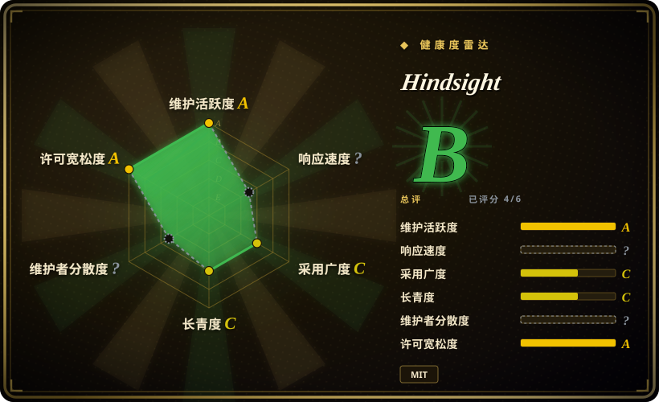
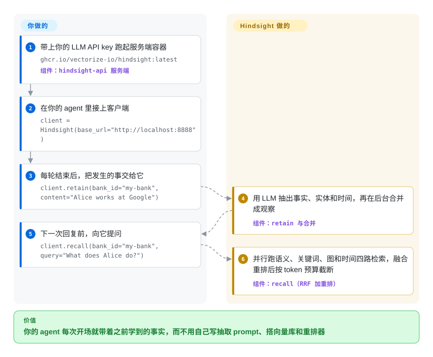

# Hindsight

老用户回来，你的 agent 又把人家早就说过的事再问一遍；把旧聊天记录整段塞回 prompt，钱烧得飞快，还是答不出“去年春天我们定了什么”。Hindsight 是跑在 agent 旁边的一个记忆服务：它让 LLM 把每段对话拆成带日期、指向具体人和事的事实并连起来，下一轮只把真正相关的那几条递回来。

## 何时使用

你在做一个要陪同一批用户、或者盯同一个项目好几周的助手、客服机器人或“AI 员工”。到第三周，朴素做法的毛病就摆在眼前了：问“周二那次故障 Alice 有没有受影响？”，对旧聊天记录做向量检索只捞回一句“Alice 提过 Kubernetes”；问“她去年春天在忙什么？”，又把所有和 Alice 有关的事实不分时间全倒出来。你需要的记忆得知道一条事实**说的是谁**、**什么时候成立**、事实之间怎么连着——而且你想在自己的 Postgres 上跑，不想把用户数据交给一个记忆 SaaS。

当“自托管、服务形态的记忆”正是你要的，就想到 Hindsight。你起一个容器（API 加界面，内嵌 Postgres），或者让它连你自己的 PostgreSQL，然后从 Python、Node、Go 客户端或 CLI、REST，或者它自带的每个 bank 一个的 MCP 端点去调 `retain` / `recall` / `reflect`。和 [Mem0](mem0.zh.md) 比，它在写入时做得更多（实体、时间序列、后台把事实合并成“观察”和“心智模型”），读取时并行跑四种检索，代价是更多 LLM 花费和更重的服务端；和 [Graphiti](../graph-memory/graphiti.zh.md) 比，它给的是一整套带客户端、界面、MCP 和 60 多个集成的记忆服务，而不是一个要你围着 Neo4j 自己拼装的图库。它是 MIT 许可，厂商的付费选项是托管的 Hindsight Cloud——自托管服务端就是完整引擎，不是试用版。

## 怎么用起来

Hindsight 是一个替你保管记忆的服务端，你的 agent 只和它说话。你调 `retain`（它的写入操作）交一段文本，服务端就花一次 LLM 调用抽出事实、实体、关系和日期，把名字归一化，再把每条事实连同稠密和稀疏向量（分别刻画“意思”和“字面词”的数字指纹）存进带 pgvector 的 PostgreSQL。随后它在后台把相关事实合并成“观察”——去重后的信念，保留支撑它的原话，像侦探的案情笔记，有新线索就修订，而不是整页重写。你调 `recall` 时，它同时跑四路检索——按意思、按关键词（BM25）、顺着实体关系走、按时间范围筛——把结果融合，再用交叉编码器（一个直接给“问题/事实”这一对打分的小模型）重排，最后按 token 预算截断。留给你的事：选 LLM（25 种以上提供方，包括本地 Ollama、llama.cpp），决定每次调用落到哪个 bank（每个用户、agent 或项目一份隔离的记忆），以及把召回的事实拼进你的 prompt；`reflect` 是可选的重路径，由服务端自己在整个 bank 上推理并写出回答。

<!-- flow-steps:begin (generated from flows/hindsight.json by tools/flow_card.py — do not edit) -->

流程文字版

1. **你**：带上你的 LLM API key 跑起服务端容器 — `ghcr.io/vectorize-io/hindsight:latest` — 组件：`hindsight-api 服务端`
2. **你**：在你的 agent 里接上客户端 — `client = Hindsight(base_url="http://localhost:8888")`
3. **你**：每轮结束后，把发生的事交给它 — `client.retain(bank_id="my-bank", content="Alice works at Google")`
4. **Hindsight**：用 LLM 抽出事实、实体和时间，再在后台合并成观察 — 组件：`retain 与合并`
5. **你**：下一次回复前，向它提问 — `client.recall(bank_id="my-bank", query="What does Alice do?")`
6. **Hindsight**：并行跑语义、关键词、图和时间四路检索，融合重排后按 token 预算截断 — 组件：`recall（RRF 加重排）`

**价值**：你的 agent 每次开场就带着之前学到的事实，而不用自己写抽取 prompt、搭向量库和重排器

<!-- flow-steps:end -->

## 何时不用

- **写入量大、LLM 预算紧。** 每次 `retain` 都是一次 LLM 抽取，而且观察、自动合并和心智模型刷新**默认全开**（`config.py`，2026-09-28），会在后台再追加 LLM 调用。有用户报告一个月 retain 花了约 650 美元，查下来是一个编码 agent 的 bank 在跑默认配置（issue #4725，未关闭）。如果只是“记住几条偏好”，一张表的一行或 [Mem0](mem0.zh.md) 的单次抽取更省；写入时完全不想调 LLM，就直接用 pgvector 检索。
- **你只是要对一批静态文档问答。** 项目自己的 “RAG vs Memory” 文档就建议：静态语料问答、没有时间维度的检索用普通 RAG。去 `rag-retrieval` 找一条 RAG 管线，别为用不上的实体和时间抽取付钱。
- **你想要一个进程内的库，别的什么都不跑。** 它的主形态是服务端（FastAPI 加 PostgreSQL、worker、可选界面），默认还带本地 embedding 和重排模型；`hindsight-all` 能把服务端嵌进你的 Python 进程，但照样要拉起这一整套，模型预热期间连 `/health/live` 都可能约 3 分钟不可达（issue #4374，未关闭）。要一个轻依赖，选 [Mem0](mem0.zh.md) 或 [Memori](memori.zh.md)。
- **你要一张自己能查的图。** Hindsight 的实体关系是 recall 的内部管道，不是给你用 Cypher 遍历的图 API。如果双时间边、显式失效和直接查图本身就是需求，用 [Graphiti](../graph-memory/graphiti.zh.md) / [Zep](../graph-memory/zep.zh.md) 或 [Cognee](../graph-memory/cognee.zh.md)。
- **你要把它暴露到网络上，还默认它是锁着的。** 认证**默认关闭**——不配 tenant 扩展就不校验 API key，MCP 端点在没设 `HINDSIGHT_API_MCP_AUTH_TOKEN` 时也是开放的（文档 `configuration.mdx`，2026-09-28）。分享给别人之前，要么只绑 localhost，要么配上 `ApiKeyTenantExtension` 或 MCP token。
- **你要冻结的 API 和安静的升级。** 它还没到 1.0，大约每一到三周发一版；0.9.3 把 Supabase tenant 扩展移出了核心包，仍指向旧路径的安装启动即报错（文档 `extensions.md`）。锁版本、读发布说明，或者换一个节奏更慢的库。
- **你想让 agent 在自己的运行时里掌管记忆。** 如果你要的是把 agent 循环和自我编辑的记忆块放进同一个有状态平台，[Letta](letta.zh.md) 更合适；Hindsight 是挂在你现有 agent 旁边的。

## 横向对比

| 替代品 | 是否收录 | 我们的评价 | 取舍 |
|---|---|---|---|
| [Mem0](mem0.zh.md) | ✅ | 想要每次写入只调一次抽取的即插即用库，选 Mem0；时间和实体维度的召回、带界面和 MCP 的自托管服务值得更重的写入时，选 Hindsight。 | Mem0 更轻、更老（2023 年），但 ADD-only 抽取会堆积过时事实；Hindsight 把事实合并成观察、支持逐条失效，但 LLM 调用更多，还要跑一个 Postgres 支撑的服务端。 |
| [Graphiti](../graph-memory/graphiti.zh.md) / [Zep](../graph-memory/zep.zh.md) | ✅ | 想要一张自己查询、自己掌控的时序知识图，选 Graphiti；想要一个做完的记忆服务而不是图工具包，选 Hindsight。 | Graphiti 在 Neo4j/FalkorDB 上给你双时间边和直接查图，但客户端、界面和集成都要你自己补；Hindsight 把图藏在 retain/recall/reflect 后面，在普通 PostgreSQL 上把服务整套配齐。 |
| [Letta (MemGPT)](letta.zh.md) | ✅ | 平台应该跑 agent 循环并管理记忆块时，选 Letta；记忆必须挂到你已经写好的 agent 上时，选 Hindsight。 | Letta 掌管运行时（agent 和记忆一套栈）；Hindsight 只管记忆、对接 60 多个框架，你保留自己的编排，但要多跑一个服务。 |
| [Cognee](../graph-memory/cognee.zh.md) | ✅ | 输入是文档、想把它变成可查询的知识图，选 Cognee；输入是随时间累积的对话和 agent 经历，选 Hindsight。 | Cognee 的管线是文档到图的 ETL，存储可插拔；Hindsight 针对对话流、按用户分 bank 和时间感知召回调优，不太擅长做文档摄取。 |
| [claude-mem](../coding-agent-memory/claude-mem.zh.md) | ✅ | 只给一个开发者的 Claude Code 会话加记忆，claude-mem 的本地 hook 装起来更小；要让多个 agent、多个仓库共用服务端的 bank，选 Hindsight 的 coding-agents 包。 | claude-mem 本地运行、以 Claude Code 为主，什么都不用运维；Hindsight 覆盖 13 种编码 agent CLI，但要服务端一直在跑，还继承了默认开启的合并开销。 |

## 技术栈

- **服务端：** Python ≥3.11，FastAPI 加 uvicorn，SQLAlchemy 2.0 加 Alembic 迁移，asyncpg/psycopg2，pgvector；OpenTelemetry 加 Prometheus 指标（`hindsight-api-slim/pyproject.toml`，v0.10.1）。
- **存储：** 带 pgvector 的 PostgreSQL（或自带的 `pg0` 内嵌 Postgres），也支持 Oracle AI Database 23ai；文件走 `obstore`（S3/GCS/Azure）对象存储。
- **模型：** LLM 可接 OpenAI、Anthropic、Gemini、Cohere、LiteLLM 等 25 种以上提供方（配置默认 `openai`）；embedding 默认本地 `BAAI/bge-small-en-v1.5`，重排默认本地 `cross-encoder/ms-marco-MiniLM-L-6-v2`（`config.py`），经 sentence-transformers/torch、ONNX Runtime 或 Apple Silicon 上的 MLX 运行；可选内置 llama.cpp。
- **检索：** 语义、BM25、实体图、时间四路检索，用倒数排名融合（RRF）合并，再交叉编码器重排。
- **接入面：** REST API、每个 bank 一个的 MCP 端点（`/mcp/{bank_id}/`）、Web 控制台（Next.js）、Python/Node/Go 客户端和一个 Rust 写的 CLI、LLM 客户端包装器（`hindsight-litellm`）、coding-agents 安装器、Helm chart。

## 依赖

- **必须有 LLM 端点**——retain、合并和 reflect 都要调它。可以是托管 API key、本地 Ollama/LM Studio/llama.cpp，或现有订阅（`claude-code`、`openai-codex`、`cursor`、`github-copilot` 这几种提供方）。
- **PostgreSQL 加 pgvector**——默认容器里是内嵌的 `pg0`（数据在 Docker volume 里），也可以通过 compose 文件或 Helm（`postgresql.enabled=true`）接外部 Postgres。
- **本地 ML 模型**——完整的 `hindsight-api` 会装 `hindsight-api-slim[all]`：torch、transformers、sentence-transformers、ONNX Runtime 和内嵌 Postgres；如果 embedding 和重排改走外部服务，用 `-slim` 包就能去掉这些（Intel Mac 只能用 slim）。
- **客户端：** `pip install hindsight-client`、`npm install @vectorize-io/hindsight-client`、Go 模块或 CLI。
- **端口：** 参考 Docker 命令里 API 是 8888，界面是 9999。

## 运维难度

**中等。** 一条 `docker run` 就能拿到带内嵌 Postgres、API 和界面的可用服务，原型几分钟搞定。上生产它就是一个真正的服务：你要运维 PostgreSQL（备份，`max_connections` 和连接池大小——100 对 100 的冲突直到 2026-09 才修掉，issue #4754），为并发 retain 规划内存（早期版本在 5 个并发 retain 下把 4 GB 容器 OOM 杀掉过，#1572，已修），自己打开认证，还要为 LLM 限速留余量，因为写入吞吐卡在 LLM 上（文档 `performance.md`：retain 每批 0.5–2 秒，recall 100–600 毫秒，reflect 0.8–3 秒）。你还得调成本——每个 bank 上观察、自动合并和心智模型刷新间隔的开关——并跟上带 Alembic 迁移的快速发版。项目提供了管理 CLI、Prometheus 看板、webhook 和 Helm chart；Hindsight Cloud 是厂商给的“这些都不用管”的选项。

## 健康度与可持续性

- **维护（2026-09-28）：** 非常活跃——今天还有推送，2026-07-01 到 2026-09-21 之间发了 8 个版本（v0.8.4 → v0.10.1），未关闭的 issue 里满是当周提交、写得很细的 bug 报告和修复。未归档。
- **治理与巴士因子：** 归 `vectorize-io` 组织所有（LICENSE 版权方是 Vectorize AI, Inc.）。一位维护者占绝对主导：`nicoloboschi` 约 1800 次提交，第二名约 320 次（contributors API，2026-09-28），路线图实际上由一家厂商的核心团队掌握。SECURITY.md 承诺通过 GitHub 安全公告 48 小时内响应；CONTRIBUTING 里没有找到 CLA。雷达上治理轴是 `?`（GitHub 贡献者统计接口一直返回 202），响应轴也是 `?`（抽样窗口里没有符合条件的 issue 回复）——都是测量缺口，不是低分。
- **年龄与 Lindy：** 创建于 2025-10-30，约 11 个月。太年轻，Lindy 先验帮不上忙；活跃，但没经过多年检验。
- **采用度：** 不到一年约 3.94 万星、约 5200 个 fork（曲线很陡，要保持警惕），但真实使用信号能撑住：`hindsight-client` 在 PyPI 每月约 92.9 万次下载，`@vectorize-io/hindsight-client` 在 npm 每月 131,218 次（pypistats 与健康度评分器，2026-09-28）。README 声称有财富 500 强在生产使用；LongMemEval/LoCoMo 成绩来自团队自己的 arXiv 论文（2512.12818），声称有独立复现但没给链接。
- **风险信号：** 接近 open-core（MIT 引擎加付费的 Hindsight Cloud/Enterprise），但仓库里没发现功能门控——扩展目录里只有 tenant/认证适配器。主要风险在运维层面：默认开启的 LLM 密集后台任务、默认关闭的认证、1.0 之前的破坏性变更。README 里嵌了一个第三方跟踪像素（umami）；服务端包的 Python 依赖里没发现遥测。

## 存疑（未验证）

- `[未验证]` LongMemEval/LoCoMo 的“业界最佳”准确率（论文：LongMemEval 91.4%，LoCoMo 最高 89.61%）是第一方数字；README 说弗吉尼亚理工和《华盛顿邮报》复现过，但没附复现报告。这里没有复现——需要基准环境和 LLM 花费。
- `[未验证]` “财富 500 强企业在生产中使用”是 README 的说法，没有点名客户。
- `[未验证]` issue #4725 里一个月约 650 美元的 retain 花费是单个用户的自述；实际成本取决于模型、写入量和 bank 配置，这里没测。
- `[推断]` 星数增长（11 个月约 3.9 万、约 5200 fork）异常陡峭；下载量说明确有真实使用，但单凭星数和 fork 不能当成熟度。
- `[未验证]` 延迟数字（recall 100–600 毫秒、retain 每批 0.5–2 秒、reflect 0.8–3 秒）出自项目自己的性能文档，这里没有压测。
- `[推断]` “开源服务端没有功能门控”依据的是 2026-09-28 的仓库目录和扩展目录；没有逐条对照定价页核对 Hindsight Cloud/Enterprise 多了什么。
- `[推断]` 雷达的采用度轴（C）把 npm 客户端（`@vectorize-io/hindsight-client`，每月约 13.1 万次）当成规范包打分；PyPI 上的 `hindsight-client`（pypistats 2026-09-28 每月约 92.9 万次）大约是它的七倍，所以这个档位很可能低估了采用度。评分器选哪个包保持原样，没有手改。
- `[未验证]` 服务端是否上报使用遥测，只查了依赖（没有分析类 SDK）；没有观察运行时的网络行为。
