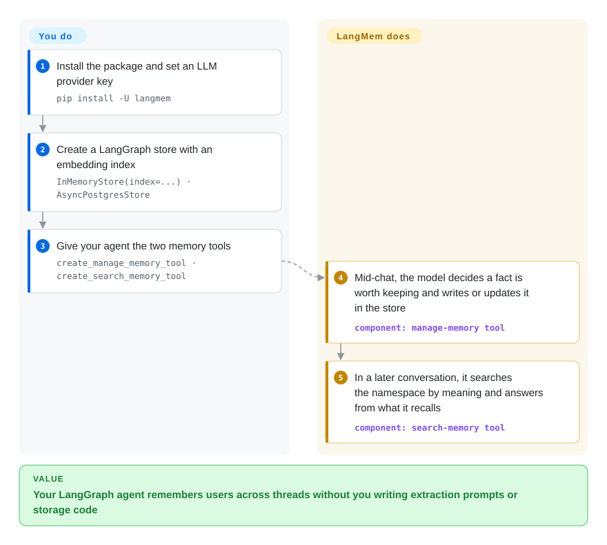

# LangMem

Your LangGraph agent forgets "I prefer dark mode" the moment the thread ends, and writing your own what-is-worth-remembering prompt plus the storage code around it turns into a side project. LangMem hands the agent two ready-made tools — save a memory, search memories — backed by LangGraph's store, and can also distill memories from a finished conversation in the background.

## When to use

You already build agents on LangGraph (or on LangChain with a LangGraph store), and users keep repeating themselves: a support bot asks the same customer for their plan tier every session, or a personal assistant re-learns that the user writes in British English. You don't want to stand up a separate memory service; you want memory to live in the same `BaseStore` your LangGraph deployment already has (in-memory for tests, `AsyncPostgresStore` in production). LangMem gives you `create_manage_memory_tool` / `create_search_memory_tool` that the model calls itself mid-conversation, plus `create_memory_store_manager` + `ReflectionExecutor` when you would rather extract memories after the conversation than spend tokens in the hot path.

Pick it over [Mem0](mem0.md) when the deciding factor is staying inside LangGraph's storage and tool model rather than adding a second memory stack with its own vector store; pick Mem0 instead when you are not on LangGraph or need an actively released library. Pick it over [Graphiti](../graph-memory/graphiti.md) when flat "facts about the user" are enough and you don't need entity relationships with time validity. It also ships a prompt optimizer (`create_prompt_optimizer`) that rewrites an agent's system prompt from feedback — useful if "learning" for you means better instructions, not just more facts.

## How it works

LangMem is a set of building blocks, not a server: there is nothing to deploy. **What it does for you** is the LLM work — deciding what in a conversation is worth keeping, consolidating it with what is already stored (update or delete instead of piling up duplicates), and turning a search into a similarity lookup. **What you do** is pick the store and the embedding model, and wire the tools into your agent. The "store" is LangGraph's long-term key-value store with an optional vector index — think of it as a filing cabinet keyed by a namespace such as `("memories", user_id)`, where each drawer can also be searched by meaning. In the hot-path mode below the model itself decides when to call "save" or "search", the same way it decides to call any other tool; the background mode instead runs a memory manager over the transcript after the fact, which keeps latency out of the reply.

<!-- flow-steps:begin (generated from flows/langmem.json by tools/flow_card.py — do not edit) -->

Text version of the flow

1. **You**: Install the package and set an LLM provider key — `pip install -U langmem`
2. **You**: Create a LangGraph store with an embedding index — `InMemoryStore(index=...) · AsyncPostgresStore`
3. **You**: Give your agent the two memory tools — `create_manage_memory_tool · create_search_memory_tool`
4. **LangMem**: Mid-chat, the model decides a fact is worth keeping and writes or updates it in the store — component: `manage-memory tool`
5. **LangMem**: In a later conversation, it searches the namespace by meaning and answers from what it recalls — component: `search-memory tool`

**Value**: Your LangGraph agent remembers users across threads without you writing extraction prompts or storage code

<!-- flow-steps:end -->

## When NOT to use

- **You are not on LangGraph / LangChain.** The package depends on `langchain`, `langgraph`, `langsmith`, `langchain-openai` and `langchain-anthropic`, and persistence goes through LangGraph's `BaseStore`. If your agent runs on another framework or a plain SDK loop, use [Mem0](mem0.md) or [Memori](memori.md) instead, because they bring their own store and do not pull the LangChain stack into your dependency tree.
- **You need a library with a live release train.** The last PyPI release is `0.0.30` (2025-10-27); commits since then are dependency bumps and docs, and the version is still `0.0.x`. If you need bug fixes to ship to PyPI on a schedule, use [Mem0](mem0.md) (v2.x, frequent releases) instead, because LangMem fixes that land on `main` may never be published.
- **Write failures must not be silent.** An open issue (2026-10-08) reports that `MemoryStoreManager.invoke()` reports success when store writes or deletes fail, and another that the local `ReflectionExecutor` drops the store injected by a LangGraph entrypoint. If losing a memory silently is unacceptable, use [Hindsight](hindsight.md) (a memory server with its own API surface) or verify writes yourself, because the background path is where these bugs live.
- **You need relationships and "what was true when".** LangMem stores memories as documents in a namespace; it does not build an entity graph or track validity windows. Use [Graphiti](../graph-memory/graphiti.md) or [Cognee](../graph-memory/cognee.md) instead when "who reports to whom, as of March" is the question.
- **You want memory as a shared service for several apps or languages.** LangMem runs inside your Python process. Use [Hindsight](hindsight.md) or [Supermemory](supermemory.md) instead when a TypeScript frontend, a second agent, and a batch job all need the same memory over HTTP.
- **You want the agent runtime to own memory end to end.** Use [Letta Code](../../agent-frameworks/coding-agents/terminal-agents/letta-code.md) (the old Letta server is retired — see the [Letta page](letta.md)) when the agent should edit its own persistent memory blocks without you designing namespaces and tools.

## Comparison

| Alternative | In index | Our verdict | Tradeoff |
|---|---|---|---|
| [Mem0](mem0.md) | ✅ | Pick Mem0 when you are not on LangGraph or need a library that still ships releases; pick LangMem only when keeping memory inside LangGraph's store and tool calling is the point. | Mem0 brings its own extraction pipeline, vector store and hosted option; you pay with a second storage stack next to LangGraph's. |
| [Graphiti](../graph-memory/graphiti.md) | ✅ | Pick Graphiti when memory must model entities, relationships and time validity; pick LangMem for flat user facts and preferences inside a LangGraph agent. | Graphiti answers relationship and "as of" questions; it needs a graph database (Neo4j, FalkorDB or Neptune) that LangMem never asks for. |
| [Hindsight](hindsight.md) | ✅ | Pick Hindsight when several apps or languages must share one memory over an API; pick LangMem when memory is a few tool calls inside one Python agent. | A server gives one memory to many clients but is one more service to run and secure. |
| [Memori](memori.md) | ✅ | Pick Memori when you want memory captured by wrapping the LLM client you already call, with no agent framework; pick LangMem when the agent should decide via tools what to save. | Memori is transparent to your code; LangMem makes memory an explicit, inspectable tool call. |
| [LangGraph](../../agent-frameworks/agent-runtimes/agent-sdks/langgraph.md) store alone | ✅ | Use the bare LangGraph store with your own `put` / `search` calls when the memory schema is tiny and fixed; add LangMem when you want an LLM to decide what to extract and consolidate. | Hand-rolled is fully predictable but you write the extraction prompt and the dedup logic yourself. |

## Tech stack

- **Python** (`requires-python >= 3.10`), packaged with hatchling; distributed as `langmem` on PyPI.
- **LangGraph** (`langgraph >= 0.6, < 2`) for the agent loop, `BaseStore` long-term memory and `langgraph-checkpoint`.
- **LangChain core + provider packages** (`langchain`, `langchain-openai`, `langchain-anthropic`) for model calls; **trustcall** for structured extraction/patching of memory objects.
- **LangSmith** client as a hard dependency (tracing is optional at runtime).

## Dependencies

- **An LLM provider API key** (e.g. `ANTHROPIC_API_KEY` or `OPENAI_API_KEY`) — extraction, consolidation and the agent itself all call the model.
- **An embedding model** if you want semantic search over memories (the README uses `openai:text-embedding-3-small` with 1536 dims).
- **A LangGraph store**: `InMemoryStore` loses everything on restart; production needs a DB-backed store such as `AsyncPostgresStore` (PostgreSQL with the vector index), or the store built into LangGraph Platform deployments.

## Ops difficulty

**Low if you already run LangGraph; medium otherwise.** There is no LangMem service — it is a library inside your process — so the ops burden is the store you already operate (or now have to add: PostgreSQL for `AsyncPostgresStore`) plus LLM/embedding costs that grow with every background extraction run. The real ongoing work is version pinning: the LangChain/LangGraph dependency ranges move faster than LangMem releases, and a `0.0.x` library gives no API-stability promise.

## Health & viability

- **Coasting, not abandoned (as of 2026-10-08).** Commits keep arriving (last on 2026-10-02), but since mid-2025 they are almost all Dependabot bumps, dependency modernization and docs fixes; the last PyPI release is 0.0.30 from 2025-10-27. The radar's maintenance **A** reflects commit activity, not feature work or releases — read it alongside that release gap.
- **Governance B — small team inside a big vendor.** 3 active maintainers in the trailing year, the top contributor holding ~60% of commits; the roadmap belongs to LangChain, Inc., which also owns LangGraph and LangSmith.
- **Backing and longevity C.** About 21 months old (created 2025-01-21) — too young for a Lindy prior to help. LangChain is a durable vendor, but it has repeatedly reshaped its own product surface; treat LangMem as a satellite of LangGraph whose fate follows LangGraph's memory story [推断].
- **Adoption B.** 773,504 PyPI downloads in the last month and ~1.7k stars; downloads likely include transitive installs through LangChain tooling, so production use is unconfirmed.
- **Risk flags:** MIT license, no relicense history; pre-1.0 API; open correctness reports on the background memory path.

## Caveats (unverified)

- [推断] "Coasting" is read from commit messages and the PyPI release history, not from a maintainer statement; LangChain may still publish new versions.
- [未验证] The open issues about `MemoryStoreManager.invoke()` reporting success on failed writes and `LocalReflectionExecutor` dropping the injected store were not reproduced here.
- [推断] LangMem's future tracks LangGraph's: if LangGraph ships memory extraction natively, LangMem could be folded in or left behind.
- [未验证] The 773,504 monthly downloads may be inflated by transitive or CI installs; they are not evidence of production deployments.
- [未验证] Behavior of the prompt optimizer (`create_prompt_optimizer`) was not exercised; it is listed from the package exports and README only.
