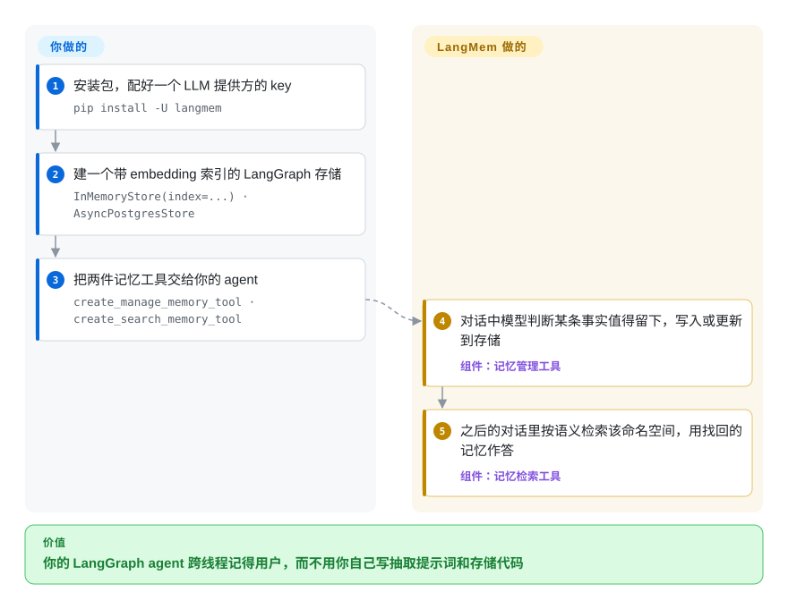

# LangMem

你的 LangGraph agent 一换对话线程就忘了用户说过“我喜欢深色模式”，自己写一套“什么值得记”的提示词再配上存储代码，又成了一个副业项目。LangMem 直接给 agent 两件现成工具——存一条记忆、搜一下记忆——底下用的是 LangGraph 自带的存储；也可以等对话结束后在后台把记忆提炼出来。

## 何时使用

你已经在用 LangGraph（或者 LangChain 配 LangGraph 的存储）搭 agent，用户却总在重复自己：客服机器人每次会话都要再问一遍客户买的是哪个套餐，个人助理每次都要重新发现用户写英式英语。你不想再单独起一个记忆服务，只想让记忆落在 LangGraph 部署里已有的那个 `BaseStore` 上（测试用内存版，生产用 `AsyncPostgresStore`）。LangMem 提供 `create_manage_memory_tool` / `create_search_memory_tool`，由模型在对话中自己调用；如果你不想在回复链路上多花 token，也可以用 `create_memory_store_manager` 加 `ReflectionExecutor`，等对话结束后再提取记忆。

和 [Mem0](mem0.zh.md) 比，决定因素是“留在 LangGraph 的存储和工具模型里”，而不是再加一套自带向量库的记忆栈；如果你不在 LangGraph 上，或者需要一个还在持续发版的库，就选 Mem0。和 [Graphiti](../graph-memory/graphiti.zh.md) 比，当“关于用户的扁平事实”就够用、不需要带时间有效期的实体关系时选 LangMem。它还附带一个提示词优化器（`create_prompt_optimizer`），根据反馈改写 agent 的系统提示——如果你说的“学习”是指令变好而不只是记住更多事实，这个有用。

## 怎么用起来

LangMem 是一组积木，不是服务器：没有要部署的东西。**它替你做的**是那部分 LLM 活：判断对话里哪些值得留下，和已有记忆合并（该更新就更新、该删就删，而不是越堆越多重复项），以及把搜索变成按语义相似度查找。**你要做的**是选存储和 embedding 模型（把文字变成可比较远近的数字向量），再把工具接进 agent。这里的“存储”是 LangGraph 的长期键值存储，可以带向量索引——可以把它想成按命名空间（如 `("memories", user_id)`）分抽屉的档案柜，每个抽屉还能按意思检索。下面这条“热路径”用法里，什么时候调用“存”或“搜”由模型自己决定，和它决定调用别的工具一样；后台模式则是在对话结束后让记忆管理器扫一遍对话记录，不拖慢当次回复。

<!-- flow-steps:begin (generated from flows/langmem.json by tools/flow_card.py — do not edit) -->

流程文字版

1. **你**：安装包，配好一个 LLM 提供方的 key — `pip install -U langmem`
2. **你**：建一个带 embedding 索引的 LangGraph 存储 — `InMemoryStore(index=...) · AsyncPostgresStore`
3. **你**：把两件记忆工具交给你的 agent — `create_manage_memory_tool · create_search_memory_tool`
4. **LangMem**：对话中模型判断某条事实值得留下，写入或更新到存储 — 组件：`记忆管理工具`
5. **LangMem**：之后的对话里按语义检索该命名空间，用找回的记忆作答 — 组件：`记忆检索工具`

**价值**：你的 LangGraph agent 跨线程记得用户，而不用你自己写抽取提示词和存储代码

<!-- flow-steps:end -->

## 何时不用

- **你不在 LangGraph / LangChain 上。** 这个包依赖 `langchain`、`langgraph`、`langsmith`、`langchain-openai`、`langchain-anthropic`，持久化走 LangGraph 的 `BaseStore`。如果你的 agent 跑在别的框架或者裸 SDK 循环上，改用 [Mem0](mem0.zh.md) 或 [Memori](memori.zh.md)，因为它们自带存储，不会把整套 LangChain 拉进依赖树。
- **你需要一个还在正常发版的库。** PyPI 上最后一个版本是 `0.0.30`（2025-10-27）；此后的提交基本是依赖升级和文档，版本号仍是 `0.0.x`。如果你需要缺陷修复按节奏发到 PyPI，改用 [Mem0](mem0.zh.md)（v2.x，发版频繁），因为 LangMem 合进 `main` 的修复可能永远不会发布。
- **写入失败不能静默。** 一个 2026-10-08 的未关闭 issue 报告 `MemoryStoreManager.invoke()` 在存储写入或删除失败时仍报告成功，另一个报告本地 `ReflectionExecutor` 会丢掉 LangGraph 入口注入的存储。如果悄悄丢一条记忆不可接受，改用 [Hindsight](hindsight.zh.md)（有自己 API 的记忆服务器），或者自己校验写入结果，因为这些问题都出在后台路径上。
- **你需要关系和“当时什么是真的”。** LangMem 把记忆当作命名空间里的文档存，不建实体图，也不记录有效期。当问题是“三月份谁向谁汇报”时，改用 [Graphiti](../graph-memory/graphiti.zh.md) 或 [Cognee](../graph-memory/cognee.zh.md)。
- **你要把记忆做成多个应用、多种语言共用的服务。** LangMem 跑在你的 Python 进程里。当 TypeScript 前端、第二个 agent 和一个批处理任务都要通过 HTTP 访问同一份记忆时，改用 [Hindsight](hindsight.zh.md) 或 [Supermemory](supermemory.zh.md)。
- **你想让 agent 运行时全权管理记忆。** 当 agent 应该自己改写持久的记忆块、而不用你去设计命名空间和工具时，改用 [Letta Code](../../agent-frameworks/coding-agents/terminal-agents/letta-code.zh.md)（旧的 Letta 服务器已退役，见 [Letta 页面](letta.zh.md)）。

## 横向对比

| 替代品 | 是否收录 | 我们的评价 | 取舍 |
|---|---|---|---|
| [Mem0](mem0.zh.md) | 已收录 | 不在 LangGraph 上、或需要一个仍在发版的库时选 Mem0；只有“把记忆留在 LangGraph 的存储和工具调用里”本身就是目的时才选 LangMem。 | Mem0 自带抽取管线、向量库和托管选项；代价是在 LangGraph 的存储旁边再多一套存储栈。 |
| [Graphiti](../graph-memory/graphiti.zh.md) | 已收录 | 记忆必须表达实体、关系和时间有效期时选 Graphiti；在 LangGraph agent 里存扁平的用户事实和偏好时选 LangMem。 | Graphiti 能回答关系类和“截至某时”的问题；但它需要图数据库（Neo4j、FalkorDB 或 Neptune），LangMem 从不需要。 |
| [Hindsight](hindsight.zh.md) | 已收录 | 多个应用或多种语言要通过 API 共享同一份记忆时选 Hindsight；记忆只是一个 Python agent 里几次工具调用时选 LangMem。 | 服务器能让多个客户端共用一份记忆，但也多了一个要运维、要做安全的服务。 |
| [Memori](memori.zh.md) | 已收录 | 想通过包装你已经在调用的 LLM 客户端来自动记录、且不用任何 agent 框架时选 Memori；想让 agent 通过工具自己决定存什么时选 LangMem。 | Memori 对你的代码透明；LangMem 把记忆变成显式、可检查的工具调用。 |
| [LangGraph](../../agent-frameworks/agent-runtimes/agent-sdks/langgraph.zh.md) 自带存储 | 已收录 | 记忆结构很小且固定时，直接用 LangGraph 存储加自己的 `put` / `search` 调用；想让 LLM 决定抽取什么、怎么合并时再加 LangMem。 | 手写的完全可预测，但抽取提示词和去重逻辑都得你自己写。 |

## 技术栈

- **Python**（`requires-python >= 3.10`），用 hatchling 打包，PyPI 包名 `langmem`。
- **LangGraph**（`langgraph >= 0.6, < 2`）：agent 循环、`BaseStore` 长期记忆和 `langgraph-checkpoint`。
- **LangChain 核心与模型提供方包**（`langchain`、`langchain-openai`、`langchain-anthropic`）负责调用模型；**trustcall** 负责对记忆对象做结构化抽取和补丁式更新。
- **LangSmith** 客户端是硬依赖（运行时追踪可选）。

## 依赖

- **一个 LLM 提供方的 API key**（如 `ANTHROPIC_API_KEY` 或 `OPENAI_API_KEY`）——抽取、合并和 agent 本身都要调模型。
- **一个 embedding 模型**，如果要对记忆做语义搜索（README 用的是 `openai:text-embedding-3-small`，1536 维）。
- **一个 LangGraph 存储**：`InMemoryStore` 重启即丢；生产需要落库的存储，例如 `AsyncPostgresStore`（PostgreSQL 加向量索引），或 LangGraph Platform 部署里自带的存储。

## 运维难度

**已经在跑 LangGraph 的话低，否则中等。** 没有 LangMem 服务——它就是你进程里的一个库——所以运维负担是你已经在运维的存储（或者现在要新加的：给 `AsyncPostgresStore` 用的 PostgreSQL），外加每次后台抽取都会增长的 LLM / embedding 费用。真正长期的活是锁版本：LangChain / LangGraph 的依赖区间变得比 LangMem 发版快，而 `0.0.x` 的库不承诺 API 稳定。

## 健康度与可持续性

- **在滑行，不是废弃（截至 2026-10-08）。** 提交一直有（最近一次 2026-10-02），但从 2025 年中起几乎都是 Dependabot 升级、依赖现代化和文档修复；PyPI 最后一个版本是 2025-10-27 的 0.0.30。雷达上维护度的 **A** 反映的是提交活跃度，不是功能开发或发版——要和这段发版空窗一起看。
- **治理 B——大厂里的小团队。** 过去一年 3 位活跃维护者，头号贡献者约占 60% 的提交；路线图归 LangChain 公司，它同时拥有 LangGraph 和 LangSmith。
- **背书与寿命 C。** 约 21 个月（2025-01-21 创建），太年轻，Lindy 先验帮不上忙。LangChain 是个能活下去的厂商，但多次重塑过自己的产品线；应把 LangMem 看成 LangGraph 的卫星，它的命运跟着 LangGraph 的记忆方案走 [推断]。
- **采用度 B。** 上个月 PyPI 下载 773,504 次，约 1.7k 星；下载量很可能包含经 LangChain 工具链带进来的传递安装，生产使用情况未确认。
- **风险信号：** MIT 许可，无改许可历史；1.0 之前的 API；后台记忆路径上有未关闭的正确性问题报告。

## 存疑（未验证）

- [推断] “在滑行”是从提交信息和 PyPI 发版记录读出来的，不是维护者的声明；LangChain 仍可能发新版本。
- [未验证] 关于 `MemoryStoreManager.invoke()` 写入失败仍报成功、以及 `LocalReflectionExecutor` 丢掉注入存储的未关闭 issue，本次没有复现。
- [推断] LangMem 的前途跟着 LangGraph 走：如果 LangGraph 原生提供记忆抽取，LangMem 可能被并入或被搁置。
- [未验证] 每月 773,504 次的下载量可能被传递依赖或 CI 安装放大，不能当作生产部署的证据。
- [未验证] 提示词优化器（`create_prompt_optimizer`）的行为没有实测，只依据包导出和 README 列出。
