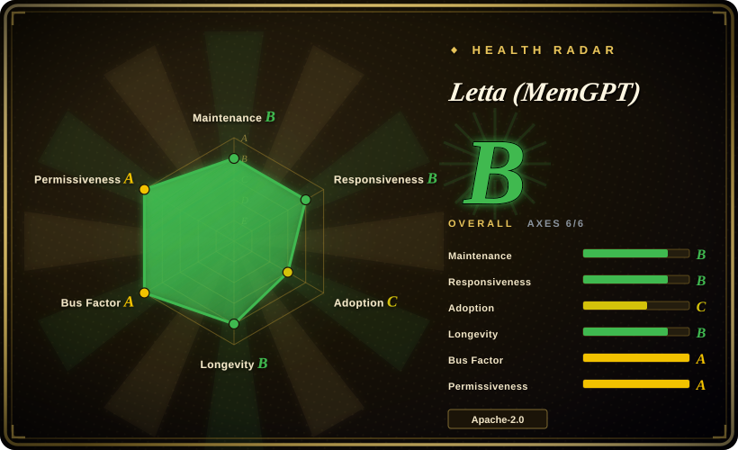
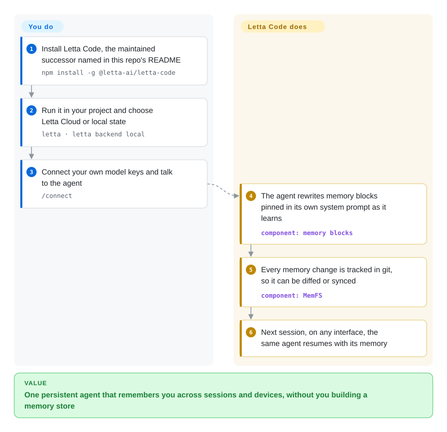

# Letta (MemGPT)

Agents that meet you as a stranger every session are what MemGPT set out to fix: an agent that edits its own long-term memory and is still the same agent weeks later. This repository no longer holds that code — the Letta V1 Python server was retired in August 2026 and parked on an `archive` branch, and maintained Letta now ships as Letta Code, a TypeScript agent harness; this page tells you what that means for your choice.

## When to use

Two situations bring you here. First: a paper, blog post or older tutorial pointed you at `letta-ai/letta` (25k+ stars, the MemGPT name, a `letta/letta` Docker image) and you are deciding whether to build on it. Second: you already run a self-hosted Letta V1 server — the Python API server behind `letta-client` — and need to know whether it is still safe. For both, the answer this page records is the same: the repo's own `SECURITY.md` and `AGENTS.md` (2026-08) say the V1 server is retired, unsupported, gets no security fixes, and must not be used for production, demos, benchmarks or comparisons. You use this page to route to the maintained path, not to adopt the code in this repo.

Reach for Letta's *current* runtime (Letta Code, `npm install -g @letta-ai/letta-code`) when you want the agent runtime itself to own memory: the agent keeps "memory blocks" — persistent text sections pinned into its own system prompt — and rewrites them as it learns, with every change versioned in git. That beats adding a memory library like [Mem0](mem0.md) or [LangMem](langmem.md) to your own loop only when you are willing to let Letta be the loop; if you want to keep your own agent code and just bolt memory on, those libraries are the better fit.

## How it works

The retired V1 server was a REST API service (Python, PostgreSQL or SQLite) that held agents and their memory on the server side; you called it from SDKs. **Current Letta moved that whole job into Letta Code**, which this repo's README now points to. **What Letta does for you:** it runs the agent loop, keeps the agent's identity and memory blocks, lets the agent rewrite those blocks itself, and records every memory change in a git-tracked folder (MemFS — a "memory file system", plain files under version control) so you can diff or sync it. Optionally it "dreams" (`/sleeptime`): a periodic background pass that reflects on recent conversations and consolidates memory. **What you do:** install the CLI, choose where state lives — Letta Cloud (the default, a hosted service) or local — connect your own model API keys, and talk to the agent from the terminal, the desktop app, chat channels, or the TypeScript Agent SDK. To self-host a server you now run `letta server` (the App Server) instead of the old Docker image.

<!-- flow-steps:begin (generated from flows/letta.json by tools/flow_card.py — do not edit) -->

Text version of the flow

1. **You**: Install Letta Code, the maintained successor named in this repo's README — `npm install -g @letta-ai/letta-code`
2. **You**: Run it in your project and choose Letta Cloud or local state — `letta · letta backend local`
3. **You**: Connect your own model keys and talk to the agent — `/connect`
4. **Letta (MemGPT)**: The agent rewrites memory blocks pinned in its own system prompt as it learns — component: `memory blocks`
5. **Letta (MemGPT)**: Every memory change is tracked in git, so it can be diffed or synced — component: `MemFS`
6. **Letta (MemGPT)**: Next session, on any interface, the same agent resumes with its memory

**Value**: One persistent agent that remembers you across sessions and devices, without you building a memory store

<!-- flow-steps:end -->

## When NOT to use

- **Do not deploy this repository's code — it is retired (archived to the `archive` branch on 2026-08-16).** The maintainers state the V1 server, its old Python server packages and the `letta/letta` Docker images get no fixes or security updates. For Letta itself use [Letta Code](../../agent-frameworks/coding-agents/terminal-agents/letta-code.md); for a maintained self-hosted memory service use [Hindsight](hindsight.md) or [Supermemory](supermemory.md); for an embeddable library use [Mem0](mem0.md).
- **Do not benchmark or compare against the old server.** Its `AGENTS.md` explicitly prohibits using the archive for benchmarks or comparisons with other memory systems, because results would describe retired code. Evaluate current Letta Code, or compare [Mem0](mem0.md) / [Hindsight](hindsight.md) directly.
- **You want memory inside your own agent loop.** Letta wants to be the runtime. If you keep your own LangGraph, OpenAI Agents or plain-SDK loop, use [LangMem](langmem.md) (LangGraph) or [Mem0](mem0.md) / [Memori](memori.md) (any framework) instead, because they add memory without handing over control of the loop.
- **You need a Python-first stack.** Current Letta is TypeScript/Node: the CLI is an npm package and the new Agent SDK is TypeScript (the older V1 Python client targets the V1 API). Use [Mem0](mem0.md) or [LangMem](langmem.md) instead when Python embedding is a hard requirement.
- **You need agent state to stay off vendor infrastructure by default.** Letta Code defaults to Letta Cloud on first launch (local is a choice, and features such as remote computers and secrets require signing in). If an air-gapped deployment is mandatory, prefer [Mem0](mem0.md) open-source mode or self-hosted [Hindsight](hindsight.md), whose default is your own storage.
- **You only want Claude Code to remember things.** Use [claude-mem](../coding-agent-memory/claude-mem.md), or [Claude Subconscious](../coding-agent-memory/claude-subconscious.md) if you specifically want a Letta agent watching your Claude Code sessions.

## Comparison

| Alternative | In index | Our verdict | Tradeoff |
|---|---|---|---|
| [Letta Code](../../agent-frameworks/coding-agents/terminal-agents/letta-code.md) | ✅ | If you want Letta at all, pick Letta Code — it is where the maintainers moved every live feature; treat this repo only as a historical pointer. | Agents own and rewrite their memory blocks with git-tracked history; you accept a TypeScript runtime that defaults to Letta Cloud. |
| [Mem0](mem0.md) | ✅ | Pick Mem0 when you want to add memory to your own agent in Python or TypeScript and keep control of the loop; pick Letta Code when you want the runtime to own memory and identity. | Mem0 is a library plus optional hosted API with frequent releases; it does not give the agent self-editing memory blocks. |
| [Hindsight](hindsight.md) | ✅ | Pick Hindsight when you need a maintained, self-hosted memory server that several apps call — the role many teams used the Letta V1 server for. | One more service to run, but no dependence on a retired codebase or a vendor cloud default. |
| [LangMem](langmem.md) | ✅ | Pick LangMem when you are on LangGraph and want the model to save and search memories through tools in your own graph. | Stays inside LangGraph's store; it is coasting at 0.0.x and has no agent-identity or dreaming layer. |
| [Claude Subconscious](../coding-agent-memory/claude-subconscious.md) | ✅ | Pick it only to try a Letta agent as a background memory for Claude Code; it is a low-activity demo, not a general Letta deployment. | Shows the memory-block pattern on a real coding loop; needs a Letta API key and carries a demo's maintenance limits. |

## Tech stack

- **This repository (`main`)**: documentation only — README, `AGENTS.md`, `SECURITY.md`, policies. GitHub reports no primary language for it any more.
- **Retired V1 server (`archive` branch, last release 0.16.8 on 2026-05-14)**: Python 3.11–3.13, FastAPI/uvicorn REST server, SQLAlchemy + Alembic, PostgreSQL with pgvector or SQLite with sqlite-vec, LlamaIndex embeddings, OpenTelemetry, the `mcp` library.
- **Current Letta (Letta Code)**: TypeScript CLI distributed as `@letta-ai/letta-code` on npm (Node.js 22.19+ per the archived README), a TypeScript Agent SDK (`@letta-ai/letta-agent-sdk`), git-backed MemFS for memory, and an App Server started with `letta server`.

## Dependencies

- **For the current path:** Node.js and npm; an LLM API key you connect with `/connect` (OpenAI, Anthropic, Z.ai and others) or a Letta account for Letta Cloud; git for MemFS-tracked memory.
- **Optional:** a Letta Cloud account for cross-machine agents, remote computers and secrets; your own host for `letta server` if you self-host.
- **For the retired server (do not adopt):** PostgreSQL + pgvector (or SQLite), Python 3.11+, model-provider keys, and the `letta/letta` Docker image — none of which now receive security updates.

## Ops difficulty

**Low to start, medium to self-host — and a migration if you run V1 today.** The current CLI installs with one npm command and can keep state in Letta Cloud, so a single developer has almost nothing to operate. Self-hosting means running and securing `letta server` yourself. If you operate a Letta V1 server, the real ops item is migration: the server, its packages and Docker images are out of security support, so plan a move to Letta Code's App Server or to another memory service rather than patching the archive.

## Health & viability

- **This repository is retired; the radar overstates it.** Maintenance B (last commit 28 days before scoring) and longevity B (1093 days old) count commits to a landing page — spam guards, policy text — not server development. The code's maintainers declared it unsupported in August 2026; treat this repo as frozen. The radar's overall **B** should not be read as "safe to adopt".
- **The project behind it is active.** Letta (the company) moved development to `letta-ai/letta-code`, which released v0.34.5 on 2026-10-08 and pushes daily. Judge Letta's viability by that repository — see the [Letta Code page](../../agent-frameworks/coding-agents/terminal-agents/letta-code.md) for its own radar.
- **Governance A, responsiveness B — historical team signal.** 23 active maintainers in the trailing 12 months and a 59.2-hour median first response on qualifying issues reflect the team that built V1; they say the vendor has capacity, not that this code gets fixes.
- **Adoption C.** 1,032,185 pulls of the now-retired `letta/letta` Docker image — an install base that now has to migrate.
- **Risk flags:** Apache-2.0, no relicense; abrupt product-generation change (V1 server → Letta Code; AgentFile `.af` import/export removed from Letta Code); the current product defaults to a vendor cloud.

## Caveats (unverified)

- [未验证] The migration path from a V1 server's data to Letta Code / the App Server was not exercised; whether existing agents and memories carry over cleanly is unconfirmed.
- [未验证] Whether the older V1 client SDKs (`letta-client`) will keep working against Letta Cloud long-term is not documented in the sources read.
- [推断] The Letta Cloud default may change product terms or pricing over time; self-hosting via `letta server` is the hedge, but its feature parity with the cloud was not verified.
