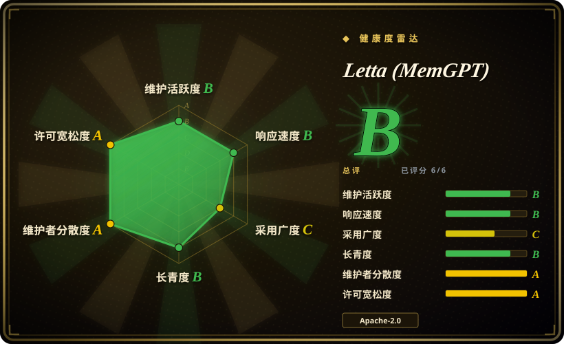
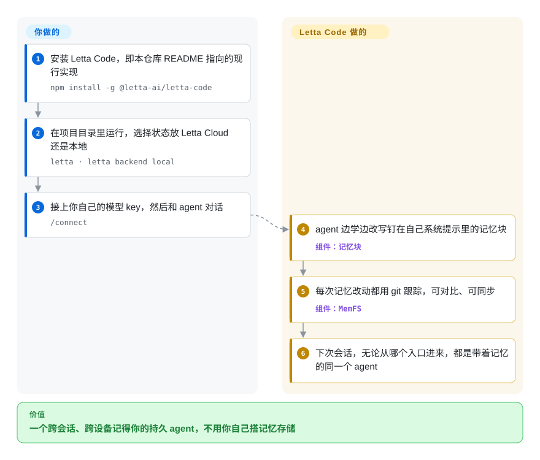

# Letta (MemGPT)

agent 每次见你都像第一次见面——MemGPT 当年要解决的就是这个：让 agent 自己改写长期记忆，几周后还是同一个 agent。但这个仓库里已经不是那套代码了：Letta V1 的 Python 服务器在 2026 年 8 月退役、挪到了 `archive` 分支，还在维护的 Letta 现在是 TypeScript 写的 agent 运行框架 Letta Code；本页告诉你这对选型意味着什么。

## 何时使用

有两种情况会让你来到这里。第一种：某篇论文、博客或旧教程把你指向了 `letta-ai/letta`（2.5 万多星、MemGPT 的名字、一个 `letta/letta` Docker 镜像），你在决定要不要基于它开发。第二种：你已经自托管着一台 Letta V1 服务器——就是 `letta-client` 背后那个 Python API 服务器——想知道它还安不安全。两种情况本页给的答案相同：仓库自己的 `SECURITY.md` 和 `AGENTS.md`（2026-08）写明 V1 服务器已退役、不再支持、不再有安全修复，不得用于生产、演示、基准测试或横向对比。你用这一页是为了找到仍在维护的路径，而不是采用这个仓库里的代码。

当你想让 agent 运行时自己全权管理记忆时，考虑 Letta *现在*的运行时（Letta Code，`npm install -g @letta-ai/letta-code`）：agent 持有若干“记忆块”——钉在它自己系统提示里的持久文本段——并随着学习自己改写它们，每次改动都用 git 记版本。只有当你愿意让 Letta 来当这个 agent 循环时，它才比往自己的循环里加 [Mem0](mem0.zh.md) 或 [LangMem](langmem.zh.md) 这类记忆库更合适；如果你想保留自己的 agent 代码、只是把记忆接上去，那些库更对路。

## 怎么用起来

退役的 V1 服务器是一个 REST API 服务（Python，PostgreSQL 或 SQLite），在服务端保存 agent 和它们的记忆，你通过 SDK 调用它。**现在的 Letta 把这整件事搬进了 Letta Code**，本仓库的 README 现在就指向它。**Letta 替你做的：**跑 agent 循环，保存 agent 的身份和记忆块，让 agent 自己改写这些记忆块，并把每次记忆改动记进一个用 git 跟踪的目录（MemFS，“记忆文件系统”，即放在版本控制下的普通文件），方便你对比差异或同步。它还可以“做梦”（`/sleeptime`）：定期在后台回顾最近的对话、整理记忆。**你要做的：**安装 CLI，选状态存在哪——Letta Cloud（默认，一个托管服务）或本地——接上你自己的模型 API key，然后在终端、桌面应用、聊天渠道或 TypeScript Agent SDK 里和 agent 对话。要自托管服务器，现在是跑 `letta server`（App Server），而不是旧的 Docker 镜像。

<!-- flow-steps:begin (generated from flows/letta.json by tools/flow_card.py — do not edit) -->

流程文字版

1. **你**：安装 Letta Code，即本仓库 README 指向的现行实现 — `npm install -g @letta-ai/letta-code`
2. **你**：在项目目录里运行，选择状态放 Letta Cloud 还是本地 — `letta · letta backend local`
3. **你**：接上你自己的模型 key，然后和 agent 对话 — `/connect`
4. **Letta (MemGPT)**：agent 边学边改写钉在自己系统提示里的记忆块 — 组件：`记忆块`
5. **Letta (MemGPT)**：每次记忆改动都用 git 跟踪，可对比、可同步 — 组件：`MemFS`
6. **Letta (MemGPT)**：下次会话，无论从哪个入口进来，都是带着记忆的同一个 agent

**价值**：一个跨会话、跨设备记得你的持久 agent，不用你自己搭记忆存储

<!-- flow-steps:end -->

## 何时不用

- **不要部署这个仓库的代码——它已退役（2026-08-16 挪到 `archive` 分支）。** 维护者声明 V1 服务器、旧的 Python 服务端包和 `letta/letta` Docker 镜像都不再有修复和安全更新。要用 Letta 本身，改用 Letta Code（未收录）；要一个仍在维护的自托管记忆服务，改用 [Hindsight](hindsight.zh.md) 或 [Supermemory](supermemory.zh.md)；要一个可嵌入的库，改用 [Mem0](mem0.zh.md)。
- **不要拿旧服务器做基准测试或对比。** 它的 `AGENTS.md` 明确禁止用归档代码做基准测试或与其他记忆系统对比，因为结果描述的是已退役的代码。要评估就评估现在的 Letta Code，或者直接对比 [Mem0](mem0.zh.md) / [Hindsight](hindsight.zh.md)。
- **你想把记忆放进自己的 agent 循环。** Letta 要当运行时本身。如果你保留自己的 LangGraph、OpenAI Agents 或裸 SDK 循环，改用 [LangMem](langmem.zh.md)（LangGraph）或 [Mem0](mem0.zh.md) / [Memori](memori.zh.md)（任意框架），因为它们只加记忆，不接管循环。
- **你需要 Python 优先的技术栈。** 现在的 Letta 是 TypeScript / Node：CLI 是 npm 包，新的 Agent SDK 是 TypeScript（较老的 V1 Python 客户端对接的是 V1 API）。当必须在 Python 里嵌入时，改用 [Mem0](mem0.zh.md) 或 [LangMem](langmem.zh.md)。
- **你需要 agent 状态默认不落在厂商基础设施上。** Letta Code 首次启动默认用 Letta Cloud（本地是可选项，而远程计算机、密钥管理等功能需要登录）。如果必须物理隔离部署，优先选 [Mem0](mem0.zh.md) 的开源模式或自托管的 [Hindsight](hindsight.zh.md)，它们默认用你自己的存储。
- **你只是想让 Claude Code 记住东西。** 用 [claude-mem](../coding-agent-memory/claude-mem.zh.md)；如果你就是想让一个 Letta agent 在后台旁观你的 Claude Code 会话，用 [Claude Subconscious](../coding-agent-memory/claude-subconscious.zh.md)。

## 横向对比

| 替代品 | 是否收录 | 我们的评价 | 取舍 |
|---|---|---|---|
| Letta Code（`letta-ai/letta-code`） | 未收录 | 只要你想用 Letta，就选 Letta Code——维护者把所有还活着的功能都搬过去了；本仓库只当历史指路牌。 | agent 自己持有并改写记忆块，历史用 git 跟踪；代价是 TypeScript 运行时，且默认走 Letta Cloud。 |
| [Mem0](mem0.zh.md) | 已收录 | 想在 Python 或 TypeScript 里给自己的 agent 加记忆、并保留对循环的控制时选 Mem0；想让运行时全权管记忆和身份时选 Letta Code。 | Mem0 是库加可选的托管 API，发版频繁；它不提供 agent 自己改写的记忆块。 |
| [Hindsight](hindsight.zh.md) | 已收录 | 需要一个仍在维护、可自托管、供多个应用调用的记忆服务器时选 Hindsight——这正是很多团队当初用 Letta V1 服务器的角色。 | 多运维一个服务，但不依赖已退役的代码库，也没有厂商云的默认值。 |
| [LangMem](langmem.zh.md) | 已收录 | 在 LangGraph 上、想让模型通过工具在你自己的图里存取记忆时选 LangMem。 | 留在 LangGraph 的存储里；但它停在 0.0.x 滑行，没有 agent 身份或“做梦”这一层。 |
| [Claude Subconscious](../coding-agent-memory/claude-subconscious.zh.md) | 已收录 | 只在想试试“Letta agent 给 Claude Code 当后台记忆”时选它；它是低活跃度的演示，不是通用的 Letta 部署。 | 在真实编码循环上展示了记忆块模式；需要 Letta API key，并带着演示项目的维护局限。 |

## 技术栈

- **本仓库（`main`）**：只有文档——README、`AGENTS.md`、`SECURITY.md` 和各类政策。GitHub 已不再为它报告主语言。
- **已退役的 V1 服务器（`archive` 分支，最后版本 0.16.8，2026-05-14）**：Python 3.11–3.13，FastAPI / uvicorn REST 服务，SQLAlchemy + Alembic，PostgreSQL 加 pgvector 或 SQLite 加 sqlite-vec，LlamaIndex embedding，OpenTelemetry，`mcp` 库。
- **现在的 Letta（Letta Code）**：TypeScript CLI，以 `@letta-ai/letta-code` 发布在 npm（归档 README 写明需 Node.js 22.19+），TypeScript Agent SDK（`@letta-ai/letta-agent-sdk`），基于 git 的 MemFS 记忆，以及用 `letta server` 启动的 App Server。

## 依赖

- **现行路径：** Node.js 和 npm；用 `/connect` 接入的 LLM API key（OpenAI、Anthropic、Z.ai 等），或用于 Letta Cloud 的 Letta 账号；MemFS 跟踪记忆需要 git。
- **可选：** Letta Cloud 账号，用于跨机器的 agent、远程计算机和密钥；自托管时为 `letta server` 准备自己的主机。
- **已退役服务器（不要采用）：** PostgreSQL + pgvector（或 SQLite）、Python 3.11+、模型提供方 key，以及 `letta/letta` Docker 镜像——这些都不再有安全更新。

## 运维难度

**上手低，自托管中等——如果你今天在跑 V1，还多一次迁移。** 现在的 CLI 一条 npm 命令就能装上，状态可以放在 Letta Cloud，单个开发者几乎没什么要运维。自托管意味着你自己运行并加固 `letta server`。如果你在运维一台 Letta V1 服务器，真正的运维事项是迁移：服务器、相关包和 Docker 镜像都已不在安全支持范围内，应计划迁到 Letta Code 的 App Server 或另一个记忆服务，而不是给归档代码打补丁。

## 健康度与可持续性

- **这个仓库已退役，雷达高估了它。** 维护度 B（评分时最后一次提交在 28 天前）和寿命 B（1093 天）数的是落地页的提交——防垃圾 issue、政策文本——不是服务器开发。代码的维护者在 2026 年 8 月宣布它不再支持；应把这个仓库当作已冻结。雷达总评 **B** 不能读成“可以放心采用”。
- **背后的项目是活跃的。** Letta（公司）把开发搬到了 `letta-ai/letta-code`，它在 2026-10-08 发布了 v0.34.5，几乎每天都有推送。判断 Letta 的可持续性要看那个仓库，本索引还没给它评分。
- **治理 A、响应 B——历史团队信号。** 过去 12 个月 23 位活跃维护者，合格 issue 的首次响应中位数 59.2 小时，反映的是做出 V1 的那支团队；说明厂商有人手，不说明这份代码还会被修。
- **采用度 C。** 已退役的 `letta/letta` Docker 镜像拉取 1,032,185 次——这批装机量现在都得迁移。
- **风险信号：** Apache-2.0，无改许可历史；产品代际突变（V1 服务器 → Letta Code；Letta Code 已移除 AgentFile `.af` 导入导出）；现行产品默认走厂商云。

## 存疑（未验证）

- [未验证] 没有实测从 V1 服务器数据迁到 Letta Code / App Server 的路径；现有 agent 和记忆能否干净地迁过去未确认。
- [推断] Letta Code 自身的健康度（发版节奏、巴士因子）只看了仓库元数据，本索引尚未评分。
- [未验证] 读过的资料没有说明较老的 V1 客户端 SDK（`letta-client`）能否长期继续对接 Letta Cloud。
- [推断] Letta Cloud 作为默认可能随时间改变产品条款或定价；用 `letta server` 自托管是对冲手段，但它与云端的功能对等没有核实。
