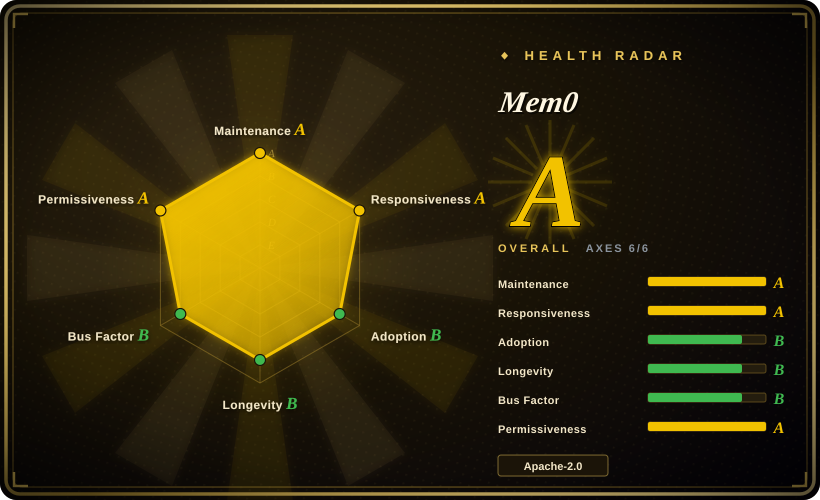
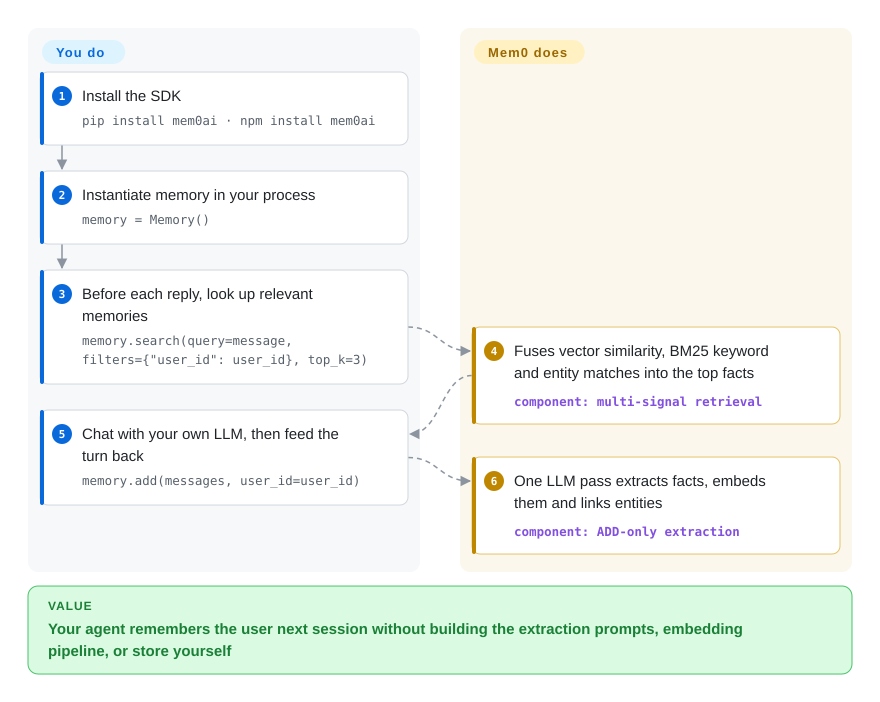

# Mem0

Every new chat session starts from zero — your assistant re-asks what it already knew. Mem0 runs an LLM extraction pass over each conversation turn, stores the durable facts it distills ("user is vegetarian") in a vector store, and hands back only the relevant ones before the next reply, so you don't stuff whole transcripts into the prompt.

## When to use

You're building a chatbot, support agent, or personal assistant on top of an LLM, and you've hit the obvious wall: every new session starts from zero. Stuffing the whole prior conversation back into the prompt blows your context window and your token bill, and a raw RAG-over-transcripts setup retrieves noisy chunks instead of the few durable facts ("user is vegetarian", "prefers terse answers", "works in EU timezone") that actually personalize the next reply. You want a drop-in layer that watches the conversation, extracts the salient facts, and hands back only the relevant ones at retrieval time — without you hand-rolling the extraction prompts, the embedding pipeline, and the store.

Mem0 is built for exactly this. You call `memory.add(messages, user_id=...)` after a turn and it runs an LLM pass to pull out memory-worthy facts, embeds them, and writes them to a vector store; before the next turn you call `memory.search(query=..., filters={"user_id": ...})` and get back the top relevant memories to inject into the prompt. It's LLM- and store-agnostic (OpenAI is the default LLM/embedder, but litellm, Groq, Gemini, Ollama and others are wired in; Qdrant is the default vector backend), ships Python (`pip install mem0ai`) and Node (`npm install mem0ai`) SDKs, and runs fully self-hosted from the OSS package — so you can prototype against the library and keep the data on your own infra. There's also a first-party CLI with an agent self-signup flow (`mem0 init --agent`) if you want a hosted key in four commands instead of running anything yourself.

## How it works

Mem0 sits inside your app process, between your conversation loop and the storage you've picked. On `add()`, a single LLM pass reads the turn, extracts memory-worthy facts, embeds each one, and writes it to a vector store (Qdrant by default); entities are extracted, embedded, and linked across memories to boost retrieval. On `search()`, three matchers — vector similarity, BM25 keyword, and entity matching — score in parallel and are fused, with time-aware ranking that picks the right dated instance when you ask about current state vs past events; the top-k memories come back as plain strings and *you* compose them into the system prompt. What stays yours: the LLM and embedder behind it (defaults `gpt-5-mini` and `text-embedding-3-small`), the vector store, and the hygiene of accumulated memories — extraction is ADD-only, so nothing self-corrects. The self-hosted server and paid Platform add dashboard, auth/API keys, and (on Platform) proprietary tuning on top of the same shape.

<!-- flow-steps:begin (generated from flows/mem0.json by tools/flow_card.py — do not edit) -->

Text version of the flow

1. **You**: Install the SDK — `pip install mem0ai · npm install mem0ai`
2. **You**: Instantiate memory in your process — `memory = Memory()`
3. **You**: Before each reply, look up relevant memories — `memory.search(query=message, filters={"user_id": user_id}, top_k=3)`
4. **Mem0**: Fuses vector similarity, BM25 keyword and entity matches into the top facts — component: `multi-signal retrieval`
5. **You**: Chat with your own LLM, then feed the turn back — `memory.add(messages, user_id=user_id)`
6. **Mem0**: One LLM pass extracts facts, embeds them and links entities — component: `ADD-only extraction`

**Value**: Your agent remembers the user next session without building the extraction prompts, embedding pipeline, or store yourself

<!-- flow-steps:end -->

## When NOT to use

- **You need memories to be corrected or forgotten in-place.** The current extraction algorithm is documented as **single-pass ADD-only — one LLM call, no UPDATE/DELETE; memories accumulate and nothing is overwritten** `[未验证]` (per README, April 2026). If a user says "actually I moved to Berlin", the old fact isn't superseded automatically — stale and contradictory memories pile up and you must prune them yourself. For mutable, authoritative user state, a plain database row is more honest than a memory layer.
- **You want a zero-LLM, deterministic store.** Every `add` costs an extra LLM call (latency + tokens on top of your main generation). If your "memory" is structured profile data or you can't afford the per-write inference, a key-value store or [Memori](memori.md)'s SQL-first approach fits better.
- **You're avoiding a hosted-platform upsell.** The OSS library is real and Apache-2.0, but the project sells a managed **Mem0 Platform**, and the README says the headline benchmark scores "reflect Mem0's managed platform, which includes proprietary optimizations not available in the open-source SDK" (README, 2026-09) — plus self-hosted server rows in its own comparison table advertise "Advanced Features: Teasers". Read the tiers before assuming OSS parity.
- **You need a mature, frozen API.** Memory extraction logic has changed materially across releases (the ADD-only algorithm replaced an earlier UPDATE/DELETE one, with a dedicated v2→v3 migration guide), and Python vs Node SDKs version independently. If you need long-term API stability, pin hard and expect churn.
- **Graph relationships are central to your use case.** The current README doesn't mention a graph-memory backend at all `[未验证]`; historically Mem0 has offered graph memory (e.g. Neo4j), but don't pick Mem0 *for* graph memory without verifying the release you install.

## Comparison

| Alternative | In index | Our verdict | Tradeoff |
|---|---|---|---|
| [Memori](memori.md) | ✅ | Choose Memori when database-native auditability matters more than drop-in vector memory. | SQL-first / database-native memory (queryable, auditable, no vector store required); Mem0 leans vector + LLM extraction and is more "drop-in" but less inspectable. |
| [claude-subconscious](../coding-agent-memory/claude-subconscious.md) | ✅ | Choose claude-subconscious when you want a Claude-specific hook memory experiment. | A Claude-specific subconscious/reflection memory experiment; Mem0 is general-purpose and LLM-agnostic across many providers. |
| [Zep](../graph-memory/zep.md) / [Graphiti](../graph-memory/graphiti.md) | ✅ | Choose Zep or Graphiti when temporal graph memory and explicit invalidation are central. | Temporal knowledge-graph memory with bi-temporal edges and explicit invalidation; stronger at evolving/contradicting facts where Mem0's ADD-only model accumulates. |
| [Letta (MemGPT)](letta.md) | ✅ | Choose Letta when you need a stateful agent runtime, not just a memory library. | Agent runtime with self-editing memory + a stateful server, not just a library; heavier, owns the agent loop rather than slotting under yours. |
| [LangMem (LangChain)](langmem.md) | ✅ | Choose LangMem when your memory layer should stay inside LangChain/LangGraph. | Memory utilities tied to the LangChain/LangGraph ecosystem; Mem0 is framework-neutral. |
| Plain pgvector + your own extraction | 未收录 | Choose plain pgvector when full schema and retrieval control outweigh Mem0's packaged layer. | Full control, no extra dependency or platform; you build and maintain the extraction prompts, schema, and retrieval that Mem0 gives you out of the box. |

## Tech stack

- **Language:** Python (primary); first-party TypeScript/Node SDK.
- **Core (Python `mem0ai` v2.2.1):** `pydantic` for models, `httpx`/`openai` for LLM calls, `qdrant-client` as default vector store, `sqlalchemy` for relational history, `posthog` for telemetry.
- **LLM/embedding layer:** OpenAI by default (default LLM `gpt-5-mini`, default embedder `text-embedding-3-small`, per README); pluggable extras verified on PyPI 2026-09: `llms` (litellm, groq, google-genai, ollama, together, vertexai), `nlp` (spaCy — the README's install for hybrid BM25 + entity search), `vector-stores` (chromadb, elasticsearch, faiss, ~20 more) and an `extras` group.
- **Retrieval:** README describes multi-signal retrieval — semantic (vector) search, BM25 keyword matching, and entity linking, with temporal reasoning.
- **Surfaces:** in-process library, first-party CLI (`@mem0/cli` on npm / `mem0-cli` on pip) with agent self-signup, installable agent skills (`npx skills add …` for Claude Code / Codex / Cursor / OpenCode), self-hosted Docker Compose server (auth on by default since recent builds), and the hosted Mem0 Platform (paid).

## Dependencies

- **Runtime:** Python `>=3.10,<4.0` (per PyPI metadata for v2.2.1); Node for the JS SDK.
- **Required Python deps:** `httpx>=0.28`, `openai>=1.90`, `pydantic>=2.7`, `qdrant-client>=1.12`, `sqlalchemy>=2.0`, `posthog>=7.14`, `pytz`, `protobuf>=5.29,<7` (PyPI metadata, 2026-09).
- **An LLM + embedder:** you must supply credentials/endpoints — an OpenAI key for the defaults, or a self-hosted model via Ollama/litellm. Every `add` makes an LLM call, so a reachable model is a hard dependency, not optional.
- **A vector store:** Qdrant by default; other stores (Elasticsearch, OpenSearch, pgvector, Chroma, etc.) via the `vector-stores`/`extras` install extras.
- **Install:** `pip install mem0ai` or `npm install mem0ai`; add `pip install mem0ai[nlp]` + `python -m spacy download en_core_web_sm` for the full hybrid search. Self-hosted server adds a Docker Compose stack (`cd server && make bootstrap`, or `docker compose up -d`).

## Ops difficulty

**Low-to-medium.** As an in-process library pointed at a managed LLM and a single Qdrant instance, it's a few lines and minimal ops — close to "just a dependency". It rises to **medium** when you self-host the server stack (Docker Compose, auth now on by default with an admin bootstrap, a vector DB you now operate and back up) and when you account for the LLM call on every write: that's added latency, a per-write token cost, and a new failure mode (LLM/embedder downtime stalls memory writes). Because extraction is ADD-only (see When NOT to use), you also inherit an ongoing *data-hygiene* burden — pruning stale/contradictory memories — that pure storage layers don't impose. The hosted Platform trades this ops for a bill and vendor dependency.

## Health & viability

- **Responsiveness**: Grade A — median first-response time 9.2 hours across 33 qualifying issues/PRs.
- **Maintenance (2026-09):** very actively maintained — Python v2.2.1 and Node ts-v3.3.1 both released 2026-09-25, a v2.2.0/ts-v3.3.0 pair two days earlier, plus plugin release trains (OpenCode, OpenClaw, pi-agent, DeepSeek) (GitHub releases API). Not archived. ~750 open issues is high in absolute terms but typical of a hot project at this star level, not a stall signal on its own.
- **Governance / bus factor:** owned by the `mem0ai` org (a commercial company, YC S24 badge in the README), not a foundation. Roadmap is vendor-controlled and steered by the paid **Mem0 Platform** business — a single-vendor open-core structure, not community governance. `[推断]`
- **Age & Lindy verdict:** ~3.3 years old (created 2023-06) and still active — long enough to have shed at least one major extraction-algorithm rewrite (UPDATE/DELETE → ADD-only), so it clears the basic Lindy bar (old + active), but the churn means *API* longevity is weaker than the project's.
- **Adoption:** the most-cited open-source agent-memory layer — ~66k stars and ~2.0M PyPI downloads/month (1,996,397 per the health scorer of 2026-09-27). The radar's adoption axis grades B: download *volume* tier is high but the dependency-graph signal is weak (0 dependent repos visible to the graph), and stars are a weak proxy either way. The README now also ships a research paper (arXiv 2504.19413) and an open-sourced evaluation framework.
- **Risk flags:** open-core — an Apache-2.0 library with a paid managed Platform on top; the README itself states the benchmark scores reflect **platform-only proprietary optimizations**, so expect OSS/Platform capability gaps. ADD-only accumulation is a *data-hygiene* liability, not a licensing one.

## Caveats (unverified)

- `[未验证]` "Single-pass ADD-only extraction — one LLM call, no UPDATE/DELETE; memories accumulate, nothing is overwritten" is the README's framing of its April-2026 algorithm, still present as of 2026-09; confirm against the exact release you install, as extraction logic has changed before.
- `[未验证]` Default models (`gpt-5-mini` LLM, `text-embedding-3-small` embedder) and the multi-signal retrieval description (semantic + BM25 + entity linking + temporal reasoning) are the README's own framing, not independently verified.
- `[未验证]` Benchmark figures the project cites (LoCoMo 92.5, LongMemEval 94.4, BEAM 64.1@1M / 48.6@10M, p50 latency ~0.88–1.09s, ~6.7–7.0K tokens) are first-party, self-reported, and per the README reflect the **managed platform**, not the OSS SDK — not independent results.
- `[未验证]` Whether a graph-memory backend (e.g. Neo4j) exists in the current OSS package: the 2026-09 README no longer mentions graph memory at all; check the docs for the version you install.
- `[未验证]` Star count ~66k as of 2026-09-27 (GitHub API) — GitHub stars are unreliable and time-sensitive; indicative only.
- `[推断]` Feature parity between the Apache-2.0 OSS package and the paid Mem0 Platform is partial by design; specific platform-only capabilities should be checked against current pricing/docs before assuming OSS covers them.
- `[推断]` Python (`v2.2.1`) and Node (`ts-v3.3.1`) SDKs version independently; behavior and feature coverage may differ between them at any given time.
