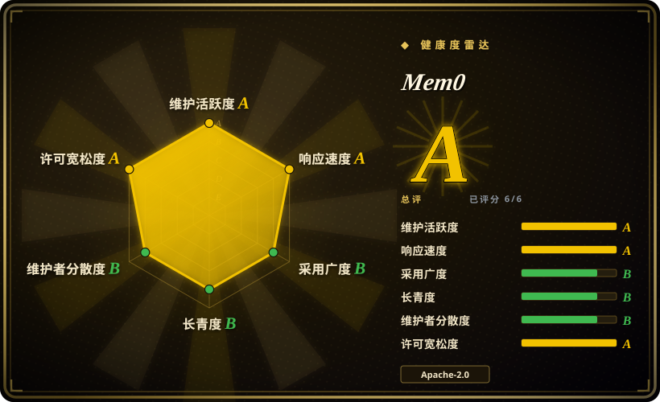
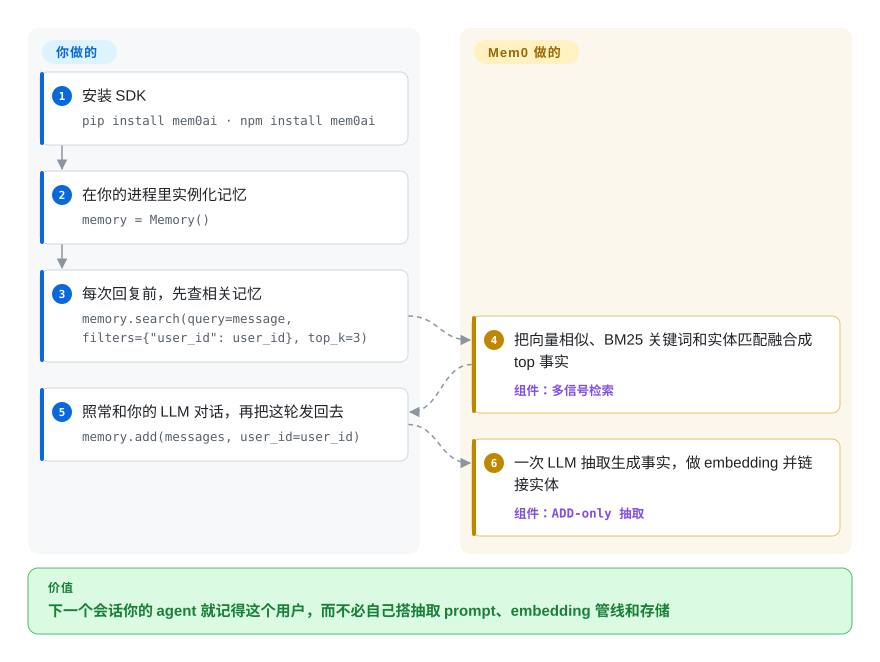

# Mem0

每开一个新会话都从零开始——你的助手反复问它本来已经知道的事。Mem0 对每轮对话跑一遍 LLM 抽取，把提炼出的持久事实（“用户吃素”）存进向量库，并在下一次回复前只把相关的几条递回来，省掉把整段 transcript 塞进 prompt 的做法。

## 何时使用

你在某个 LLM 之上搭聊天机器人、客服 agent 或个人助理，撞上了那堵显而易见的墙：每开一个新会话都从零开始。把之前整段对话重新塞回 prompt 会撑爆上下文窗口、烧掉 token 预算；而对原始对话记录直接做 RAG，检索回来的是嘈杂的片段，而不是真正能个性化下一句回复的那几条持久事实（“用户吃素”“偏好简短回答”“在欧洲时区上班”）。你想要一个即插即用的层：它盯着对话、抽出值得记住的事实，检索时只交还相关的几条——而不必你自己手搓抽取 prompt、embedding 管线和存储。

Mem0 正是为此而生。一轮对话后你调用 `memory.add(messages, user_id=...)`，它跑一遍 LLM 抽取把值得记的事实拉出来、做 embedding、写进向量库；下一轮之前你调用 `memory.search(query=..., filters={"user_id": ...})`，拿回 top 相关记忆注入 prompt。它与 LLM 和存储都解耦（默认用 OpenAI 做 LLM/embedder，但 litellm、Groq、Gemini、Ollama 等都已接好；默认向量后端是 Qdrant），同时提供 Python（`pip install mem0ai`）和 Node（`npm install mem0ai`）SDK，OSS 包即可完全自托管——你可以对着库原型开发，把数据留在自己的基础设施上。它还配了一等 CLI 与 agent 自助注册流程（`mem0 init --agent`），想四个命令拿到托管 key、什么都不自跑时可以用。

## 怎么用起来

Mem0 坐在你的进程内部，夹在你的对话循环和你已选定的存储之间。调用 `add()` 时，一次 LLM pass 读入这轮对话、抽出值得记的事实、逐条 embedding 写进向量库（默认 Qdrant）；实体会被抽取、embedding 并跨记忆链接起来，用于给检索加权。调用 `search()` 时，三个匹配器——向量相似、BM25 关键词、实体匹配——并行打分再融合，配合时间感知排序，让“当前状态”和“过去事件”各自命中正确日期的那条；返回的 top-k 记忆就是普通字符串，把**它拼进 system prompt 这一步仍归你**。留在你手里的还有：背后的 LLM 与 embedder（默认 `gpt-5-mini` 和 `text-embedding-3-small`）、向量库本身，以及累积记忆的卫生——抽取是 ADD-only，什么都不会自我修正。自托管 server 和付费 Platform 在同一形态之上再加 dashboard、auth/API key，以及（仅 Platform）专有调优。

<!-- flow-steps:begin (generated from flows/mem0.json by tools/flow_card.py — do not edit) -->

流程文字版

1. **你**：安装 SDK — `pip install mem0ai · npm install mem0ai`
2. **你**：在你的进程里实例化记忆 — `memory = Memory()`
3. **你**：每次回复前，先查相关记忆 — `memory.search(query=message, filters={"user_id": user_id}, top_k=3)`
4. **Mem0**：把向量相似、BM25 关键词和实体匹配融合成 top 事实 — 组件：`多信号检索`
5. **你**：照常和你的 LLM 对话，再把这轮发回去 — `memory.add(messages, user_id=user_id)`
6. **Mem0**：一次 LLM 抽取生成事实，做 embedding 并链接实体 — 组件：`ADD-only 抽取`

**价值**：下一个会话你的 agent 就记得这个用户，而不必自己搭抽取 prompt、embedding 管线和存储

<!-- flow-steps:end -->

## 何时不用

- **你需要就地修正或遗忘记忆。** 当前抽取算法被文档描述为**单遍 ADD-only——一次 LLM 调用，无 UPDATE/DELETE；记忆只累积，什么都不会被覆盖** `[未验证]`（README「New Memory Algorithm（April 2026）」一节，2026-09 仍在）。如果用户说“其实我搬到柏林了”，旧事实不会被自动取代——陈旧、矛盾的记忆会堆积，需要你自己去清理。对于可变、权威的用户状态，一行普通的数据库记录比记忆层更诚实。
- **你想要零 LLM、确定性的存储。** 每次 `add` 都额外耗一次 LLM 调用（在主生成之上叠加延迟和 token）。如果你的“记忆”本就是结构化的画像数据，或你负担不起每次写入的推理成本，键值存储或 [Memori](memori.zh.md) 那种 SQL-first 路线更合适。
- **你想躲开托管平台的引流。** OSS 库是真实的、Apache-2.0 的，但项目同时在卖托管的 **Mem0 Platform**，且 README 自己写着：头条跑分“反映的是 Mem0 托管平台，其中包含开源 SDK 拿不到的专有优化”（README，2026-09）——再加上官方三层对比表里自托管 server 的 Advanced Features 一栏标注“Teasers”。在假设 OSS 平价之前，先把三档读清楚。
- **你需要成熟、冻结的 API。** 记忆抽取逻辑在不同版本间有实质变化（ADD-only 算法取代了更早的 UPDATE/DELETE 版本，官方还专门写了 v2→v3 迁移指南），而且 Python 与 Node SDK 各自独立发版。如果你需要长期 API 稳定，请硬 pin 并预期会有变动。
- **图谱关系是你的核心场景。** 当前 README 已完全不提图记忆后端 `[未验证]`；Mem0 历史上提供过图记忆（如 Neo4j），但不要在未核实你所装版本的前提下，*为了*图记忆而选 Mem0。

## 横向对比

| 替代品 | 是否收录 | 我们的评价 | 取舍 |
|---|---|---|---|
| [Memori](memori.zh.md) | ✅ | 数据库原生的可审计性比即插即用向量记忆更重要时，选 Memori。 | SQL-first / 数据库原生记忆（可查询、可审计、不强制向量库）；Mem0 偏向向量 + LLM 抽取，更“即插即用”但更不可审视。 |
| [claude-subconscious](../coding-agent-memory/claude-subconscious.zh.md) | ✅ | 想要 Claude 专属 hook 记忆实验时，选 claude-subconscious。 | Claude 专属的潜意识/反思记忆实验；Mem0 是通用、跨多家 provider 的 LLM 无关方案。 |
| [Zep](../graph-memory/zep.zh.md) / [Graphiti](../graph-memory/graphiti.zh.md) | ✅ | 时序图记忆和显式失效是核心时，选 Zep 或 Graphiti。 | 时序知识图谱记忆，带双时态边和显式失效；在事实演化/相互矛盾的场景更强，而 Mem0 的 ADD-only 模型只会累积。 |
| [Letta (MemGPT)](letta.zh.md) | ✅ | 需要有状态 agent runtime 而不只是记忆库时，选 Letta。 | 带自编辑记忆 + 有状态 server 的 agent 运行时，而不只是一个库；更重，接管 agent 循环而非塞在你的循环下面。 |
| [LangMem (LangChain)](langmem.zh.md) | ✅ | 记忆层需要留在 LangChain/LangGraph 生态内时，选 LangMem。 | 绑定 LangChain/LangGraph 生态的记忆工具；Mem0 与框架无关。 |
| 自建 pgvector + 自写抽取 | 未收录 | 完全控制 schema 和召回比 Mem0 的打包层更重要时，选自建 pgvector。 | 完全可控、无额外依赖或平台；但 Mem0 开箱即给你的抽取 prompt、schema 和检索，都要你自己搭和维护。 |

## 技术栈

- **语言：** Python（主）；官方 TypeScript/Node SDK。
- **核心（Python `mem0ai` v2.2.1）：** `pydantic` 建模、`httpx`/`openai` 发 LLM 调用、`qdrant-client` 作默认向量库、`sqlalchemy` 存关系型历史、`posthog` 做遥测。
- **LLM/embedding 层：** 默认 OpenAI（据 README 默认 LLM `gpt-5-mini`、默认 embedder `text-embedding-3-small`）；经 PyPI 元数据（2026-09）核实可插拔 extras：`llms`（litellm、groq、google-genai、ollama、together、vertexai）、`nlp`（spaCy——README 为完整混合检索给的安装方式）、`vector-stores`（chromadb、elasticsearch、faiss 等约 20 个）以及 `extras` 分组。
- **检索：** README 描述多信号检索——语义（向量）检索、BM25 关键词匹配、实体链接，并带时序推理。
- **入口面：** 进程内库、一等 CLI（npm `@mem0/cli` / pip `mem0-cli`，支持 agent 自助注册）、可安装的 agent skills（`npx skills add …`，覆盖 Claude Code / Codex / Cursor / OpenCode）、自托管 Docker Compose server（近期版本 auth 默认开启），以及托管 Mem0 Platform（付费）。

## 依赖

- **运行时：** Python `>=3.10,<4.0`（据 v2.2.1 的 PyPI 元数据）；JS SDK 需 Node。
- **必需 Python 依赖：** `httpx>=0.28`、`openai>=1.90`、`pydantic>=2.7`、`qdrant-client>=1.12`、`sqlalchemy>=2.0`、`posthog>=7.14`、`pytz`、`protobuf>=5.29,<7`（PyPI 元数据，2026-09）。
- **一个 LLM + embedder：** 你必须提供凭证/端点——用默认就要 OpenAI key，或经 Ollama/litellm 接自托管模型。每次 `add` 都会发一次 LLM 调用，所以可达的模型是硬依赖，不是可选项。
- **一个向量库：** 默认 Qdrant；其他存储（Elasticsearch、OpenSearch、pgvector、Chroma 等）经 `vector-stores`/`extras` 安装 extras 接入。
- **安装：** `pip install mem0ai` 或 `npm install mem0ai`；要完整混合检索再加 `pip install mem0ai[nlp]` 和 `python -m spacy download en_core_web_sm`。自托管 server 另需一套 Docker Compose 栈（`cd server && make bootstrap`，或 `docker compose up -d`）。

## 运维难度

**低到中。** 作为进程内库，指向一个托管 LLM 和单个 Qdrant 实例时，几行代码、运维极少——接近“就是一个依赖”。当你自托管 server 栈（Docker Compose、现在默认开启的 auth 与 admin bootstrap、一个由你运维和备份的向量库）、以及把每次写入的 LLM 调用算进来时，难度升到**中**：那是额外的延迟、每次写入的 token 成本，和一个新的失败模式（LLM/embedder 宕机会卡住记忆写入）。由于抽取是 ADD-only（见“何时不用”），你还继承了一份持续的*数据卫生*负担——清理陈旧/矛盾的记忆——这是纯存储层不会强加的。托管 Platform 用账单和供应商依赖换掉这部分运维。

## 健康度与可持续性

- **响应速度**：Grade A——中位首次响应时间 9.2 小时，基于 33 个 qualifying issues/PRs。
- **维护（2026-09）：** 非常活跃——Python v2.2.1 与 Node ts-v3.3.1 同于 2026-09-25 发布，v2.2.0/ts-v3.3.0 一对两天前刚发，另有多条插件发版线（OpenCode、OpenClaw、pi-agent、DeepSeek）（GitHub releases API）。未归档。约 750 个 open issue 绝对值偏高，但对这个 star 量级的热门项目算正常，单看它不构成停滞信号。
- **治理 / bus factor：** 归 `mem0ai` 组织（一家商业公司，README 挂 YC S24 徽章）所有，不是基金会。路线图由厂商掌控、被付费的 **Mem0 Platform** 业务牵引——是单厂商 open-core 结构，而非社区治理。`[推断]`
- **年龄与 Lindy 判断：** 约 3.3 岁（创建于 2023-06）且仍活跃——存活到至少经历过一次抽取算法大重写（UPDATE/DELETE → ADD-only），所以越过了基本的 Lindy 门槛（老 + 活跃）；但这种 churn 意味着 *API* 的稳定性弱于项目本身的存续性。
- **采用度：** 被引用最多的开源 agent 记忆层——约 66k stars、PyPI 月下载量约 200 万（health scorer 原值 1,996,397，2026-09-27）。雷达采用度轴评 B：下载量高，但依赖图信号弱（图上可见的依赖仓库为 0），且 star 本就是弱代理。README 现在还给出了论文（arXiv 2504.19413）与开源的评测框架。
- **风险旗标：** open-core——Apache-2.0 库之上叠了付费托管 Platform；README 自己承认头条跑分来自**仅平台可用的专有优化**，预期 OSS 与 Platform 存在能力差。ADD-only 累积是一项*数据卫生*负担，而非许可证问题。

## 存疑（未验证）

- `[未验证]` “单遍 ADD-only 抽取——一次 LLM 调用，无 UPDATE/DELETE；记忆累积、什么都不覆盖”是 README 对其 April-2026 算法的表述（2026-09 仍在）；请对照你实际安装的版本核实，因为抽取逻辑此前变过。
- `[未验证]` 默认模型（LLM `gpt-5-mini`、embedder `text-embedding-3-small`）及多信号检索描述（语义 + BM25 + 实体链接 + 时序推理）都是 README 自己的表述，未经独立验证。
- `[未验证]` 项目引用的跑分（LoCoMo 92.5、LongMemEval 94.4、BEAM 64.1@1M / 48.6@10M、p50 延迟约 0.88–1.09s、约 6.7–7.0K token）是第一方自报，且按 README 说法反映的是**托管平台**而非 OSS SDK——非独立结果。
- `[未验证]` 当前 OSS 包是否有图记忆后端（如 Neo4j）：2026-09 的 README 已完全不提图记忆；请对照你要装的版本的文档核实。
- `[未验证]` star 数约 66k（截至 2026-09-27，GitHub API）——GitHub star 不可靠且对时间敏感，仅供参考。
- `[推断]` Apache-2.0 OSS 包与付费 Mem0 Platform 之间的功能平价是按设计部分的；具体仅平台可用的能力应对照当前定价/文档核实，别假设 OSS 全覆盖。
- `[推断]` Python（`v2.2.1`）与 Node（`ts-v3.3.1`）SDK 各自独立发版；两者在任一时点的行为和功能覆盖可能不同。
