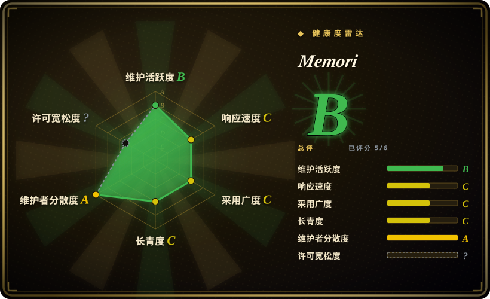
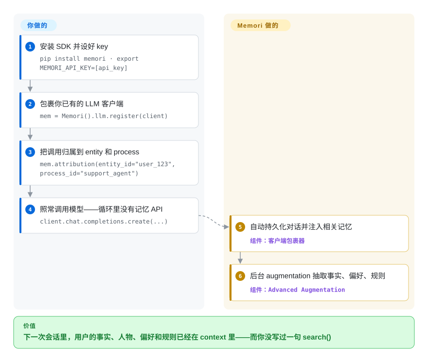

# Memori

你的 agent 每次会话都从零调用模型——它既不知道用户是谁，也不记得自己刚做过什么。Memori 包裹你已经在用的 LLM 客户端：每次调用都会在后台被自动捕获和召回，于是下一次会话里，相关的事实、人物、偏好和规则已经在 context 里，你不用写任何 `search()` 调用。

## 何时使用

你在 OpenAI 或 Anthropic 之上搭一个生产级客服 agent，而你一直在重复解决同一个问题：模型在会话之间什么都不记得，每次对话都从零开始。你不想手搓向量库、写召回胶水、设计记忆 schema——你想要的是 agent 能像人类同事那样*记住这个用户*（他的实体、偏好、过去的决策）。Memori 坐在你的代码和 LLM 之间：你注册现有客户端（`Memori().llm.register(client)`），给某次调用打上 `entity_id` 和 `process_id`，对话就会在后台被自动持久化并召回——于是下一次会话里，相关的 facts、people、preferences、rules 已经在 context 里了，你不用自己写召回管线。

当你想要的记忆是以*agent 做了什么*为锚、而不只是聊天记录时，它很合适——augmentation 层在后台按 entity / process / session 三个层级抽取 attributes、events、facts、people、preferences、relationships、rules、skills，号称对热路径“零延迟”，BYODB 文档还补了一层 agent-trace（工具调用、决策、结果都被存成可复用的原语）。因为它定位为 LLM、datastore、framework 三无关（Anthropic、OpenAI、Bedrock、DeepSeek、Gemini、Grok；Agno、LangChain、Pydantic AI），你甚至可以完全不碰 SDK：一条命令把它的 MCP server 接进 Claude Code / Cursor / Codex / Warp，另外针对 OpenClaw 网关和 Hermes agent 还有即插即用的插件。

## 怎么用起来

Memori 是一个包裹器，不是你要额外调用的服务。`Memori().llm.register(client)` 会接管你现有的 OpenAI/Anthropic 等客户端，`mem.attribution(entity_id=..., process_id=...)` 声明这些记忆归谁（entity 是用户，process 是你的 agent 或程序）。此后你发的每一次 `chat.completions.create(...)` 都会被同步写进存储，而*召回*路径——从存储里拉回相关事实——会自动注入后续 prompt，应用代码在请求路径里不需要 import 任何记忆 API。结构化记忆的抽取（“Advanced Augmentation”：事实、偏好、规则、关系、技能）发生在后台异步过程，“零延迟”的说法就来自这里。用 Memori Cloud 时存储和 augmentation 由它托管（`MEMORI_API_KEY`）；用 BYODB 时同样的表落在你自己的数据库里（文档列出 SQLite、PostgreSQL、MySQL、MongoDB、TiDB 等），你传一个连接工厂即可。留在你手里的是：attribution 的纪律（不给 entity/process id 就没有记忆）、BYODB 模式下你自己运维的库，以及 cloud 与本地两条路径之间到底哪些能力有差异。

<!-- flow-steps:begin (generated from flows/memori.json by tools/flow_card.py — do not edit) -->

流程文字版

1. **你**：安装 SDK 并设好 key — `pip install memori · export MEMORI_API_KEY=[api_key]`
2. **你**：包裹你已有的 LLM 客户端 — `mem = Memori().llm.register(client)`
3. **你**：把调用归属到 entity 和 process — `mem.attribution(entity_id="user_123", process_id="support_agent")`
4. **你**：照常调用模型——循环里没有记忆 API — `client.chat.completions.create(...)`
5. **Memori**：自动持久化对话并注入相关记忆 — 组件：`客户端包裹器`
6. **Memori**：后台 augmentation 抽取事实、偏好、规则 — 组件：`Advanced Augmentation`

**价值**：下一次会话里，用户的事实、人物、偏好和规则已经在 context 里——而你没写过一句 search()

<!-- flow-steps:end -->

## 何时不用

- **你要求开箱即用、完全不碰外部端点。** 默认 SDK 路径会调用 **Memori Cloud**，需要 `MEMORI_API_KEY`（在 app.memorilabs.ai 注册）。BYODB 自托管比 README 暗示的宽得多——BYODB 文档（2026-09）列出 CockroachDB、MariaDB、MongoDB、MySQL、OceanBase、Oracle、PostgreSQL、SQLite 和 TiDB，外加经兼容引擎接入的 RDS/Aurora/Neon/Supabase——所以*存储*可以完全在本地。真正没核实的是：纯 BYODB 部署里 "Advanced Augmentation" 还有多少依赖 Memori 的托管服务 `[未验证]`；要求离线等价请先自己验证。
- **你在规避厂商锁定 / SaaS 依赖。** "Advanced Augmentation"（实体/事实/关系抽取，正是这个产品的主要卖点）被描述为无账号也可用但**按 IP 限速**，更高额度要注册 Memori 账号；README 还把私有 VPC 部署放进 "Enterprise" 章节做营销。开源代码和商业 cloud 是交织的，脱离 cloud 后哪些行为还在，要花时间逐项确认。
- **你想要久经考验、稳定的 API。** 它还年轻，而且发版线已经*停滞*：截至 2026-09-27，GitHub 与 PyPI 上最新仍是 v3.3.6（2026-05-28），TypeScript SDK 在 npm 上是 `0.0.11`。请 pin 版本、预期有 churn——并且预期修复也会发得很慢。
- **你只需要一个薄薄的向量召回 RAG。** 如果你只想“切块嵌入、top-k 召回”，一个普通向量库或 [Mem0](mem0.zh.md) 比 Memori 的结构化状态 + augmentation 模型更轻。
- **你需要透明、可审计的召回。** 记忆是通过对被包裹客户端的后台自动拦截注入的——quickstart 里没有显式的 `search()` 调用。如果你需要看清并控制每个 prompt 里到底拉进了什么，这种隐式模型会跟你拧着来。

## 横向对比

| 替代品 | 是否收录 | 我们的评价 | 取舍 |
|---|---|---|---|
| [Mem0](mem0.zh.md) | ✅ | 显式 add/search API 和更广的自托管路径更重要时，选 Mem0。 | 被引用最多的 agent 记忆层；在向量库之上提供 add/search API，自托管能力广。Memori 偏向自动客户端拦截 + 结构化 entity/process 状态加一个有主张的 cloud，而 Mem0 召回更显式、datastore 更灵活。 |
| [claude-subconscious](../coding-agent-memory/claude-subconscious.zh.md) | ✅ | 明确想要 Claude/Letta 血统的后台记忆实验时，选 claude-subconscious。 | 一个 Claude 专属的后台记忆实验（Letta 血统）；范围比 Memori 的多 provider、多 framework 基础设施窄。 |
| [Letta (MemGPT)](letta.zh.md) | ✅ | 需要把记忆管理 OS 放进有状态 agent runtime 时，选 Letta。 | 带记忆管理 OS 的 agent runtime（分层 context、自编辑记忆）；是更重的有状态 agent 服务，不是即插即用的客户端包裹器。 |
| [Zep](../graph-memory/zep.zh.md) | ✅ | 时序知识图谱记忆是主要架构下注时，选 Zep。 | 基于时序知识图谱的记忆服务，自托管/OSS 核心很强；结构化记忆的野心相当，但模型是图优先的。 |
| [LangMem (LangChain)](langmem.zh.md) | ✅ | 记忆工具需要绑定在 LangGraph/LangChain 栈内时，选 LangMem。 | 绑在 LangGraph/LangChain 栈上的记忆工具；独立性不如 Memori 的 framework 无关定位。 |
| 普通向量库（pgvector / Chroma） | 未收录 | 自己掌控 schema 和召回比 augmentation 功能更重要时，选普通向量库。 | schema 和召回都你自己掌控；没有 augmentation、没有 entity 模型、没有 cloud——掌控最大，接线也最多。 |

## 技术栈

- **语言：** Python（约 64%）、TypeScript SDK（约 19%），另有约 14% 的 Rust（GitHub linguist，2026-09）；`pip install memori` / `npm install @memorilabs/memori`。Rust 部分做什么，README 未解释（见存疑）。
- **记忆模型：** 按 **entity / process / session** 三个层级跟踪；后台 "Advanced Augmentation" 抽取 attributes、events、facts、people、preferences、relationships、rules、skills；BYODB 文档另加 agent-trace 捕获（工具调用、决策、结果）与 knowledge-graph 概念。
- **集成：** 包裹现有 LLM 客户端（OpenAI Chat Completions & Responses API、Anthropic、Bedrock、DeepSeek、Gemini、Grok）；Agno、LangChain、Pydantic AI 框架适配；**MCP server** 一条命令接入（`claude mcp add --transport http memori https://api.memorilabs.ai/mcp/ …`）；针对 OpenClaw 网关与 Hermes agent 的即插即用插件。
- **datastore：** Memori Cloud（托管，默认）或 **BYODB** 自托管——文档（2026-09）列出 SQLite、PostgreSQL、MySQL/MariaDB、MongoDB、TiDB、CockroachDB、Oracle、OceanBase，外加经兼容引擎的 RDS/Aurora/Neon/Supabase；TiDB Zero 可开一次性开发库。

## 依赖

- **运行时：** Python（SDK）和/或 Node（TS SDK）。默认 cloud 路径需要 `MEMORI_API_KEY`；BYODB 文档的 quickstart 只需要你的数据库连接和一个 LLM key（如 `OPENAI_API_KEY`）。
- **外部服务：** 默认 Memori Cloud（在 app.memorilabs.ai 建账号）。自托管：上面列表里、由你运维的一个 BYODB 数据库。无账号时 Advanced Augmentation 按 IP 限速。
- **LLM provider：** 至少一个受支持的 provider 客户端（OpenAI、Anthropic 等）——Memori 是你现有 LLM 调用之上的一层，本身不是 LLM。
- **可选：** 支持 MCP 的客户端（Claude Code、Cursor、Codex、Warp）走零 SDK 的 MCP 路径；OpenClaw 或 Hermes 走插件路径。

## 运维难度

**cloud 路径低，BYODB 中。** 托管 cloud 的 quickstart 是“零配置”：设个 API key、注册客户端、完事，运维极少。BYODB 意味着你从受支持列表里挑一个真数据库自己供给和运维，并传一个连接工厂（`Memori(conn=get_sqlite_connection)`），这是普通的 DB 运维活。更难的问题不在基础设施而在能力映射：Advanced Augmentation 哪些部分脱离账号/cloud 后还在（无账号按 IP 限速、私有 VPC 被归到 Enterprise）——在承诺投入前先拿你的用例对着 OSS 路径验证一遍。

## 健康度与可持续性

- **响应速度**：Grade C——中位首次响应时间 199.3 小时，基于 4 个 qualifying issues/PRs；样本极小，近期 README 级 PR 几天内就被合，但团队对 issue 的响应偏慢。
- **维护（2026-09）：** 明显减速——最新发布 v3.3.6（2026-05-28，GitHub 与 PyPI 一致），到 2026-09-27 已约 4 个月没有新版本。2026-06-15 之后默认分支的提交大多是 README/badge 修改加一个 `asyncio` 弃用修复（2026-09-18）；约 35 个 open issue。未归档、也谈不上废弃级寂静，但 6 月时“发版很快”的说法已不成立。
- **治理 / bus factor：** 归 `MemoriLabs` 组织所有（Memori Labs Inc.，即商业 Memori Cloud 背后的公司）。单厂商、open-core 的治理——路线图跟着 SaaS 走，不是基金会或社区。`[推断]`
- **年龄与 Lindy 判断：** 约 1.2 岁（创建于 2025-07）——在 Lindy 维度上年轻且未经验证，而且第一个多月发版空窗在满两岁前就出现了。没有长期记录可依靠；把存续性当作未决问题，并锁定版本。
- **采用度：** 约 17k stars（GitHub API，2026-09-27），但注册表侧的拉动有限（雷达显示 PyPI 月下载 29,750）；README 引用了 LoCoMo 87%（每查询 721 token）的成绩、一篇 arXiv 论文（2603.19935）和一个匿名企业案例（“每年省 210 万美元 token”）——全部为第一方主张 `[未验证]`。
- **风险旗标：** open-core / SaaS 耦合是头号风险——Advanced Augmentation 无账号限速，README 又把私有 VPC 能力作为 "Enterprise" 预览来卖，离开 cloud 可能让能力降级或变慢。5 月以来的发版停滞是第二个要盯的信号。

## 存疑（未验证）

- [未验证] 仓库 `LICENSE` 文件与 README 徽章为 Apache-2.0（标准文本，无 Commons Clause）；`gh api` 报 `license: NOASSERTION`，很可能是识别误差——若 license 重要，请对照线上 `LICENSE` 核实。
- [未验证] 最新 release v3.3.6 发布于 2026-05-28；默认分支最后提交 2026-09-18；约 17.0k stars（截至 2026-09-27）——均据 GitHub/PyPI API；star 对时间敏感，仅供参考。
- [未验证] 纯 BYODB 部署中 "Advanced Augmentation"（实体/事实/关系抽取）有多大比例不依赖 Memori 托管服务——BYODB 文档描述了它，但异步抽取路径的云端依赖未在源码中核实。
- [未验证] Rust 代码（按 GitHub linguist 约占 14%）的职责未被 README/所采样文档解释。
- [未验证] LoCoMo 87% / 721 token 的数字、arXiv 论文（2603.19935）与“每年省 210 万美元”的企业案例都是第一方的营销/自报跑分，非独立结果。
- [推断] 后台 augmentation“零延迟”是项目自己的表述；真实影响取决于负载，且未经独立测量。
- [推断] TypeScript SDK 在 npm 上是 `0.0.11`，相对 Python 意味着更早期；两套 SDK 的功能平价未逐项对比。
