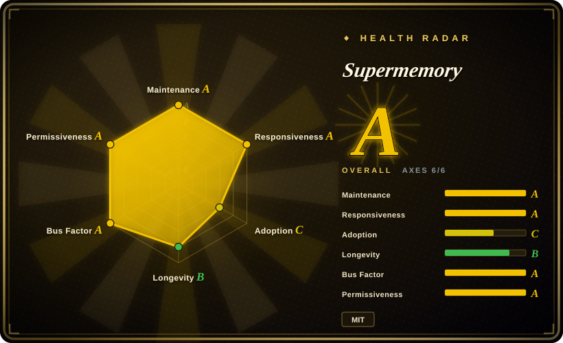
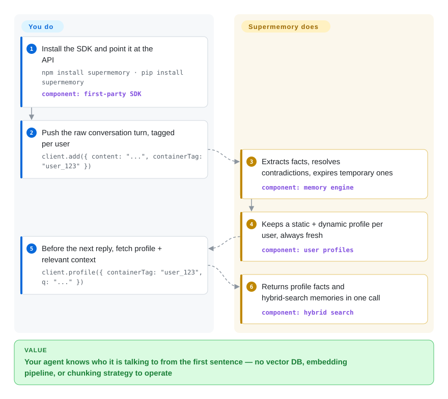

# Supermemory

Your AI agent starts every conversation from zero, and wiring memory in yourself means an extraction prompt, an embedding pipeline, a vector store, and a cleanup job for stale and contradictory facts. Supermemory collapses that whole stack behind one API (or one self-hosted binary): you push raw conversations and documents at it, it extracts the durable facts, supersedes them when they contradict, expires temporary ones, and hands your agent a user profile plus the relevant memories on every query.

## When to use

You're shipping a chat product, support bot, or assistant on a raw LLM API, and personalization is the missing piece: the user said last week they moved from NYC to SF, and today your agent still tells them to bundle a coat. Replaying transcripts into the prompt costs tokens and still retrieves noisy chunks instead of the handful of facts that matter. You want the whole context stack — fact extraction, contradiction handling ("moved to SF" *supersedes* "lives in NYC"), automatic expiry of temporary facts, per-user profiles, and RAG over your documents — without operating a vector DB or writing extraction prompts yourself.

That is exactly Supermemory's bet: it is API-first rather than library-first. You `client.add()` raw content scoped by a `containerTag` (its per-user/per-project bucket), and one `client.profile()` call returns an auto-maintained profile (static facts + recent dynamic context) *plus* hybrid search results — knowledge-base docs and personal memories fused in a single query. Compare Mem0, which runs the extraction pass *inside your process* against a vector store you provision and whose current algorithm is documented as ADD-only (nothing self-corrects); compare Zep/Graphiti, where you stand up and own a graph engine. Supermemory takes the whole pipeline off you — at the price of trusting a black box (see When NOT to use). It also covers the two adjacent surfaces: hosted MCP server + open-source plugins give Claude Code/Cursor/Codex/OpenCode persistent memory, and `@supermemory/tools` wraps Vercel AI SDK, LangChain, Mastra and the OpenAI Agents SDK in one line (`withSupermemory(...)`).

## How it works

You do two things: tag content with a `containerTag`, and pull context before each reply. Everything between is the project's job. On `add()`, the memory engine extracts memory-worthy facts from raw text, conversations, URLs, or uploaded files (PDFs, images via OCR, video transcription, code via AST-aware chunking), then *maintains* them — updates that contradict an old fact supersede it, time-bound facts like "I have an exam tomorrow" expire themselves. In parallel it keeps a profile per user split into `static` (stable facts) and `dynamic` (recent activity), which the README says reads back in ~50 ms `[未验证]` (vendor figure). On query, `search()` runs hybrid retrieval — RAG chunks over your documents fused with personal memories; `profile()` returns profile + search results in one call, and you compose them into the system prompt yourself. The memory-vs-RAG line the docs draw: RAG is stateless and returns the same chunks to everyone; memory tracks facts *about the user* and their evolution. Two ways in: the hosted platform (the repo points your web app at `api.supermemory.ai`; extraction runs on the vendor's proprietary models) or the self-hosted `supermemory-server` binary — same API on `localhost:6767`, embeddings local by default, extraction runs on whatever OpenAI-compatible endpoint you bring (Ollama works for fully offline). The coding-agent route (MCP tools `memory` / `recall` / `context`, plus per-harness plugins like `claude-supermemory`) is the same API behind a different surface.

<!-- flow-steps:begin (generated from flows/supermemory.json by tools/flow_card.py — do not edit) -->

Text version of the flow

1. **You**: Install the SDK and point it at the API — `npm install supermemory · pip install supermemory` — component: `first-party SDK`
2. **You**: Push the raw conversation turn, tagged per user — `client.add({ content: "...", containerTag: "user_123" })`
3. **Supermemory**: Extracts facts, resolves contradictions, expires temporary ones — component: `memory engine`
4. **Supermemory**: Keeps a static + dynamic profile per user, always fresh — component: `user profiles`
5. **You**: Before the next reply, fetch profile + relevant context — `client.profile({ containerTag: "user_123", q: "..." })`
6. **Supermemory**: Returns profile facts and hybrid-search memories in one call — component: `hybrid search`

**Value**: Your agent knows who it is talking to from the first sentence — no vector DB, embedding pipeline, or chunking strategy to operate

<!-- flow-steps:end -->

<!-- flow-steps:begin (generated from flows/supermemory.json by tools/flow_card.py — do not edit) -->
<!-- flow-steps:end -->

## When NOT to use

- **You need to read or tune the extraction pipeline itself.** The memory engine is not open here: the `supermemory-server` releases ship prebuilt binaries only, and no server source exists in this repo's tree (925 files at main, 2026-09-28) or in any public repo of the org `[推断]` (docs call it "open source" and link this monorepo, but the monorepo contains the MCP server, integrations, docs and playgrounds — not the engine). You pick the model; you cannot pick the algorithm. If auditability of the pipeline is the requirement, run [Zep](../graph-memory/zep.md) / [Graphiti](../graph-memory/graphiti.md) or [Cognee](../graph-memory/cognee.md), whose engines are their repos.
- **You are choosing on the benchmark claims.** "#1 on LongMemEval, LoCoMo, ConvoMem, 95% Recall@15" are self-reported by the vendor on MemoryBench — a benchmark framework the same company authored and runs. Treat as marketing until reproduced on your data.
- **Your data cannot leave the box by default.** The primary path is a hosted API — raw conversations get pushed to `api.supermemory.ai`. The local binary with an Ollama endpoint can run fully offline, but that is opt-in work; if local-first-by-default fits your policy better, [claude-mem](../coding-agent-memory/claude-mem.md) (coding sessions) or [Engram](../coding-agent-memory/engram.md) are structured differently.
- **You want a hardened self-host server.** The `server-v*` release channel is v0.0.x; the 0.0.8 release notes openly document that upgrading a 0.0.7-rc store *silently wiped search vectors* (0.0.8 auto-repairs the damage). Pin versions, back up the `.supermemory/` data directory, and expect schema churn.
- **You want the full product self-hosted.** The docs' own table puts connectors (Drive/Gmail/Notion/OneDrive), the hosted MCP surface, multi-org auth, dashboards and the proprietary extraction models on the platform/Enterprise side; the local binary is single-org, single-key, your machine, one process. If "self-hosted with team controls" is the requirement, compare Letta.

## Comparison

| Alternative | In index | Our verdict | Tradeoff |
|---|---|---|---|
| [Mem0](mem0.md) | ✅ | When you want memory as a library running inside your own process against a store you pick, choose Mem0; choose Supermemory when you want the entire pipeline — extraction, contradiction supersession, expiry, profiles — operated for you behind one API. | Mem0: Apache-2.0, in-process, BYO vector store, but its current extraction is documented ADD-only (stale facts accumulate, you prune); Supermemory: supersedes/expires automatically, but the engine is closed and the main path is a hosted API. |
| [Zep](../graph-memory/zep.md) / [Graphiti](../graph-memory/graphiti.md) | ✅ | Choose Zep/Graphiti when temporal graph semantics (bi-temporal edges, explicit invalidation) and a fully open engine you can inspect are central; Supermemory hides its ontology behind fixed endpoints and a binary-only server. | Graph engines: full pipeline control, heavier to stand up; Supermemory: zero infra behind one API, no inspectable memory model. |
| [Letta (MemGPT)](letta.md) | ✅ | Choose Letta when you want the runtime to own the whole stateful agent loop (memory blocks the agent edits itself); choose Supermemory when your existing agent loop just needs a context provider. | Letta is a platform that replaces your harness; Supermemory slots in as one API dependency. |
| [claude-mem](../coding-agent-memory/claude-mem.md) | ✅ | For persistent memory across coding-agent sessions on your own machine, claude-mem is local-first with hooks and SQLite; reach for Supermemory's plugins/MCP only when you accept a memory service (hosted, or a server you run) behind the harness. | claude-mem: local-by-default, harness-specific; Supermemory: multi-harness + multi-user product memory, service-shaped. |
| Memobase (memodb-io/memobase) | 未收录 | When your memory need is user *profile* schema (structured preference slots for companion/roleplay apps) rather than free-text fact extraction, look at Memobase. | Profile-engine shape vs Supermemory's fact-graph shape. Not indexed — not added in this tab-intake batch. |
| ChatGPT/Claude native memory | 非仓库 | If the only surface is one vendor's own assistant and you don't ship software, the built-in memory of ChatGPT/Claude already does this with zero integration. | Closed product feature, not a repository — out of scope for this index by shape. |

## Tech stack

- **Language:** TypeScript primary (Python wrappers for LangChain/OpenAI/Cartesia/Pipecat packages).
- **Monorepo (this repo):** Bun + Turbo; `apps/mcp` is a Hono/Cloudflare-Workers MCP server (`supermemory-mcp`); `apps/web` is a Next.js landing/console shell (the platform's real backend is the closed `api.supermemory.ai`); `apps/docs` Mintlify docs; `packages/tools` (Vercel AI SDK, LangChain, LangGraph, OpenAI Agents SDK, Mastra, n8n wrappers), `packages/ai-sdk`, `packages/memory-graph` (canvas graph *visualization*, not the engine), `packages/ui`, `skills/supermemory` (agent skill).
- **Shared deps:** better-auth, drizzle-orm, zod, hono, Sentry + PostHog (analytics).
- **SDKs live in separate repos:** `supermemory` on npm (v4.25.4, 2026-09, repo `supermemoryai/sdk-ts`) and on PyPI (v3.62.0).
- **Self-host:** prebuilt `supermemory-server` binary (macOS arm64/x64, Linux x64/arm64, Windows x64) shipped via GitHub Releases; embedded graph store; local embeddings default (`Xenova/bge-base-en-v1.5`).

## Dependencies

- **Hosted path:** an `API` key from console.supermemory.ai + the npm/PyPI SDK; no infrastructure.
- **Self-host path:** one binary + a model. First boot creates the embedded store, prints an API key, serves the full API on `http://localhost:6767`; data lives in `./.supermemory`, keys in `~/.supermemory/env`. LLM provider: OpenAI / Anthropic / Gemini / Groq / any OpenAI-compatible endpoint; fully offline via Ollama. Embeddings: local default, no key needed.
- **Not required:** Docker, a database server, a vector DB, or any worker/queue you provision — that's the pitch.
- **Connectors, hosted MCP, multi-org auth** — platform/Enterprise only; self-hosted local is single-org.

## Ops difficulty

**Low (hosted)** — it's an API dependency: no store, no pipeline, no hygiene jobs; the cost is a vendor and per-request billing (pricing not verified here). **Low-to-medium (self-hosted)** — genuinely zero-config to boot, but it's a v0.0.x binary channel: you manage upgrades (0.0.7→0.0.8 shipped an actual vector-wipe regression with auto-repair), backups of one data directory, and an LLM endpoint that is now a hard dependency of every write (quality and cost follow whichever model you bring). Not multi-machine: one process, one box.

## Health & viability

- **Maintenance (2026-09-28):** active — last commit to `main` 2026-09-25, steady same-week commits through September; 125 open issues on a hot repo. But note two release channels with different tempos: the self-host binary peaked at weekly `server-v0.0.x` releases Jul–Aug 2026, quiet since 0.0.8 (2026-08-17) — ~6 weeks as of this check.
- **Governance / bus factor:** the `supermemoryai` org (a commercial company); top contributors Dhravya (854 commits) and MaheshtheDev (354) dominate a long tail of 10+ — vendor-owned roadmap, single-vendor open-core, not a foundation.
- **Backing & Lindy:** created 2024-02-27 (~2.6 years, still active) — but the repo *pivoted*: "Supermemory v2 Release" (2025-01-21) turned a save-anything app into the memory API, so the memory product itself is under 2 years old and the ~31k stars are largely post-pivot. Age alone does not bank here.
- **Adoption:** the health scorer grades this axis C from its canonical package `@supermemory/tools` — 89,113 npm downloads/month; the main SDK tells a stronger story: `supermemory` ~390k npm + ~105k PyPI downloads/month (window 2026-08-29→09-27); plugin ecosystem with real traction — `claude-supermemory` ~2.8k stars, `opencode-supermemory` ~1.6k; wrappers shipped for the major agent frameworks; the vendor also runs MemoryBench and SMFS (separate repos).
- **Risk flags:** (1) **Relicense history** — MIT (2024-04) → CC BY-NC-SA 4.0 at the v2 release (2025-01-21, a non-commercial license) → MIT again (2025-08-17); snapshots taken inside that window are non-commercial and the precedent shows the license is a business lever, not a fixed contract. (2) **Open-core boundary** — the engine/server source is not in any public repo `[推断]`; connectors, hosted MCP, org controls, and the best extraction models are platform/Enterprise. (3) **Self-reported benchmarks** on the vendor's own harness. (4) PostHog analytics wired into the shared packages.

## Caveats (unverified)

- `[推断]` The `supermemory-server` source is not public: based on the repo tree at `main` and at tag `server-v0.0.8` (both checked 2026-09-28, no server/engine directory) and the org's public repo list; the docs' "open source" claim links to this monorepo. A private source repo may exist.
- `[未验证]` "#1 on LongMemEval / LoCoMo / ConvoMem", "95% Recall@15 with 99.4% context reduction", "~50ms profiles": vendor-reported on their own MemoryBench harness; not independently reproduced here.
- `[未验证]` The hosted platform's proprietary extraction models and the cloud backend (`api.supermemory.ai`) are asserted in the docs; their quality vs the self-hosted BYO-model path is vendor framing.
- `[未验证]` Cloudflare Workers + Postgres/Hyperdrive as the platform's serving shape: inferred from repo topics, `wrangler.jsonc`, `pg`/`postgres` deps and stale CLAUDE.md notes describing an API app whose source is no longer in the tree.
- `[未验证]` Funding status and company headcount not checked; "commercial org" is based on the paid platform/Enterprise offering in the docs and the org-owned repo.
- `[未验证]` Hosted-platform pricing and free tier not checked; "paid" follows from the Enterprise offering and console signup in the docs.
- `[推断]` Code committed during the 2025-01-21→2025-08-17 window was distributed under CC BY-NC-SA 4.0; CC licenses are irrevocable, so forks taken from that window stay non-commercial even though the repo is MIT today. Legal nuance — not legal advice.
- `[未验证]` Star count (~31.0k) and download figures are GitHub/npm/PyPI snapshots as of 2026-09-28; they drift.
