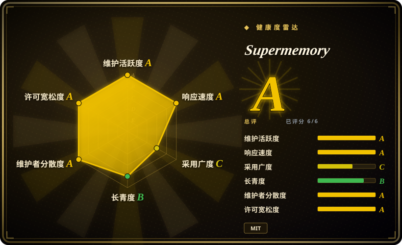
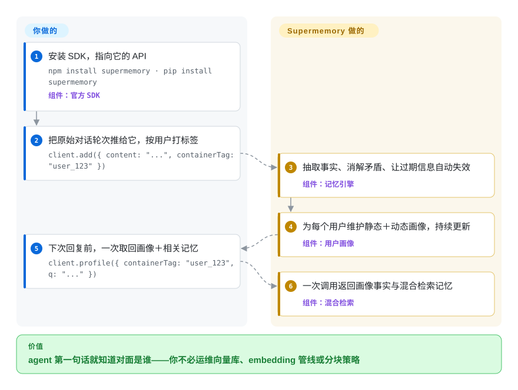

# Supermemory

你的 AI agent 每次对话都从零开始，而自己接记忆等于要养一套抽取 prompt、embedding 管线、向量库，外加一份清理过期与矛盾事实的苦役。Supermemory 把这整叠东西收到一个 API（或一个可自托管的二进制）后面：你往里推原始对话和文档，它抽取持久事实、用新事实覆盖矛盾的旧事实、让过期信息自动失效，并在每次查询时把用户画像加相关记忆递给你的 agent。

## 何时使用

你在裸 LLM API 上做一个对话产品、客服 bot 或助手，缺的那块是个性化：用户上周说从纽约搬到了旧金山，今天你的 agent 还在劝他多穿件外套。把历史记录塞回 prompt 既烧 token，捞回来的也只是噪声分块，而不是那几条真正重要的事实。你想要的是整条上下文管线——事实抽取、矛盾覆盖（“搬去 SF”*取代*“住在纽约”）、临时信息的自动到期、按用户维护的画像、对自己文档的 RAG——而不必自己运维向量库或写抽取 prompt。

这正是 Supermemory 的赌注：它是 API 优先，不是库优先。你用 `client.add()` 把原始内容按 `containerTag`（它的按用户／按项目隔离桶）推进去，再用一次 `client.profile()` 同时拿到自动维护的画像（static 长期事实＋dynamic 近期动态）和混合检索结果——知识库文档和个人记忆在一次查询里融合返回。对比 Mem0：抽取发生在*你的进程内*，向量库由你供应，且当前算法被文档标为 ADD-only（没有自我更正）；对比 Zep／Graphiti：图引擎要你自己立起来、自己 owning。Supermemory 把整条管线接走——代价是你要信任一个黑盒（见“何时不用”）。它还顺手覆盖了相邻的两个面：托管 MCP 服务加开源插件给 Claude Code／Cursor／Codex／OpenCode 提供跨会话记忆，`@supermemory/tools` 用一行 `withSupermemory(...)` 包住 Vercel AI SDK、LangChain、Mastra 和 OpenAI Agents SDK。

## 怎么用起来

你只做两件事：给内容打上 `containerTag`，回复前拉一次上下文。中间全部是项目的活。`add()` 之后，记忆引擎从原始文本、对话、URL 或上传文件（PDF、图片 OCR、视频转写、按 AST 感知切分的代码）里抽取值得记的事实，然后*持续维护*它们：与旧事实矛盾的新事实直接取代旧的，带时限的事实（“我明天有考试”）到期自动失效。与此同时它为每个用户维护一份画像，拆成 static（稳定事实）与 dynamic（近期活动），README 称画像读取约 50ms `[未验证]`（供应商自报数字）。查询时 `search()` 走混合检索——对你文档的 RAG 分块与个人记忆融合；`profile()` 一次调用返回画像加检索结果，拼进 system prompt 是你的事。文档画的这条线很清楚：RAG 是无状态的、对所有人返回相同分块；记忆追踪的是*关于这个用户*的事实及其演化。进入方式有二：托管平台（仓库里 web 应用指向 `api.supermemory.ai`，抽取跑在厂商专有模型上）或自托管的 `supermemory-server` 二进制——同一套 API 跑在 `localhost:6767`，embedding 默认本地，抽取管线改跑你自带的任意 OpenAI-compatible 端点（配 Ollama 可完全离线）。编码 agent 路线（MCP 工具 `memory`／`recall`／`context`，加上 `claude-supermemory` 等各家插件）是同一个 API 的另一层皮。

<!-- flow-steps:begin (generated from flows/supermemory.json by tools/flow_card.py — do not edit) -->

流程文字版

1. **你**：安装 SDK，指向它的 API — `npm install supermemory · pip install supermemory` — 组件：`官方 SDK`
2. **你**：把原始对话轮次推给它，按用户打标签 — `client.add({ content: "...", containerTag: "user_123" })`
3. **Supermemory**：抽取事实、消解矛盾、让过期信息自动失效 — 组件：`记忆引擎`
4. **Supermemory**：为每个用户维护静态＋动态画像，持续更新 — 组件：`用户画像`
5. **你**：下次回复前，一次取回画像＋相关记忆 — `client.profile({ containerTag: "user_123", q: "..." })`
6. **Supermemory**：一次调用返回画像事实与混合检索记忆 — 组件：`混合检索`

**价值**：agent 第一句话就知道对面是谁——你不必运维向量库、embedding 管线或分块策略

<!-- flow-steps:end -->

<!-- flow-steps:begin (generated from flows/supermemory.json by tools/flow_card.py — do not edit) -->
<!-- flow-steps:end -->

## 何时不用

- **你需要阅读或调校抽取管线本身。** 记忆引擎并不开源在这里：`supermemory-server` 的 release 只发预编译二进制，本仓库树里（main 分支 925 个文件，2026-09-28 核查）没有任何 server 源码，org 的公开仓库列表里也没有 `[推断]`——文档说“open source”并把链接指向这个 monorepo，但 monorepo 装的是 MCP server、集成包、文档和 playground，不是引擎。你能选模型，不能选算法。要求管线可审查的话，去跑引擎即仓库的 [Zep](../graph-memory/zep.zh.md)／[Graphiti](../graph-memory/graphiti.zh.md) 或 [Cognee](../graph-memory/cognee.zh.md)。
- **你在拿基准分数做选型。** “LongMemEval／LoCoMo／ConvoMem 三榜第一、95% Recall@15”全部是供应商在 MemoryBench 上自报的——那套评测框架出自同一家公司、由同一方运行。在自己的数据上复现之前，按营销对待。
- **对话数据默认不能出门。** 主路径是托管 API——原始对话会被推到 `api.supermemory.ai`。本地二进制配 Ollama 可以完全离线，但那是 opt-in 的额外动作；如果本地优先才是你的合规底线，[claude-mem](../coding-agent-memory/claude-mem.zh.md)（编码会话）或 [Engram](../coding-agent-memory/engram.zh.md) 的结构更对口。
- **你想要一个久经生产考验的自托管 server。** `server-v*` 发布通道还在 v0.0.x；0.0.8 的 release note 公开记录了 0.0.7 升级曾*静默清空搜索向量*的事故（0.0.8 带自动修复）。锁版本、备份 `.supermemory/` 数据目录，schema 变动要有预期。
- **你要的是整套产品自托管。** 文档自己的对照表把 connectors（Drive／Gmail／Notion／OneDrive）、托管 MCP、多组织鉴权、控制台和专有抽取模型都划在平台／Enterprise 侧；本地二进制是单组织、单 key、一台机器、一个进程。“自托管且带团队管控”是需求的话，去比 Letta。

## 横向对比

| 替代品 | 是否收录 | 我们的评价 | 取舍 |
|---|---|---|---|
| [Mem0](mem0.zh.md) | ✅ | 要“在自己进程里跑、存储自己挑”的记忆库，选 Mem0；要把抽取、矛盾覆盖、到期、画像整条管线托管出去、只对一个 API 编程，选 Supermemory。 | Mem0：Apache-2.0、进程内、自带向量库，但当前抽取被文档标为 ADD-only（过期事实堆积要自己清）；Supermemory：自动取代与到期，但引擎闭源、主路径是托管 API。 |
| [Zep](../graph-memory/zep.zh.md)／[Graphiti](../graph-memory/graphiti.zh.md) | ✅ | 双时态图语义（bi-temporal 边、显式失效）和完全可审查的开源引擎是硬需求时选 Zep／Graphiti；Supermemory 把本体藏在固定端点和二进制 server 后面。 | 图引擎：管线全掌控、立起来更重；Supermemory：一个 API 零基建，但记忆模型不可解剖。 |
| [Letta (MemGPT)](letta.zh.md) | ✅ | 要让运行时替你拥有整个有状态 agent 循环（agent 自己编辑记忆块）选 Letta；现有 agent 循环只想外挂一个上下文供应方选 Supermemory。 | Letta 是替换你 harness 的平台；Supermemory 是你系统里的一个 API 依赖。 |
| [claude-mem](../coding-agent-memory/claude-mem.zh.md) | ✅ | 单机上给编码 agent 跨会话记忆，claude-mem 是本地优先、hook 加 SQLite 的结构；Supermemory 的插件／MCP 路线只有在你接受记忆是一个服务（托管，或自跑一个 server）时才合适。 | claude-mem：默认本地、绑定编码 harness；Supermemory：多 harness 加多用户产品记忆，服务形态。 |
| Memobase（memodb-io/memobase） | 未收录 | 记忆需求是用户*画像 schema*（伴侣／角色扮演类应用的结构化偏好槽位）而非自由文本事实抽取时，看 Memobase。 | 画像引擎形态对比 Supermemory 的事实图形态。本页批次未收录（本批不闭环）。 |
| ChatGPT／Claude 自带记忆 | 非仓库 | 唯一界面就是某家自己的助手、你不出软件的话，其内建记忆零集成就已够用。 | 封闭产品功能，不是仓库——按形态不在此索引范围。 |

## 技术栈

- **语言：** TypeScript 为主（另有 LangChain／OpenAI／Cartesia／Pipecat 的 Python 封装包）。
- **Monorepo（本仓库）：** Bun + Turbo；`apps/mcp` 是 Hono／Cloudflare Workers 的 MCP server（`supermemory-mcp`）；`apps/web` 是 Next.js 落地页／控制台壳（平台真后端是闭源的 `api.supermemory.ai`）；`apps/docs` 为 Mintlify 文档；`packages/tools`（Vercel AI SDK、LangChain、LangGraph、OpenAI Agents SDK、Mastra、n8n 封装）、`packages/ai-sdk`、`packages/memory-graph`（画布图*可视化*，不是引擎）、`packages/ui`、`skills/supermemory`（agent skill）。
- **共享依赖：** better-auth、drizzle-orm、zod、hono、Sentry + PostHog（分析埋点）。
- **SDK 在独立仓库：** npm 的 `supermemory`（v4.25.4，2026-09，仓库 `supermemoryai/sdk-ts`）与 PyPI 同名包（v3.62.0）。
- **自托管：** 经 GitHub Releases 分发的预编译 `supermemory-server` 二进制（macOS arm64/x64、Linux x64/arm64、Windows x64）；内嵌图存储；embedding 默认本地（`Xenova/bge-base-en-v1.5`）。

## 依赖

- **托管路径：** console.supermemory.ai 的 API key 加 npm／PyPI SDK；无任何基础设施。
- **自托管路径：** 一个二进制加一个模型。首次启动自建内嵌存储、打印 API key、在 `http://localhost:6767` 提供完整 API；数据在 `./.supermemory`，key 在 `~/.supermemory/env`。LLM 供应方：OpenAI／Anthropic／Gemini／Groq／任意 OpenAI-compatible 端点；配 Ollama 可完全离线。embedding 默认本地、不需要 key。
- **不需要：** Docker、数据库服务、向量库或任何你自己供应的 worker／队列——这是它的卖点。
- **Connectors、托管 MCP、多组织鉴权**仅平台／Enterprise 有；自托管 local 是单组织。

## 运维难度

**低（托管）**——就是一个 API 依赖：没有库、没有管线、没有清扫任务；代价是绑上供应商和按请求计费（价格未在此核实）。**低到中（自托管）**——启动确实零配置，但这是一条 v0.0.x 的二进制通道：升级归你管（0.0.7→0.0.8 真实发生过向量清空回归，靠 0.0.8 自动修复）、单个数据目录的备份归你管，而 LLM 端点从此是每次写入的硬依赖（质量与成本随你带来的模型走）。不是多机方案：一个进程，一台机器。

## 健康度与可持续性

- **维护（2026-09-28）：** 活跃——main 最后提交 2026-09-25，九月整周稳定有提交；125 个 open issue 属热门仓库常态。但两条发布通道节奏不同：自托管二进制在 2026 年 7–8 月按周发 `server-v0.0.x`，0.0.8（2026-08-17）后约 6 周无新版。
- **治理／巴士因子：** `supermemoryai` 组织（一家商业公司）；贡献者以 Dhravya（854 commits）与 MaheshtheDev（354）为主、长尾 10+——路线图为供应商所有、单一厂商 open-core，不是基金会。
- **背书与 Lindy：** 仓库创建于 2024-02-27（约 2.6 年且仍活跃）——但中间*转型过*：“Supermemory v2 Release”（2025-01-21）把 save-anything 应用改造成记忆 API，所以记忆产品本身不满 2 岁，约 31k star 主要是转型后挣来的。单看年龄不足以在这里兑现 Lindy。
- **采用度：** 健康度评分器按其认定的规范包 `@supermemory/tools` 给该轴打 C（npm 月下载 89113）；主 SDK 的数字更强——`supermemory` npm 约 39 万／月、PyPI 约 10.5 万／月（2026-08-29→09-27 窗口）；插件生态有真实热度——`claude-supermemory` 约 2.8k star、`opencode-supermemory` 约 1.6k；主流 agent 框架有官方封装；厂商还运营 MemoryBench 与 SMFS（独立仓库）。
- **风险信号：**（1）**改许可证史**——MIT（2024-04）→ v2 发布时改 CC BY-NC-SA 4.0（2025-01-21，非商业许可）→ 又回 MIT（2025-08-17）；窗口期内取走的快照是非商业许可，且先例说明许可证是商业杠杆而非固定契约。（2）**open-core 边界**——引擎／server 源码不在任何公开仓库 `[推断]`；connectors、托管 MCP、组织管控和最好的抽取模型都在平台／Enterprise。（3）**基准成绩自报**于自家 harness。（4）共享包里接了 PostHog 分析埋点。

## 存疑（未验证）

- `[推断]` `supermemory-server` 源码未公开：依据是 `main` 与 tag `server-v0.0.8` 的仓库树（均于 2026-09-28 核查，无 server／engine 目录）加 org 公开仓库列表；文档的“open source”指向本 monorepo。可能存在私有源仓库。
- `[未验证]` “LongMemEval／LoCoMo／ConvoMem 第一”“95% Recall@15、上下文缩减 99.4%”“画像约 50ms”：均为供应商在自家 MemoryBench harness 上的自报数字，此处未独立复现。
- `[未验证]` 托管平台的专有抽取模型与云端后端（`api.supermemory.ai`）的存在与能力以文档为准；其相对自托管 BYO-model 的质量优势是厂商话术。
- `[未验证]` 平台的 Cloudflare Workers + Postgres/Hyperdrive 服务形态：依据是仓库 topics、`wrangler.jsonc`、`pg`／`postgres` 依赖，以及一份描述了早已不在树上的 API 应用的过期 CLAUDE.md。
- `[未验证]` 融资状态与公司规模未核实；“商业组织”的判断来自文档里的付费平台／Enterprise 与组织名下的仓库。
- `[未验证]` star 数约 31.0k、下载量等均为 GitHub/npm/PyPI 在 2026-09-28 的快照；会漂移。
- `[未验证]` 托管平台定价与免费额度未核实；“付费”依据是文档里的 Enterprise 方案与 console 注册流程。
- `[推断]` CC BY-NC-SA 窗口期（2025-01-21→2025-08-17）内的代码快照对商业使用仍受该许可约束；具体法律判断应咨询法务，本页只登记事实。
