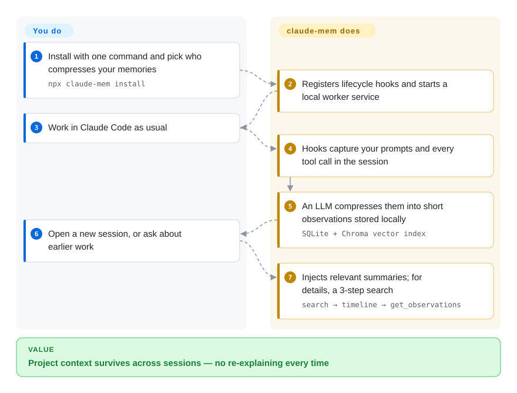

# claude-mem

You restart Claude Code every day and re-explain the project from scratch; `/clear` wipes the context you spent an hour building. claude-mem hooks the agent's session lifecycle, compresses what happened into observations in a local SQLite + Chroma store, and injects the relevant slices back into future sessions — a memory layer on your own machine (an optional hosted "observer" / cloud-sync tier was added in v13.x).

## When to use

You're a Claude Code (or Codex / Gemini / Copilot / OpenCode) power user who burns the first ten minutes of every session re-establishing context: which files matter, what you decided yesterday, why that refactor stalled. Worse, you hit `/clear` mid-task to reclaim context window and watch all of that working memory evaporate — the agent forgets the constraint you just spent three turns explaining. You don't want to hand-maintain a sprawling CLAUDE.md, and you don't want a cloud memory service that ships your transcripts off-box. You install claude-mem with `npx claude-mem install`; it wires lifecycle hooks (`SessionStart`, `UserPromptSubmit`, `PostToolUse`, `Stop`, `SessionEnd`) so that when a session ends it captures the activity, an LLM compresses it into observations, and on your next session start the relevant context is searched out of a local store and injected back into the prompt — surviving both session boundaries and `/clear`.

It fits when you want this *across* tools, not bound to one agent: the same memory backend serves Claude Code, Codex, Gemini, Copilot, OpenClaw, Hermes, OpenCode, Antigravity CLI, and Grok Bot through hooks (plus log-file watching where a host has no hooks) and an MCP interface (`search`, `timeline`, `get_observations`), with everything stored locally in SQLite (FTS5) plus a Chroma vector index. If you want the captured history kept on your machine and queryable — and you're comfortable running a local HTTP service and the Bun/uv toolchain it depends on — this is the local-first option for cross-session agent memory. Note that since v13.x the default installer nudges you toward signing in and the hosted observer; the account-free path (`--provider`, `CLAUDE_MEM_ONLINE_OPTIN=false`, or a non-interactive shell) is still there, just no longer the default.

## How it works

claude-mem hooks into your coding agent's lifecycle (e.g. Claude Code): it fires when a session starts, when you send a prompt, after every tool call, and when the session ends. It hands what the agent did to an LLM that compresses it into short "observations", stored in a local **SQLite** database (plus a **Chroma** vector index so you can search by meaning, not just keywords), all managed by a local worker service. When you open a new session it injects relevant past summaries into the context automatically; when the agent needs details it searches in three steps — a compact index first, then the surrounding timeline, then full text only for the few records it needs. Your part is one install command plus picking who runs the compression — the hosted claude-mem observer it offers by default since v13.x, your own OpenRouter or Gemini key, or your Anthropic plan; after that you just work.

<!-- flow-steps:begin (generated from flows/claude-mem.json by tools/flow_card.py — do not edit) -->

Text version of the flow

1. **You**: Install with one command and pick who compresses your memories — `npx claude-mem install`
2. **claude-mem**: Registers lifecycle hooks and starts a local worker service
3. **You**: Work in Claude Code as usual
4. **claude-mem**: Hooks capture your prompts and every tool call in the session
5. **claude-mem**: An LLM compresses them into short observations stored locally — `SQLite + Chroma vector index`
6. **You**: Open a new session, or ask about earlier work
7. **claude-mem**: Injects relevant summaries; for details, a 3-step search — `search → timeline → get_observations`

**Value**: Project context survives across sessions — no re-explaining every time

<!-- flow-steps:end -->

## When NOT to use

- **You need memory inside your own application, not your coding agent.** claude-mem is a *developer-workstation* tool wired into agent hooks. If you're embedding user memory into an app you ship (a chatbot, a support agent), a model-agnostic memory **library/API** like [Mem0](mem0.md) or [Memori](memori.md) is the right shape — claude-mem has no SDK you call from product code.
- **Single-developer maintenance / abandonment risk.** The project is authored by one developer (`@thedotmack`). It moves fast (v13.x in 2026), but a hook tool sitting in your every-session critical path from a single maintainer is a bus-factor-of-one dependency — weigh that before making it load-bearing.
- **You need a fully local-only memory tool.** The store is local (SQLite + Chroma), but v13.x added a hosted "observer" compression tier that is the installer's default nudge (email sign-in, 30-day free trial), plus opt-in cloud sync to cmem.ai. You can decline the account (`--provider`, `CLAUDE_MEM_ONLINE_OPTIN=false`, or a non-interactive shell) and keep the store on-box — but every documented compression provider (observer, OpenRouter, Gemini, your Anthropic plan) is still an external API call, and no local-model compression path is documented [未验证]（源码未查）. There's also no managed multi-tenant backend to share memory across a team or fleet; it's per-developer-machine.
- **Privacy of captured session data.** By design it captures *everything the agent does* — file contents, commands, outputs — and an LLM compresses it. The store is local and `<private>` tags can exclude content from storage, but with the default provider path the *compression itself* calls an external model (hosted observer or your OpenRouter/Gemini/Anthropic key), and cloud sync to cmem.ai is opt-in; on a sensitive repo, audit what lands in the store and which compression provider you actually chose.
- **You distrust the popularity signal.** The ~94.8k star count is API-verified, but it is extreme for a young, single-developer tool and its production-adoption/vetting meaning is unverified and suspicious `[未验证]`; do not adopt it *because* it looks widely vetted — evaluate the code and your own constraints, not the star count.

## Comparison

| Alternative | In index | Our verdict | Tradeoff |
|---|---|---|---|
| [Mem0](mem0.md) | ✅ | Choose Mem0 when app-embedded model-agnostic memory API matters more than coding-agent hooks. | Model-agnostic memory **library/API** you embed in your own agent code (Python/TS, any LLM); built for app-embedded user memory. claude-mem is a workstation hook tool for coding agents, not a library you call. |
| [Memori](memori.md) | ✅ | Choose Memori when SQL-first client-wrapper memory is the right application shape. | SQL-first memory engine you wrap your LLM client with; framework-agnostic, with a cloud/BYODB split. claude-mem is local-only and hook-driven, scoped to coding-agent sessions rather than app memory. |
| [Claude Subconscious](claude-subconscious.md) | ✅ | Choose Claude Subconscious when a Claude-Code hook demo backed by Letta fits your experiment. | Closest shape: a Claude Code hook plugin doing cross-session memory — but it's a Letta-backed *demo* explicitly "not for production" and Claude-Code-only. claude-mem is local-store (SQLite+Chroma), multi-agent, and positions as a real install. |
| [Letta (MemGPT)](letta.md) | ✅ | Choose Letta when you want a stateful runtime to own the agent loop and memory OS. | Stateful agent runtime with a self-editing memory OS and a server; owns the agent loop. claude-mem slots under your existing agents via hooks rather than replacing them. |
| [Zep](zep.md) / [Graphiti](graphiti.md) | ✅ | Choose Zep or Graphiti when temporal knowledge-graph memory and fact invalidation are central. | Temporal knowledge-graph memory service with explicit fact invalidation; a hosted/self-host backend for app memory, not a per-developer coding-agent hook layer. |

## Tech stack

- **Language:** TypeScript (primary) / JavaScript (repo bytes ≈46% TS, ≈40% JS, ≈12% Python per GitHub linguist, 2026-09; the README footer says "Made with TypeScript").
- **Capture surface:** five Claude Code lifecycle hooks (`SessionStart`, `UserPromptSubmit`, `PostToolUse`, `Stop`, `SessionEnd`) plus an MCP server exposing `search`, `timeline`, and `get_observations`; log-file watching for hookless hosts (Grok Bot).
- **Storage:** local **SQLite** with **FTS5** full-text search, plus a **Chroma** vector database for semantic/keyword retrieval; optional cloud sync of memories to cmem.ai.
- **Process model:** a local **HTTP API (default port 37777)** with a web viewer UI; runs under **Bun** as the JS runtime/process manager; **uv** used as the Python package manager (for the Chroma side) — both auto-installed if missing.
- **Compression:** an LLM pass compresses captured session activity into stored observations before injection; the provider is yours to pick (hosted claude-mem observer by default, OpenRouter, Gemini, or your Anthropic plan).
- **Distribution:** plugin marketplace, `npx claude-mem install` (with `--ide` variants for OpenCode, Antigravity, Grok Bot), and a one-line OpenClaw gateway installer (`curl -fsSL https://install.cmem.ai/openclaw.sh | bash`).

## Dependencies

- **A supported coding agent:** Claude Code, Codex, Gemini, Copilot, OpenCode, OpenClaw, Hermes, Antigravity CLI, or Grok Bot — claude-mem hooks into the agent's lifecycle (or watches its logs); it is not standalone.
- **Node.js:** README badge says ≥ 20.0.0; package.json engines pin `node >=20.12.0` and `bun >=1.1.31`.
- **Bun** (JS runtime / process manager) and **uv** (Python package manager) — required by the install path, both auto-installed if missing.
- **Chroma** vector database and a **SQLite** file — provisioned locally by the installer.
- **An LLM for the compression step** — by default the installer offers the hosted claude-mem observer (account sign-in, 30-day trial); alternatives are your own OpenRouter or Gemini key or your Anthropic plan. All documented options are external API calls.
- **Install:** `npx claude-mem install`; a local service then listens on port 37777 by default (configurable via `~/.claude-mem/settings.json`). Note: `npm install -g claude-mem` installs the SDK/library only — no hooks or worker are registered.

## Ops difficulty

**Low-to-medium, on a single workstation.** The install is one `npx` command and a hook wiring (v13 may interleave a browser sign-in for the hosted observer — skippable with `--provider` / `CLAUDE_MEM_ONLINE_OPTIN=false`); there's no server fleet, no multi-tenant backend, no clustering — everything else is local. The medium part is the moving-parts count for a *memory* tool: a long-running HTTP service on a fixed port (37777 — collisions and stale processes are a real failure mode), a Bun runtime, a `uv`-managed Python side for Chroma, and a SQLite + vector store you now own (size growth, corruption, backups are yours). Failures in async capture at session boundaries can be silent to the foreground, and an LLM compression step on capture adds latency and a token cost per session. It's "install and forget" until the local stack drifts — then you're debugging a port, a runtime, and two datastores on your own machine.

## Health & viability

- **Responsiveness**: Grade A — median first-response time 61.4 hours across 38 qualifying issues/PRs.
- **Maintenance — extremely active (as of 2026-09).** Last push 2026-09-26; release v13.28.0 same day; commits in all of the last 13 weeks; not archived. The v13.x major-number churn on a ~13-month-old project is still unusual — treat the version pace as a churn signal, not maturity.
- **Governance & bus factor — single developer, star/maturity mismatch ⇒ strong red flag.** A `User`-owned repo (`@thedotmack`, Alex Newman) sitting in your every-session critical path is a bus-factor-of-one dependency. ~94.8k stars is API-verified, but wildly disproportionate for a young single-developer hook tool, and ~81% of recent commits are the top author's — treat popularity as decoupled from vetting, not as adoption evidence.
- **Age & Lindy — young, unproven.** Created 2025-08, ~13 months old (as of 2026-09). Active but no track record; young-and-hyped, not Lindy-safe — do not adopt *because* it looks widely vetted.
- **Adoption & backing signals.** 67,914 npm downloads/month (measured 2026-09), a Vercel OSS Program badge, its own docs site and Discord — real reach, but the registry dependency-graph signal is near-nil (zero dependent packages), and the README now monetizes attention: a third-party **CMEM token** is "officially embraced" by the author. Token affiliation is a governance/attention-diversion risk flag regardless of your view of crypto. [推断]
- **Risk flags — data capture, commercialization drift, local-stack ownership.** Apache-2.0 (no relicense risk), but by design it records everything the agent does; the default compression provider is now a hosted, account-gated service; you also own the local SQLite+Chroma stack. Privacy, bus-factor, and the account/hosted-tier drift are the dominant risks, not licensing.

## Caveats (unverified)

- `[未验证]` **~94.8k GitHub stars as of 2026-09: the count is API-verified, but its production-adoption/vetting meaning is unverified and suspicious** — that figure is wildly disproportionate for a young, single-developer hook tool. Treat the count's adoption/vetting meaning as unverified and *not* as evidence of adoption or vetting; GitHub stars are unreliable and date-sensitive regardless.
- `[未验证]` v13.28.0 released 2026-09-26 (verified via GitHub releases + npm). The very high major version on a ~13-month project is unusual and implies fast, unannounced breaking changes; the stability of any specific minor version was not assessed.
- `[未验证]` Supported-agent list (Claude Code, Codex, Gemini, Copilot, OpenCode, OpenClaw, Hermes, Antigravity, Grok Bot) is the README's own framing; depth/parity of support per agent was not independently confirmed (e.g. Grok Bot has no hooks — only log watching).
- `[未验证]` What exactly the hosted claude-mem observer sends server-side (raw transcripts vs compressed observations, retention) is not spelled out in the README; the account-gated default install flow was read from the README only, not exercised.
- `[推断]` Reading the author-endorsed third-party CMEM token as a governance/attention-diversion risk flag is our inference from the README's "What About CMEM?" section, not a claim of wrongdoing.
- `[未验证]` The README says "4 MCP tools" but names three (`search`, `timeline`, `get_observations`); the actual MCP surface was not inspected in source.
- `[推断]` `uv`/Python is present for the Chroma vector-store component; the exact division of labor between the Bun and Python sides is inferred, not stated.
- `[推断]` Hook names and MCP tool names are taken from the README; behavior at each hook was not inspected in source.
