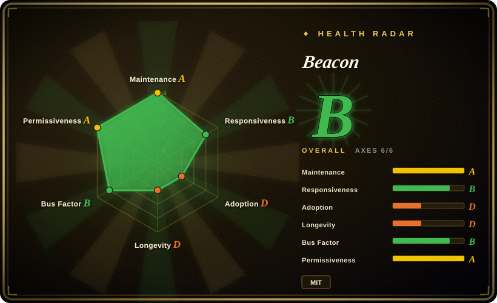
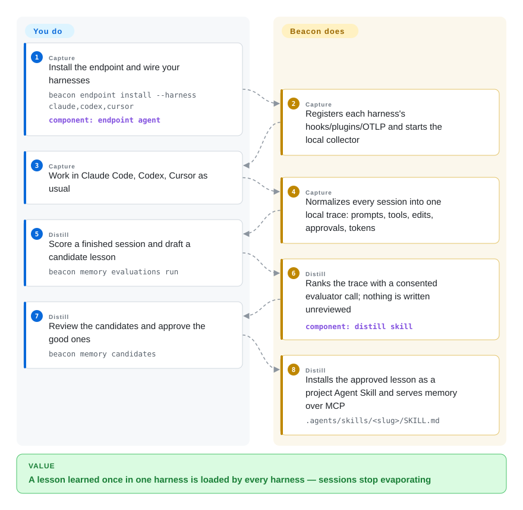

# Beacon

The migration trick your Claude Code session finally nailed evaporates when the session ends — and tomorrow Cursor relearns it from scratch. Beacon records what your coding agents did across Claude Code, Codex, Cursor, OpenCode and 20+ other harnesses into one local trace, and turns the sessions you review and approve into project skills any of them can load.

## When to use

You use more than one coding agent — Claude Code at work, Codex or Cursor for some repos, OpenCode on the side — and the lessons each one learns die inside its own session history. The fix for the flaky migration, the test convention every agent keeps getting wrong, the correction you have now given three different tools: none of it compounds. You also can't answer "what did the agent actually do in that session?" after the fact — which tool it called, what it edited, what it approved. Beacon is an endpoint agent you install once (`brew install beacon`, then `beacon endpoint install --harness claude,codex,cursor`); it wires each harness's own hooks/plugins/OTLP exports and writes every session — prompts, tool calls, file edits, approvals, MCP traffic, tokens — into one normalized local trace (`runtime.jsonl`), viewable in a local dashboard with `beacon endpoint dashboard`.

The memory half is what picks Beacon over its closest substitute: lessons only enter memory after *you* review and approve them (`beacon memory evaluations run` → review candidates → install as a skill), unlike claude-mem which auto-compresses and auto-injects at session start. Pick Beacon when the review gate is a feature — you don't want an LLM silently rewriting your agents' instructions — and when the same approved knowledge must be loadable by *every* harness (installed under `.agents/skills/`, retrieved over MCP via `get_memory_context`). The normalized trace is also the secondary value: you can forward it to your own Splunk/Sentinel/Datadog/S3 for audit, which pure memory tools don't give you. Stay local-first by default (nothing leaves the machine unless you configure forwarding or opt into Beacon Managed), or wire the distill evaluator to a self-hosted endpoint.

## How it works

Beacon is an *endpoint agent*: a Go CLI plus a small OpenTelemetry-based collector (OpenTelemetry = an open standard for shipping traces/metrics; here it listens on loopback `127.0.0.1:4318` only) running as a local service. After install, it configures each supported harness through whichever surface that harness exposes — lifecycle hooks, a managed plugin, native OTLP export, or reading the session files the runtime already writes to disk — and normalizes everything into one event stream appended to a rotating local `runtime.jsonl` (10 MiB × 5 archives, with secret redaction, sanitization and truncation applied before storage). You do: install once, pick Local in the setup wizard, work as usual. It does: capture, normalize, store, correlate, and optionally run threat-detection rules over the stream. The learning loop is deliberately *not* hooked into your sessions: `beacon memory evaluations run` sends a bounded, redacted projection of a finished trace to an evaluator (TypeSafe's hosted Jev API by default, or your own via `BEACON_JEV_ENDPOINT`) which returns probabilities; a trace becomes a candidate lesson only if task success ≥ 0.50 *and* the mean of three lesson-questions ≥ 0.60 — and even then nothing is written until you approve it. `beacon memory skills install` then renders the approved lesson as a project Agent Skill under `.agents/skills/<slug>/SKILL.md`, and `beacon mcp serve` exposes the same memory as read-only MCP tools (`get_memory_context`) any harness can call. Think apprenticeship logbook, not a diary the agent rereads: only the foreman — you — countersigns a lesson before it enters the house manual.

<!-- flow-steps:begin (generated from flows/agent-beacon.json by tools/flow_card.py — do not edit) -->

Text version of the flow

1. **You** (Capture): Install the endpoint and wire your harnesses — `beacon endpoint install --harness claude,codex,cursor` — component: `endpoint agent`
2. **Beacon** (Capture): Registers each harness's hooks/plugins/OTLP and starts the local collector
3. **You** (Capture): Work in Claude Code, Codex, Cursor as usual
4. **Beacon** (Capture): Normalizes every session into one local trace: prompts, tools, edits, approvals, tokens
5. **You** (Distill): Score a finished session and draft a candidate lesson — `beacon memory evaluations run`
6. **Beacon** (Distill): Ranks the trace with a consented evaluator call; nothing is written unreviewed — component: `distill skill`
7. **You** (Distill): Review the candidates and approve the good ones — `beacon memory candidates`
8. **Beacon** (Distill): Installs the approved lesson as a project Agent Skill and serves memory over MCP — `.agents/skills/<slug>/SKILL.md`

**Value**: A lesson learned once in one harness is loaded by every harness — sessions stop evaporating

<!-- flow-steps:end -->

## When NOT to use

- **You want memory inside your own application, not on your workstation.** Beacon is an endpoint capture tool wired into coding-agent harnesses. For a model-agnostic memory library/API you embed in product code (a chatbot, a support agent), use [Mem0](../app-memory/mem0.md) or [Memori](../app-memory/memori.md) — Beacon has no memory API your app calls.
- **You want zero-maintenance auto-injection at every session start.** Beacon's capture is automatic, but recall rides on an Agent Skill or MCP call the agent chooses to make — nothing is force-injected into context. [claude-mem](claude-mem.md) compresses and injects relevant summaries at `SessionStart` automatically; if you want memory that just appears without installing skills per harness, pick that shape and accept its per-session LLM compression cost.
- **You need a central, multi-user memory server for a team or fleet.** Beacon memory lives in a per-endpoint `memory.db`, scoped to one project (sharing happens by committing the installed skills, or via the hosted tier). For a self-hosted shared context store with accounts and isolation, [OpenViking](openviking.md) or [Letta](../app-memory/letta.md) are the right shape — a server, not an endpoint.
- **You won't run a background collector that records full agent sessions.** Beacon's value depends on capturing everything your agents do (with redaction/truncation, local-only by default, uninstall with `--keep-logs`). In a locked-down or minimal environment, hand-maintained `AGENTS.md`/`CLAUDE.md` conventions are lighter and leak nothing — you trade compounding for control.
- **You need a fully offline distill loop.** Scoring traces with the default evaluator calls TypeSafe's hosted Jev API (consent-gated); recall and promote stay keyless and local. You can point `BEACON_JEV_ENDPOINT` at an internal compatible evaluator or write candidates by hand (`beacon memory candidates create`), but if you want offline scoring out of the box, budget for that wiring first.
- **You need a proven, boring dependency.** The repo is ~4.5 months old (created 2026-05-12), releases multiple times a week, and the roadmap belongs to a young security startup whose commercial tier is the hosted service. Fine for a workstation tool you can uninstall; think twice before a fleet-wide rollout standardizes on its event schema.

## Comparison

| Alternative | In index | Our verdict | Tradeoff |
|---|---|---|---|
| [claude-mem](claude-mem.md) | ✅ | Choose Beacon when capture must span many harnesses with one normalized trace and lessons you approve before they land; choose claude-mem when you want automatic compress-and-inject at session start inside its supported agents. | Beacon: cross-harness traces + human review gate + one Go binary, but recall depends on skills/MCP the agent invokes. claude-mem: automatic context injection, but per-harness hooks, a local Bun/Python stack, and LLM compression on every capture. |
| [Mem0](../app-memory/mem0.md) | ✅ | Choose Mem0 when the memory belongs to your application (an SDK/API your code calls, any LLM); choose Beacon when it belongs to your *workstation* across the coding agents you already run. | Mem0 is an embeddable memory library with hosted/self-host options — no session capture. Beacon is endpoint telemetry + review-gated lessons; no app-facing memory API. |
| [Letta (MemGPT)](../app-memory/letta.md) | ✅ | Choose Letta when you want a stateful runtime to own the agent loop and its memory OS; choose Beacon when your agents already run under their own harnesses and you only want a passive memory/trace layer beneath them. | Letta replaces how your agents run (server, memory OS, self-editing state). Beacon adds capture + curated memory without touching the agent loop. |
| [OpenViking](openviking.md) | ✅ | Choose OpenViking when several people/agents must share one self-hosted context+memory store behind a server; choose Beacon for per-developer, per-endpoint memory that needs no server at all. | OpenViking: shared multi-account store, but a server to run plus model dependencies and AGPL-3.0. Beacon: zero-server local JSONL + memory.db, but no multi-user backend (sharing = committed skills or hosted tier). |
| Basic Memory | 未收录 | Choose Beacon when the source of truth must be every harness's captured sessions with a review gate; choose Basic Memory when you want a local-first knowledge base of notes the AI remembers, without session telemetry. | Basic Memory (basicmachines-co, ~4.1k stars, AGPL-3.0, active 2026-09) is note-centric local memory over MCP; no cross-harness trace capture, no approval loop. Not added in this tab-intake batch. |

## Tech stack

- **Language:** Go (primary) — `cli/beacon` (CLI, endpoint runtime, local dashboard), `cli/beacon-hooks` (hook adapter runtimes invoke), `pkg/asymptoteobserve` (shared event schema, provenance markers, threat-rules engine).
- **Telemetry:** an OpenTelemetry Collector distribution (`collector-builder` with a `beaconjson` exporter) receiving loopback OTLP; events normalized into a unified schema with a published field reference.
- **TypeScript surfaces:** `@asymptote/sdk` (Observe SDK, OpenLLMetry-based, for agent-in-code instrumentation), managed plugins/extensions for OpenCode/Cline/Pi (bun), and an optional Chrome MV3 + Firefox-beta browser extension posting chat activity to the same loopback receiver.
- **Storage:** local `runtime.jsonl` rotated at 10 MiB × 5, plus `memory.db` for durable approved memory; the trace index is rebuildable from the log.
- **Detection:** a threat-rule corpus (`rules/`, shipped as a release asset) run by the endpoint engine over the normalized stream; the rule format is open (`spec/threat-rules` with JSON schema).
- **Packaging:** Homebrew tap (`asymptote-labs/tap`), `.deb`/`.rpm` + checksum-verified `install.sh`, Windows MSI + MDM assets, a GitHub Action (`action.yml`), and `beacon ci exec` wrapping CI jobs with a temporary collector.

## Dependencies

- **A supported harness to capture** — 25+ local runtimes (Claude Code, Codex, Cursor, OpenCode, Cline, Gemini CLI, …) via their strongest surface; default `beacon endpoint install` configures Claude Code and Codex CLI, others need their documented hook/plugin/OTLP setup. Browser chat capture needs the optional extension; CI needs `beacon ci exec`; cloud agents need sandbox hooks.
- **No hosted account for the local path** — capture, dashboard, review and promote run endpoint-local (the project's contributing contract says normal hook execution must not depend on hosted accounts or remote fetches).
- **Optional — an evaluator for distill scoring:** `TYPESAFE_API_KEY` / `BEACON_JEV_API_KEY` for the hosted TypeSafe Jev API, or `BEACON_JEV_ENDPOINT` + `BEACON_JEV_MODEL` pointing at your own compatible evaluator. Recall and promote need no key; `--dry-run` previews calls without network.
- **Optional — forwarding destinations you already own:** Splunk HEC, Microsoft Sentinel, CrowdStrike LogScale, Sumo, Wazuh, Datadog, Elastic, CloudWatch, S3/GCS (mostly via Vector content packs).
- **Optional — Beacon Managed:** the hosted tier (account sign-in; Standard or metadata-only privacy modes).

## Ops difficulty

**Low on a single workstation.** `brew install` + one `beacon endpoint install` (Linux `.deb`/`.rpm` and Windows MSI equivalents, all checksum-verified), the collector runs as a managed local service, logs rotate themselves, `beacon endpoint status` is the health check, and uninstall has an explicit `--keep-logs`. The medium parts are elsewhere: a fleet rollout leans on MDM assets and per-harness wiring; you own `memory.db` growth and the rotating `runtime.jsonl`; the distill evaluator is another credential to manage (or another internal service to run); and each SIEM/Vector forwarding destination is its own small pipeline. No database server, no cluster — the endpoint is self-contained.

## Health & viability

- **Maintenance — very active (as of 2026-09-28).** v1.3.27 released 2026-09-28; three releases in the last four days; commits and merged PRs daily; not archived. Treat the multi-release-per-week cadence as churn risk for pinned deployments, not as maturity.
- **Governance & bus factor — small startup team.** Owner is Asymptote Labs (org created 2025-10, "The Runtime Intelligence Layer for AI Agents"), and commit volume concentrates in two humans (≈750 + ≈480 contributions) with large shares from `claude`/`cursoragent` bot accounts — a heavily AI-co-authored commit stream [推断]（作者意图与审查深度未查证）. Roadmap control rests with the vendor.
- **Age & Lindy — very young, unproven.** Repo created 2026-05-12 (~4.5 months old at verification). Fast-moving and backed, but with no track record; do not adopt *because* it looks established — it isn't.
- **Adoption & ecosystem.** 1,634 stars / 142 forks (API, 2026-09-28) in ~4.5 months — attention-grade growth for a startup launch; production vetting is unverified. Real infrastructure around it: docs site, Discord, Homebrew tap, MSI/deb/rpm + MDM packaging, GitHub Action, npm SDK.
- **Risk flags.** Full-session telemetry by design (redaction/sanitization/truncation + loopback-only defaults documented in SECURITY.md, forwarding opt-in); the distill scorer calls a third party's hosted API by default (consent-gated, self-hostable); the MIT endpoint funnels toward the vendor's paid managed tier — open-core posture rather than feature-gating as far as docs show [未验证]（未逐项对比托管层功能）。MIT license, no relicense history (too young to have one).

## Caveats (unverified)

- `[未验证]` Per-harness support depth/parity is the project's own coverage table (README "Supported Agents"); actual capture fidelity per runtime was not exercised. Default install configures Claude Code and Codex CLI only; the other 20+ entries are documented setups, not tested here.
- `[推断]` The `claude` (502 contributions) and `cursoragent` (180) contributor entries are read as AI-agent co-authored commits; the actual share of machine-written code and its review depth were not measured.
- `[未验证]` Beacon Managed's data handling (what "Standard" vs "metadata-only" privacy modes actually send, retention) is taken from README/docs prose; the hosted flow was not exercised.
- `[推断]` 1,634 stars in ~4.5 months is read as launch-attention, not production vetting; no deployment evidence beyond the vendor's own materials was found.
- `[未验证]` The threat-rules engine ships in the repo and rules are a release asset, but rule corpus content and detection efficacy were not assessed.
- `[未验证]` Evaluator thresholds (task_success ≥ 0.50 precondition, mean ≥ 0.60) and the redaction applied to the "bounded, redacted trace projection" sent to Jev are from the docs; the projection's actual contents were not inspected in source.
- `[推断]` Multi-release-per-week cadence (v1.3.19→v1.3.27 within a week) is read as a churn risk for deployments that pin versions.
