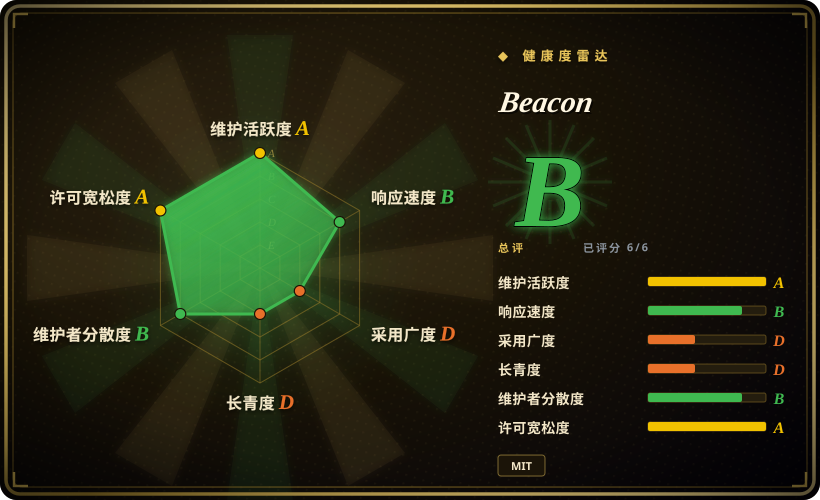
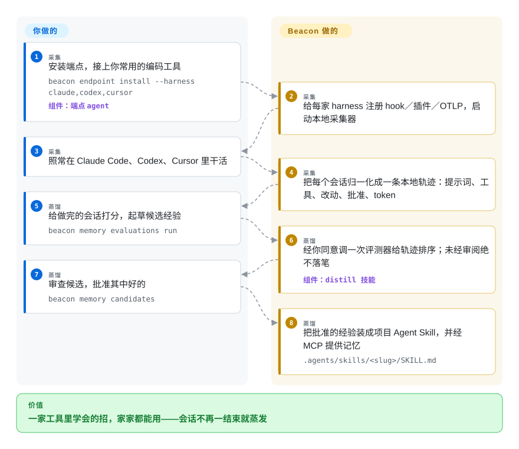

# Beacon

你在 Claude Code 里好不容易摸清的那条迁移脚本坑，会话一结束就蒸发了——第二天换 Cursor 又从头踩一遍。Beacon 把 Claude Code、Codex、Cursor、OpenCode 等 20 多家编码工具的会话统一记成一份本地轨迹，再把你审核通过的那部分经验变成任何一家都能加载的项目技能。

## 何时使用

你手上有不止一个编码 agent——上班用 Claude Code，某些仓库用 Codex 或 Cursor，旁边还开着 OpenCode——而每家学到的东西都死在自家会话历史里：那条治好 flaky migration 的命令、每个 agent 都会写错的测试约定、你已经跟三个工具重复过的纠正，全都无法积累。你还经常答不上“刚才那个 session 里 agent 到底做了什么”——调了哪个工具、改了哪些文件、批准了什么。Beacon 是一个装一次就完事的端点 agent（`brew install beacon`，再 `beacon endpoint install --harness claude,codex,cursor`）：它接上每家工具自己的 hook／插件／OTLP 导出，把每个会话——提示词、工具调用、文件改动、批准动作、MCP 流量、token 消耗——写进一份归一化的本地轨迹 `runtime.jsonl`，用 `beacon endpoint dashboard` 打开本地面板就能看。

Beacon 与最近替代品的分水岭在记忆这半边：经验必须经过**你**审核批准才进记忆（`beacon memory evaluations run` → 审查候选 → 装成技能），而 claude-mem 是自动压缩、session 开始时自动注入。当这道人工闸门是你想要的特性——你不想让 LLM 悄悄改写 agent 的指令——而且同一份批准过的知识要能被**每一家**工具加载（装到 `.agents/skills/` 下，经 MCP 的 `get_memory_context` 取回）时，选 Beacon。归一化轨迹本身也是第二重价值：可以转发到你自己的 Splunk／Sentinel／Datadog／S3 做审计，纯记忆工具给不了这个。默认本地优先（不配置转发、不选 Beacon Managed 就什么都不外发），蒸馏打分也可以指向自建评测端点。

## 怎么用起来

Beacon 是一个**端点 agent**：Go 写的 CLI 加一个基于 OpenTelemetry 的小采集器（OpenTelemetry 是传输链路追踪／指标的开放标准；这里只监听本机回环地址 `127.0.0.1:4318`），作为本地服务常驻。安装后它按每家 harness 各自暴露的最强接入面——生命周期 hook、托管插件、原生 OTLP 导出，或直接读运行时写到磁盘的会话文件——完成配置，把一切归一化成一条事件流，追加进本地滚动日志 `runtime.jsonl`（10 MiB × 5 份归档，入库前做密钥脱敏、清洗和截断）。你做的：装一次，向导里选 Local，照常干活。它做的：采集、归一化、存储、关联，并可选地在事件流上跑威胁检测规则。学习闭环则**故意不挂**在任何 hook 上：`beacon memory evaluations run` 把一份有界的、脱敏后的轨迹投影发给评测器（默认是 TypeSafe 托管的 Jev API，也可以用 `BEACON_JEV_ENDPOINT` 指向自己的），拿回概率分数；只有任务成功概率 ≥ 0.50 **且**三个经验问题的均分 ≥ 0.60，轨迹才会变成候选经验——即便如此，你不批准就什么都不会写入。之后 `beacon memory skills install` 把批准的经验渲染成 `.agents/skills/<slug>/SKILL.md` 下的项目 Agent Skill，`beacon mcp serve` 再把同一份记忆以只读 MCP 工具（`get_memory_context`）暴露给任意 harness。可以把它想成学徒日志本，而不是 agent 自己回看的日记：只有工头——你——签过字的教训才能进作业手册。

<!-- flow-steps:begin (generated from flows/agent-beacon.json by tools/flow_card.py — do not edit) -->

流程文字版

1. **你**（采集）：安装端点，接上你常用的编码工具 — `beacon endpoint install --harness claude,codex,cursor` — 组件：`端点 agent`
2. **Beacon**（采集）：给每家 harness 注册 hook／插件／OTLP，启动本地采集器
3. **你**（采集）：照常在 Claude Code、Codex、Cursor 里干活
4. **Beacon**（采集）：把每个会话归一化成一条本地轨迹：提示词、工具、改动、批准、token
5. **你**（蒸馏）：给做完的会话打分，起草候选经验 — `beacon memory evaluations run`
6. **Beacon**（蒸馏）：经你同意调一次评测器给轨迹排序；未经审阅绝不落笔 — 组件：`distill 技能`
7. **你**（蒸馏）：审查候选，批准其中好的 — `beacon memory candidates`
8. **Beacon**（蒸馏）：把批准的经验装成项目 Agent Skill，并经 MCP 提供记忆 — `.agents/skills/<slug>/SKILL.md`

**价值**：一家工具里学会的招，家家都能用——会话不再一结束就蒸发

<!-- flow-steps:end -->

## 何时不用

- **你要的是嵌进自己应用的记忆，不是工作站上的记忆。** Beacon 是挂在编码 agent harness 上的端点采集工具。给产品代码（聊天机器人、客服 agent）嵌一个与模型无关的记忆库/API，用 [Mem0](../app-memory/mem0.zh.md) 或 [Memori](../app-memory/memori.zh.md)——Beacon 没有供应用调用的记忆 API。
- **你要每次会话开始时零维护的自动注入。** Beacon 的采集是自动的，但召回靠 Agent Skill 或 MCP 调用，由 agent 自己发起——不会强行塞进上下文。[claude-mem](claude-mem.zh.md) 在 `SessionStart` 时自动压缩并注入相关摘要；想要记忆自动出现、不想逐个 harness 装技能，就选那种形态，代价是每次捕获都过一遍 LLM 压缩。
- **你要团队／机群共用的中央记忆服务端。** Beacon 的记忆存在每台机器各自的 `memory.db` 里，按项目隔离（共享方式是把装好的技能提交进仓库，或走托管层）。要多账号隔离的自托管共享上下文库，[OpenViking](openviking.zh.md) 或 [Letta](../app-memory/letta.zh.md) 才是对应形态——一个服务端，而不是一个端点。
- **你不愿意跑一个记录 agent 全量会话的后台采集器。** Beacon 的价值建立在“记下 agent 做的每件事”上（有脱敏／截断，默认纯本地，卸载支持 `--keep-logs`）。在锁死或极简环境里，手工维护的 `AGENTS.md`／`CLAUDE.md` 约定更轻、什么都不外泄——你用“可积累”换“可控”。
- **你需要完全离线的蒸馏闭环。** 默认评测器打分要调 TypeSafe 托管的 Jev API（需同意才调用）；召回和晋升无密钥、纯本地。可以把 `BEACON_JEV_ENDPOINT` 指向内部兼容评测器，或用 `beacon memory candidates create` 手写候选——但想要开箱即用的离线打分，先把这层接线预算进去。
- **你需要一个被验证过的、无聊的依赖。** 仓库只有约四个半月（2026-05-12 创建），一周发多个版本，路线图握在一家年轻的安全创业公司手里，商业层是托管服务。当作可随时卸载的工作站工具没问题；要在机群范围标准化它的事件 schema 之前，先想清楚。

## 横向对比

| 替代品 | 是否收录 | 我们的评价 | 取舍 |
|---|---|---|---|
| [claude-mem](claude-mem.zh.md) | ✅ | 当采集要横跨多家 harness、出一份归一化轨迹、经验要经你批准才落地时选 Beacon；当你要在它支持的 agent 里做会话开始时自动压缩注入时选 claude-mem。 | Beacon：跨工具轨迹＋人工审核闸门＋单个 Go 二进制，但召回依赖 agent 主动调技能/MCP。claude-mem：上下文自动注入，但依赖各家 hook、本地 Bun/Python 栈，且每次捕获都要 LLM 压缩。 |
| [Mem0](../app-memory/mem0.zh.md) | ✅ | 当记忆属于你的应用（代码调用的 SDK/API，任意 LLM）时选 Mem0；当记忆属于你的**工作站**、覆盖你已在跑的那些编码 agent 时选 Beacon。 | Mem0 是可嵌入的记忆库，带托管/自托管选项——不做会话采集。Beacon 是端点遥测＋审核闸门经验，没有面向应用的记忆 API。 |
| [Letta (MemGPT)](../app-memory/letta.zh.md) | ✅ | 当你想让一个有状态运行时接管 agent 循环和记忆 OS 时选 Letta；当你的 agent 已经跑在各自 harness 下、只想要垫在下面的被动记忆/轨迹层时选 Beacon。 | Letta 换掉 agent 的运行方式（服务端、记忆 OS、自改写状态）。Beacon 不碰 agent 循环，只做采集＋受审记忆。 |
| [OpenViking](openviking.zh.md) | ✅ | 当多个人/多个 agent 要共用一个自托管的上下文＋记忆库时选 OpenViking；当只要每个开发者的每台机器各自有记忆、且完全不需要服务端时选 Beacon。 | OpenViking：多账号共享存储，但要跑服务端、有模型依赖，且 AGPL-3.0。Beacon：零服务端的本地 JSONL＋memory.db，但没有多用户后端（共享＝提交技能或托管层）。 |
| Basic Memory | 未收录 | 当事实来源必须是各家 harness 采集来的会话、且要过审核闸门时选 Beacon；当你要的是一个本地优先、AI 能记住的笔记知识库、不需要会话遥测时选 Basic Memory。 | Basic Memory（basicmachines-co，约 4.1k stars，AGPL-3.0，2026-09 仍活跃）是以笔记为中心、走 MCP 的本地记忆；没有跨工具轨迹采集，也没有审批闭环。本批次 tab-intake 未收录。 |

## 技术栈

- **语言：** Go（主体）——`cli/beacon`（CLI、端点运行时、本地面板）、`cli/beacon-hooks`（运行时调用的 hook 适配器）、`pkg/asymptoteobserve`（共享事件 schema、溯源标记、威胁规则引擎）。
- **遥测：** 一个 OpenTelemetry Collector 发行版（`collector-builder`，带 `beaconjson` 导出器）接收回环 OTLP；事件归一化到统一 schema，字段参考已公开发布。
- **TypeScript 侧：** `@asymptote/sdk`（Observe SDK，基于 OpenLLMetry，给代码内 agent 埋点）、OpenCode/Cline/Pi 的托管插件（bun）、可选的 Chrome MV3＋Firefox beta 浏览器扩展（把网页聊天活动发到同一个回环接收器）。
- **存储：** 本地 `runtime.jsonl`（10 MiB × 5 份滚动归档），加存放已批准记忆的 `memory.db`；轨迹索引可从日志重建。
- **检测：** 威胁规则语料（`rules/`，作为 release 资产分发）由端点引擎在归一化流上执行；规则格式开放（`spec/threat-rules`，带 JSON schema）。
- **打包：** Homebrew tap（`asymptote-labs/tap`）、`.deb`/`.rpm`＋校验和验证的 `install.sh`、Windows MSI＋MDM 资产、GitHub Action（`action.yml`）、以及给 CI 作业包一层临时采集器的 `beacon ci exec`。

## 依赖

- **至少一个受支持的 harness 才有东西可采**——本地运行时 25+（Claude Code、Codex、Cursor、OpenCode、Cline、Gemini CLI 等），各家走自己最强的接入面；默认 `beacon endpoint install` 只配 Claude Code 和 Codex CLI，其余按文档配 hook/插件/OTLP。浏览器聊天采集要装可选扩展；CI 用 `beacon ci exec`；云 agent 靠沙箱 hook。
- **本地路径不需要托管账号**——采集、面板、审查、晋升全部端点本地完成（贡献契约明确：正常 hook 执行不得依赖托管账号或远程拉取）。
- **可选——蒸馏打分的评测器：** `TYPESAFE_API_KEY`／`BEACON_JEV_API_KEY` 用 TypeSafe 托管 Jev API，或用 `BEACON_JEV_ENDPOINT`＋`BEACON_JEV_MODEL` 指向自建兼容评测器。召回和晋升不需要密钥；`--dry-run` 可预览调用数且不联网。
- **可选——转发目标：** 你自己已有的 Splunk HEC、Microsoft Sentinel、CrowdStrike LogScale、Sumo、Wazuh、Datadog、Elastic、CloudWatch、S3/GCS（多数经 Vector 内容包）。
- **可选——Beacon Managed：** 托管层（账号登录；Standard 或 metadata-only 两档隐私模式）。

## 运维难度

**单台工作站上算低。** `brew install` 加一条 `beacon endpoint install`（Linux 有 `.deb`/`.rpm`，Windows 有 MSI，全部带校验和验证），采集器作为托管本地服务运行，日志自己滚动，`beacon endpoint status` 就是健康检查，卸载还有显式的 `--keep-logs`。中等难度的部分在别处：机群铺开要靠 MDM 资产和逐家 harness 的接线；`memory.db` 的增长和滚动日志归你管；蒸馏评测器是又一份要管的凭据（或又一个要跑的内部服务）；每个 SIEM/Vector 转发目标都是一条自己的小管道。没有数据库服务端、没有集群——端点是自包含的。

## 健康度与可持续性

- **维护——非常活跃（截至 2026-09-28）。** v1.3.27 于 2026-09-28 发布；最近四天三个版本；每日有提交和合并 PR；未归档。把一周多版的节奏当作锁定版本部署的 churn 风险看，不要当成成熟度。
- **治理与巴士因子——小型创业团队。** 归属 Asymptote Labs（组织创建于 2025-10，自称“The Runtime Intelligence Layer for AI Agents”），提交量集中在两个人类（约 750＋约 480 次贡献），另有相当份额来自 `claude`/`cursoragent` 机器人账号——一条高度 AI 协作的提交流 [推断]（作者意图与审查深度未查证）。路线图由厂商掌控。
- **年龄与 Lindy——非常年轻，未经时间验证。** 仓库创建于 2026-05-12（验证时约四个半月）。跑得快、有厂商背书，但毫无历史记录；不要因为它“看起来已经站稳”而选它——它还没有。
- **采用与生态。** 约 4.5 个月拿到 1,634 stars／142 forks（API，2026-09-28）——对创业公司发布而言是注意力级增长；生产验证情况未经验证。周边是真的：文档站、Discord、Homebrew tap、MSI/deb/rpm＋MDM 打包、GitHub Action、npm SDK。
- **风险标记。** 设计上就是全量会话遥测（SECURITY.md 写明默认回环、脱敏／清洗／截断、转发需显式配置）；蒸馏打分默认调第三方的托管 API（需同意，可自建）；MIT 端点通向厂商付费托管层——就文档所见是 open-core 姿态而非功能阉割 [未验证]（未逐项对比托管层功能）。MIT 许可，无改证历史（太年轻，还来不及有）。

## 存疑（未验证）

- `[未验证]` 各 harness 的支持深度/一致性来自项目自己的覆盖表（README “Supported Agents”）；每个运行时的实际采集保真度未实测。默认安装只配 Claude Code 和 Codex CLI，其余 20+ 条目是文档化配置，未在此验证。
- `[推断]` `claude`（502 次贡献）与 `cursoragent`（180 次）两个贡献者条目被解读为 AI 协作提交；机器所写代码的真实占比及其审查深度未测。
- `[未验证]` Beacon Managed 的数据处理（“Standard”与“metadata-only”两档隐私模式实际发送什么、留存多久）取自 README/文档叙述；托管流程未实际走通。
- `[推断]` 约 4.5 个月 1,634 stars 被解读为发布期注意力，而非生产验证；除厂商自家材料外未找到部署证据。
- `[未验证]` 威胁规则引擎随仓库分发、规则作为 release 资产发布，但规则语料内容与检测效力未评估。
- `[未验证]` 评测阈值（task_success ≥ 0.50 为前置条件、三问均分 ≥ 0.60）与发给 Jev 的“有界、脱敏的轨迹投影”所含内容均来自文档；投影的实际字段未查源码。
- `[推断]` 一周多版（v1.3.19→v1.3.27 七天内）被解读为锁定版本部署的 churn 风险。
