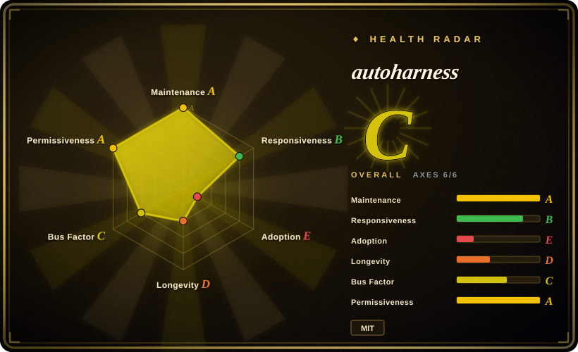
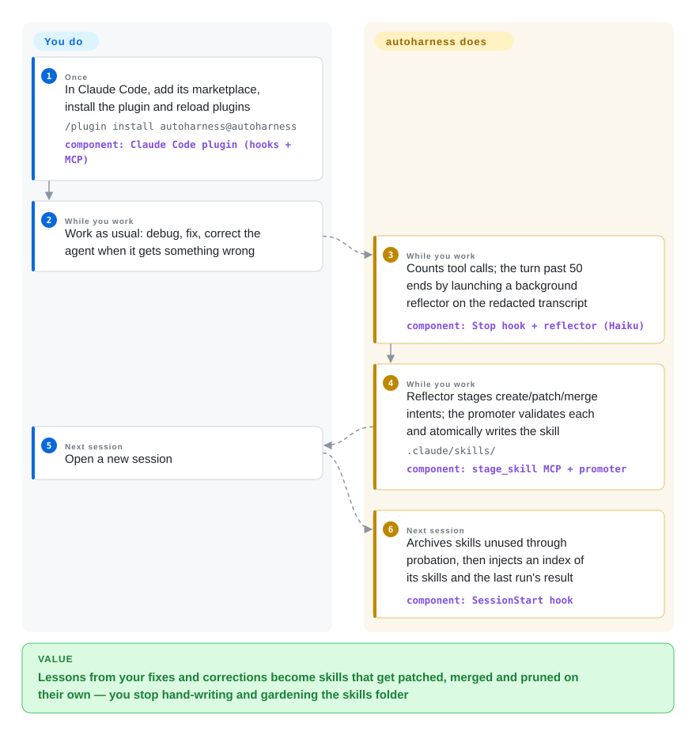

# autoharness

You correct Claude Code the same way three sessions in a row ("use `/reload-plugins`, not a restart"), and the fix lives only in transcripts nobody rereads, while the hand-written skills folder grows stale. autoharness is a Claude Code plugin that, every few dozen tool calls, has a background session turn what you just worked out into a skill file, patches or merges existing ones instead of piling up copies, and archives the ones the model never loads.

## When to use

You live in Claude Code all day on one or two machines, and the same lessons keep evaporating: you tell it twice that this repo's tests need `pnpm test --filter`, it rediscovers a workaround for a flaky tool you already debugged last week, and the skills you meant to write by hand never got written — or were written once, a year of model upgrades ago, and nobody prunes them. You want the skill folder itself to be the memory, kept current without a review chore, and you are fine with it filling `.claude/skills/` on its own as long as it never touches the skills you wrote.

autoharness is the pick when **automatic and skill-shaped** both matter. It reflects in the background after real work (counted in tool calls, so pure chat never triggers it), writes plain native `SKILL.md` files the host recalls normally, and — the part its substitutes lack — runs a lifecycle on them: per-skill load/view counters, probation, a capacity cap, and archiving of skills nobody used. Against [backpass](backpass.md) and [Beacon](agent-beacon.md) the deciding tradeoff is **no human gate**: they propose edits you accept one by one; autoharness lands them through a deterministic validator and lets usage decide what survives. Against Claudeception or claude-reflect, it is the one that also prunes and merges instead of only appending.

## How it works

Four hooks (`SessionStart`, `Stop`, `PreToolUse`, `SessionEnd`) all enter one Python dispatcher. On every tool call it bumps a per-session counter; when a turn ends past the threshold (50 tool calls by default, and the session's tail is flushed at exit), it takes the raw slice of the Claude Code transcript — the JSONL log the host writes for each session — since the last watermark, clips it to 200 KB, runs a regex redactor over secrets and PII, and launches a detached `claude -p --agent autoharness:reflector` child session (a Haiku subagent) with that slice, the index of existing skills and a format spec. The reflector has no write tools: it can only call the plugin's own `stage_skill` MCP tool to queue an "intent" (create, patch, update, merge-and-delete, remove a subfile). A separate deterministic **promoter** then lints each intent in memory — injection/exfiltration regexes, frontmatter, a 25-line body cap, a 60-character trigger-first description, "only skills autoharness created" for edits — and only on a pass atomically renames the files into `.claude/skills/<name>/` (or `~/.claude/skills/` for the global layer), with a hidden append-only ledger and a redacted evidence slice next to `SKILL.md`. At the next session start it archives skills that finished probation without ever being loaded or read, and injects a grouped one-line-per-skill index plus "last run: landed N, rejected M". Every 250 tool calls a Haiku **curator** session folds near-duplicate skills into umbrellas after snapshotting the tree. What you do: install it and work; `/learn` forces a pass now. What it does: everything else — think of a junior colleague who keeps the team wiki, but whose edits go through a strict spell-checker instead of a reviewer, and whose pages get archived when nobody opens them.

<!-- flow-steps:begin (generated from flows/autoharness.json by tools/flow_card.py — do not edit) -->

Text version of the flow

1. **You** (Once): In Claude Code, add its marketplace, install the plugin and reload plugins — `/plugin install autoharness@autoharness` — component: `Claude Code plugin (hooks + MCP)`
2. **You** (While you work): Work as usual: debug, fix, correct the agent when it gets something wrong
3. **autoharness** (While you work): Counts tool calls; the turn past 50 ends by launching a background reflector on the redacted transcript — component: `Stop hook + reflector (Haiku)`
4. **autoharness** (While you work): Reflector stages create/patch/merge intents; the promoter validates each and atomically writes the skill — `.claude/skills/` — component: `stage_skill MCP + promoter`
5. **You** (Next session): Open a new session
6. **autoharness** (Next session): Archives skills unused through probation, then injects an index of its skills and the last run's result — component: `SessionStart hook`

**Value**: Lessons from your fixes and corrections become skills that get patched, merged and pruned on their own — you stop hand-writing and gardening the skills folder

<!-- flow-steps:end -->

## When NOT to use

- **Your agents are not (only) Claude Code.** It is a Claude Code plugin end to end: `hooks/hooks.json`, `claude -p --agent` child sessions, the host's transcript format and skill folders. For Codex, Cursor, OpenCode or a mixed fleet, use [backpass](backpass.md) (mines seven harnesses' stores offline) or [Beacon](agent-beacon.md) (cross-harness capture, lessons installed as `.agents/skills/`).
- **Nothing may reach your skills without a human reading it.** The only gate is the promoter's regex and shape checks; a lesson the Haiku reflector misread lands and is recalled next session. If skills feed a team or production workflow, use [backpass](backpass.md) (each edit shown with quotes, accepted one at a time) or claude-reflect (`/reflect` processes a queue with human review).
- **`.claude/skills/` is version-controlled or shared.** Project-layer skills, sidecars and evidence slices land inside the working tree (state goes to `<repo>/.claude/autoharness/`), so they show up in `git status` and can be swept into a commit. Worse, the self-authored-only check covers patch/update/delete but not `create`: reading `promoter.py` and `validate.py`, a `create` whose name matches an existing hand-written skill overwrites its `SKILL.md` and stamps it as its own [推断] (read from the code, not reproduced; open PR #168 reports and fixes the same issue). Keep it on a personal setup, or curate shared skills by hand / with backpass.
- **Unattended, permission-skipping background sessions are not allowed on your machine.** Each reflection and curation is a full `claude -p ... --dangerously-skip-permissions` session billed to your account; the boundary is the agent's tool allowlist (Read/Grep/Glob/`stage_skill`) plus a `PreToolUse` deny on write tools. Per PR #168, those children also load your other plugins, hooks and project `CLAUDE.md`. Where that is unacceptable, use Claudeception (the main session writes skills, prompted by a `UserPromptSubmit` hook, no child processes) or backpass (you trigger every run).
- **You need recall of facts or history, not procedures.** It writes short rule-shaped skills (bodies capped at 25 non-blank lines); it does not let you search what happened. For context injected at session start use [claude-mem](claude-mem.md); for searching past transcripts use [deja-vu](deja-vu.md).
- **Windows, or no Python ≥ 3.11 as the bare `python3`.** The README lists Linux and macOS only, and every hook runs `python3 -m autoharness.hook.dispatch`; on macOS the Xcode `/usr/bin/python3` (3.9.6) silently turns every hook off for the session. claude-reflect declares native Windows support.
- **You run many concurrent or frequently killed sessions in one repo.** Overlapping learning passes can create duplicate skills (issue #184, open); per-skill use/view bumps are still unlocked read-modify-writes (issue #157, open; request counters only got a file lock on 2026-10-01 via PR #133); and each reflection still reads the whole transcript file before slicing (issue #163; `capture.window` at HEAD). The curator cleans duplicates later, but if you want a single deterministic pass, run backpass on demand instead.
- **You need a pinned, conservatively governed dependency.** Four months old, the plugin version (0.5.3) has outrun the git tags (v0.2.5) with no GitHub Releases, defaults are labeled "placeholders pending empirical calibration", and since 2026-09-04 the main author has not committed — a second maintainer merges community PRs. Treat it as an experiment you can uninstall; skills it wrote stay on disk as plain files.

## Comparison

| Alternative | In index | Our verdict | Tradeoff |
|---|---|---|---|
| [Hermes Agent](../../agent-frameworks/agent-runtimes/personal-assistants/hermes-agent.md) | ✅ | Pick Hermes Agent when you are choosing the agent itself and want skill creation, memory and messaging built in; pick autoharness when you are staying on Claude Code and only want its skill layer to learn and prune itself. | Hermes: one integrated runtime with its own learning loop and scheduler, but you leave Claude Code. autoharness: bolts the same idea (its README credits Hermes) onto Claude Code with no daemon, triggered by work done rather than idle time, but only for skills. |
| [backpass](backpass.md) | ✅ | Pick backpass when every change to agent instructions must be reviewed and you use several harnesses; pick autoharness when you are on Claude Code alone and want lessons landed and pruned without a review step. | backpass: offline batch over seven agents' existing transcripts, two-session evidence floor, token budget, accept-each-edit. autoharness: continuous and hands-off with usage-based retirement, but Claude Code only and no human gate. |
| [Beacon](agent-beacon.md) | ✅ | Pick Beacon when you need one audit trace of every coding session across harnesses and lessons approved before they install; pick autoharness for a zero-config, local, Claude-Code-only loop with no collector or dashboard. | Beacon: cross-harness capture, review-gated skills, SIEM forwarding, but a background collector and hosted evaluator by default. autoharness: no service and no review, lifecycle counters instead of an approval queue. |
| Claudeception | 未收录 | Pick Claudeception for the smallest possible version — one skill plus a hook nudging Claude to save non-obvious discoveries as skills in the current session; pick autoharness when you also want merging, a validator and pruning. | Claudeception (blader, ~2.4k stars, MIT, last push 2026-02-21): no child sessions or extra spend, but the library only grows and its README describes no retirement step. Not added in this tab batch. |
| claude-reflect | 未收录 | Pick claude-reflect when corrections should go into `CLAUDE.md`/`AGENTS.md` through a reviewed queue, or you need Windows; pick autoharness when you want skills rather than memory-file lines and no review step. | claude-reflect (BayramAnnakov, ~1.7k stars, MIT, active 2026-09): hook capture plus `/reflect` with human review, `/reflect-skills` for skill candidates you approve. autoharness: fully automatic, with use counters and capacity-based archiving. Not added in this tab batch. |

## Tech stack

- **Language/runtime:** Python ≥ 3.11 with **zero third-party dependencies** (`tomllib` for the redaction rules is why 3.11 is the floor); pytest suite of 36 test modules, CI on 3.11 and 3.12 plus ruff.
- **Host integration:** a Claude Code plugin — `.claude-plugin/plugin.json`, `hooks/hooks.json` wiring `SessionStart`/`Stop`/`PreToolUse`/`SessionEnd` to one dispatcher module, two plugin agents (`reflector`, `curator`, both `model: haiku`), one `/learn` skill.
- **MCP:** a hand-rolled stdio JSON-RPC server (`stage_skill`) registered in `.mcp.json`; it only appends intents to a queue.
- **Storage:** plain files — `SKILL.md` plus hidden `.ledger.jsonl` / `.sidecar.json` and `references/evidence-*.md` per skill; counters, intent queues, run accounts and tarball snapshots under `.claude/autoharness/`; archive is `.claude/skills/.archive/`.
- **Safety layer:** regex families for exfiltration/injection/destructive/persistence/network/obfuscation, and a TOML rule set redacting keys, tokens, emails, phone numbers and Luhn-valid card numbers.

## Dependencies

- **Claude Code** with plugin support, and the `claude` CLI on `PATH` (child sessions are spawned as `claude -p`).
- **`python3` ≥ 3.11 first on `PATH`** — hooks resolve the bare name; an older one disables every hook for the session.
- **Model quota on your Claude account** for the Haiku reflector and curator sessions.
- **Linux or macOS.** Optional: `osascript` / `notify-send` or any command for run notifications (`AUTOHARNESS_NOTIFY`, `AUTOHARNESS_NOTIFY_CMD`).

## Ops difficulty

**Low to install, medium to live with.** Install is two slash commands and a reload, and there is no daemon. The ongoing work is elsewhere: background sessions spend quota on a cadence you tune with `AUTOHARNESS_REFLECT_EVERY_N` / `AUTOHARNESS_CONSOLIDATE_EVERY_N`; learned skills accumulate in the working tree and need a `.gitignore` decision; the lifecycle thresholds (probation 100/300 requests, caps 50/20) are self-declared placeholders; updates require refreshing the marketplace, `claude plugin update autoharness@autoharness` and a restart, since third-party marketplaces do not auto-update by default. Uninstalling stops it but leaves the skills and state directories for you to delete. Recovering from a bad curator merge is a manual untar of a snapshot.

## Health & viability

- **Maintenance — active through community PRs (as of 2026-10-01).** ~160 commits on `main`, the latest merged 2026-10-01; recent work is mostly outside contributors' fixes (redaction, path traversal, worktree handling, Python-floor guard) merged by `faj-design5260`. The original author (`liruihan000`, 117 commits) last committed 2026-09-04, and an open issue (#181) asks whether the project is dead. Version 0.5.3 lives only in `plugin.json`; tags stop at v0.2.5 and there are no GitHub Releases.
- **Governance & bus factor — a young vendor org, effectively two people.** Owned by the `tigerless-labs` organization (created 2026-05-18, 14 public repos, all from 2026); commits concentrate in one author with a second as merger and a long tail of one-commit contributors.
- **Age & Lindy — very young.** Created 2026-06-09, under four months before verification; no track record to lean on.
- **Adoption — high numbers, unproven depth.** ~6.3k stars, 536 forks and 226 watchers in four months, and the org's sibling repos also reached thousands of stars within weeks. A burst of 26 narrow issues filed on 2026-09-06 by 22 accounts (blank lines, brittle test assertions) looks more like contribution or bounty activity than production reports [推断] (same-day clustering and mostly one-off accounts; accounts not checked individually). Treat the star count as hype risk, not proof of use.
- **Risk flags.** MIT, no CLA found, no relicense history. Design risks are the real ones: unattended `--dangerously-skip-permissions` child sessions, regex-only safety and redaction, a `create` path that can claim a same-named hand-written skill, and concurrency defects still open.

## Caveats (unverified)

- `[推断]` The `create`-overwrites-a-hand-written-skill path is read from `promoter.py`/`validate.py` (the self-produced check applies only to update/patch/remove_file/delete) and matches open PR #168's report; not reproduced here.
- `[未验证]` That reflector/curator child sessions load the user's other plugins, hooks and project `CLAUDE.md` comes from PR #168's description; not tested.
- `[未验证]` The README's "42% → 78% on CORE-Bench" is a cited figure about harnesses in general (HAL), not a measurement of autoharness; no benchmark of autoharness itself was found.
- `[推断]` The 2026-09-06 issue burst being bounty/engagement activity is inferred from timing and account pattern only.
- `[未验证]` Per-reflection cost was not measured; it depends on window size (≤200 KB), digest, and Haiku pricing.
- `[未验证]` Whether the lifecycle defaults (probation, capacity) keep useful skills alive in practice is untested; the project itself calls them placeholders pending calibration.
- `[未验证]` Claudeception's lack of pruning is from its README (no retirement step described); its source was not read. claude-reflect's review queue and Windows support are its README's claims.
- `[未验证]` Stargazer timing could not be sampled (the stargazers API returned 404 on 2026-10-01), so the growth curve was not checked.
