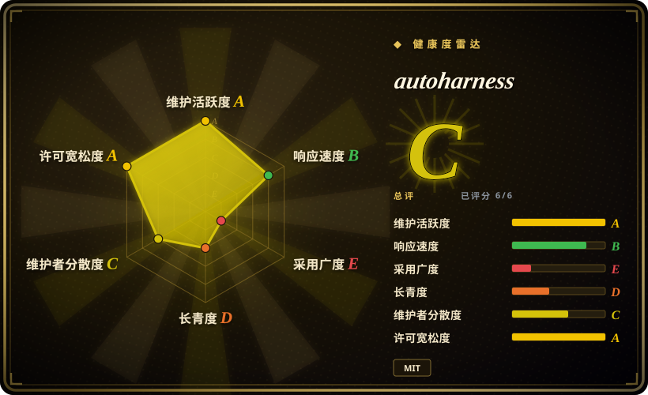
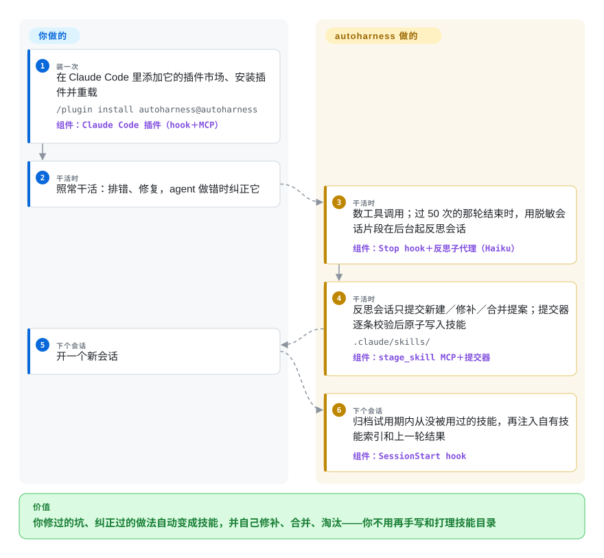

# autoharness

同一件事你连着三个会话纠正 Claude Code（“装完插件用 `/reload-plugins`，别重启”），纠正只留在没人回看的会话记录里；手写的技能目录则越放越旧。autoharness 是一个 Claude Code 插件：每干几十次工具调用，就在后台起一个会话，把你刚摸索出来的做法写成技能文件，同类的就修补或合并进已有技能而不是再堆一份，模型从来不加载的技能则自动归档。

## 何时使用

你一天到晚都在 Claude Code 里干活，就一两台机器，而同样的经验总在蒸发：这个仓库的测试要用 `pnpm test --filter`，你说了两遍；上周排查过的某个工具的坑，它又从头排查一遍；本打算手写的技能一直没写——或者写过一次，经过一年的模型升级早就过时，也没人清理。你希望技能目录本身就是记忆，不用审阅也能保持新鲜；它自己往 `.claude/skills/` 里加东西你也接受，只要它绝不碰你自己写的技能。

当“全自动”和“产出是技能”两样都要时，选 autoharness。它在真正干完活之后才在后台反思（按工具调用计数，光聊天永远触发不了），产出的是宿主照常召回的原生 `SKILL.md` 文件；而替代品没有的部分是它给这些技能配了一套生命周期：每个技能的加载／查看计数、试用期、容量上限，以及把没人用的技能归档。跟 [backpass](backpass.zh.md) 和 [Beacon](agent-beacon.zh.md) 比，决定性的取舍是**没有人工闸门**：它们把改动摆给你逐条接受；autoharness 只过一个确定性校验器就落盘，留不留由使用情况决定。跟 Claudeception 或 claude-reflect 比，它是唯一还会合并和淘汰、而不是只往里加的那个。

## 怎么用起来

四个 hook（`SessionStart`、`Stop`、`PreToolUse`、`SessionEnd`）全部进同一个 Python 分发器。每次工具调用它给本会话计数加一；某一轮结束时如果计数过了阈值（默认 50 次工具调用，会话退出时还会把尾巴补一次），它就从上次的位置往后截一段 Claude Code 会话记录——宿主为每个会话写的 JSONL 日志——截到 200 KB 以内，用正则把密钥和个人信息脱敏，然后脱离当前进程启动一个 `claude -p --agent autoharness:reflector` 子会话（一个 Haiku 子代理），把这段记录、已有技能的索引和一份格式规范交给它。反思子代理没有写文件的工具：它只能调用插件自带的 `stage_skill` MCP 工具，把一条“提案”放进队列（新建、修补、整体替换、合并后删除、删一个附属文件）。随后一个确定性的**提交器**在内存里逐条检查——注入／外传类正则、frontmatter、正文不超过 25 行、描述不超过 60 个字符且触发词靠前、改动只许针对它自己建的技能——通过才原子地重命名进 `.claude/skills/<name>/`（全局层是 `~/.claude/skills/`），`SKILL.md` 旁边还有一份隐藏的只追加账本和一段脱敏后的证据片段。下一个会话开始时，它把试用期满却从没被加载、也没被读过的技能归档，然后注入一份按类别分组、每个技能一行的索引，外加一句“上一轮：落地 N 条、拒绝 M 条”。每 250 次工具调用，还会起一个 Haiku **整理者**会话，先给技能目录打快照，再把近似重复的技能并进一个总技能。你要做的：装上它、照常干活；想立刻沉淀就说 `/learn`。其余都由它做——像一个替团队维护内部 wiki 的新同事，他的改动不经人审，只过一道严格的格式检查，没人打开的页面会被他自己收进档案柜。

<!-- flow-steps:begin (generated from flows/autoharness.json by tools/flow_card.py — do not edit) -->

流程文字版

1. **你**（装一次）：在 Claude Code 里添加它的插件市场、安装插件并重载 — `/plugin install autoharness@autoharness` — 组件：`Claude Code 插件（hook＋MCP）`
2. **你**（干活时）：照常干活：排错、修复，agent 做错时纠正它
3. **autoharness**（干活时）：数工具调用；过 50 次的那轮结束时，用脱敏会话片段在后台起反思会话 — 组件：`Stop hook＋反思子代理（Haiku）`
4. **autoharness**（干活时）：反思会话只提交新建／修补／合并提案；提交器逐条校验后原子写入技能 — `.claude/skills/` — 组件：`stage_skill MCP＋提交器`
5. **你**（下个会话）：开一个新会话
6. **autoharness**（下个会话）：归档试用期内从没被用过的技能，再注入自有技能索引和上一轮结果 — 组件：`SessionStart hook`

**价值**：你修过的坑、纠正过的做法自动变成技能，并自己修补、合并、淘汰——你不用再手写和打理技能目录

<!-- flow-steps:end -->

## 何时不用

- **你用的不只是 Claude Code。** 它从头到尾都是 Claude Code 插件：`hooks/hooks.json`、`claude -p --agent` 子会话、宿主的会话记录格式和技能目录。用 Codex、Cursor、OpenCode 或混着用时，选 [backpass](backpass.zh.md)（离线挖七家 agent 的本地记录）或 [Beacon](agent-beacon.zh.md)（跨工具采集，经验装成 `.agents/skills/`）。
- **任何东西进技能目录之前都必须有人看过。** 唯一的闸门是提交器的正则和格式检查；Haiku 反思会话理解错的经验照样落盘，下个会话就会被召回。技能要给团队或生产流程用时，选 [backpass](backpass.zh.md)（每条改动带原话、逐条接受）或 claude-reflect（`/reflect` 带人工审阅地处理队列）。
- **`.claude/skills/` 受版本管理或与人共享。** 项目层的技能、计数文件和证据片段都落在工作区里（状态在 `<repo>/.claude/autoharness/`），会出现在 `git status` 里，一不小心就被提交。更糟的是，“只动自己建的技能”这条检查覆盖了修补／替换／删除，却不覆盖 `create`：读 `promoter.py` 和 `validate.py` 可知，一个与你手写技能同名的 `create` 会覆盖它的 `SKILL.md`，并把它标记成自己的 [推断]（读代码得出，未复现；仍开着的 PR #168 报告并修复了同一问题）。只在个人环境里用它，共享技能还是手工维护或交给 backpass。
- **你的机器不允许跳过权限确认、无人值守的后台会话。** 每次反思和整理都是一个完整的 `claude -p ... --dangerously-skip-permissions` 会话，记在你的账号额度上；安全边界只是子代理的工具白名单（Read／Grep／Glob／`stage_skill`）加一个拒绝写文件工具的 `PreToolUse` hook。据 PR #168 描述，这些子会话还会加载你别的插件、hook 和项目 `CLAUDE.md`。接受不了时，选 Claudeception（由主会话自己写技能，靠 `UserPromptSubmit` hook 提醒，不起子进程）或 backpass（每一轮都由你手动触发）。
- **你要的是记住事实或历史，而不是做法。** 它写的是短小的规则式技能（正文上限 25 个非空行），不能拿来搜过去发生了什么。会话开头自动注入上下文选 [claude-mem](claude-mem.zh.md)；搜过去的会话记录选 [deja-vu](deja-vu.zh.md)。
- **Windows，或者 `python3` 不是 3.11 以上。** README 只列了 Linux 和 macOS；每个 hook 都跑 `python3 -m autoharness.hook.dispatch`，macOS 上 Xcode 自带的 `/usr/bin/python3`（3.9.6）排在前面时，整个会话的 hook 都会悄悄失效。需要 Windows 的话，claude-reflect 声明原生支持。
- **同一个仓库里经常并发跑很多会话，或经常强杀会话。** 重叠的学习轮次会生出重复技能（issue #184，未关闭）；每个技能的使用／查看计数仍是不加锁的读改写（issue #157，未关闭；请求计数器直到 2026-10-01 才由 PR #133 加上文件锁）；每次反思仍会先把整份会话记录读进内存再截取（issue #163，见当前 `capture.window`）。整理者事后会清理重复，但要的是一次确定的批处理时，按需跑 backpass。
- **你需要版本钉得住、治理稳妥的依赖。** 项目不到四个月；插件版本（0.5.3）已经跑在 git 标签（v0.2.5）前面，也没有 GitHub Release；默认参数自称“等待实测校准的占位值”；主作者自 2026-09-04 起没有再提交，由另一位维护者合并社区 PR。把它当成随时可卸的实验——卸掉后它写过的技能仍以普通文件留在磁盘上。

## 横向对比

| 替代品 | 是否收录 | 我们的评价 | 取舍 |
|---|---|---|---|
| [Hermes Agent](../../agent-frameworks/agent-runtimes/personal-assistants/hermes-agent.zh.md) | ✅ | 你在挑 agent 本身、想要技能生成、记忆和消息渠道都内置时选 Hermes Agent；你要留在 Claude Code、只想让它的技能层自己学习和淘汰时选 autoharness。 | Hermes：一个集成运行时，自带学习循环和调度器，但你得离开 Claude Code。autoharness：把同一个思路（它的 README 致谢了 Hermes）装到 Claude Code 上，不需要常驻进程，按干了多少活而不是空闲时长触发，但只管技能。 |
| [backpass](backpass.zh.md) | ✅ | agent 指令的每条改动都必须经人审、且你用好几家 agent 时选 backpass；只用 Claude Code、想让经验不经审阅就落地并自动淘汰时选 autoharness。 | backpass：离线批处理七家 agent 已有的记录，至少两个会话作证、有 token 预算、逐条接受。autoharness：持续、免手动，按使用情况淘汰，但只支持 Claude Code，也没有人工闸门。 |
| [Beacon](agent-beacon.zh.md) | ✅ | 你需要跨工具留下每个编码会话的审计轨迹、经验批准后才安装时选 Beacon；想要零配置、纯本地、只服务 Claude Code、没有采集器也没有面板的闭环时选 autoharness。 | Beacon：跨工具采集、审阅后才装技能、可转发 SIEM，但默认要后台采集器和托管评估。autoharness：没有服务也没有审阅，用生命周期计数代替审批队列。 |
| Claudeception | 未收录 | 想要最小的版本——一个技能加一个 hook，提醒 Claude 在当前会话里把不显然的发现存成技能——选 Claudeception；还要合并、校验器和淘汰时选 autoharness。 | Claudeception（blader，约 2.4k stars，MIT，最后推送 2026-02-21）：没有子会话、没有额外花费，但技能库只增不减，README 里没写任何淘汰环节。本批次未收录。 |
| claude-reflect | 未收录 | 纠正要经审阅队列写进 `CLAUDE.md`／`AGENTS.md`，或你需要 Windows 时选 claude-reflect；你要的是技能而不是记忆文件里的条目、且不要审阅环节时选 autoharness。 | claude-reflect（BayramAnnakov，约 1.7k stars，MIT，2026-09 仍活跃）：hook 采集加带人工审阅的 `/reflect`，`/reflect-skills` 提出技能候选由你批准。autoharness：全自动，带使用计数和按容量归档。本批次未收录。 |

## 技术栈

- **语言／运行时：** Python 3.11 以上，**零第三方依赖**（脱敏规则用 `tomllib` 读，所以下限是 3.11）；pytest 测试共 36 个模块，CI 在 3.11 和 3.12 上跑，外加 ruff。
- **宿主集成：** 一个 Claude Code 插件——`.claude-plugin/plugin.json`，`hooks/hooks.json` 把 `SessionStart`／`Stop`／`PreToolUse`／`SessionEnd` 都接到同一个分发模块，两个插件子代理（`reflector`、`curator`，都是 `model: haiku`），一个 `/learn` 技能。
- **MCP：** 手写的 stdio JSON-RPC 服务（`stage_skill`），在 `.mcp.json` 里注册；它只往队列里追加提案。
- **存储：** 全是普通文件——每个技能一份 `SKILL.md`，加隐藏的 `.ledger.jsonl`／`.sidecar.json` 和 `references/evidence-*.md`；计数器、提案队列、运行记录和 tar 快照放在 `.claude/autoharness/`；归档目录是 `.claude/skills/.archive/`。
- **安全层：** 外传／注入／破坏／持久化／网络／混淆六类正则，以及一份 TOML 规则，脱敏密钥、token、邮箱、电话号码和能通过 Luhn 校验的卡号。

## 依赖

- 支持插件的 **Claude Code**，以及 `PATH` 上的 `claude` 命令（子会话以 `claude -p` 启动）。
- **`PATH` 上排在最前的 `python3` 必须是 3.11 以上**——hook 只认这个名字，版本太旧会让整个会话的 hook 失效。
- 你的 Claude 账号要有**模型额度**，供 Haiku 反思和整理会话消耗。
- **Linux 或 macOS。** 可选：`osascript`／`notify-send` 或任意命令，用来接收每轮结果通知（`AUTOHARNESS_NOTIFY`、`AUTOHARNESS_NOTIFY_CMD`）。

## 运维难度

**装起来低，长期用中等。** 安装就是两条斜杠命令加一次重载，没有常驻进程。持续的工作在别处：后台会话按你用 `AUTOHARNESS_REFLECT_EVERY_N`／`AUTOHARNESS_CONSOLIDATE_EVERY_N` 设的节奏消耗额度；学到的技能堆在工作区里，得决定要不要写进 `.gitignore`；生命周期阈值（试用期 100／300 次请求、上限 50／20 个）是项目自己承认的占位值；升级要先刷新市场、再 `claude plugin update autoharness@autoharness`、再重启，因为第三方市场默认不自动更新。卸载只是让它停下，技能和状态目录要你自己删。整理者合并坏了，恢复方式是手动解开一份快照。

## 健康度与可持续性

- **维护——靠社区 PR 保持活跃（截至 2026-10-01）。** `main` 上约 160 个提交，最新一次合并在 2026-10-01；近期的工作主要是外部贡献者的修复（脱敏、路径穿越、worktree 处理、Python 版本守卫），由 `faj-design5260` 合并。原作者（`liruihan000`，117 个提交）最后一次提交在 2026-09-04，还有一个未关闭的 issue（#181）在问项目是不是死了。0.5.3 这个版本号只存在于 `plugin.json`；git 标签停在 v0.2.5，也没有 GitHub Release。
- **治理与巴士系数——年轻的厂商组织，实际上两个人。** 归属 `tigerless-labs` 组织（2026-05-18 创建，14 个公开仓库，全部建于 2026 年）；提交集中在一位作者，另一位负责合并，后面是一长串只提交过一次的贡献者。
- **年龄与林迪——非常年轻。** 2026-06-09 创建，核实时不到四个月，没有历史可依。
- **采用——数字很高，深度未经证实。** 四个月约 6.3k stars、536 个 fork、226 人关注，同组织的其他仓库也都在几周内拿到几千 stars。2026-09-06 一天里 22 个账号集中提了 26 个琐碎 issue（多余空行、脆弱的测试断言），看起来更像刷贡献或悬赏活动，而不是生产使用的反馈 [推断]（依据是同日集中提交、多为单次出现的账号，未逐个核查账号）。把 star 数当作炒作风险，而不是有人在用的证据。
- **风险信号。** MIT，没发现 CLA，没有改许可证的历史。真正的风险在设计上：无人值守、跳过权限确认的子会话，只靠正则的安全检查和脱敏，`create` 可能占用同名的手写技能，以及仍未修复的并发缺陷。

## 存疑（未验证）

- `[推断]` `create` 会覆盖同名手写技能，这是读 `promoter.py`／`validate.py` 得出的（“只动自己建的技能”检查只作用于 update／patch／remove_file／delete），与仍开着的 PR #168 的报告一致；本次没有复现。
- `[未验证]` 反思／整理子会话会加载用户的其他插件、hook 和项目 `CLAUDE.md`，来自 PR #168 的描述；没有实测。
- `[未验证]` README 里的“CORE-Bench 上 42% → 78%”引的是关于 harness 的一般性数据（HAL），不是对 autoharness 的测量；没找到针对 autoharness 本身的评测。
- `[推断]` 2026-09-06 那批 issue 属于刷贡献／悬赏活动，只是根据时间和账号特征推断。
- `[未验证]` 每次反思花多少钱没有测过；取决于窗口大小（不超过 200 KB）、前情摘要和 Haiku 的价格。
- `[未验证]` 生命周期默认值（试用期、容量上限）实际能否留住有用的技能，没有验证；项目自己也说这些是待校准的占位值。
- `[未验证]` Claudeception 没有淘汰机制，依据是它的 README（没描述任何淘汰环节），没读源码；claude-reflect 的审阅队列和 Windows 支持是它 README 的说法。
- `[未验证]` 2026-10-01 调用 stargazers 接口返回 404，无法抽样 star 时间分布，增长曲线没有核查。
