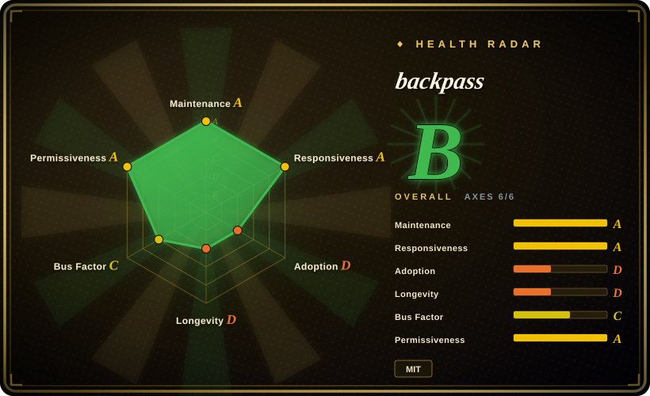
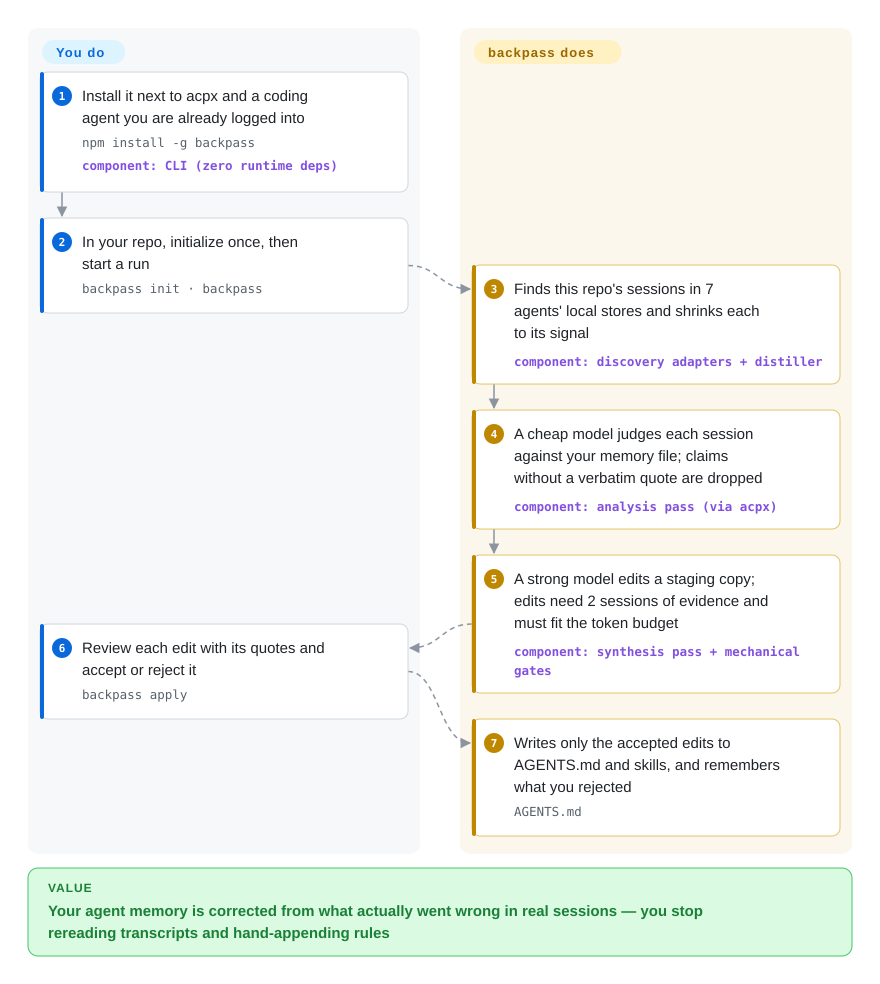

# backpass

Your `AGENTS.md` holds whatever you remembered to write down, while the agent makes the same mistake — `npm test` in a pnpm repo, again — in sessions nobody rereads. backpass reads the transcripts your coding agents already left on disk and proposes a few small edits to `AGENTS.md` / `CLAUDE.md` and skills, each backed by verbatim quotes from at least two sessions, which you accept or reject one at a time.

## When to use

You own a repository where Claude Code, Codex or OpenCode sessions run every day, yours and maybe teammates' on the same checkout. The `AGENTS.md` has grown to a few hundred lines by accretion: some rules are ignored, some are stale, and the things the agent actually keeps tripping on — the wrong test command, a migration directory it edits by hand, a helper it re-implements — were never written down, because nobody reads 100 transcripts to find them. You want the memory file corrected from evidence, and you want it to get *shorter* where it has bloated, not just longer. backpass is the batch job for that: run `backpass` in the repo, it collects the sessions tied to this repo from seven agents' local stores, has a cheap model judge each one against the current file, and has a strong model propose at most a handful of edits; `backpass apply` shows each edit with its quotes and writes only what you accept.

It is the pick over its closest substitutes for three reasons. It works **retroactively** on history you already have — nothing had to be installed before the sessions ran, unlike Beacon's endpoint capture or claude-reflect's correction hook. It is **cross-harness but key-less**: it reads the stores of Claude Code, Codex, Pi, OpenCode, Grok, Cursor CLI and Hermes, and routes every model call through `acpx` into an agent you are already logged into, so there is no API key and no service of its own. And it treats the file as a **budgeted** artifact — a 5,000-token default cap on the always-loaded surface, edits that must name what pays for them when over budget, narrow procedures moved out into skills — where claude-reflect and claude-diary only append learnings to `CLAUDE.md`.

## How it works

The tool borrows the vocabulary of training a neural network: your memory file and skills are the "weights", each agent session is a "forward pass", and the transcript — the log file each coding agent writes for every session — is the "loss signal". A run first distills each transcript deterministically (tool output truncated, harness scaffolding dropped, secrets redacted; the README reports a 96–99% size reduction), then calls a cheap model once per transcript to list which instructions helped, which were violated or caused harm, and what mistakes no instruction covers — and every claim must carry a quote that actually appears in the trace, or it is thrown away. Mistakes are clustered across sessions; only ones seen in at least two sessions reach a stronger model, which edits a **staging copy** with its own file tools while backpass measures the diff, enforces the edit cap and token budget, and re-prompts on violations. What backpass does for you: find the sessions, reduce them, check the quotes, count the evidence, measure the tokens, render a review page. What you do: have `acpx` plus a logged-in agent available, run the command, and decide each edit. Think of a coach reviewing game tape: a note goes on the board only if it showed up in at least two games, and the head coach signs off every line.

<!-- flow-steps:begin (generated from flows/backpass.json by tools/flow_card.py — do not edit) -->

Text version of the flow

1. **You**: Install it next to acpx and a coding agent you are already logged into — `npm install -g backpass` — component: `CLI (zero runtime deps)`
2. **You**: In your repo, initialize once, then start a run — `backpass init · backpass`
3. **backpass**: Finds this repo's sessions in 7 agents' local stores and shrinks each to its signal — component: `discovery adapters + distiller`
4. **backpass**: A cheap model judges each session against your memory file; claims without a verbatim quote are dropped — component: `analysis pass (via acpx)`
5. **backpass**: A strong model edits a staging copy; edits need 2 sessions of evidence and must fit the token budget — component: `synthesis pass + mechanical gates`
6. **You**: Review each edit with its quotes and accept or reject it — `backpass apply`
7. **backpass**: Writes only the accepted edits to AGENTS.md and skills, and remembers what you rejected — `AGENTS.md`

**Value**: Your agent memory is corrected from what actually went wrong in real sessions — you stop rereading transcripts and hand-appending rules

<!-- flow-steps:end -->

## When NOT to use

- **You want memory recalled *during* a session.** backpass is an offline batch you run by hand; it changes a file for the next session and does nothing in the current one. For capture-and-inject at session start use [claude-mem](claude-mem.md); for memory the agent writes and searches mid-session over MCP use [Engram](engram.md).
- **The repo has little agent history yet.** Every add, rewrite or remove needs quotes from at least two distinct sessions (`minGapEvidence`, default 2), and removals need harm-class evidence from two sessions, so a new repo with a handful of sessions mostly produces an empty proposal. Write the first `AGENTS.md` by hand (or let `backpass` bootstrap its fixed starter) and come back once there is a corpus.
- **Transcripts must not reach any model provider.** Distilled traces go to whichever agent `acpx` drives — normally a cloud model under your own login — and the redactor is, in its own source comment, "a coarse net, not a guarantee" (issue #147 reports a missed `apikey_` credential shape). If sessions can contain material that may not leave the machine, search and review them locally with [AgentsView](../../agent-tooling/session-history/agentsview.md) instead, which makes no model calls.
- **You need session search, replay or token/cost analytics.** backpass keeps only per-transcript judgments and an evidence ledger under `.backpass/`; it is not a browser for history. Use [AgentsView](../../agent-tooling/session-history/agentsview.md) for cross-agent search and cost, or [Entire](../../agent-tooling/session-history/entire-cli.md) to checkpoint sessions next to commits.
- **You are on Windows.** Paths are verified on macOS and Linux only; issue #164 shows Windows-path sessions read from WSL matching *every* repo at the strongest association tier, and issue #148 reports Windows test failures. On a Windows-only Claude Code setup, [claude-reflect](https://github.com/BayramAnnakov/claude-reflect) (not indexed) declares Windows support, at the cost of being Claude-Code-only and hook-based.
- **You want lessons turned into shareable skills with an audit trail of what agents did.** backpass can extract skills, but it owns only the memory surface; it records no telemetry. [Beacon](agent-beacon.md) captures every session into one normalized trace (forwardable to a SIEM) and installs approved lessons as `.agents/skills/` loaded by every harness.
- **You need a boring, pinned dependency.** The repo is five weeks old (created 2026-08-21), at 0.1.x with 28 releases so far, and configuration semantics have already shifted between releases (the README documents how old all-null role blocks behave after upgrade). Pin a version and treat it as a workstation tool; for a process nobody may disturb, keep `AGENTS.md` changes in ordinary code review.
- **Model spend matters more than the file.** A default run makes up to 100 analysis calls (a recency-weighted sample past that) plus a high-reasoning synthesis call with up to two re-prompts, billed against your agent subscription or quota [推断]（成本依会话量与所选模型而定，未实测一轮的实际花费）. On a quota-limited plan, narrow the run with `--since`, `--max-transcripts` or `--target`, or edit the file by hand.

## Comparison

| Alternative | In index | Our verdict | Tradeoff |
|---|---|---|---|
| [Beacon](agent-beacon.md) | ✅ | Choose backpass when the goal is a shorter, corrected `AGENTS.md` mined from history you already have; choose Beacon when you want every future session captured into one audit trace and approved lessons installed as skills across harnesses. | backpass: retroactive, no daemon, no key, per-edit evidence and a token budget, but no telemetry and no recall surface. Beacon: continuous capture, dashboard, SIEM forwarding and MCP recall, but a background collector and a hosted evaluator by default. |
| [claude-mem](claude-mem.md) | ✅ | Choose claude-mem when the agent should receive compressed context automatically at every session start; choose backpass when you want the durable instruction file itself fixed, reviewed edit by edit. | claude-mem: automatic injection with per-capture LLM compression and a local worker. backpass: nothing runs between invocations and nothing reaches the file unreviewed, but it helps only from the next session after you apply. |
| [AgentsView](../../agent-tooling/session-history/agentsview.md) | ✅ | Choose AgentsView to search, read and cost-account sessions yourself; choose backpass when you want a model to read them for you and turn recurring mistakes into proposed memory edits. | AgentsView: local-only, no model calls, full history UI, but the conclusions are yours to draw and write. backpass: automated judgment with quote checks, but traces go to a model and there is no browsing UI. |
| claude-reflect | 未收录 | Choose claude-reflect when you live in Claude Code and want explicit corrections ("no, use X") captured as they happen and synced to `CLAUDE.md`; choose backpass for several harnesses and for pruning, not only appending. | claude-reflect (BayramAnnakov, ~1.7k stars, MIT, active 2026-09): a Claude Code plugin with hooks and `/reflect`, declared Windows support; no multi-session evidence floor or token budget. Not added in this tab-intake batch. |
| claude-diary | 未收录 | Treat claude-diary as a minimal pattern to copy — diary entries per session, a reflection command that updates `CLAUDE.md`; choose backpass when you need evidence gates, rejection memory and more than one harness. | claude-diary (rlancemartin, ~380 stars, MIT, last push 2025-12): a few commands and a PreCompact hook you copy into `~/.claude`; tiny and readable, but Claude-Code-only and apparently idle since 2025-12. Not added in this tab-intake batch. |

## Tech stack

- **Language/runtime:** ESM-only JavaScript on Node ≥ 22.5, type-checked with TypeScript `checkJs`; tests on `node:test` with a golden fixture per transcript adapter.
- **Zero runtime dependencies:** `package.json` declares `"dependencies": {}`; SQLite stores (OpenCode, Hermes) are read through Node's built-in `node:sqlite`, which is why Node 22.5 is the floor.
- **Model access:** every call goes through `acpx` (a headless client for Agent Client Protocol sessions, openclaw/acpx) into Claude Code, Codex, Pi, OpenCode or Grok; two ordered model "ladders" (analysis at medium effort, synthesis at high) pick the first installed, logged-in candidate.
- **Review surface:** a static HTML template shipped in the package, filled with one JSON payload and served via `lavish-axi`; `--no-ui` gives a terminal flow instead.
- **State:** plain JSON files under `.backpass/` (scan cache, per-transcript evidence, gap ledger, proposal, rejections, staging copy), kept out of git via `.git/info/exclude`; user scope lives in `~/.config/backpass/user/` with mode 0700.
- **Remote collection:** your own `ssh` in `BatchMode=yes`, piping a one-shot Node program into `node -` on the remote; nothing is installed there.

## Dependencies

- **Node ≥ 22.5** on the machine running backpass (and on SSH hosts whose SQLite stores you want read).
- **`acpx` on PATH** plus **at least one coding agent already authenticated** (Claude Code, Codex, Pi, OpenCode or Grok) — that login is what pays for the model calls; backpass holds no API key.
- **`lavish-axi` on PATH** for the browser review page, or use `backpass apply --no-ui`.
- **A git repository** with local agent transcripts in the supported stores (Claude Code, Codex, Pi, OpenCode, Grok, Cursor CLI, Hermes); Cursor IDE is best-effort behind `--include-cursor-ide`.
- **Optional:** SSH access (key-based, no prompts) to your other machines to pool their sessions.

## Ops difficulty

**Low.** It is a CLI with no daemon, no database server and no account: `npm install -g backpass`, make sure `acpx` and one logged-in agent exist, `backpass init`, run it when you want a step. What needs attention is elsewhere: each run spends model quota; the `.backpass/` state and fetched remote transcripts (pruned after 30 days unused) sit on disk and contain distilled session content; transcript formats are undocumented and can drift under an agent upgrade (adapters warn and skip rather than fail); and the review step is real human time — the whole design assumes you read the quotes before accepting.

## Health & viability

- **Maintenance — very active (as of 2026-09-28).** v0.1.28 released 2026-09-25 with v0.1.29 pending in a release-please PR; 28 releases in five weeks, commits on most days, not archived. The cadence is a churn signal as much as a vitality one.
- **Governance & bus factor — one maintainer with a growing contributor ring.** Owner is an individual (Kun Chen, `kunchenguid`), who also runs `no-mistakes` (~8.7k stars) and `lavish-axi`, both of which backpass leans on for its PR gate and review page. Of the ~95 commits on `main` (2026-09-28), the owner authored 44 and the release bot 28, with a tail of mostly one-commit outside contributors; 23 of the last 100 closed PRs merged from people other than the owner and the bot. PRs must go through the owner's own `no-mistakes` pipeline, which raises the bar for casual contribution.
- **Age & Lindy — very young, unproven.** Created 2026-08-21, about five weeks before verification. No track record to lean on; judge it by its design documents (`VISION.md`, the README's gate rules), not its age.
- **Adoption & ecosystem.** ~1.2k stars and 93 forks in five weeks; npm shows 7,480 downloads in the last month (health scorer, 2026-09-28) with 0 dependent repos — usage is a CLI people run, not a library others build on. Issues are specific and technical (WSL path association, redaction misses, timeouts reported as empty output), and several are fixed by outside PRs within days.
- **Risk flags.** Sends distilled transcripts to your chosen model provider by design, with coarse regex redaction; depends on seven undocumented transcript formats that upstream agents can change at will; its default model ladder names specific current models, so defaults will need updating as those models are retired [推断]（依据是 README 中写死的模型 id）. MIT, no CLA found, no relicense history.

## Caveats (unverified)

- `[推断]` Cost per run was not measured; the estimate that a default run makes up to ~100 analysis calls plus one synthesis call with up to two re-prompts comes from the README's `maxTranscripts` default and re-prompt rule, not from running it.
- `[未验证]` The 96–99% distillation reduction is the README's own figure; not reproduced.
- `[未验证]` Support depth for each of the seven transcript stores is taken from the README table and the fixture list in `test/fixtures/`; no store was exercised here.
- `[推断]` Default model ladder entries (`gpt-5.6-luna`, `gpt-5.6-sol`, `claude-sonnet-5`, `claude-opus-5`, `grok-4.6`) are hard-coded config defaults; the claim that they will need maintenance as models change is inference from that, not a documented policy.
- `[推断]` "Several issues fixed by outside PRs within days" is read from issue/PR titles and dates on 2026-09-28 (e.g. #143→#145, #158→#159), not from a full responsiveness measurement.
- `[未验证]` claude-reflect's Windows support is its README's platform claim; not tested.
- `[推断]` claude-diary being idle is inferred from its last push (2025-12-17); no archive notice was found.
