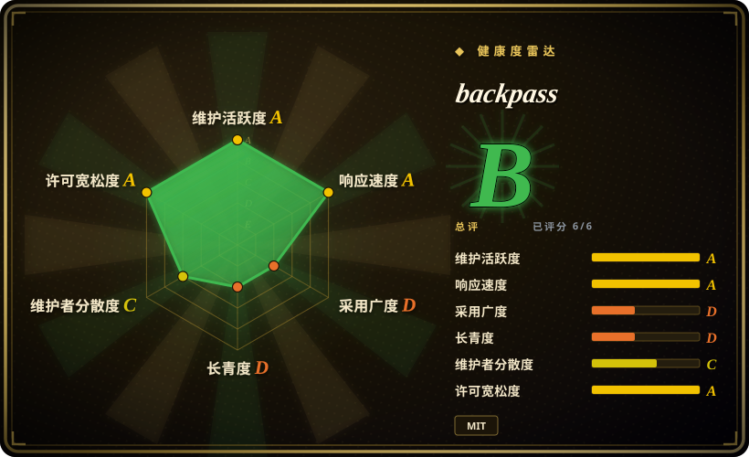
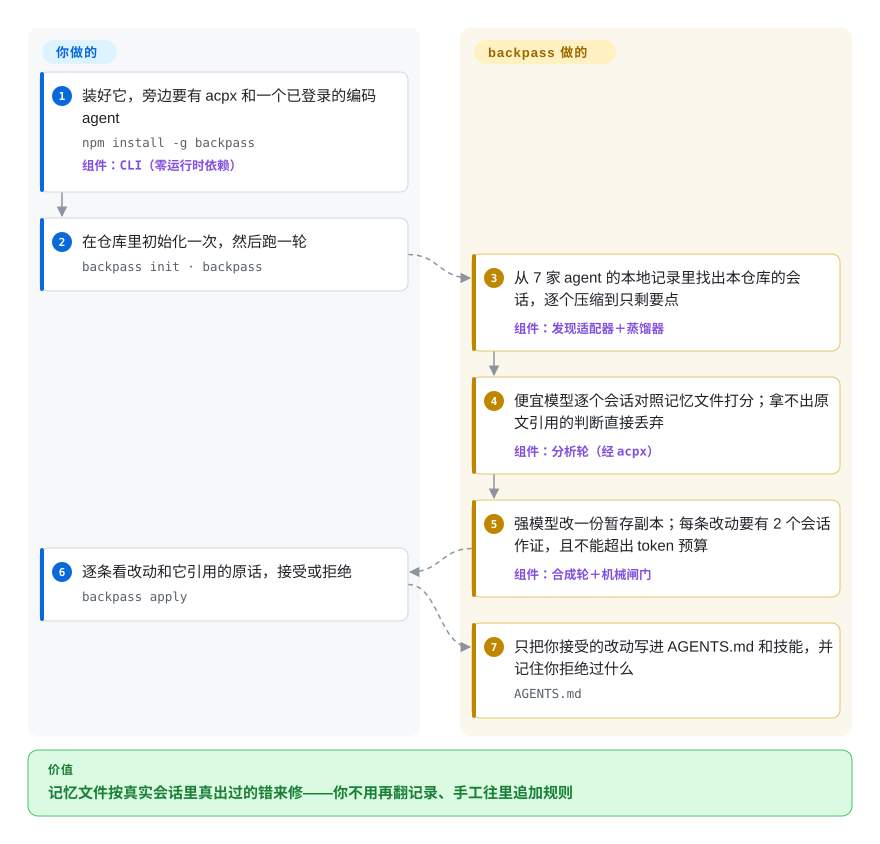

# backpass

`AGENTS.md` 里写的是你碰巧记得写下来的东西；agent 却在一个又一个没人回看的会话里犯同一个错——pnpm 仓库里又敲了 `npm test`。backpass 去读编码 agent 早已留在磁盘上的会话记录，提出几条小改动给 `AGENTS.md`／`CLAUDE.md` 和技能，每条都附上至少两个会话里的原话作证据，由你逐条接受或拒绝。

## 何时使用

你维护一个仓库，每天都有 Claude Code、Codex 或 OpenCode 的会话在里面跑，可能还有同事在同一份检出上用。`AGENTS.md` 一点点堆到了几百行：有些规则没人遵守，有些已经过时；而 agent 真正反复栽跟头的地方——用错的测试命令、它总去手改的迁移目录、它一次次重写的现成工具函数——从来没写进去，因为没人会去翻 100 份会话记录找它们。你想让记忆文件按证据来修，并且在它臃肿的地方变**短**，而不只是越写越长。backpass 就是干这件事的批处理：在仓库里跑 `backpass`，它从 7 家 agent 的本地记录中收集跟这个仓库有关的会话，让便宜模型逐个对照当前文件打分，再让强模型提出最多几条改动；`backpass apply` 把每条改动连同引用的原话摆给你看，只写入你接受的。

它胜过最接近的替代品有三点。第一，它**回溯**你已有的历史——不需要在会话发生之前先装好什么，不像 Beacon 要先装端点采集，也不像 claude-reflect 要先挂上纠错 hook。第二，它**跨工具却不要密钥**：能读 Claude Code、Codex、Pi、OpenCode、Grok、Cursor CLI、Hermes 七家的记录，所有模型调用都经 `acpx` 转给你已经登录的某个 agent，自己既不持有 API key，也不跑任何服务。第三，它把记忆文件当成**有预算**的东西：常驻内容默认上限 5000 token，超预算时每条新增都得说明拿什么来抵，窄场景的流程挪进技能里；而 claude-reflect 和 claude-diary 只会往 `CLAUDE.md` 里追加。

## 怎么用起来

它借用了训练神经网络的说法：记忆文件和技能是“权重”，每个 agent 会话是一次“前向计算”，会话记录（每个编码 agent 为每次会话写下的日志文件）就是“损失信号”。一轮运行先把每份记录做确定性的蒸馏（截断工具输出、去掉工具框架注入的样板、遮掉密钥；README 称体积能减掉 96–99%），然后每份记录调一次便宜模型，列出哪些指令帮上了忙、哪些被违反或造成了伤害、哪些错误没有任何指令覆盖——每个判断都必须带一段确实出现在这份记录里的原话，否则直接丢掉。错误会跨会话聚类，只有在至少两个会话里都出现过的，才交给更强的模型；强模型用它自己的文件工具去改一份**暂存副本**，backpass 在旁边量出改了什么，卡住改动条数和 token 预算，违规就点名重问。backpass 替你做的：找会话、压缩、核对引文、数证据、量 token、生成审阅页。你要做的：备好 `acpx` 和一个已登录的 agent，敲命令，逐条拍板。像教练复盘比赛录像：一条意见要在至少两场比赛里都出现过才上白板，而且每一行都得主教练签字。

<!-- flow-steps:begin (generated from flows/backpass.json by tools/flow_card.py — do not edit) -->

流程文字版

1. **你**：装好它，旁边要有 acpx 和一个已登录的编码 agent — `npm install -g backpass` — 组件：`CLI（零运行时依赖）`
2. **你**：在仓库里初始化一次，然后跑一轮 — `backpass init · backpass`
3. **backpass**：从 7 家 agent 的本地记录里找出本仓库的会话，逐个压缩到只剩要点 — 组件：`发现适配器＋蒸馏器`
4. **backpass**：便宜模型逐个会话对照记忆文件打分；拿不出原文引用的判断直接丢弃 — 组件：`分析轮（经 acpx）`
5. **backpass**：强模型改一份暂存副本；每条改动要有 2 个会话作证，且不能超出 token 预算 — 组件：`合成轮＋机械闸门`
6. **你**：逐条看改动和它引用的原话，接受或拒绝 — `backpass apply`
7. **backpass**：只把你接受的改动写进 AGENTS.md 和技能，并记住你拒绝过什么 — `AGENTS.md`

**价值**：记忆文件按真实会话里真出过的错来修——你不用再翻记录、手工往里追加规则

<!-- flow-steps:end -->

## 何时不用

- **你要的是会话进行中就能取回的记忆。** backpass 是你手动触发的离线批处理，改的是下一次会话读的文件，对当前会话毫无作用。想在会话开始时自动采集并注入，用 [claude-mem](claude-mem.zh.md)；想让 agent 在会话中通过 MCP 自己写、自己搜记忆，用 [Engram](engram.zh.md)。
- **仓库里的 agent 历史还很少。** 每条新增、改写、删除都要至少两个不同会话的原话作证（`minGapEvidence`，默认 2），删除还要两个会话里“照做反而出事”的证据；新仓库只有几个会话时，多半得到一份空提案。第一版 `AGENTS.md` 手写（或让 `backpass` 生成它那份固定的起步模板），等会话攒够了再来。
- **会话内容不能交给任何模型服务商。** 蒸馏后的记录会发给 `acpx` 驱动的那个 agent——通常是你自己账号下的云端模型；而遮密钥的逻辑，源码注释里自己就写着“粗网，不是保证”（issue #147 报告漏遮了 `apikey_` 形态的凭据）。如果会话里可能有不能离开本机的内容，改用 [AgentsView](../../agent-tooling/session-history/agentsview.zh.md) 在本地搜索、自己审，它不调用模型。
- **你要的是搜索、回放会话或统计 token／费用。** backpass 只保存每份记录的判断结果和 `.backpass/` 下的证据台账，不是翻历史的浏览器。跨 agent 搜索和算账用 [AgentsView](../../agent-tooling/session-history/agentsview.zh.md)，把会话跟提交一起存成检查点用 [Entire](../../agent-tooling/session-history/entire-cli.zh.md)。
- **你在 Windows 上。** 路径只在 macOS 和 Linux 上验证过；issue #164 显示在 WSL 里读 Windows 路径的会话时，会以最强的关联级别匹配到**每一个**仓库，issue #148 报告了 Windows 下测试失败。纯 Windows 的 Claude Code 环境可以看 [claude-reflect](https://github.com/BayramAnnakov/claude-reflect)（未收录），它声明支持 Windows，代价是只支持 Claude Code、靠 hook 实时采集。
- **你想把经验做成可共享技能，还要一份 agent 行为的审计记录。** backpass 也能抽出技能，但它只管记忆文件这一层，不留任何遥测。[Beacon](agent-beacon.zh.md) 把每个会话采成一条归一化轨迹（可转发到 SIEM），并把批准的经验装成每家工具都能加载的 `.agents/skills/`。
- **你需要一个稳定、可长期钉版本的依赖。** 仓库才五周大（2026-08-21 创建），版本还在 0.1.x，已经发了 28 个版本，配置语义在版本间也变过（README 专门说明了旧版写入的全 null 角色配置块升级后怎么处理）。钉住版本、把它当个人工作站工具用；对不容打扰的流程，还是让 `AGENTS.md` 的修改走普通代码评审。
- **模型花费比这份文件更要紧。** 默认一轮最多做 100 次分析调用（超过就按新近程度加权抽样），外加一次高推理强度的合成调用和至多两次重问，都记在你的 agent 订阅或额度上 [推断]（花费随会话量和所选模型变化，没有实测一轮的实际开销）。额度紧的话用 `--since`、`--max-transcripts` 或 `--target` 收窄范围，或者干脆手改。

## 横向对比

| 替代品 | 是否收录 | 我们的评价 | 取舍 |
|---|---|---|---|
| [Beacon](agent-beacon.zh.md) | ✅ | 目标是从已有历史里挖出一份更短、更正确的 `AGENTS.md`，选 backpass；想把今后每个会话都采成一条审计轨迹、并把批准的经验装成跨工具技能，选 Beacon。 | backpass：回溯式、无常驻进程、无密钥，逐条证据加 token 预算，但没有遥测也没有召回入口。Beacon：持续采集、看板、SIEM 转发和 MCP 召回，但要跑后台采集器，默认还调用托管的评测服务。 |
| [claude-mem](claude-mem.zh.md) | ✅ | 希望 agent 每次开会话时自动拿到压缩后的上下文，选 claude-mem；想修的是那份常驻的指令文件本身、并且逐条审过，选 backpass。 | claude-mem：自动注入，但每次采集都要 LLM 压缩，还要跑本地 worker。backpass：两次调用之间什么都不跑，未经审阅的内容进不了文件，但只能从你 apply 之后的下一个会话起作用。 |
| [AgentsView](../../agent-tooling/session-history/agentsview.zh.md) | ✅ | 想自己搜、自己读会话并核算费用，选 AgentsView；想让模型替你读，把反复出现的错误变成记忆文件的改动提案，选 backpass。 | AgentsView：纯本地、不调模型、有完整的历史界面，但结论得你自己下、自己写。backpass：自动判断且核对引文，但记录要发给模型，也没有浏览界面。 |
| claude-reflect | 未收录 | 你只用 Claude Code，想在说出“不对，用 X”的那一刻就把纠正采下来并同步到 `CLAUDE.md`，选 claude-reflect；要覆盖多家工具、还要能删减而不只是追加，选 backpass。 | claude-reflect（BayramAnnakov，约 1.7k 星，MIT，2026-09 仍活跃）：Claude Code 插件，靠 hook 和 `/reflect` 工作，声明支持 Windows；没有多会话证据门槛，也没有 token 预算。本批次（tab-intake）未收录。 |
| claude-diary | 未收录 | 把 claude-diary 当作可以照抄的最小样板——每个会话写一篇日记、一条反思命令更新 `CLAUDE.md`；需要证据闸门、记住拒绝、覆盖多家工具时，选 backpass。 | claude-diary（rlancemartin，约 380 星，MIT，最后推送 2025-12）：几条命令加一个 PreCompact hook，拷进 `~/.claude` 即用；小而易读，但只支持 Claude Code，且 2025-12 以来看似无人维护。本批次（tab-intake）未收录。 |

## 技术栈

- **语言／运行时：** 只用 ESM 的 JavaScript，跑在 Node ≥ 22.5 上，用 TypeScript 的 `checkJs` 做类型检查；测试基于 `node:test`，每个会话记录适配器都钉着一份黄金样例。
- **零运行时依赖：** `package.json` 写的是 `"dependencies": {}`；OpenCode、Hermes 的 SQLite 存储通过 Node 内置的 `node:sqlite` 读取，这也是 Node 22.5 成为下限的原因。
- **模型接入：** 所有调用都经 `acpx`（openclaw/acpx，一个无界面的 Agent Client Protocol 会话客户端）转给 Claude Code、Codex、Pi、OpenCode 或 Grok；分析（中等推理强度）和合成（高推理强度）各有一条有序的候选“梯子”，挑第一个已安装且已登录的。
- **审阅页面：** 包里自带一个静态 HTML 模板，填入一份 JSON 数据后经 `lavish-axi` 打开；`--no-ui` 则在终端里走完同样的决定。
- **状态：** `.backpass/` 下的一组 JSON 文件（扫描缓存、逐份记录的证据、缺口台账、提案、拒绝记录、暂存副本），通过 `.git/info/exclude` 挡在 git 之外；用户级范围放在 `~/.config/backpass/user/`，权限 0700。
- **远程采集：** 用你自己的 `ssh`（`BatchMode=yes`），把一段一次性的 Node 程序管道给远端的 `node -` 执行；远端不装任何东西。

## 依赖

- 运行 backpass 的机器上要有 **Node ≥ 22.5**（想读 SQLite 存储的 SSH 远端也要）。
- **PATH 上有 `acpx`**，并且**至少有一个已登录的编码 agent**（Claude Code、Codex、Pi、OpenCode 或 Grok）——模型调用走的就是这个登录；backpass 自己不持有 API key。
- 浏览器审阅页需要 **PATH 上有 `lavish-axi`**，否则用 `backpass apply --no-ui`。
- **一个 git 仓库**，本机上有受支持存储里的 agent 会话记录（Claude Code、Codex、Pi、OpenCode、Grok、Cursor CLI、Hermes）；Cursor IDE 只是尽力支持，需加 `--include-cursor-ide`。
- **可选：** 能免密（基于密钥）SSH 到你的其他机器，把那边的会话也汇进来。

## 运维难度

**低。** 它就是一个 CLI，没有常驻进程、没有数据库服务、没有账号：`npm install -g backpass`，确认有 `acpx` 和一个已登录的 agent，`backpass init`，想走一步时跑一次。要操心的在别处：每跑一轮都消耗模型额度；`.backpass/` 状态和从远端拉来的会话记录（30 天不用就清理）留在磁盘上，里面有蒸馏后的会话内容；会话记录格式没有公开文档，agent 一升级就可能变（适配器遇到会告警跳过，不会整轮失败）；审阅这一步要花真实的人力——整个设计都假设你在接受之前真的读了那些引文。

## 健康度与可持续性

- **维护——非常活跃（截至 2026-09-28）。** v0.1.28 于 2026-09-25 发布，v0.1.29 正在 release-please 的 PR 里待合；五周内发了 28 个版本，大多数日子都有提交，未归档。这种节奏既说明有活力，也意味着变动频繁。
- **治理与巴士因子——一位维护者，外围贡献者在增加。** 所有者是个人（Kun Chen，`kunchenguid`），他同时维护 `no-mistakes`（约 8.7k 星）和 `lavish-axi`，backpass 的 PR 门禁和审阅页都依赖这两个项目。`main` 上约 95 个提交（2026-09-28）中，所有者 44 个、发布机器人 28 个，其余多为只提交过一次的外部贡献者；最近 100 个已关闭 PR 中有 23 个来自所有者和机器人以外的人并已合并。PR 必须经所有者自己的 `no-mistakes` 流水线提交，随手贡献的门槛因此更高。
- **年龄与林迪效应——非常年轻，尚未经受考验。** 2026-08-21 创建，核实时约五周大。没有历史可依，只能凭它的设计文档（`VISION.md`、README 里写明的闸门规则）来判断，而不是凭年头。
- **采用与生态。** 五周约 1.2k 星、93 个 fork；npm 近一个月下载 7,480 次（健康度评分器，2026-09-28），依赖它的仓库为 0——它是人手动跑的 CLI，不是别人拿来搭建的库。issue 具体且偏技术（WSL 路径关联、遮密钥遗漏、超时被误报为空输出），其中好几个几天内就被外部 PR 修掉。
- **风险信号。** 按设计会把蒸馏后的会话记录发给你选的模型服务商，遮密钥只靠粗粒度正则；依赖七种没有公开文档的会话记录格式，上游 agent 随时可能改；默认模型梯子写死了几款当下的具体模型，这些模型下线后默认值就得跟着改 [推断]（依据是 README 里写死的模型 id）。MIT 许可，未发现 CLA，没有改许可证的历史。

## 存疑（未验证）

- `[推断]` 每轮花费没有实测；“默认一轮最多约 100 次分析调用，外加一次合成调用和至多两次重问”是根据 README 里 `maxTranscripts` 的默认值和重问规则推出来的，不是跑出来的。
- `[未验证]` 蒸馏后体积减少 96–99% 是 README 自己的数字，未复现。
- `[未验证]` 七种会话记录存储各自的支持深度，取自 README 表格和 `test/fixtures/` 里的样例列表；这里没有实际跑过任何一种。
- `[推断]` 默认模型梯子里的条目（`gpt-5.6-luna`、`gpt-5.6-sol`、`claude-sonnet-5`、`claude-opus-5`、`grok-4.6`）是写死的配置默认值；“模型更替时需要跟着维护”是据此推断，并非项目写明的策略。
- `[推断]` “好几个 issue 几天内就被外部 PR 修掉”是根据 2026-09-28 看到的 issue／PR 标题和日期判断的（如 #143→#145、#158→#159），没有做完整的响应速度测量。
- `[未验证]` claude-reflect 支持 Windows 是它 README 里的平台声明，未测试。
- `[推断]` claude-diary 无人维护是根据它的最后推送时间（2025-12-17）推断的，没有找到归档声明。
