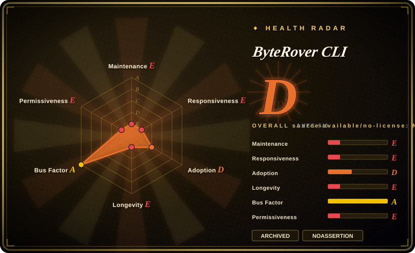
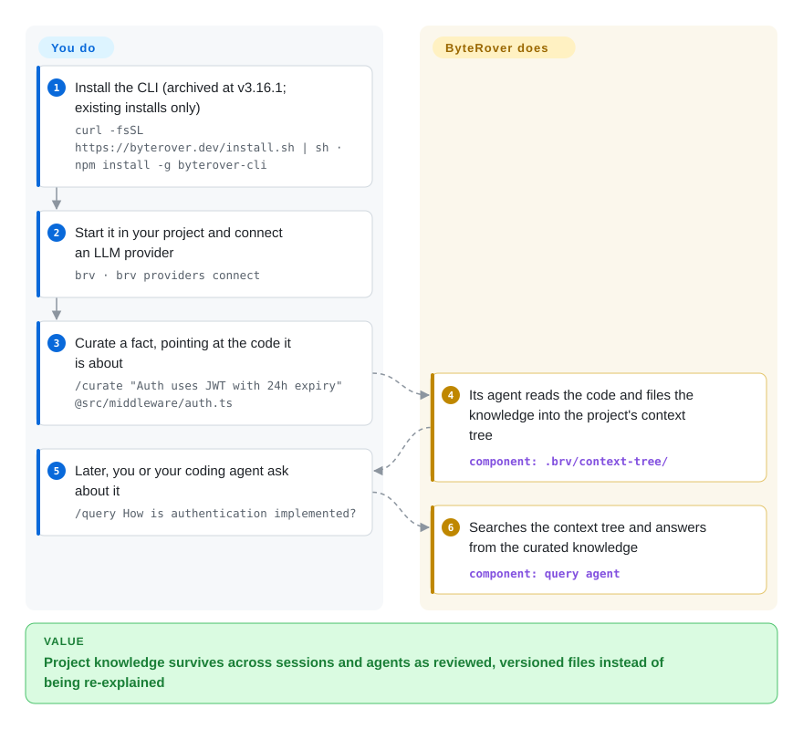

# ByteRover CLI

Your coding agent forgets the project's conventions and past decisions every session, and you keep re-typing "auth uses JWT with 24h expiry". ByteRover CLI (`brv`) let you curate such facts into a local, git-versioned "context tree" that any agent could query — but the repository was archived by its owner in 2026 and receives no further updates, so read this page as a pattern reference and a migration note.

## When to use

You land on this page in one of two ways. Either you already run `brv` (npm `byterover-cli`, v3.x) in your projects and need to know what its archival means for you, or you are looking for exactly what ByteRover offered: a coding-agent memory that lives in your repo as a structured tree of knowledge, which an LLM-driven `curate` step writes, a `query` step searches, you review before changes land, and you can branch, commit and push like code. For the first case this page tells you to plan a migration; for the second it tells you which maintained projects deliver the same shape.

The design is still worth studying — it is the clearest open example in this index of *reviewed* memory writes (`brv review approve / reject`) and git-style version control applied to agent memory — but as of 2026-10-08 the repository is archived (last commit 2026-06-25, last release v3.16.1 on 2026-05-27) and the company's newer integrations target a hosted "Company Brain" instead. Choose [Engram](engram.md) or [claude-mem](claude-mem.md) for a maintained local memory for coding agents; choose [Cognee](../graph-memory/cognee.md) if you want the "company brain" idea self-hosted.

## How it works

`brv` runs a local daemon per machine and one agent process per project. **What ByteRover does for you:** when you `curate` a fact (optionally pointing at files with `@path`), its own LLM-driven agent reads the code, decides where the knowledge belongs in the project's context tree — a folder of structured knowledge files under `.brv/context-tree/` — and writes it; when you or your coding agent `query`, it searches that tree and answers from it. Changes can wait for your approval in a review queue, and `brv vc` gives the tree git-like history: commits, branches, merges, and push/pull to ByteRover's cloud. **What you do:** install the CLI, connect an LLM provider (or use ByteRover's hosted model after logging in), decide what is worth curating, and wire your coding agent to it through MCP (`brv mcp`) or a connector. In plain terms it is a project notebook that a clerk keeps for you, where nothing enters the notebook until you sign off.

<!-- flow-steps:begin (generated from flows/byterover.json by tools/flow_card.py — do not edit) -->

Text version of the flow

1. **You**: Install the CLI (archived at v3.16.1; existing installs only) — `curl -fsSL https://byterover.dev/install.sh | sh · npm install -g byterover-cli`
2. **You**: Start it in your project and connect an LLM provider — `brv · brv providers connect`
3. **You**: Curate a fact, pointing at the code it is about — `/curate "Auth uses JWT with 24h expiry" @src/middleware/auth.ts`
4. **ByteRover CLI**: Its agent reads the code and files the knowledge into the project's context tree — component: `.brv/context-tree/`
5. **You**: Later, you or your coding agent ask about it — `/query How is authentication implemented?`
6. **ByteRover CLI**: Searches the context tree and answers from the curated knowledge — component: `query agent`

**Value**: Project knowledge survives across sessions and agents as reviewed, versioned files instead of being re-explained

<!-- flow-steps:end -->

## When NOT to use

- **For anything new: the repository is archived (observed 2026-10-08).** No commits since 2026-06-25, no release since v3.16.1 (2026-05-27), and no deprecation notice or successor in the README; open bug reports (a connection-pool leak that hangs `brv curate`, a daemon that becomes unresponsive under concurrent curate) will not be fixed here. Use [Engram](engram.md) (single binary, any MCP agent) or [claude-mem](claude-mem.md) (Claude Code hooks) instead for maintained local coding-agent memory.
- **You need an OSI open-source license.** The `LICENSE` file is Elastic License 2.0 — source-available, with limits such as not offering it as a hosted service — even though GitHub's metadata shows `NOASSERTION`. Use [Engram](engram.md) (MIT) or [Mem0](../app-memory/mem0.md) (Apache-2.0) instead when your policy requires OSI terms.
- **You want team-shared memory that stays on your infrastructure.** Push/pull sync and spaces go through ByteRover Cloud, and the vendor's current plugin (`campfirein/byterover-plugin`, 2026-08) talks only to a hosted MCP endpoint. Use [Cognee](../graph-memory/cognee.md) self-hosted or [OpenViking](openviking.md) instead when the shared memory must be yours to run.
- **You need an embeddable memory library.** `brv` is a CLI, daemon and web dashboard, not an SDK for your own agent. Use [Mem0](../app-memory/mem0.md) or [LangMem](../app-memory/langmem.md) instead when memory belongs inside your application code.
- **You want memory that captures sessions automatically.** ByteRover depends on explicit `curate` calls (by you or the agent) and a review step. If you want capture with no extra step, use [claude-mem](claude-mem.md) instead, because it records sessions through lifecycle hooks.

## Comparison

| Alternative | In index | Our verdict | Tradeoff |
|---|---|---|---|
| [Engram](engram.md) | ✅ | For maintained, local, agent-agnostic coding memory over MCP, pick Engram instead of this archived CLI. | Engram is one Go binary with agent-written notes; you lose ByteRover's review queue and git-style branching of memory. |
| [claude-mem](claude-mem.md) | ✅ | If your agent is Claude Code and you want sessions captured without curating, pick claude-mem; ByteRover's archived curate-and-review flow is not worth adopting now. | Automatic capture through hooks, but tied to Claude Code and with no human approval step. |
| [Cognee](../graph-memory/cognee.md) | ✅ | If what drew you was ByteRover's team "company brain", pick self-hosted Cognee, which is actively released under Apache-2.0. | A heavier graph pipeline and server to run, but you own the data and the code is maintained. |
| [Mem0](../app-memory/mem0.md) | ✅ | When memory must be embedded in your own agent code rather than a separate CLI, pick Mem0. | Library with frequent releases and an optional hosted API; no context tree or review workflow. |
| [OpenViking](openviking.md) | ✅ | When you want a self-hosted context database that several coding agents share as a filesystem-like tree, pick OpenViking — accepting its AGPL-3.0 terms. | Closest maintained match to the "context tree" idea; AGPL obligations and a service to operate. |

## Tech stack

- **TypeScript on Node.js (>= 20)**, CLI framework oclif; packaged on npm as `byterover-cli` (Elastic-2.0) and as a bundled shell-installer binary that needs no Node.js.
- **Interfaces:** Ink/React terminal REPL, a React web dashboard (`brv webui`) served by an Express + Socket.IO daemon, and an MCP server (`@modelcontextprotocol/sdk`).
- **LLM layer:** Vercel AI SDK provider packages (Anthropic, OpenAI, Google, Groq, Mistral, xAI and others) plus OpenRouter and OpenAI-compatible endpoints, including local Ollama / LM Studio.
- **Storage:** knowledge files under the project's `.brv/context-tree/`; MiniSearch and isomorphic-git among the dependencies for local text search and git-style versioning; optional ByteRover Cloud for sync.

## Dependencies

- **Runtime:** Node.js 20+ (npm install) or the bundled binary for macOS/Linux (x64, ARM64).
- **An LLM:** your own provider key, a local model server, or ByteRover's hosted model after `brv login`; every `curate` and `query` runs an agentic LLM loop (default 10-minute budget per task).
- **Optional:** a ByteRover Cloud account for push/pull, spaces and team sync.
- **Upstream:** now none — with the repo archived, security and dependency updates stop at v3.16.1.

## Ops difficulty

**Low to install, rising over time.** On a single machine it is one install plus a daemon that starts itself, and settings live in one `settings.json`. The cost now is maintenance you inherit: pinned dependencies that will age without upstream fixes, known daemon/curate hangs on slow local LLMs that will stay open, and a cloud sync service whose future is tied to a vendor that has moved to a different product. If you keep it running, back up your `.brv/context-tree/` files and plan a migration rather than upgrades.

## Health & viability

- **Abandoned by its owner (maintenance E, longevity E).** Archived and read-only; last commit 105 days before scoring and 0 of the last 13 weeks active. Both sat mid-scale at the previous scoring — the drop is the archival, not a quiet patch.
- **Responsiveness E.** Archived repos accept no issues or PRs; reports filed in July–August 2026 sit unanswered.
- **Adoption D, falling.** 13,642 npm downloads last month, down from 57,394 at the previous scoring; ~5.0k stars and ~455 forks remain as history.
- **Governance A — but moot.** 17 active maintainers in the trailing 12 months with top-3 share 63.3% was a real company team (campfirein / ByteRover); that team now works on hosted products such as the `byterover-plugin` Company Brain connector.
- **Risk / license E (capped).** Elastic License 2.0 (source-available, not OSI); the radar's overall D is capped by the license and would not lift even if the repo were active.

## Caveats (unverified)

- [推断] Reading the archival as a pivot to a hosted "Company Brain" product rests on the newer `campfirein/byterover-plugin` repo (created 2026-08-17) and the absence of new `brv` releases; the owner has published no notice in the repo.
- [未验证] The exact archival date is not exposed by the GitHub API; it happened after the last push (2026-06-25) and was observed on 2026-10-08.
- [未验证] Whether ByteRover Cloud push/pull for `brv` v3 keeps working after archival was not tested.
- [未验证] The README benchmark numbers (LoCoMo 96.1%, LongMemEval-S 92.8%, LLM-as-judge) are vendor-reported and were not reproduced.
- [未验证] Coverage claims (20 LLM providers, 24 built-in tools, 22+ compatible coding agents) come from the README and were not tested individually.
- [推断] The project was formerly named "Cipher" (per the GitHub description); compatibility between Cipher-era data and `brv` v3 is undocumented here.
