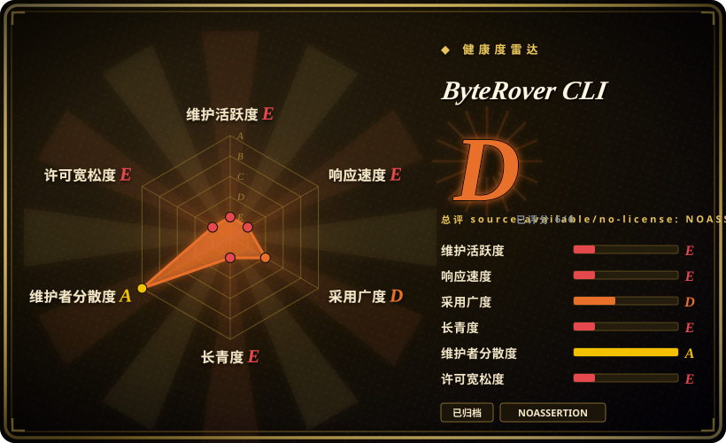
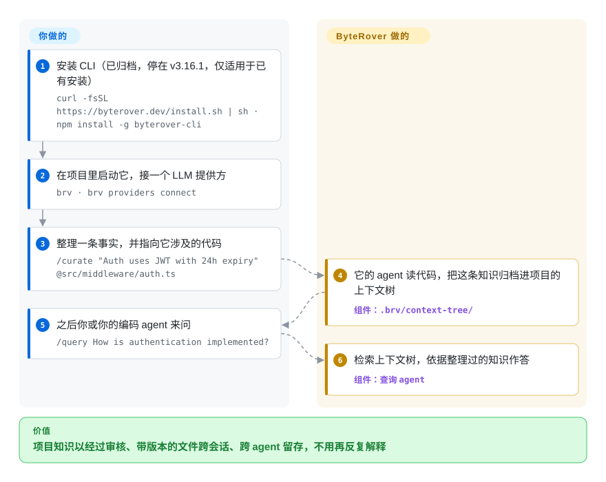

# ByteRover CLI

你的编码 agent 每次会话都忘了项目约定和过往决定，你一遍遍重打“鉴权用 JWT、24 小时过期”。ByteRover CLI（`brv`）让你把这类事实整理进一棵本地的、用 git 方式管版本的“上下文树”，任何 agent 都能来查——但这个仓库已被所有者归档，不会再更新，所以请把本页当作设计参考和迁移说明来读。

## 何时使用

你来到这一页通常有两种原因。要么你已经在项目里用着 `brv`（npm 包 `byterover-cli`，v3.x），需要知道它被归档对你意味着什么；要么你在找的恰好就是 ByteRover 提供的那种东西：一份以结构化知识树的形式住在仓库里的编码 agent 记忆，由 LLM 驱动的 `curate` 步骤写入、`query` 步骤检索，改动落地前你先审一遍，还能像代码一样分支、提交、推送。对第一种情况，本页告诉你要计划迁移；对第二种，本页告诉你哪些仍在维护的项目能给出同样的形态。

这个设计仍然值得研究——它是本索引里最清楚的、把*需审核的*记忆写入（`brv review approve / reject`）和 git 式版本控制用在 agent 记忆上的开源例子——但截至 2026-10-08 仓库已归档（最后提交 2026-06-25，最后版本 v3.16.1，2026-05-27），公司较新的集成转向了一个托管的“Company Brain”。要一个仍在维护的本地编码 agent 记忆，选 [Engram](engram.zh.md) 或 [claude-mem](claude-mem.zh.md)；想自托管“公司大脑”这个思路，选 [Cognee](../graph-memory/cognee.zh.md)。

## 怎么用起来

`brv` 每台机器跑一个本地守护进程，每个项目一个 agent 进程。**ByteRover 替你做的：**你 `curate` 一条事实时（可以用 `@path` 指向相关文件），它自己的 LLM 驱动 agent 去读代码，判断这条知识该放在项目上下文树的哪个位置——上下文树就是 `.brv/context-tree/` 下的一组结构化知识文件——然后写进去；你或你的编码 agent `query` 时，它检索这棵树并据此作答。改动可以先进审核队列等你批准，`brv vc` 还给这棵树加上 git 式的历史：提交、分支、合并，以及推送 / 拉取到 ByteRover 云端。**你要做的：**安装 CLI，接一个 LLM 提供方（或者登录后用 ByteRover 托管的模型），决定哪些东西值得整理，再通过 MCP（`brv mcp`）或连接器把编码 agent 接上。说白了，它是一本由书记员替你记的项目笔记本，你不签字，什么都记不进去。

<!-- flow-steps:begin (generated from flows/byterover.json by tools/flow_card.py — do not edit) -->

流程文字版

1. **你**：安装 CLI（已归档，停在 v3.16.1，仅适用于已有安装） — `curl -fsSL https://byterover.dev/install.sh | sh · npm install -g byterover-cli`
2. **你**：在项目里启动它，接一个 LLM 提供方 — `brv · brv providers connect`
3. **你**：整理一条事实，并指向它涉及的代码 — `/curate "Auth uses JWT with 24h expiry" @src/middleware/auth.ts`
4. **ByteRover CLI**：它的 agent 读代码，把这条知识归档进项目的上下文树 — 组件：`.brv/context-tree/`
5. **你**：之后你或你的编码 agent 来问 — `/query How is authentication implemented?`
6. **ByteRover CLI**：检索上下文树，依据整理过的知识作答 — 组件：`查询 agent`

**价值**：项目知识以经过审核、带版本的文件跨会话、跨 agent 留存，不用再反复解释

<!-- flow-steps:end -->

## 何时不用

- **任何新项目都别用：仓库已归档（2026-10-08 观察到）。** 2026-06-25 之后没有提交，v3.16.1（2026-05-27）之后没有发版，README 里也没有弃用说明或继任者；已报告的缺陷（连接池泄漏导致 `brv curate` 卡死、并发 curate 时守护进程无响应）不会在这里修复。要仍在维护的本地编码 agent 记忆，改用 [Engram](engram.zh.md)（单个二进制，任意 MCP agent）或 [claude-mem](claude-mem.zh.md)（Claude Code 钩子）。
- **你需要 OSI 认可的开源许可。** `LICENSE` 文件是 Elastic License 2.0——源码可见，带有不得作为托管服务提供等限制——尽管 GitHub 元数据显示 `NOASSERTION`。当你的政策要求 OSI 条款时，改用 [Engram](engram.zh.md)（MIT）或 [Mem0](../app-memory/mem0.zh.md)（Apache-2.0）。
- **你要团队共享、且留在自己基础设施上的记忆。** 推送 / 拉取同步和空间都经过 ByteRover Cloud，厂商现在的插件（`campfirein/byterover-plugin`，2026-08）只连一个托管的 MCP 端点。当共享记忆必须由你自己运行时，改用自托管的 [Cognee](../graph-memory/cognee.zh.md) 或 [OpenViking](openviking.zh.md)。
- **你需要可嵌入的记忆库。** `brv` 是 CLI、守护进程和 Web 仪表盘，不是给你自己的 agent 用的 SDK。当记忆应该放进你的应用代码时，改用 [Mem0](../app-memory/mem0.zh.md) 或 [LangMem](../app-memory/langmem.zh.md)。
- **你想让记忆自动捕获会话。** ByteRover 靠显式的 `curate` 调用（你或 agent 发起）加一道审核。如果你想不多做一步就自动记录，改用 [claude-mem](claude-mem.zh.md)，因为它通过生命周期钩子记录会话。

## 横向对比

| 替代品 | 是否收录 | 我们的评价 | 取舍 |
|---|---|---|---|
| [Engram](engram.zh.md) | 已收录 | 要仍在维护、本地、与 agent 无关、走 MCP 的编码记忆，选 Engram，不要选这个已归档的 CLI。 | Engram 是单个 Go 二进制，记的是 agent 自己写的笔记；代价是没有 ByteRover 的审核队列和记忆的 git 式分支。 |
| [claude-mem](claude-mem.zh.md) | 已收录 | 你的 agent 是 Claude Code、想不经整理就自动捕获会话时选 claude-mem；ByteRover 已归档的“整理 + 审核”流程现在不值得采用。 | 通过钩子自动捕获，但绑定 Claude Code，也没有人工审批这一步。 |
| [Cognee](../graph-memory/cognee.zh.md) | 已收录 | 如果吸引你的是 ByteRover 的团队“公司大脑”，选自托管的 Cognee，它以 Apache-2.0 持续发版。 | 要运行更重的图谱管线和服务器，但数据归你，代码有人维护。 |
| [Mem0](../app-memory/mem0.zh.md) | 已收录 | 当记忆必须嵌进你自己的 agent 代码、而不是一个独立 CLI 时，选 Mem0。 | 发版频繁的库加可选托管 API；没有上下文树和审核流程。 |
| [OpenViking](openviking.zh.md) | 已收录 | 想要一个可自托管、让多个编码 agent 像共享文件系统树一样共享的上下文数据库时，选 OpenViking——前提是接受 AGPL-3.0 条款。 | 仍在维护的项目里最接近“上下文树”思路的；代价是 AGPL 义务和一个要运维的服务。 |

## 技术栈

- **Node.js（>= 20）上的 TypeScript**，CLI 框架为 oclif；以 `byterover-cli`（Elastic-2.0）发布在 npm，另有不需要 Node.js 的打包二进制，用 shell 安装脚本安装。
- **界面：** Ink / React 终端 REPL，由 Express + Socket.IO 守护进程提供的 React Web 仪表盘（`brv webui`），以及 MCP 服务器（`@modelcontextprotocol/sdk`）。
- **LLM 层：** Vercel AI SDK 的各提供方包（Anthropic、OpenAI、Google、Groq、Mistral、xAI 等），外加 OpenRouter 和 OpenAI 兼容端点，包括本地 Ollama / LM Studio。
- **存储：** 项目 `.brv/context-tree/` 下的知识文件；依赖里有 MiniSearch 和 isomorphic-git，用于本地文本检索和 git 式版本管理；同步可选 ByteRover Cloud。

## 依赖

- **运行时：** Node.js 20+（npm 安装），或 macOS / Linux（x64、ARM64）的打包二进制。
- **一个 LLM：** 你自己的提供方 key、本地模型服务，或 `brv login` 之后 ByteRover 托管的模型；每次 `curate` 和 `query` 都跑一轮 agent 式 LLM 循环（默认每个任务 10 分钟预算）。
- **可选：** ByteRover Cloud 账号，用于推送 / 拉取、空间和团队同步。
- **上游：** 已经没有了——仓库归档后，安全和依赖更新停在 v3.16.1。

## 运维难度

**安装低，随时间上升。** 单机上就是一次安装加一个自启动的守护进程，设置都在一个 `settings.json` 里。现在的成本是你继承下来的维护：钉死的依赖会在没有上游修复的情况下老化，慢速本地 LLM 下已知的守护进程 / curate 卡死问题会一直开着，云同步服务的前途绑在一个已经转向别的产品的厂商身上。如果继续用，备份 `.brv/context-tree/` 下的文件，计划迁移而不是升级。

## 健康度与可持续性

- **已被所有者放弃（维护度 E，寿命 E）。** 已归档、只读；评分时最后一次提交在 105 天前，最近 13 周里 0 周活跃。上次评分时这两项都在中段——掉级的原因是归档，而不是安静地打补丁。
- **响应度 E。** 归档仓库不接受 issue 和 PR；2026 年 7–8 月提交的报告都没有回应。
- **采用度 D，还在下滑。** 上个月 npm 下载 13,642 次，上次评分时是 57,394 次；约 5.0k 星和约 455 个 fork 只是历史。
- **治理 A——但已无意义。** 过去 12 个月 17 位活跃维护者、前三名占 63.3%，那是一支真实的公司团队（campfirein / ByteRover）；这支团队现在在做托管产品，比如 `byterover-plugin` 这个 Company Brain 连接器。
- **风险 / 许可 E（封顶）。** Elastic License 2.0（源码可见，非 OSI）；雷达总评 D 被许可封顶，即便仓库还活跃也升不上去。

## 存疑（未验证）

- [推断] 把归档解读为转向托管“Company Brain”产品，依据是较新的 `campfirein/byterover-plugin` 仓库（2026-08-17 创建）和 `brv` 不再发版；所有者没有在仓库里发布任何说明。
- [未验证] GitHub API 不提供确切的归档日期；它发生在最后一次推送（2026-06-25）之后，于 2026-10-08 观察到。
- [未验证] 没有测试归档后 `brv` v3 的 ByteRover Cloud 推送 / 拉取是否还能用。
- [未验证] README 里的基准数字（LoCoMo 96.1%、LongMemEval-S 92.8%，LLM 当评委）是厂商自报，没有复现。
- [未验证] 覆盖面声明（20 个 LLM 提供方、24 个内置工具、22+ 个兼容的编码 agent）来自 README，没有逐个测试。
- [推断] 项目曾名为“Cipher”（据 GitHub 描述）；Cipher 时期的数据与 `brv` v3 的兼容性此处没有记录。
