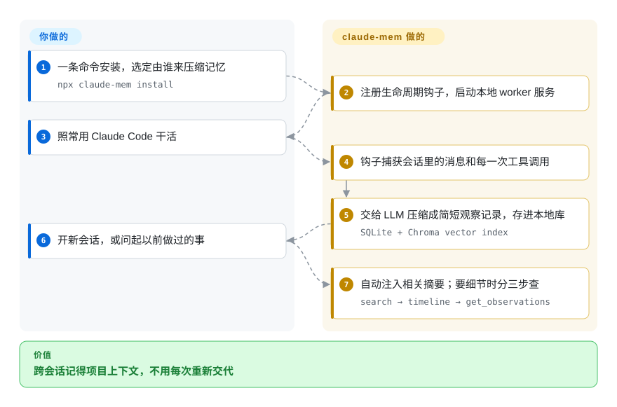

# claude-mem

你每天重开 Claude Code，都要把项目从头交代一遍；一次 `/clear` 就把花一小时攒出的上下文清零。claude-mem 挂在 agent 的会话生命周期上，把发生过的事压缩成观察记录，存进本地的 SQLite + Chroma 库，再把相关片段注入后续会话——记忆层跑在你自己机器上（v13.x 起另加了可选的托管 observer 与云同步档）。

## 何时使用

你是 Claude Code（或 Codex / Gemini / Copilot / OpenCode）的重度用户，每次会话开头都要花十分钟重新建立上下文：哪些文件要紧、昨天定了什么、那个重构为什么卡住了。更糟的是，你在任务进行到一半时按下 `/clear` 想腾出上下文窗口，结果眼看着这些工作记忆全部蒸发——你刚花三轮解释清楚的约束，agent 又忘了。你不想手工维护一份越长越乱的 CLAUDE.md，也不想用一个会把你的 transcript 送出本机的云端记忆服务。你用 `npx claude-mem install` 安装，它会接上生命周期 hook(`SessionStart`、`UserPromptSubmit`、`PostToolUse`、`Stop`、`SessionEnd`)：会话结束时捕获活动，LLM 把它压缩成 observation，下次会话启动时再从本地库里检索相关上下文注回 prompt——既扛得住会话边界，也扛得住 `/clear`。

当你想要的是*跨工具*而非绑定单一 agent 的记忆时，它就合适：同一套记忆后端通过 hook（宿主没有 hook 的地方则监听日志文件）和 MCP 接口（`search`、`timeline`、`get_observations`）同时服务 Claude Code、Codex、Gemini、Copilot、OpenClaw、Hermes、OpenCode、Antigravity CLI 和 Grok Bot，所有内容都存在本地 SQLite（FTS5）加 Chroma 向量索引里。如果你要把捕获的历史留在自己机器上、且可查询——并且你能接受跑一个本地 HTTP 服务以及它依赖的 Bun/uv 工具链——那它就是跨会话 agent 记忆里本地优先的那个选项。注意：v13.x 起，默认安装流程会引导你登录账号并使用托管 observer；免账号路径（`--provider`、`CLAUDE_MEM_ONLINE_OPTIN=false`，或在非交互 shell 里安装）仍然保留，只是不再是默认。

## 怎么用起来

claude-mem 挂在编程 agent（如 Claude Code）的生命周期钩子上——会话开始、你发消息、agent 每次调完工具、会话结束时都会被触发。它把 agent 干过的事交给一个 LLM 压缩成简短的「观察记录」，存进本地 **SQLite**（另配一个 **Chroma** 向量库，用来按意思而不只是按关键词搜），这些都由一个本地 worker 服务管理。下次开新会话时，它自动把相关历史摘要塞进上下文；要查细节时，agent 通过它提供的搜索工具分三步查：先搜出简短索引，再看前后时间线，最后只取需要的那几条全文。你做的只有一条安装命令，外加选定由谁来跑压缩——v13.x 起默认引导你用的托管 claude-mem observer、你自己的 OpenRouter 或 Gemini key，或你的 Anthropic 套餐；之后正常干活即可。

<!-- flow-steps:begin (generated from flows/claude-mem.json by tools/flow_card.py — do not edit) -->

流程文字版

1. **你**：一条命令安装，选定由谁来压缩记忆 — `npx claude-mem install`
2. **claude-mem**：注册生命周期钩子，启动本地 worker 服务
3. **你**：照常用 Claude Code 干活
4. **claude-mem**：钩子捕获会话里的消息和每一次工具调用
5. **claude-mem**：交给 LLM 压缩成简短观察记录，存进本地库 — `SQLite + Chroma vector index`
6. **你**：开新会话，或问起以前做过的事
7. **claude-mem**：自动注入相关摘要；要细节时分三步查 — `search → timeline → get_observations`

**价值**：跨会话记得项目上下文，不用每次重新交代

<!-- flow-steps:end -->

## 何时不用

- **你要的是嵌进自己应用的记忆，而不是嵌进编程 agent。** claude-mem 是接在 agent hook 上的*开发者工作站*工具。如果你要把用户记忆嵌进你交付的应用（聊天机器人、客服 agent），模型无关的记忆**库/API**——如 [Mem0](../app-memory/mem0.zh.md) 或 [Memori](../app-memory/memori.zh.md)——才是对的形态；claude-mem 没有供你在业务代码里调用的 SDK。
- **单人维护 / 弃坑风险。** 项目由一名开发者（`@thedotmack`）主导。它迭代很快（2026 年已到 v13.x），但一个坐在你每次会话关键路径上的 hook 工具、且只有单一维护者，这是 bus-factor 为一的依赖——在让它变成承重件之前先掂量。
- **你要的是完全本地、不出域的记忆工具。** 存储是本地的（SQLite + Chroma），但 v13.x 加了托管「observer」压缩档，而且是安装器的默认引导（邮箱登录、30 天免费试用），另有可选的 cmem.ai 云同步。你可以拒绝建账号（`--provider`、`CLAUDE_MEM_ONLINE_OPTIN=false`，或在非交互 shell 里安装）、把库留在本机——但文档给出的压缩 provider（observer、OpenRouter、Gemini、Anthropic 套餐）全都仍是外部 API 调用，没有文档化的本地模型压缩路径 [未验证]（源码未查）。它也没有托管的多租户后端来在团队或机群间共享记忆；它是每开发者一台机器的。
- **被捕获会话数据的隐私。** 它的设计就是捕获 *agent 做过的一切*——文件内容、命令、输出——再由 LLM 压缩。库在本地，且 `<private>` 标签可把内容排除在存储之外，但在默认 provider 路径下，*压缩本身*会调用外部模型（托管 observer 或你的 OpenRouter/Gemini/Anthropic key），云同步到 cmem.ai 是 opt-in；在敏感仓库上，要审查什么会落进库里、以及你实际选的压缩 provider 是哪一个。
- **你不信任这个热度信号。** ~94.8k star 这个计数经 GitHub API 核实，但它对一个年轻的单人工具来说极端反常，且其生产采用/检验程度的含义未经核实、可疑 `[未验证]`；别*因为*它看起来被广泛检验过就采用它——评估代码和你自己的约束，而不是 star 数。

## 横向对比

| 替代品 | 是否收录 | 我们的评价 | 取舍 |
|---|---|---|---|
| [Mem0](../app-memory/mem0.zh.md) | ✅ | 应用内嵌、模型无关的记忆 API 比编程 agent hook 更重要时，选 Mem0。 | 你嵌进自己 agent 代码的模型无关记忆**库/API**（Python/TS，任意 LLM）；为应用内嵌用户记忆而建。claude-mem 是面向编程 agent 的工作站 hook 工具，不是你调用的库。 |
| [Memori](../app-memory/memori.zh.md) | ✅ | SQL 优先、包裹 LLM client 的应用记忆形态更合适时，选 Memori。 | 你用它包裹自己 LLM client 的 SQL 优先记忆引擎；框架无关，带云/BYODB 之分。claude-mem 纯本地、hook 驱动，范围限于编程 agent 会话而非应用记忆。 |
| [Claude Subconscious](claude-subconscious.zh.md) | ✅ | Letta 支撑的 Claude Code hook 记忆实验正好贴合时，选 Claude Subconscious。 | 形态最接近：同样是做跨会话记忆的 Claude Code hook 插件——但它是 Letta 支撑的 *demo*，作者明示“不用于生产”，且只支持 Claude Code。claude-mem 是本地存储（SQLite+Chroma）、多 agent，定位为正式安装的工具。 |
| [Letta (MemGPT)](../app-memory/letta.zh.md) | ✅ | 想让有状态 runtime 接管 agent 循环和记忆 OS 时，选 Letta。 | 有状态的 agent runtime，带自编辑记忆 OS 和服务端；接管 agent 主循环。claude-mem 通过 hook 嵌在你现有 agent 之下，而非替换它们。 |
| [Zep](../graph-memory/zep.zh.md) / [Graphiti](../graph-memory/graphiti.zh.md) | ✅ | 时序知识图谱记忆和显式事实失效是核心时，选 Zep 或 Graphiti。 | 带显式事实失效的时序知识图记忆服务；面向应用记忆的托管/自托管后端，不是每开发者一份的编程 agent hook 层。 |

## 技术栈

- **语言：** TypeScript（主）/ JavaScript（仓库字节占比约 46% TS、40% JS、12% Python，据 GitHub linguist 2026-09 估算；README 页脚自称“Made with TypeScript”）。
- **捕获面：** 五个 Claude Code 生命周期 hook（`SessionStart`、`UserPromptSubmit`、`PostToolUse`、`Stop`、`SessionEnd`），外加一个暴露 `search`、`timeline`、`get_observations` 的 MCP 服务；对没有 hook 的宿主（Grok Bot）用日志文件监听。
- **存储：** 本地 **SQLite** 配 **FTS5** 全文检索，加一个 **Chroma** 向量库做语义/关键词检索；记忆可选云同步到 cmem.ai。
- **进程模型：** 本地 **HTTP API（默认端口 37777）**，带 web viewer UI；以 **Bun** 作为 JS 运行时/进程管理器；**uv** 作为 Python 包管理器（供 Chroma 那一侧）——两者缺失时都会自动安装。
- **压缩：** 一次 LLM pass 把捕获的会话活动压缩成存储的 observation 再注入；provider 由你选（默认引导的托管 claude-mem observer、OpenRouter、Gemini 或你的 Anthropic 套餐）。
- **分发：** 插件市场、`npx claude-mem install`（带 `--ide` 变体支持 OpenCode、Antigravity、Grok Bot），以及 OpenClaw 网关的一行安装脚本（`curl -fsSL https://install.cmem.ai/openclaw.sh | bash`）。

## 依赖

- **一个受支持的编程 agent：** Claude Code、Codex、Gemini、Copilot、OpenCode、OpenClaw、Hermes、Antigravity CLI 或 Grok Bot——claude-mem 接进 agent 的生命周期（或监听其日志），自身不是独立运行的。
- **Node.js：** README 徽章写 ≥ 20.0.0；package.json engines 钉的是 `node >=20.12.0`、`bun >=1.1.31`。
- **Bun**（JS 运行时/进程管理器）与 **uv**（Python 包管理器）——安装路径两者都要，缺失时都会自动安装。
- **Chroma** 向量库与一个 **SQLite** 文件——由安装器在本地配置。
- **压缩步骤所需的 LLM**——安装器默认引导登录并使用托管 claude-mem observer（账号、30 天试用）；备选是你自己的 OpenRouter 或 Gemini key、或 Anthropic 套餐。文档给出的选项全部是外部 API 调用。
- **安装：** `npx claude-mem install`；随后本地服务默认监听 37777 端口（可在 `~/.claude-mem/settings.json` 改）。注意：`npm install -g claude-mem` 只装 SDK/库——不会注册 hook、也不会起 worker。

## 运维难度

**单机上低到中。** 安装是一条 `npx` 命令加 hook 接线（v13 可能中途拉起浏览器登录以启用托管 observer——可用 `--provider` / `CLAUDE_MEM_ONLINE_OPTIN=false` 跳过）；没有服务机群、没有多租户后端、没有集群——其余全在本地。中的那部分来自一个*记忆*工具的活动部件数：一个常驻、固定端口的 HTTP 服务（37777——端口冲突和残留进程是真实的失败模式）、一个 Bun 运行时、一个 `uv` 管理的 Python 侧给 Chroma，以及你现在自己拥有的 SQLite + 向量库（体积增长、损坏、备份都归你）。会话边界上的异步捕获若失败，对前台可能是静默的；捕获时的 LLM 压缩步骤会带来延迟和每会话的 token 成本。在本地栈漂移之前它是“装完就忘”——一旦漂移，你就得在自己机器上同时排查一个端口、一个运行时和两个数据存储。

## 健康度与可持续性

- **响应速度**：Grade A——中位首次响应时间 61.4 小时，基于 38 个 qualifying issues/PRs。
- **维护——极其活跃（截至 2026-09）。** 最后推送 2026-09-26，v13.28.0 同日发布；近 13 周周周有提交；未归档。约 13 个月大的项目跑到 v13.x 这种主版本号节奏仍然反常——把它当变动信号读，而不是成熟度。
- **治理与 bus factor——单一开发者、star 与成熟度失配 ⇒ 强红旗。** 一个 `User` 持有的仓库（`@thedotmack`，Alex Newman）坐在你每次会话的关键路径上，是 bus-factor 为一的依赖。约 94.8k star 经 API 核实，但对一个年轻的单人 hook 工具极不成比例，且近期约 81% 的提交出自头号作者——请把热度与检验程度解耦，别当成采用证据。
- **年龄与 Lindy——年轻、未经证明。** 2025-08 创建，约 13 个月（截至 2026-09）。活跃但无历史沉淀；属于「年轻且被热捧」，而非 Lindy 安全——别*因为*它看起来被广泛检验过就采用。
- **采用与背书信号。** 每月 67,914 次 npm 下载（2026-09 实测）、Vercel OSS Program 徽章、自建文档站与 Discord——触达是真实的，但注册表的依赖图信号近乎为零（零依赖包），而且 README 现在开始在注意力上变现：第三方 **CMEM 代币**被作者「官方接纳」。无论你怎么看加密货币，代币关联都是治理/注意力分散的风险信号。[推断]
- **风险信号——数据捕获、商业化漂移、自有本地栈。** Apache-2.0（无重许可风险），但其设计就是记录 agent 做过的一切；默认压缩 provider 如今是需要账号的托管服务；你还要自己拥有本地 SQLite+Chroma 栈。主导风险是隐私、bus-factor 与账号/托管档的漂移，而非许可。

## 存疑（未验证）

- `[未验证]` **截至 2026-09 约 94.8k GitHub star：计数经 GitHub API 核实，但其生产采用/检验程度的含义未经核实、可疑**——这个数字对一个年轻的单人 hook 工具与其成熟度严重不成比例。把这个计数对采用/检验程度的含义当作未经核实、且*不*作为采用或检验程度的证据；无论如何 GitHub star 都不可靠且对时间敏感。
- `[未验证]` v13.28.0 于 2026-09-26 发布（GitHub releases 与 npm 双源核实）。约 13 个月的项目跑到这么高的主版本号很不寻常，意味着快速且未必公告的破坏性变更；具体某个小版本的稳定性未做评估。
- `[未验证]` 受支持 agent 列表（Claude Code、Codex、Gemini、Copilot、OpenCode、OpenClaw、Hermes、Antigravity、Grok Bot）是 README 自己的表述；各 agent 的支持深度/等质性未独立确认（如 Grok Bot 没有 hook，只能监听日志）。
- `[未验证]` 托管 claude-mem observer 到底向服务端发什么（原始 transcript 还是压缩后的 observation、保留多久），README 没有写清；登录引导的默认安装流程只读自 README，未实跑验证。
- `[推断]` 把作者背书的第三方 CMEM 代币读作治理/注意力分散风险，是我们基于 README「What About CMEM?」一节做的推断，不是对不当行为的指控。
- `[未验证]` README 自称「4 个 MCP 工具」但只列了三个（`search`、`timeline`、`get_observations`）；MCP 实际表面未在源码层核实。
- `[推断]` `uv`/Python 是给 Chroma 向量库组件用的；Bun 侧与 Python 侧的具体分工是推断而非明述。
- `[推断]` hook 名称和 MCP 工具名取自 README；各 hook 的实际行为未在源码中核验。
