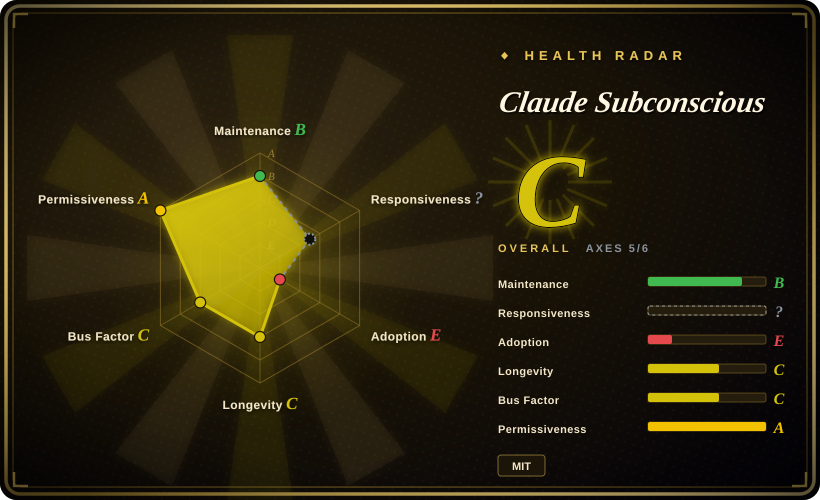
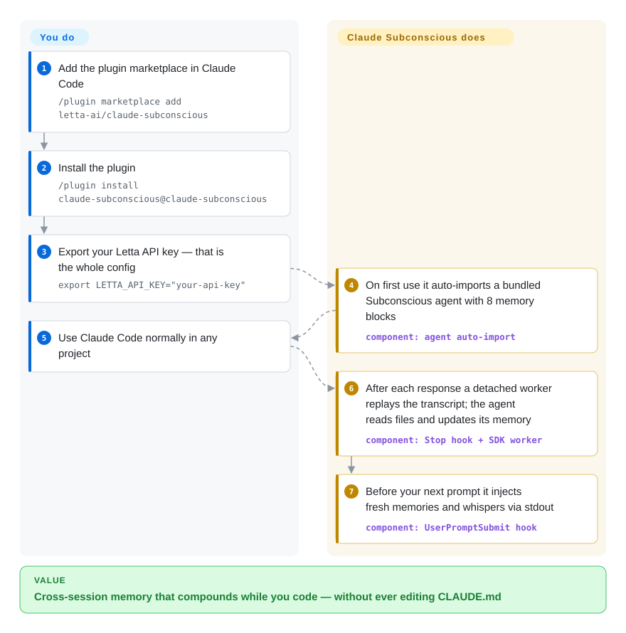

# Claude Subconscious

Claude Code forgets everything between sessions, so you re-explain the same preferences and decisions every time. Claude Subconscious hangs a background Letta agent off your hooks: it watches every transcript, maintains eight persistent memory blocks, and whispers relevant guidance back before your next prompt — without ever touching CLAUDE.md.

## When to use

You're a Claude Code power user who keeps re-explaining the same things every session — your preferred test runner, the fact that this repo uses pnpm not npm, the architectural decision you made last week that Claude keeps "forgetting." Claude Code's context dies at the end of each session, so the same corrections recur. You want a memory layer that *accumulates* across sessions without you hand-curating a giant CLAUDE.md. Claude Subconscious installs as a plugin and wires four Claude Code hooks: when a session ends it asynchronously ships the full transcript to a Letta agent (in a detached worker, so it never blocks you), the agent reads your files and updates eight persistent memory blocks (`user_preferences`, `project_context`, `pending_items`, `tool_guidelines`, and more), and on your next `UserPromptSubmit` it injects the relevant memory and any "whispered" guidance via stdout — never touching CLAUDE.md.

It fits best when you already live inside the Letta ecosystem (or want an excuse to try it) and treat this as an exploratory, single-developer convenience layer: one shared "agent brain" serving many projects, each project keeping its own conversation bookkeeping under `.letta/claude/`. If you want to *see* what a subconscious-style background memory agent feels like wired into a real coding loop, this is a working, readable reference implementation built on the Letta Code SDK.

## How it works

Four hooks wrap your Claude Code session and everything happens at their boundaries. On first use the plugin auto-imports a bundled "Subconscious" Letta agent — zero config beyond `LETTA_API_KEY` — and one agent "brain" is then shared across all your projects while each repo keeps its own conversation bookkeeping under `.letta/claude/`. After each response, the `Stop` hook parses the transcript (user messages, assistant replies including thinking blocks, tool uses) into a temp file and spawns a detached background worker, so it never blocks you; that worker replays the transcript to the agent through the Letta Code SDK, and while processing it the agent can explore your codebase — by default with read-only tools (`Read` / `Grep` / `Glob` plus `web_search` / `fetch_webpage`, tightened or widened via `LETTA_SDK_TOOLS`) — and rewrite its eight memory blocks (`core_directives`, `guidance`, `user_preferences`, `project_context`, `session_patterns`, `pending_items`, `self_improvement`, `tool_guidelines`). Before your next prompt, the `UserPromptSubmit` hook fetches what changed and prints it to stdout as `<letta_message>` / `<letta_memory_blocks>` XML, which Claude Code folds into the prompt context; `PreToolUse` can inject mid-workflow updates the same way. What stays yours: memory quality depends on the agent model you point it at, and CLAUDE.md is never written by the plugin — all injection is in-context only.

<!-- flow-steps:begin (generated from flows/claude-subconscious.json by tools/flow_card.py — do not edit) -->

Text version of the flow

1. **You**: Add the plugin marketplace in Claude Code — `/plugin marketplace add letta-ai/claude-subconscious`
2. **You**: Install the plugin — `/plugin install claude-subconscious@claude-subconscious`
3. **You**: Export your Letta API key — that is the whole config — `export LETTA_API_KEY="your-api-key"`
4. **Claude Subconscious**: On first use it auto-imports a bundled Subconscious agent with 8 memory blocks — component: `agent auto-import`
5. **You**: Use Claude Code normally in any project
6. **Claude Subconscious**: After each response a detached worker replays the transcript; the agent reads files and updates its memory — component: `Stop hook + SDK worker`
7. **Claude Subconscious**: Before your next prompt it injects fresh memories and whispers via stdout — component: `UserPromptSubmit hook`

**Value**: Cross-session memory that compounds while you code — without ever editing CLAUDE.md

<!-- flow-steps:end -->

## When NOT to use

- **Production / team use.** The authors explicitly state this is "a demo app built using the Letta Code SDK, and is not intended to be used in production," and point you to Letta Code instead. Do not build a team workflow on it.
- **You're not on Claude Code.** It is a Claude Code plugin end-to-end — it depends on Claude Code's hook lifecycle (`SessionStart` / `UserPromptSubmit` / `PreToolUse` / `Stop`). It is *not* an LLM-agnostic, framework-agnostic memory library; [Mem0](../app-memory/mem0.md) or [Memori](../app-memory/memori.md) are the choices if you need memory inside your own agent code.
- **You can't depend on an external Letta server.** It requires a `LETTA_API_KEY` and a reachable Letta backend (cloud `api.letta.com` or self-hosted). No backend, no memory. That's a hard network dependency on every session boundary.
- **Privacy-sensitive code you can't ship off-box.** The Stop hook sends your **full session transcript** to the Letta agent, and the agent gets client-side tool access while processing: by default `LETTA_SDK_TOOLS=read-only` (`Read`/`Grep`/`Glob` + web search/fetch), but `full` grants Bash, Edit, Write and sub-agent spawning via `Task`. Think before pointing it at a sensitive repo.
- **You want deterministic, auditable, self-hosted memory with no third-party brain.** The memory lives in a Letta agent, not in a local store you fully own; behavior depends on the agent model and Letta API semantics.
- **Latency-/quota-sensitive workflows.** Every session start, prompt, and stop touches the Letta API; quality "requires several sessions" before guidance becomes useful, per the README.

## Comparison

| Alternative | In index | Our verdict | Tradeoff |
|---|---|---|---|
| [Mem0](../app-memory/mem0.md) | ✅ | Choose Mem0 when portable application memory matters more than a Claude Code plugin. | Framework-agnostic memory **library/API** you embed in your own agent (Python/TS, any LLM); not a Claude Code plugin and not a background "whisper" agent. Pick it for portable, production-oriented memory. |
| [Memori](../app-memory/memori.md) | ✅ | Choose Memori when you need a SQL-native memory backend rather than Claude-Code-bound hooks. | SQL-native open-source memory engine for agents; also LLM/framework-agnostic and self-hostable. Different shape: a memory backend, not a Claude-Code-bound plugin. |
| [Letta Code](../../agent-frameworks/coding-agents/terminal-agents/letta-code.md) | ✅ | Choose Letta Code when you want the team's full coding-agent product instead of this demo. | The production sibling from the same team — a full coding agent on the Letta platform. The README explicitly recommends it over this demo for real use. |
| CLAUDE.md (built-in) | 未收录 | Choose CLAUDE.md when manual, deterministic project memory is enough. | Manual, deterministic, zero-dependency project memory. No background learning or cross-project brain; you curate it by hand. Claude Subconscious explicitly avoids writing here. |
| [Cipher](https://github.com/campfirein/cipher) | 未收录 | Choose Cipher when MCP-based memory across IDEs and CLIs matters more than Claude-only hooks. | MCP-based memory layer for coding agents (works across IDEs/CLIs via MCP); broader client support than a single-tool plugin. |

## Tech stack

- **Language:** TypeScript (~85% of repo per GitHub; also some C#, JavaScript, PowerShell). [未验证] language split is GitHub's linguist estimate.
- **Runtime:** Node.js (TypeScript hook scripts: `session_start.ts`, `sync_letta_memory.ts`, `pretool_sync.ts`, `send_messages_to_letta.ts`, plus the detached `send_worker_sdk.ts` worker).
- **Integration surface:** Claude Code plugin + four hooks (`SessionStart` 5s / `UserPromptSubmit` 10s / `PreToolUse` 5s / `Stop` 120s async); content injected as stdout XML tags (`<letta_message>`, `<letta_memory_blocks>`, `<letta_memory_update>`) and `additionalContext`.
- **Memory backend:** Letta agent via `@letta-ai/letta-code-sdk`; eight named memory blocks; bundled `Subconscious.af` agent auto-imported on first use; multi-project "one agent, many projects" model with a `whisper` / `full` / `off` injection-mode switch (`LETTA_MODE`).
- **Models:** any LLM provider your Letta server exposes (`LETTA_MODEL` in `provider/model` form, e.g. `anthropic/claude-sonnet-4-5`); the plugin queries `GET /v1/models/` and auto-selects a fallback. The bundled agent defaults to `zai/glm-5` (free on Letta Cloud).

## Dependencies

- **Claude Code** (required; version unspecified in README).
- **Node.js** (required; version unspecified).
- **`@letta-ai/letta-code-sdk`** (installed as a dependency).
- **A Letta backend** — cloud (`api.letta.com`) or self-hosted via `LETTA_BASE_URL`.
- **`LETTA_API_KEY`** (mandatory; from app.letta.com). Provider keys may be needed for non-default models.
- **On-disk state:** `.letta/claude/conversations.json`, `.letta/claude/session-{id}.json`, temp logs under `$TMPDIR/letta-claude-sync-$UID/`; the global agent pointer lives at `~/.letta/claude-subconscious/config.json` (overridable with `LETTA_HOME`).

## Ops difficulty

**Low to install, but with an external-service tail.** Install is a two-line plugin command (`/plugin marketplace add …` then `/plugin install …`) plus setting `LETTA_API_KEY`. The catch is operational dependency, not setup complexity: you're now coupled to a Letta server's availability, quotas, and latency on every session boundary, and a detached background worker (120s timeout) does the transcript sync out of band — failures there are silent to the foreground. Self-hosting Letta to remove the cloud dependency raises ops difficulty to **medium**. A Linux `TMPDIR` workaround is noted for tmpfs cross-device errors during install.

## Health & viability

- **Responsiveness**: Cannot be scored — unknown.
- **Maintenance — trickle, demo-stage (as of 2026-09).** Latest release is still v2.1.1 (2026-03-30, "Bug fixes"); the default branch got only sporadic commits since — a deprecated-API fix merged 2026-07-01 and a docs/typo fix 2026-09-10 (GitHub API). Not archived, ~8 open issues, but the cadence reads as a lightly-tended demo, not active product development.
- **Governance & backing — vendor demo (Letta).** Owned by `letta-ai`, the same team behind the Letta platform; backing is real, but this repo is explicitly a *demo* and the team points you to Letta Code for production. The org won't vanish, but it has no incentive to harden the demo. [推断]
- **Age & Lindy — young and explicitly not-for-production.** Created 2026-01, ~8 months old (as of 2026-09). No track record and the authors disclaim production use; Lindy does not apply — this is a reference implementation, not a durable bet.
- **Adoption — niche demo reach.** ~2.9k stars (GitHub API, 2026-09-27) with no package-registry footprint (it ships as a Claude Code plugin, not a pip/npm runtime dep); treat it as a widely-read example rather than a depended-on component.
- **Risk flags — external-brain dependency + transcript egress.** MIT (no relicense risk), but every session boundary touches a Letta backend (cloud or self-host), the Stop hook ships your full transcript off-box, and memory lives in a third-party agent, not a store you own. The dominant risks are the explicit demo status, the hard network dependency, and data egress.

## Caveats (unverified)

- [未验证] Latest release v2.1.1 ("Bug fixes"), published 2026-03-30; last default-branch commit 2026-09-10 — dates per `gh api` on 2026-09-27.
- [未验证] ~2.9k stars as of 2026-09-27 (GitHub API) — stars are unreliable and date-sensitive; indicative only.
- [未验证] Language breakdown (TypeScript ~85%, C# ~10%) is GitHub's linguist estimate; the C# share is unexplained by the README and may be tooling/sample code.
- [推断] Required Node.js and Claude Code minimum versions are not stated in the README; treat version compatibility as unverified.
- [推断] The "no incentive to harden the demo" reading of Letta's stewardship is an inference from the README's demo disclaimer and the commit cadence, not a statement from the team.
- [未验证] "Not intended for production" is the authors' own framing; no maturity/SLA claims are independently verified.
- [推断] Hook timeouts (5s/10s/5s/120s) are quoted from the README table; actual behavior under slow networks was not tested.
