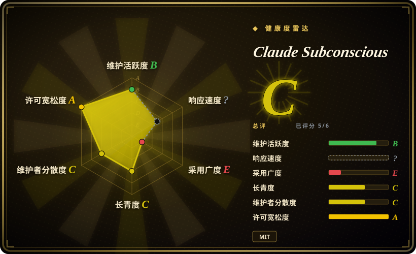
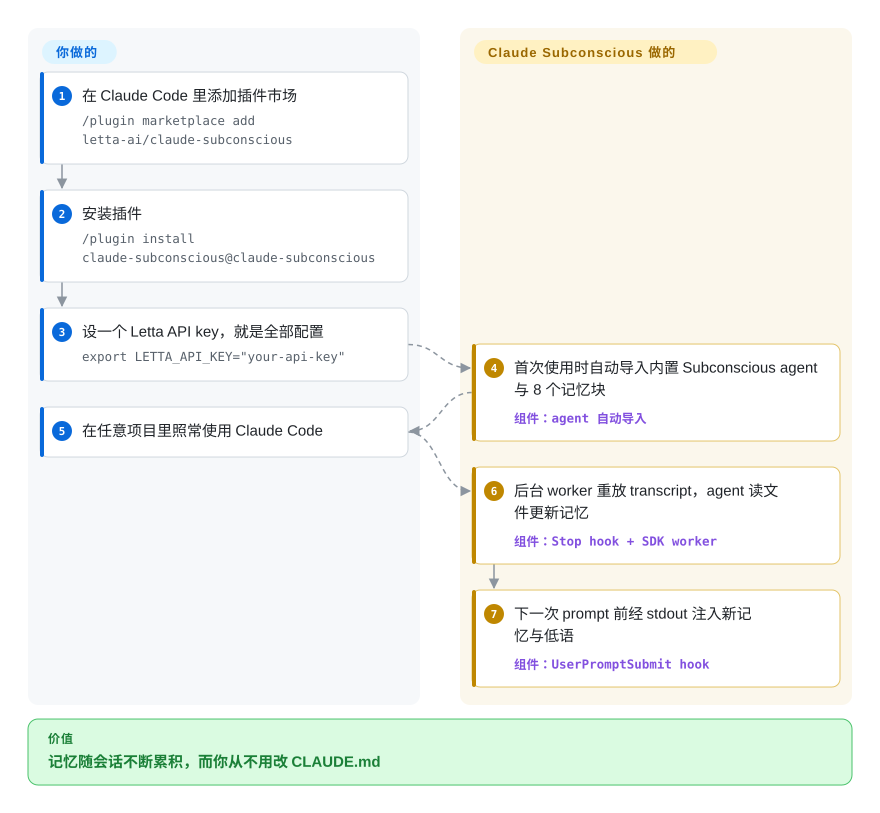

# Claude Subconscious

Claude Code 每个会话之间都会失忆，同一套偏好和决定你要一遍遍重讲。Claude Subconscious 用 hook 挂一个 Letta agent 在后台：它看你每一段 transcript，维护八个持久记忆块，并在你下一次 prompt 前把相关的指引“低语”回来——全程不碰 CLAUDE.md。

## 何时使用

你是 Claude Code 的重度用户，每个会话都在反复解释同样的事——你惯用的测试 runner、这个仓库用的是 pnpm 不是 npm、你上周做的某个架构决定它又“忘了”。Claude Code 的上下文在每个会话结束时就消失，于是同样的纠正一遍遍重来。你想要一个能在会话之间**累积**的记忆层，而不必手工维护一份巨大的 CLAUDE.md。Claude Subconscious 以插件形式安装，接好四个 Claude Code hook：会话结束时它异步把完整 transcript 发给一个 Letta agent（在分离的 worker 里跑，因此从不阻塞你），agent 读你的文件、更新八个持久记忆块（`user_preferences`、`project_context`、`pending_items`、`tool_guidelines` 等），下一次 `UserPromptSubmit` 时它再通过 stdout 注入相关记忆和“低语”指引——全程不碰 CLAUDE.md。

当你本就生活在 Letta 生态里（或正想找个理由试一试）、并把它当作探索性的、单人开发的便利层时最合适：一个共享的“agent 大脑”服务多个项目，每个项目在 `.letta/claude/` 下各自保存会话记账。如果你想**亲眼看看**一个 subconscious 式后台记忆 agent 接进真实编码循环里是什么感觉，这是一个基于 Letta Code SDK、可读性不错的参考实现。

## 怎么用起来

四个 hook 包住你的 Claude Code 会话，一切都发生在它们的边界上。首次使用时插件会自动导入一个内置的 “Subconscious” Letta agent——除了 `LETTA_API_KEY` 之外零配置——此后一个 agent “大脑”跨你所有项目共享，而每个仓库只在 `.letta/claude/` 下保存自己的会话记账。每次回复结束后，`Stop` hook 把 transcript（用户消息、含思考块的助手回复、工具调用）解析进一个临时文件，再派生一个分离的后台 worker，因此从不阻塞你；worker 通过 Letta Code SDK 把 transcript 重放给 agent，agent 处理时可以顺带探索你的代码库——默认是只读工具（`Read` / `Grep` / `Glob` 加 `web_search` / `fetch_webpage`，经 `LETTA_SDK_TOOLS` 收紧或放开）——并重写它的八个记忆块（`core_directives`、`guidance`、`user_preferences`、`project_context`、`session_patterns`、`pending_items`、`self_improvement`、`tool_guidelines`）。在你下一次 prompt 之前，`UserPromptSubmit` hook 取回变化了的内容，以 `<letta_message>` / `<letta_memory_blocks>` XML 打到 stdout，Claude Code 把它折进上下文；`PreToolUse` 还能以同样方式注入中途更新。留在你手里的是：记忆质量取决于你给它配哪个模型，而 CLAUDE.md 永远不由插件写入——一切注入只发生在上下文里。

<!-- flow-steps:begin (generated from flows/claude-subconscious.json by tools/flow_card.py — do not edit) -->

流程文字版

1. **你**：在 Claude Code 里添加插件市场 — `/plugin marketplace add letta-ai/claude-subconscious`
2. **你**：安装插件 — `/plugin install claude-subconscious@claude-subconscious`
3. **你**：设一个 Letta API key，就是全部配置 — `export LETTA_API_KEY="your-api-key"`
4. **Claude Subconscious**：首次使用时自动导入内置 Subconscious agent 与 8 个记忆块 — 组件：`agent 自动导入`
5. **你**：在任意项目里照常使用 Claude Code
6. **Claude Subconscious**：后台 worker 重放 transcript，agent 读文件更新记忆 — 组件：`Stop hook + SDK worker`
7. **Claude Subconscious**：下一次 prompt 前经 stdout 注入新记忆与低语 — 组件：`UserPromptSubmit hook`

**价值**：记忆随会话不断累积，而你从不用改 CLAUDE.md

<!-- flow-steps:end -->

## 何时不用

- **生产 / 团队使用。** 作者明确写明这是“基于 Letta Code SDK 构建的 demo 应用，不打算用于生产”，并让你改用 Letta Code。不要在它上面搭团队工作流。
- **你不用 Claude Code。** 它从头到尾是个 Claude Code 插件，依赖 Claude Code 的 hook 生命周期（`SessionStart` / `UserPromptSubmit` / `PreToolUse` / `Stop`）。它**不是**一个 LLM 无关、框架无关的记忆库；如果你要在自己的 agent 代码里嵌记忆，选 [Mem0](../app-memory/mem0.zh.md) 或 [Memori](../app-memory/memori.zh.md)。
- **你无法依赖外部 Letta 服务。** 它需要 `LETTA_API_KEY` 和一个可达的 Letta 后端（云端 `api.letta.com` 或自托管）。没有后端就没有记忆。这是每个会话边界上的硬网络依赖。
- **涉密、不能外发的代码。** Stop hook 会把你的**完整会话 transcript** 发给 Letta agent，且 agent 在处理时拥有客户端工具权限：默认 `LETTA_SDK_TOOLS=read-only`（`Read`/`Grep`/`Glob` 加联网搜索/抓取），但 `full` 会授予 Bash、Edit、Write 和经 `Task` 派生 sub-agent。指向敏感仓库前请三思。
- **你要确定性、可审计、完全自托管、无第三方大脑的记忆。** 记忆存在 Letta agent 里，而非你完全掌控的本地存储；行为依赖 agent 模型和 Letta API 语义。
- **对延迟 / 配额敏感的工作流。** 每次会话开始、prompt、结束都会触达 Letta API；按 README，指引“需要好几个会话”才变得有用。

## 横向对比

| 替代品 | 是否收录 | 我们的评价 | 取舍 |
|---|---|---|---|
| [Mem0](../app-memory/mem0.zh.md) | ✅ | 可移植的应用内嵌记忆比 Claude Code 插件更重要时，选 Mem0。 | 框架无关、可嵌进你自己 agent 的记忆**库/API**（Python/TS，任意 LLM）；不是 Claude Code 插件、也不是后台“低语”agent。要可移植、偏生产的记忆选它。 |
| [Memori](../app-memory/memori.zh.md) | ✅ | 需要 SQL 原生记忆后端而非 Claude Code hook 时，选 Memori。 | SQL 原生的开源 agent 记忆引擎；同样 LLM/框架无关、可自托管。形态不同：是记忆后端，不是绑定 Claude Code 的插件。 |
| Letta Code | 未收录 | 想要同团队完整编码 agent 产品而不是这个 demo 时，选 Letta Code。 | 同团队的生产版本——Letta 平台上的完整编码 agent。README 明确推荐用它替代本 demo 做真实使用。 |
| CLAUDE.md（内置） | 未收录 | 手动、确定的项目记忆已经足够时，选 CLAUDE.md。 | 手动、确定、零依赖的项目记忆。没有后台学习、没有跨项目大脑；靠你手工维护。Claude Subconscious 刻意不写这里。 |
| [Cipher](https://github.com/campfirein/cipher) | 未收录 | 跨 IDE/CLI 的 MCP 记忆层比 Claude-only hook 更重要时，选 Cipher。 | 基于 MCP 的编码 agent 记忆层（经 MCP 跨 IDE/CLI 通用）；客户端支持比单工具插件更广。 |

## 技术栈

- **语言：** TypeScript（按 GitHub 约占仓库 85%；另有少量 C#、JavaScript、PowerShell）。[未验证] 语言占比是 GitHub linguist 估算。
- **运行时：** Node.js（TypeScript hook 脚本：`session_start.ts`、`sync_letta_memory.ts`、`pretool_sync.ts`、`send_messages_to_letta.ts`，外加分离的 `send_worker_sdk.ts` worker）。
- **集成面：** Claude Code 插件 + 四个 hook（`SessionStart` 5s / `UserPromptSubmit` 10s / `PreToolUse` 5s / `Stop` 120s 异步）；内容以 stdout XML 标签（`<letta_message>`、`<letta_memory_blocks>`、`<letta_memory_update>`）与 `additionalContext` 注入。
- **记忆后端：** 经 `@letta-ai/letta-code-sdk` 的 Letta agent；八个有名字的记忆块；内置 `Subconscious.af` agent 首次使用自动导入；多项目“一个 agent，多个项目”模型，注入内容受 `whisper` / `full` / `off` 三档开关（`LETTA_MODE`）控制。
- **模型：** 你的 Letta 服务器暴露的任意 LLM provider（`LETTA_MODEL`，`provider/model` 格式，如 `anthropic/claude-sonnet-4-5`）；插件会查询 `GET /v1/models/` 并自动选择兜底模型。内置 agent 默认用 `zai/glm-5`（Letta Cloud 免费）。

## 依赖

- **Claude Code**（必需；README 未指定版本）。
- **Node.js**（必需；未指定版本）。
- **`@letta-ai/letta-code-sdk`**（作为依赖安装）。
- **一个 Letta 后端**——云端（`api.letta.com`）或经 `LETTA_BASE_URL` 自托管。
- **`LETTA_API_KEY`**（必需；来自 app.letta.com）。用非默认模型时可能还需提供商 key。
- **磁盘状态：** `.letta/claude/conversations.json`、`.letta/claude/session-{id}.json`、`$TMPDIR/letta-claude-sync-$UID/` 下的临时日志；全局 agent 指针在 `~/.letta/claude-subconscious/config.json`（可用 `LETTA_HOME` 改基目录）。

## 运维难度

**安装很轻，但拖着一条外部服务的尾巴。** 安装是两行插件命令（`/plugin marketplace add …` 再 `/plugin install …`）加设一个 `LETTA_API_KEY`。难点不在搭建复杂度而在运营依赖：你现在在每个会话边界都被绑定到某个 Letta 服务器的可用性、配额和延迟上，而一个分离的后台 worker（120s 超时）在带外做 transcript 同步——那里失败对前台是静默的。自托管 Letta 以去掉云依赖会把运维难度抬到**中**。Linux 上有针对 tmpfs 跨设备错误的 `TMPDIR` 变通做法。

## 健康度与可持续性

- **响应速度**：无法计算——unknown。
- **维护——涓流，demo 阶段（截至 2026-09）。** 最新发布仍是 v2.1.1（2026-03-30，“Bug fixes”）；默认分支此后只有零星提交——一个废弃 API 修复于 2026-07-01 合入，一个文档/拼写修复在 2026-09-10（GitHub API）。未归档，约 8 个 open issue，但节奏读起来是一个被轻度照看的 demo，而非活跃的产品开发。
- **治理与背书——厂商 demo（Letta）。** 归在 `letta-ai` 名下，即 Letta 平台背后的同一团队；背书是真的，但这个仓库明确是 *demo*，团队让你用 Letta Code 做生产。组织不会消失，但它没有动力去加固这个 demo。[推断]
- **年龄与 Lindy——年轻且明示不用于生产。** 2026-01 创建，约 8 个月（截至 2026-09）。无历史沉淀，且作者声明不作生产用途；Lindy 不适用——这是参考实现，不是可持久的押注。
- **采用度——小众 demo 触达。** 约 2.9k stars（GitHub API，2026-09-27），且没有包注册表足迹（它作为 Claude Code 插件分发，不是 pip/npm 运行时依赖）；把它当一个被广泛阅读的示例，而非被依赖的组件。
- **风险信号——外部大脑依赖 + transcript 出域。** MIT（无重许可风险），但每个会话边界都要触达 Letta 后端（云端或自托管），Stop hook 会把完整 transcript 发出本机，记忆存在第三方 agent 里而非你自有的存储。主导风险是明示的 demo 定位、硬网络依赖与数据出域。

## 存疑（未验证）

- [未验证] 最新 release v2.1.1（“Bug fixes”）发布于 2026-03-30；默认分支最后提交 2026-09-10——日期据 2026-09-27 的 `gh api`。
- [未验证] 截至 2026-09-27 约 2.9k stars——GitHub star 不可靠且对时间敏感，仅供参考。
- [未验证] 语言占比（TypeScript ~85%、C# ~10% 等）是 GitHub 估算；C# 部分 README 未解释，可能是工具/示例代码。
- [推断] README 未声明所需的 Node.js 与 Claude Code 最低版本；版本兼容性视为未验证。
- [推断] “没有动力加固 demo”是对 README 的 demo 免责声明与提交节奏的推断，不是团队自己的表述。
- [未验证] “不打算用于生产”是作者自述；无任何成熟度/SLA 主张被独立验证。
- [推断] hook 超时（5s/10s/5s/120s）引自 README 表格；慢网络下的真实行为未实测。
