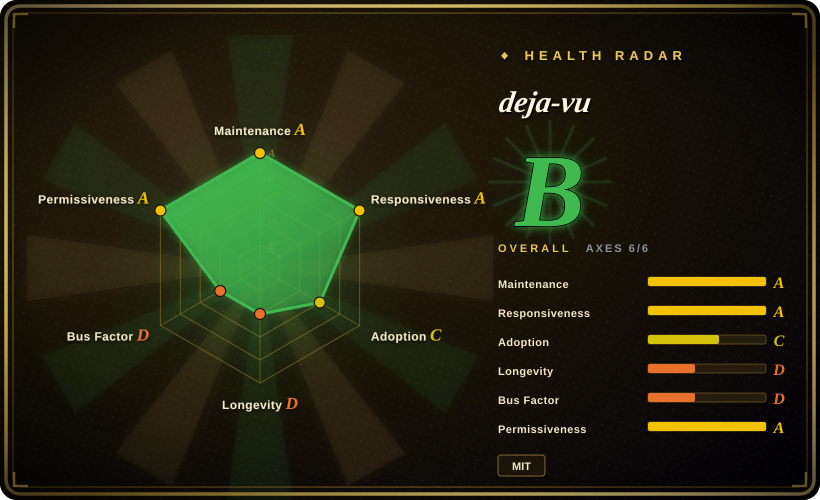
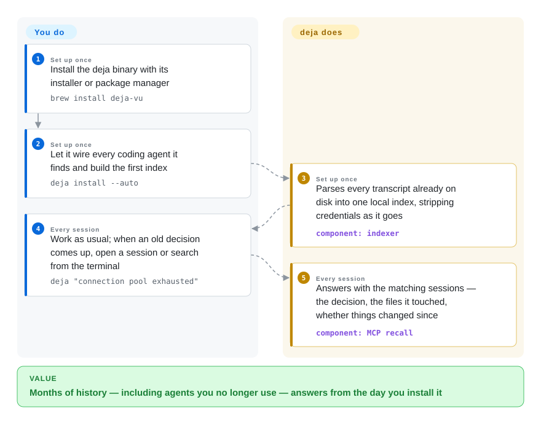

# deja-vu

You fixed an auth bug in March under Codex; in September Claude Code re-derives the same failure from scratch, because neither it — nor anything you installed — has a record of March. deja-vu parses the session transcripts the 35 coding agents it lists already write to your disk, builds one local searchable index under `~/.cache/deja`, and hands the old decision back to whichever agent you are in now.

## When to use

You work across several coding agents — Claude Code for one repo, Codex for another, Cursor when you inherit someone's project — and each session opens blank. The pain is concrete: the agent proposes a caching scheme you already rejected in June, because no harness records rejections; your tool's own compaction summary kept 77% of the decisions but only 0.2% of the commands over 43 measured compactions, per the project's own numbers. Session history is not lost — it sits on disk (`~/.claude/projects`, `~/.codex/sessions`, Cursor's SQLite stores) — it is just unreadable at the speed of grep over gigabytes, and invisible across tools.

Reach for deja-vu when the deciding tradeoff is **memory that predates the install** over curated distilled notes. It needs no capture step: the transcripts your agents already write are the memory, indexed from day one including months of history from before you installed it — unlike [Engram](engram.md), which starts empty and remembers only what an agent chose to save, or [claude-mem](claude-mem.md), which hooks and compresses sessions going forward on one harness. It also needs no model: search is lexical against a local inverted index, so there is no per-session LLM bill the way [Mem0](../app-memory/mem0.md) and [Letta](../app-memory/letta.md) require one. One Go binary wires MCP recall into every harness it detects (`deja install --auto`), answers at session start before you ask, and moves between machines over ssh with no cloud in between.

## How it works

deja-vu is a single Go binary whose `go.mod` had no third-party requires when we checked (2026-09-28) — standard library only, no CGO. Its indexer parses each harness's own store — JSONL files, and SQLite databases read by shelling out to the system `sqlite3` command — turning every message into typed records (user speech, tool output, shell commands, file paths, the exact spans edits replaced), and writes a local inverted index (a word → where-it-appears lookup, like the index at the back of a book) to `~/.cache/deja`: `records.bin`, token buckets, and a per-file manifest so a rebuild ingests only what changed. Credential patterns (API keys, JWTs, PEM blocks) are stripped as the index is built — the originals on disk are left alone. You write no memory protocol; deja-vu does the remembering by reading what is already there. `deja install --auto` registers the index as a one-tool MCP server (one tool saves the ~8k tokens a larger MCP server's tool definitions cost per turn, the README claims) and turns on session-start recall where the harness supports it, so the agent gets the prior decision before it edits a file — optionally backed by vectors for rephrased queries via `deja embed` against a local Ollama/LM Studio or a configured endpoint.

<!-- flow-steps:begin (generated from flows/deja-vu.json by tools/flow_card.py — do not edit) -->

Text version of the flow

1. **You** (Set up once): Install the deja binary with its installer or package manager — `brew install deja-vu`
2. **You** (Set up once): Let it wire every coding agent it finds and build the first index — `deja install --auto`
3. **deja-vu** (Set up once): Parses every transcript already on disk into one local index, stripping credentials as it goes — component: `indexer`
4. **You** (Every session): Work as usual; when an old decision comes up, open a session or search from the terminal — `deja "connection pool exhausted"`
5. **deja-vu** (Every session): Answers with the matching sessions — the decision, the files it touched, whether things changed since — component: `MCP recall`

**Value**: Months of history — including agents you no longer use — answers from the day you install it

<!-- flow-steps:end -->

## When NOT to use

- **You need recall by meaning, and won't run an embedding endpoint.** Core retrieval is lexical — an exact error string or flag hits hard, but a rephrased query ("that caching problem") can miss a session written in different words. Use [claude-mem](claude-mem.md) (vector search over Chroma) or [Mem0](../app-memory/mem0.md) if semantic recall must work out of the box, or add deja's optional `deja embed` with a local runtime and accept the extra model dependency.
- **The memory belongs to your product's users, not your workstation.** deja indexes coding sessions keyed to this machine's directories; there is no SDK or per-end-user account model. For memory inside an agent you ship, use [Mem0](../app-memory/mem0.md) or [Letta](../app-memory/letta.md).
- **You cannot tolerate a second copy of your raw conversations.** The index stores transcript content (redacted, but pattern-based — the project's own `docs/SECURITY-MODEL.md` says pattern matching is not secret detection, and shapes it doesn't know can pass through). If only curated notes may persist, use [Engram](engram.md), where the agent decides what to save; if you need per-user isolation over shared content, use [OpenViking](openviking.md).
- **You want one team-shared memory behind accounts and access control.** deja-vu is per-machine; `deja sync ssh` moves it between machines you control, but there is no server, no auth model. For a shared store, use [OpenViking](openviking.md) or [Beacon](agent-beacon.md).
- **You need a slow-moving dependency you can freeze.** Pre-1.0 (v0.21.3 on 2026-09-27), multiple releases a week including a `nightly` channel, and the parsers must chase 35 harnesses' store-format changes as they ship. If your policy forbids near-weekly re-validation, choose a slower, backed project; otherwise pin the version.
- **Windows is your main machine.** The `install.sh` one-liner exits with `unsupported OS`; Scoop/winget packages exist, but as of 2026-09-28 an open community issue (#4116) reports `deja install --auto` writing backslash hook paths that Claude Code's bash cannot execute, failing all hooks silently. The README itself calls macOS and Linux "the battle-tested paths".

## Comparison

| Alternative | In index | Our verdict | Tradeoff |
|---|---|---|---|
| [Engram](engram.md) | ✅ | Choose deja-vu when the history you need mostly predates installing any memory tool and you will not rely on the agent to save; choose Engram when you want a small, curated, agent-written note store and accept starting empty. | deja-vu: zero capture discipline, indexes raw transcripts of 35 harnesses, lexical search with an optional vector sidecar. Engram: clean FTS5 note store with no transcripts copied, but recall is only what the agent chose to record. |
| [claude-mem](claude-mem.md) | ✅ | Choose deja-vu when you run several harnesses and want sub-second recall with no LLM in the loop; choose claude-mem when Claude Code is your only agent and you prefer compressed summaries injected every session over searching raw history. | deja-vu: no per-session model bill, no vector DB, cross-harness; but the raw transcript corpus is copied into the index. claude-mem: automatic hook capture + LLM compression + Chroma search, at the cost of that pipeline and its concentration on Claude Code. |
| [Mem0](../app-memory/mem0.md) | ✅ | Choose deja-vu for one developer's own machine history; choose Mem0 when you are building a product whose agents must remember end-users across accounts. | deja-vu: no LLM, no server, keyed on coding sessions; it cannot answer per-user product questions. Mem0: extraction pipeline + hosted or self-hosted platform, in exchange for scoped user memory APIs. |
| agentmemory (rohitg00/agentmemory) | not indexed | When you need a coding-agent memory tool with a large user base and accept an LLM-backed store, agentmemory (~29k stars, GitHub API 2026-09-28) is the closest peer to compare against; pick deja-vu instead when pre-install transcript history and a zero-dependency binary decide it. | Both market on benchmark scores; deja's README cites agentmemory's 95.2% in its own comparison. The two have not been independently benchmarked against each other; not added in this tab-intake batch. |
| MemPalace (MemPalace/mempalace) | not indexed | Choose it over deja-vu when published leaderboard numbers on a memory-platform shape matter more to you than a single binary with no LLM; for a coding-session archive you search by error string, stay with this page. | Self-describes as "the best-benchmarked open-source AI memory system" (~59k stars, GitHub API 2026-09-28); deja's README cites its 96.6% in its own comparison. A different shape (platform vs transcript index) — not added in this tab-intake batch. |

## Tech stack

- **Language:** Go (module `github.com/vshulcz/deja-vu`, `go 1.25`); `go.mod` had zero third-party requires as of 2026-09-28 — stdlib only, no CGO. SQLite stores are read by invoking the external `sqlite3` command.
- **Storage:** a bespoke local inverted index under `~/.cache/deja` — `records.bin` (length-prefixed typed records, ≥8 KiB bodies deflated), `buckets/*.bin` (token postings), `manifest.gob`/`sessions.gob` (per-file state, redaction counters, sync watermarks) — so ingest is incremental and deterministic.
- **Optional vectors:** `.vectors.bin` sidecar (float32, ~4 MB per 1k messages at 1024-dim) built by `deja embed` against a configured or auto-probed Ollama/LM Studio/OpenAI-compatible endpoint.
- **Surfaces:** CLI; one MCP stdio tool (`deja`) with modes `recall/context/blame/fix/how/orient/remember`; session-start hooks and skill/guidance files per harness; `.mcpb` bundles; marketplace packages for 8 ecosystems; multi-platform CI including CodeQL and a nightly release channel.

## Dependencies

- **Core:** none beyond the binary (Homebrew `deja-vu`, Scoop, winget, npm `@vshulcz/deja-vu`, `go install`). No database server, no Node/Python runtime, no model API key on the default path.
- **`sqlite3` CLI** on PATH when the harnesses you use keep SQLite stores (opencode, Cursor IDE state, Goose, Zed, Crush, Kiro, Grok, OpenClaw, Hermes), and **`zstd`** for compressed stores (DeepSeek Harness, Zed, Reasonix 1.x, OpenClaw archives).
- **Disk:** the index is a copy of your transcript content (redacted) — ~10% of corpus size on the author's machine [author-reported].
- **Optional:** a reachable embedding endpoint only for `deja embed`; lexical search works without it.

## Ops difficulty

**Low on macOS/Linux.** Two commands install and wire it; first index is seconds on the author's 19,195-session corpus [author-reported], updates are incremental, and `deja doctor --deep` checks the index against the sources. Uninstall is `deja uninstall --all` plus deleting `~/.cache/deja`. What is not free: releases land multiple times a week with no stability promise, so upgrades need re-validation (pin the version); and the maintenance burden that matters to you is harness drift — 35 store formats the single maintainer must keep parsing. Windows and the auto-recall hook paths are the least-tested surfaces.

## Health & viability

- **Maintenance — intense (as of 2026-09-28).** v0.19.4→v0.21.3 between 2026-09-07 and 2026-09-27, a `nightly` release asset republished the day of this check, last commit 2026-09-28. Fast, but pre-1.0 churn.
- **Governance / bus factor — one person.** Owner is a user account, not an org; the top contributor has 1,968 of ~2,060 contributions (contributors API 2026-09-28), the next has 19. `SECURITY.md` with a private advisory channel exists; there is no second maintainer visible.
- **Backing & Lindy — 11 weeks old.** Created 2026-07-14; no foundation or company backing found [推断]. Too young for a Lindy prior — treat it as a live experiment you can cheaply adopt and cheaply leave, not an institution.
- **Adoption — fast but shallow-verifiable.** ~1.1k stars and 104 forks in ~11 weeks (GitHub API 2026-09-28); packages in 8 agent ecosystems; the issue tracker is dominated by maintainer-filed task issues with one open external bug report (#4116). No independent production-use reports found [未验证].
- **Risk flags.** MIT, no relicense history; benchmark claims are author-run (drivers and dated result JSONs are committed, e.g. LongMemEval-S cleaned set: hit@1 88.1%, hit@5 97.4% for 2026-09-22 — auditable, not reproduced here); redaction is pattern-based by the project's own admission; a curl-pipe install and a binary that reads every agent's data on the machine concentrate trust in one maintainer.

## Caveats (unverified)

- `[未验证]` All performance/benchmark figures (97.2% R@5, the 88.1% hit@1 / 97.4% hit@5 in the committed 2026-09-22 results JSON, 17.6 s to index 19,195 sessions, 58% token savings, 0.7–0.8 ms lookups) are author-reported on author machines; the harnesses and result files are in-repo (`scripts/longmemeval`, `docs/benchmarks/*.json`) but we did not run them.
- `[推断]` The README's 97.2% R@5 likely reflects a run newer than the committed 97.4% hit@5 JSON we checked; we did not find the exact run behind the headline number.
- `[未验证]` "35 supported harnesses" was verified as 35 rows in the README matrix and 35 parser entries in `docs/ARCHITECTURE.md`, not by running deja against real installs of each.
- `[未验证]` The compaction statistics (77% of decisions / 0.2% of commands kept over 43 measured compactions) and "84 credentials in 42 sessions on one machine" are author measurements with no independent reproduction.
- `[未验证]` The claim that Claude Code deletes transcripts older than 30 days by default (`cleanupPeriodDays`) was not checked against Claude Code's own docs.
- `[未验证]` Community issue #4116 (Windows backslash hook paths failing silently) is one unconfirmed report; we did not test on Windows.
- `[推断]` The star growth (0→~1.1k in ~11 weeks) suggests a promotional spike rather than steady organic adoption; we checked no traffic source.
- `[推断]` No foundation/company backing and no independent production-use reports: the absence rests on `owner.type=User` from the GitHub API, nothing in the repo claiming funding, and the searches we ran — an unsearched source is not a nonexistent one.
- `[未验证]` Index size "~10% of corpus" and "~4 MB per 1k messages" of vectors are single-machine author figures.
